# TradePlan —加密筛选程序

> 原文：<https://medium.com/coinmonks/tradeplan-io-crypto-screener-88034678c457?source=collection_archive---------0----------------------->

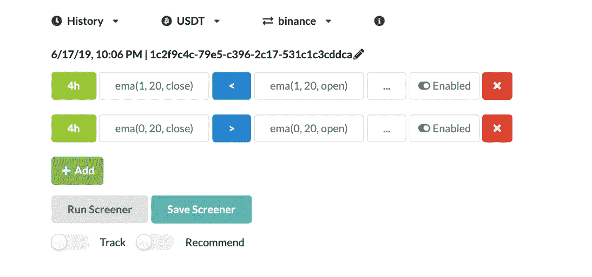

[Tradeplan](http://tradeplan.co) 是一个简单的定制密码筛选工具，帮助密码交易者根据您的技术指标要求找到合适的硬币，节省他们寻找密码进行交易的时间和精力。

它的主要目的是帮助交易者找到他们想要的东西，而不是猜测或手动检查。

你可以访问 tradeplan.co[注册手机应用程序，或者使用测试网页版](http://tradeplan.co) [tradeplan.io](http://tradeplan.io) ，如下例所示。

以下是加密筛选程序的主要功能及其使用方法。

该筛分机目前具有以下核心特征，未来还会有更多特征。

*   **SMA、EMA、BBand、RSI、MACD 和随机指标**是第一版中你用来筛选的六个指标。

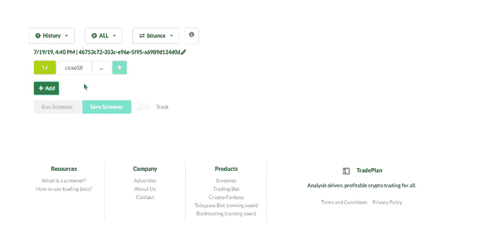

6 Indicator in addition to OHLC and Volume

*   时间范围选项有 **5 分钟、1 小时、4 小时、6 小时、1 天和 1 周**蜡烛。

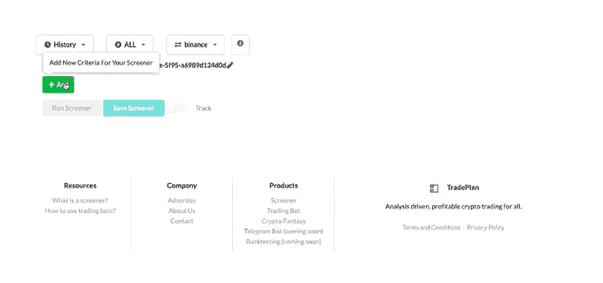

Selection the candle time frame for screening

*   用户不必将收盘价作为指标的唯一选项。您可以选择**打开、高、低和关闭**作为 SMA 等所有上述指标的基础。

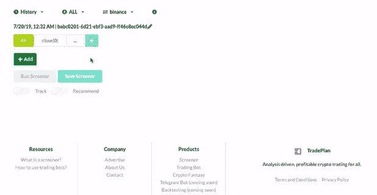

*   比较的类型有>，

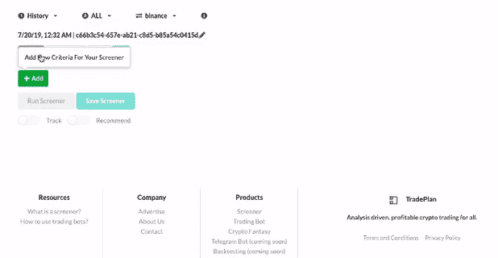

Tradeplan.io is life in Beta mode, there are still a lot of things in the work but the core screener is working and the results.

On the **首页，**你可以看到所有币安默认硬币的详细信息。在这一点上，我们正在使用币安，并计划稍后添加更多的交流。

**推荐筛选**显示在主页面上，更多将很快添加。

在 screener 页面上，用户可以看到以下关键组件。

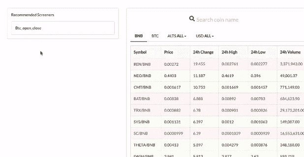

View Recommended Screener from the Home Page

用户可以选择喜欢的配对，例如 USDT 或 BTC。这样，只有硬币对才会被筛选。

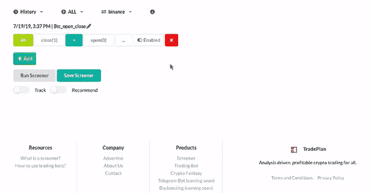

Refine your screening using specific crypto pairing

一旦完成筛选条件，用户必须添加条件并运行筛选程序。任何不完整或未添加的查询都将被忽略。

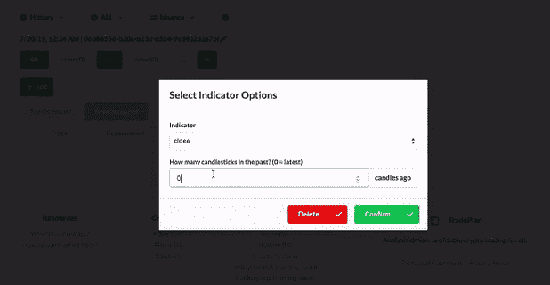

Click on “+” to add a condition after completion to screen it.

可以禁用和启用每个查询，而无需删除筛选条件。如果用户不想重写整个查询，这很有帮助。

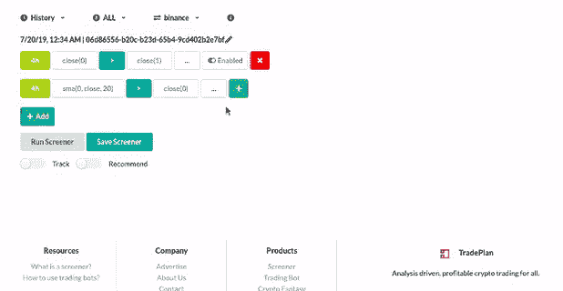

Disable and enable instead of deleting

用户可以使用名为 Candle ago 的选项进行筛选，该选项用于筛选一周前(即 7 天前)或 12 小时前(即 3、4 小时前)等。

Use a historical value of Price and Indicator by mentioning candle ago.

# 下面是几个如何制作筛分机的例子。

硬币的名称:

> **当前 4 小时蜡烛线成交量大于之前 4 小时蜡烛线成交量的 10 倍。**

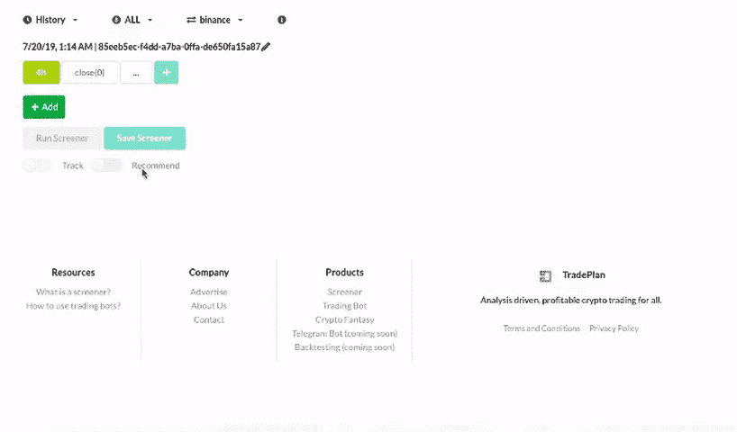

选择 4 小时时间范围→选择右边的音量指示器，蜡烛前为 0，因为它是最新的音量→选择下一个选项卡中的“大于”选项→选择音量指示器，并将蜡烛前更改为 1，这意味着蜡烛前为 1，在本例中为 1，蜡烛前为 4 小时→用数字 10 乘以它→添加查询并运行筛选程序。

> **当前日成交量大于最近 2 日成交量之和。**

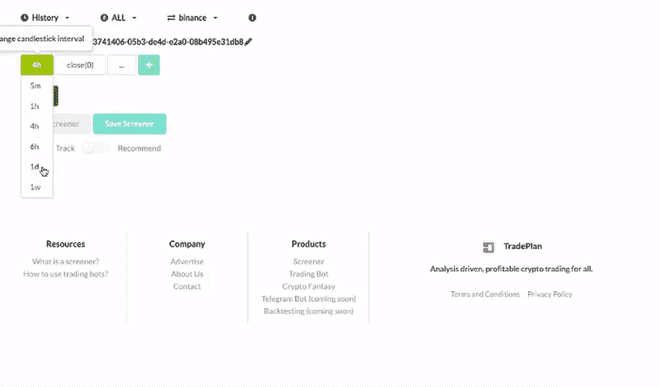

选择 1D 时间范围→选择 0 烛光前的音量→选择“大于”选项卡→选择 1 烛光前的音量，然后选择“+”选项卡，然后选择 2 烛光前的音量。添加查询并运行该函数。

> **20 支蜡烛开启 1 小时 SMA，20 支蜡烛关闭时越过 EMA。**

2 值以上的叉号表示第一个值小于上一个蜡烛中的第二个值，并且大于当前蜡烛中的第二个值，因此需要 2 个筛选查询。

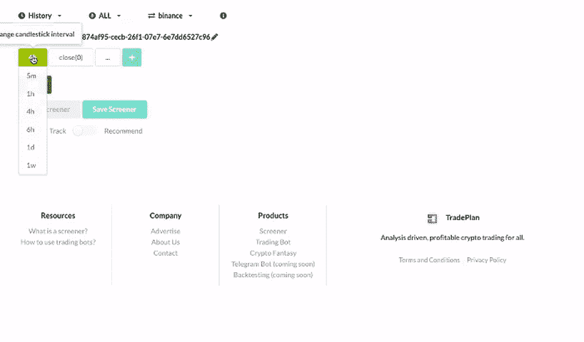

以开放价格为来源的 SMA & 20，1 小时蜡烛长度，**一蜡烛前**比以封闭价格为来源的 EMA 小**20，1 小时蜡烛，**一蜡烛前。****

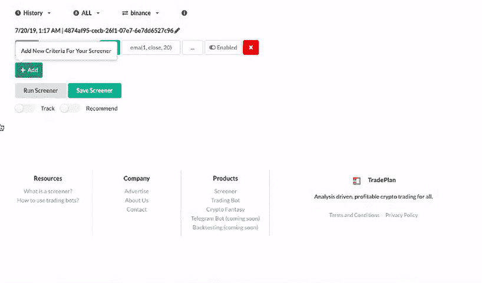

SMA 以开盘价为来源& 20 支 1 小时蜡烛为长度，**最新蜡烛**大于**EMA 以收盘价为来源& 20 支 1 小时蜡烛，**最新蜡烛**。**

> **10 支蜡烛 4 小时收盘均线，10 支蜡烛 4 小时开盘均线。**

类似于上面的例子，在这种情况下，收盘时的 4 小时均线小于开盘时的均线，一个蜡烛前，但在最近的蜡烛中更大。

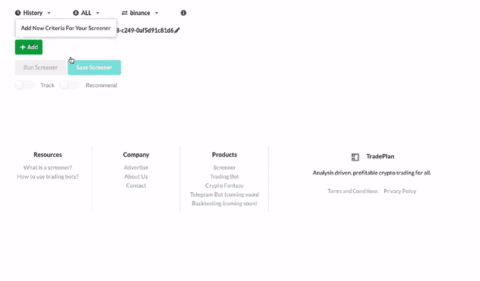

收盘均线 **1 烛前**小于开盘均线 **1 烛前**。长度是 10 支蜡烛。

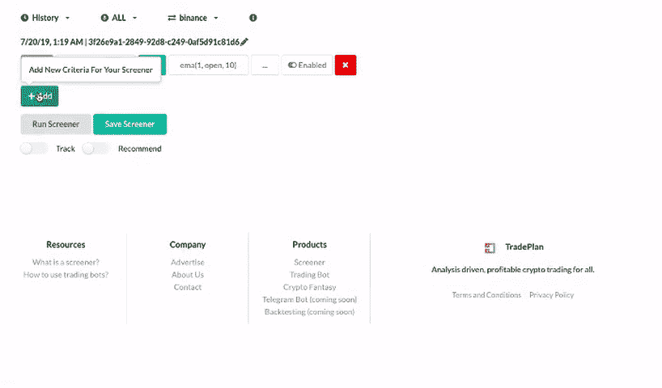

收盘的均线，最新的蜡烛**大于开盘的均线，最新的蜡烛**。**长度为 10 支蜡烛。**

> **MACD (30，20，10)线交叉 MACD 信号(30，20，10)为 4 小时烛光。**

按照上面的例子

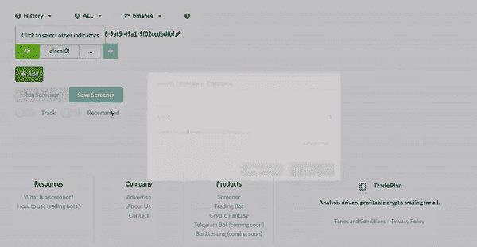

选择时间框架，MACD 线小于 MACD 信号，1 烛光前。改变快速、慢速和信号均线的值。

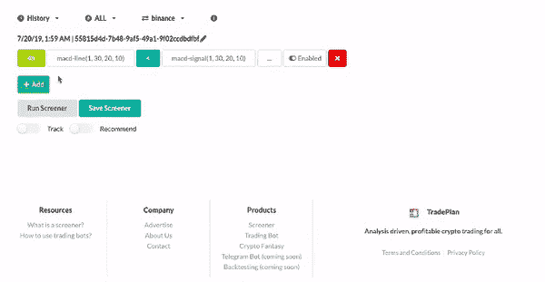

选择时间框架，MACD 线小于 MACD 信号，最新蜡烛前。更新值并运行筛选程序。

> **在每日烛光 14 天的时间段内，RSI 大于 10 但小于 40。**

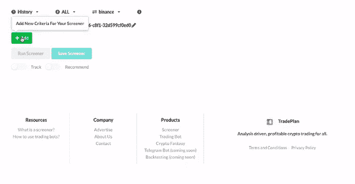

在 14 个每日烛光时段内，RSI 大于 10 但小于 40

> **收盘价在 5 天内下跌 30%以上。**

最新收盘价比 5 天前的收盘价高出 30%。1.3 表示高 30%。0.95 相应地意味着比今天少 5%。

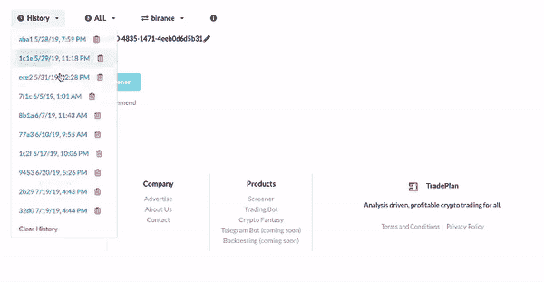

我希望下面的例子和说明有所帮助。

请注意，最新的蜡烛是指最新完成的蜡烛。由于数据延迟和 API 调用限制，结果可能会相差 15 分钟。这是我们未来努力解决的问题。

该应用程序仍在工作中，在几天内，我们希望有通知功能的工作，然后通知的移动应用程序正在工作中。我们正在努力引入 Tradingview 图表，因为目前该图表需要更新，因为我们没有指标。

我们在[tradeplan.co](http://tradeplan.co)正尽最大努力让这部电影成为现实，为尽可能多的人提供帮助。

欢迎随时联系我们@ twitter: [@TradeplanIO](https://twitter.com/TradeplanIO)

如果你喜欢这篇文章，请随意鼓掌以示支持。

> [在您的收件箱中直接获得最佳软件交易](https://coincodecap.com/?utm_source=coinmonks)

