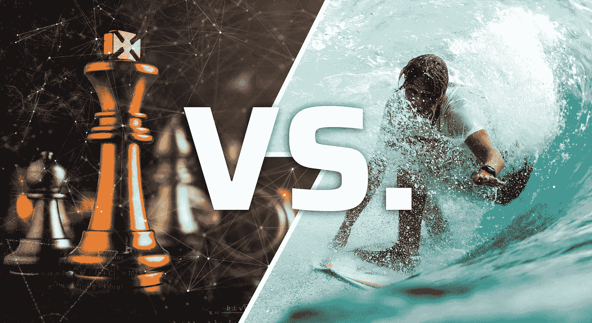

# 交易比特币:国际象棋大师 vs .冲浪者

> 原文：<https://medium.com/coinmonks/trading-bitcoin-chess-masters-vs-surfers-d54aa43d5425?source=collection_archive---------1----------------------->

## 比特币和加密货币

## 一场令人惊讶的战斗在我们这个时代最有趣的金融实验中展开…谁在记分？

*Photos by WHYFRAME on Shutterstock & Jeremy Bishop on Unsplash.*

有没有想过，为什么有些比特币交易者被吸引去交易屏幕上快速滚动的每一波比特币，而其他人却坐在那里