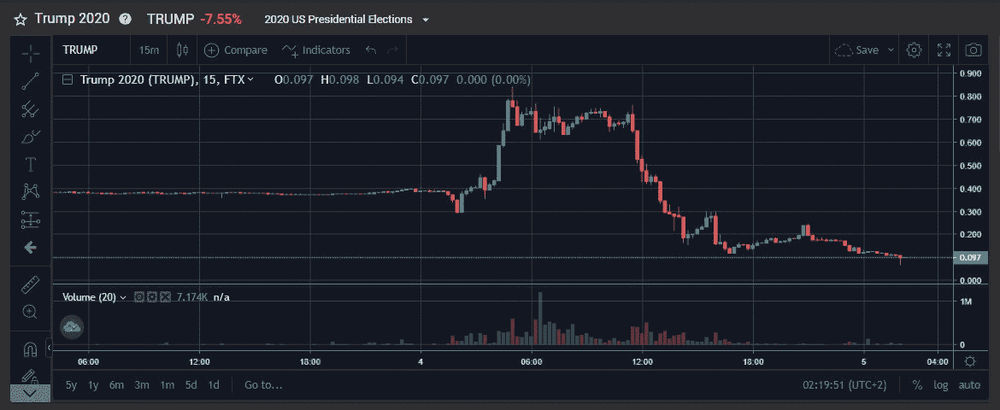

# 交易 2020 年美国总统选举

> 原文：<https://medium.com/coinmonks/trading-the-2020-us-presidential-elections-be85cd9dcb91?source=collection_archive---------0----------------------->

*本帖与*[*Eash Aggarwal*](https://twitter.com/AggarwalEash)*合著。*

2020 年美国总统选举非常引人入胜，在写这篇文章的时候仍在进行。在本帖中，我们将深入预测市场的重要性，以及我们如何利用它们，使用算法套利策略交易 2020 年美国总统大选。

这次选举的突出特点之一(除了特朗普的选举欺诈万福玛利亚)是专家预测*和*流动性预测市场的存在。

为什么这很重要？首先，这使得市场参与者能够“言出必行”，根据自己的选举观点进行交易。更重要的是，这使得**专家**和**市场**之间的第一次广泛关注的战斗成为可能。

在选举前几周，民调和统计模型(FiveThirtyEight)显示特朗普连任的可能性为 15%，经济数据模型(The Economist)预测他连任的可能性为 10%，预测市场(FTX、必发)预测特朗普连任的可能性为 35%至 40%。

Source: [FiveThirtyEight](https://fivethirtyeight.com/)

预测/博彩市场代表所有对其观点进行货币投注的市场参与者的平均估计值。预测市场的看涨理由来自于集体智慧(CI)的惊人力量，或者“群体的智慧”——即一个足够大的群体的平均估计将比任何一个个体的估计都更准确。然而，预测市场仍处于起步阶段，流动性有限，准入受限，尤其是对大型机构投资者而言。此外，人的偏见，如确认偏见，损失厌恶，锚定偏见等。会限制他们的准确性。

> 集体智慧是共享的或群体的智慧，产生于许多个人的合作、集体努力和竞争，并出现在共识决策中 *—维基百科*

# 预测市场

有三种主要类型的预测市场:

1.  **博彩网站**:必发、预测、Polymarket
2.  中央加密交易所 : FTX
3.  **分散交易所**:卜筮、猫薄荷

其中，FTX 拥有最高的流动性、集中的限价订单簿和 API 集成，支持高频算法交易。

Source: [Messari](https://messari.io/article/crypto-prediction-markets-take-center-stage-during-u-s-election)

# 交易策略

[FTX](https://ftx.com/) 是一个中央加密衍生品交易所，支持所有主要加密货币的衍生品、期权、波动性产品和杠杆代币。

有两种主要的选举相关产品可以在 FTX 交易: **TRUMPWIN** 和 **TRUMPLOSE。**这些加密货币可以在 FTX 兑换成 1 美元或 0 美元，具体取决于 Trump 是否赢得大选。

> 澄清:我们将遵循合同的原始规则，除非候选人获得选举团的大多数选票，或者所有选定的出版物都宣布选举，否则不会终止合同。如果这两种情况都没有发生，合同将由明年二月的总统——FTX 决定

忽略费用和滑点，很容易证明下面的等式必须*总是*成立:

我们的套利策略很简单:

这里的目标是每当基础组合跌破 1 美元的公允价值时买入，每当高于 1 美元时卖出，因为该组合在选举后总是可以兑换为 1 美元。理论上，这种策略在每次资本周转时可以获得 2%的收益。

# 费用

很容易调整上述等式来计算费用。设 *f* 为交易所收取的费用，单位为 bps (1bp = 0.01%)。在 FTX，标准费用是每笔交易 7 个基点(0.07%)。上面的等式可以重写，以说明费用如下:

我们使用 1%的缓冲来考虑每笔交易可能出现的任何潜在的滑点和延迟。1%的选择有些随意，理论上，可以进行回溯测试，测试不同的买入/卖出水平，以最大化 ROIC。鉴于我们急于部署，我们没有进行此分析。

# 履行

**步骤 1** :写一个脚本不断刮 trump win*&trump lose*价格。**

****

****第二步**:查看是否满足购买条件。如果是这样，每种硬币买 500 个。**

****

****第三步**:查看是否满足卖出条件。如果是这样，并且如果我们已经足够长，出售 500 枚硬币。**

****

****步骤 4** :用一个脚本管理风险，不断检查我们是否完全对冲(即，我们拥有等量的每种硬币)。这可能是由于失败的交易、代码错误、资金平衡问题等造成的。如果我们没有对冲，我们会卖出不平衡的硬币来保持 delta 中性。**

****

# **结论**

**实际市场就像过山车一样。在大选之夜(11 月 2 日，星期二)，TRUMPWIN 飙升至 0.80 美元的高点，随后跌至 0.10 美元的低点，并暂时保持在这一水平。**

****

**Source: [FTX](https://ftx.com/trade/TRUMP)**

**谁成了赢家——专家还是预测市场？不清楚。**

**民意调查和专家的初步预测显然更准确，因为他们不太看好特朗普进入选举之夜。然而，这是一个不正确的基准性能指标，因为信息整晚持续流入，市场/模型实时调整，增加了预期概率的波动性。**

**理论上，必须对多个地区的多个选举进行回溯测试，以确定模型或市场是更好的预测者。此外，在评估集体智慧的表现时，必须定义一个关键的成功指标——它是选举前一晚在时间 *t=0* 的集体估计，还是我们应该将整个选举之夜的预测加权平均作为一个更准确的指标？**

****

**总的来说，2020 年的选举证明了预测市场是一股不可忽视的力量。预计未来几年流动性和交易量将呈指数增长，同时机构采用和监管监督也会增加。与此同时，预测市场将继续为交易者和投资者提供巨大的自主和市场中立的机会。**

## **另外，阅读**

*   **最好的[密码交易机器人](/coinmonks/crypto-trading-bot-c2ffce8acb2a)**
*   **[密码本交易平台](/coinmonks/top-10-crypto-copy-trading-platforms-for-beginners-d0c37c7d698c)**
*   **最好的[加密税务软件](/coinmonks/best-crypto-tax-tool-for-my-money-72d4b430816b)**
*   **[最佳加密交易平台](/coinmonks/the-best-crypto-trading-platforms-in-2020-the-definitive-guide-updated-c72f8b874555)**
*   **最佳[加密借贷平台](/coinmonks/top-5-crypto-lending-platforms-in-2020-that-you-need-to-know-a1b675cec3fa)**
*   **[最佳区块链分析工具](https://bitquery.io/blog/best-blockchain-analysis-tools-and-software)**
*   **[加密套利](/coinmonks/crypto-arbitrage-guide-how-to-make-money-as-a-beginner-62bfe5c868f6)指南:新手如何赚钱**
*   **最佳[加密制图工具](/coinmonks/what-are-the-best-charting-platforms-for-cryptocurrency-trading-85aade584d80)**
*   **[莱杰 vs 特雷佐](/coinmonks/ledger-vs-trezor-best-hardware-wallet-to-secure-cryptocurrency-22c7a3fd391e)**
*   **了解比特币的[最佳书籍有哪些？](/coinmonks/what-are-the-best-books-to-learn-bitcoin-409aeb9aff4b)**
*   **[3 商业评论](/coinmonks/3commas-review-an-excellent-crypto-trading-bot-2020-1313a58bec92)**
*   **[AAX 交易所评论](/coinmonks/aax-exchange-review-2021-67c5ea09330c) |推荐代码、交易费用、利弊**
*   **[德里比特评论](/coinmonks/deribit-review-options-fees-apis-and-testnet-2ca16c4bbdb2) |选项、费用、API 和 Testnet**
*   **[FTX 密码交易所评论](/coinmonks/ftx-crypto-exchange-review-53664ac1198f)**
*   **[n 零审核](/coinmonks/ngrave-zero-review-c465cf8307fc)**
*   **[Bybit 交换审查](/coinmonks/bybit-exchange-review-dbd570019b71)**
*   **[3Commas vs Cryptohopper](/coinmonks/cryptohopper-vs-3commas-vs-shrimpy-a2c16095b8fe)**
*   **最好的比特币[硬件钱包](/coinmonks/the-best-cryptocurrency-hardware-wallets-of-2020-e28b1c124069?source=friends_link&sk=324dd9ff8556ab578d71e7ad7658ad7c)**
*   **最佳 [monero 钱包](https://blog.coincodecap.com/best-monero-wallets)**
*   **[莱杰 nano s vs x](https://blog.coincodecap.com/ledger-nano-s-vs-x)**
*   **[bits gap vs 3 commas vs quad ency](https://blog.coincodecap.com/bitsgap-3commas-quadency)**
*   **[莱杰纳米 S vs 特雷佐 one vs 特雷佐 T vs 莱杰纳米 X](https://blog.coincodecap.com/ledger-nano-s-vs-trezor-one-ledger-nano-x-trezor-t)**
*   **[block fi vs Celsius](/coinmonks/blockfi-vs-celsius-vs-hodlnaut-8a1cc8c26630)vs Hodlnaut**
*   **Bitsgap 评论——一个轻松赚钱的加密交易机器人**
*   **为专业人士设计的加密交易机器人**
*   **[PrimeXBT 审查](/coinmonks/primexbt-review-88e0815be858) |杠杆交易、费用和交易**
*   **[埃利帕尔泰坦评论](/coinmonks/ellipal-titan-review-85e9071dd029)**
*   **[SecuX Stone 评论](https://blog.coincodecap.com/secux-stone-hardware-wallet-review)**
*   **[BlockFi 评论](/coinmonks/blockfi-review-53096053c097) |从您的密码中赚取高达 8.6%的利息**