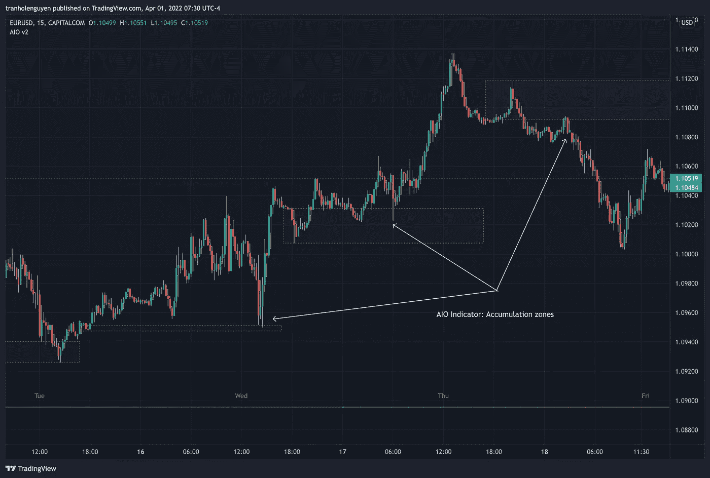
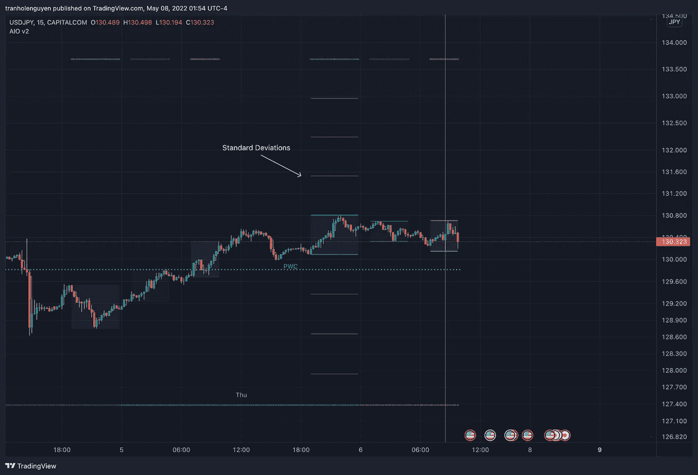

# 交易视图价格行为综合指标

> 原文：<https://medium.com/coinmonks/trading-view-price-action-all-in-one-indicator-e6238b80b830?source=collection_archive---------1----------------------->

**交易视图纯价格动作综合指标**

如果你是一个“价格行动”风格的人&不想使用许多指标或复杂的指标，或者你是一个 ICT 学生或 ICT 特许经营者，这个简单美丽的 AIO 指标适合你。

【报名链接:
**我的邮箱**:tranholenguyen@gmail.com
**我的电报频道**:[https://t.me/aiotradehub](https://t.me/aiotradehub)
**电报联系我**:[https://t.me/nguyenthl](https://t.me/nguyenthl)

该指示器具有以下功能。

**时区设置**

默认时区是纽约时间 GMT-4，如果您将时区设置留空，它将使用符号时区。注意，冬季交易时间延迟一小时。因此，如果您只是进行外汇交易，并将时区设置留空，TradingView 将自动为您调整符号时区，或者不要忘记根据夏令时更改时区设置 GMT-4 或 GMT-5。

**漏钢预测**

该指标将显示其对价格是否会以胜率突破之前的高/低的预测。

你也可以选择显示其他人的时间框架预测:1 小时，4 小时，4 天，4 周。我个人使用日，周预测，并在较低的时间框架内形成交易。

**统计面板(****)**

您可以通过设置选择要显示的面板。

**突破信息面板:**前一天/前一周的高点/低点是否被突破。

**时段信息面板:**ADR、亚洲、伦敦和纽约时段的 pips 信息。

**趋势面板:**显示趋势(上升/下降)

*   5m/15m/1h/4h/D/W 时间范围(TF)。
*   4 毫安(默认值:长度为 20–50–100–200 的形状记忆合金)

**资金管理面板**:在交易中，资金管理非常重要。只要把%风险，&止损值放在下面，指标就会为每笔交易计算出一个合适的大小/金额。
-批量大小:输入止损点
-单位大小:输入止损点(价格的%)
(*)单位大小按%止损点计算&当前棒线收盘价。你必须自己决定止损价格来转换成%止损。

当然，面板的颜色、位置、文本大小都可以根据你的喜好改变。默认大小为小。如果你用的是 4k/5k 的显示器，也许你喜欢换一个更大的尺寸。

**时间分隔符(****)**

我们可以选择要显示的时间分隔符。该指标有 5 个选项:锚定时间/天/周/月/季度。当然，我们可以选择只显示其中一个或全部 5 个。每一个的颜色都可以改变。

使用锚定时间，您可以选择想要在哪个时间绘制垂直线，以便更好地进行时间分析。这最多可以显示两条锚定时间线。默认值为 00:00(纽约午夜开盘)和 08:30(纽约时段开盘)。您也可以选择显示或不显示过去的行。

关于日分隔符，因为 TradingView 在设置中支持会话中断，但如果你不喜欢使用它或启用时，它会分散你的注意力，你可以使用我的。我最喜欢的交易日是周二和周三。

我的日期分隔符相对于“TradingView Session breaks”的优势在于时区设置，你可以将其设置为你喜欢的任何时区，会话也会随之改变。

使用日线分隔符，指示器有两个选项可以显示。您可以选择只显示其中一个或每个

*   按时区划分的每日分隔符，文本从星期一、星期二、…星期日开始
*   日线分隔符垂直线。您可以选择使用市场时间显示分隔线，如 TradingView 会话中断或使用时区

**物价水平(****)**

对于日内交易，前 1H 的高/低/收盘，4H，日，前一周，前一个月，ADR(默认周期为 5)是非常重要的关键水平。你可以选择你喜欢显示哪个以便更好的分析。当然，你可以改变线条的颜色和风格。这也是我最喜欢的指标。

有了每个以前的范围数据(日/周/月)，我们可以选择显示或不显示均衡水平。

该指示器还具有在特定时间显示多达 2 条价格线的选项，您可以选择想要显示的价格类型(高/低/收盘/开盘)。默认时间值为:

*   具体时间 1: 0:00。(纽约午夜开盘价)
*   具体时间凌晨 2: 8:30。(纽约市场开盘价)

**聚集区(**[https://bit.ly/36y9PS0](https://bit.ly/36y9PS0)**)**

市场倾向于将较高/较低价格重新定价为旧的高/低或不平衡/公允价值价格，以促进买入/卖出止损或为长/短交易提供明智的资金定价。通常情况下，它会很快重新分配，你必须学会在关键点位预测它们。弱势的短/长持有人会在回撤中被挤压。

除了开盘价，价格一直到收盘都在持续变化，所以聚集区也可以实时变化，但如果在分析时结合其他信息，就可以大概率预测/确定该区域是否已经建立。简而言之，价格需要时间来积累，我通常不会关注这个日线，直到伦敦开市/收盘或纽约时段

不仅日线区，指标还支持更高时间框架的累积区，从[ **自动→D→W→M→3M→6M→12M**

**会期&STD(****)**

共有 7 节课。默认值如下(纽约时间)。

*   亚洲:19:00 ~ 00:00
*   伦敦公开赛(伦敦杀戮地带):01:00 ~ 05:00
*   纽约公开赛(纽约死亡地带):07:00 ~ 10:00
*   DR/IDR: 09:30~10:30 **(日高或日低大概率在此盘中形成)**
*   IDR 印度支那:03:00~04:00
*   ADR/AIDR: 19:30~20:30

如果您不想显示标签，只需将标签值保留为空，或者将其更改为您想要的值。对于每个时段，你也可以选择显示顶部/底部收盘价和均衡价格水平。

这是我最喜欢的功能之一。我在 5m、15m、30m、1h TF 上使用它进行外汇日内交易。我最喜欢的交易时段是伦敦公开赛和纽约公开赛。

您也可以选择显示或不显示标准差(STD)。为亚洲范围标准设置的默认值和最大标准水平可以显示为 5。我通常使用以下 4 种 STD(纽约时间):

*   CBDR(中央银行偏差)标准时间:14:00 ~ 20:00
*   藐视标准时间:15:00 ~00:00
*   亚洲靶场标准时间:19:00 ~ 00:00
*   IDR: 09:30~10:30

**回看高/低/中(**[https://bit.ly/3qsYadW](https://bit.ly/3qsYadW)**)**

可以在日线图/4h 图上显示数据范围的高/低/中值。默认值为:

*   从今天起 20–40–60 天内的每日 TF。

*   从 4h TF 的最新小节向后 30–60–90 小节。

用于计算回看的默认锚定条是最新的锚定条，但带有:

*   4h TF:我们可以从一周的第一天开始改变回顾。

*   每日 TF:我们可以从每月的第一天开始改变回顾。

该指标还具有显示高/低/中(平衡水平)线的选项，以便更好地分析。特别是，在每日 TF 中，我们可以选择显示多达 4 行(每行 25%)的数据范围。

当然，你可以改变高/低/中线的颜色或样式。

当市场结构发生变化时，回望可以显示在较低的 TFs 上，以便更好地检测。

**魔术乐队**

我最喜欢的指标之一。波段根据趋势改变颜色&您可以将它作为更好分析的一个因素。默认周期值为 34。您可以选择显示/隐藏子波段(灰色的)

我如何使用它？我用趋势带来识别和交易回撤&潜在获利点的子带。我通常用它和多时间框架分析来寻找一个好的进场点。

【https://bit.ly/3Dh9i32】魔法棒(**)**

**分形棒线:**当价格& RSI 之间出现背离时，棒线的颜色发生变化。您可以更改 RSI 周期(默认值为 14) & RSI 来源。(开/高/低/关，…)

**不平衡条**或流动性空白或公允价值缺口(FVG)——无论你怎么称呼它。这是我在交易所有 TF 时最喜欢的指标。如果您愿意，可以在设置中选择延长最后 n 个不平衡条或隐藏填充的不平衡条。

**趋势条:**基于许多可用选项的着色条，如移动平均线(MA)值、MA 交叉、市场结构(CHoCH 或 BOS)或魔术带。如果你想通过条形颜色来过滤趋势，这真的很有帮助。

**市场结构**

*   **旧高/低启用**:检测做市商打算操纵的下一个买入/卖出止损点。适用于将周期设置为较小值的情况。

*   **市场结构启用**:检测市场结构是否发生变化(**结构的破坏(BOS)和性质的改变(CHoCH)** )。这一直是我最喜欢的指标之一。它只是在你真正需要的时候显示出线条，我真的很喜欢，太美了。

该指标支持多达 2 个周期，以显示多达 2 个市场结构变化。我称它们为:子结构&摇摆结构

它还具有**“显示流动性扫描”**，可以帮助您过滤潜在的流动性扫描水平或结构的虚假突破

**趋势线(**[https://bit.ly/36LXWrs](https://bit.ly/36LXWrs)**)**

一个非常简单的趋势线，默认的向左旋转强度是 10。

默认情况下，趋势线使用高/低价，但您可以选择“使用收盘价”。

**SMT 发散**

SMT 或聪明钱技术分歧。它显示了两个符号之间的分歧，如 S&P500 与纳斯达克 100 指数。

**之字形**

最多可显示 2 条之字形线。

这适用于那些很难发现价格关键水平(最近的高/低)来确认市场结构的交易者，或者只是在这些水平上很容易画出斐波纳契线。

**移动平均线**

我相信这是每个交易者最常用的指标之一。有 5 种 MA 可供选择:均线、SMA、WMA、VWMA、SMMA(RMA)。

这可以显示高达 4 MAs。您可以为每个选项选择信号源(关闭/高/低，…)。我最喜欢的值是 34 和 89 均线。

该指示器还支持毫安带和毫安带。您可以选择哪个麻友想要显示波段，波段的“宽度”可以通过设置进行更改。

MA Bands

MA Ribbon

**VWAP**

该指标有两个 VWAP 选项:锚定和滚动。你可以选择显示哪一个。

VWAP

**|其他/已知问题/限制**

在外汇或股票(只在工作日交易的东西)，TradingView 的[dayofweek。星期五]不包括星期一之前的最新条形，因此日分隔符不能填充该空间。因为 TradingView 将这些条形作为周日的条形进行处理，所以我将周日的颜色设置为与周五相同，以获得良好的 UI/UX。在加密图表上，指示器显示没有问题。

你可以看到下面的图片，显示我已经从 1 分钟的时间框架测试了我的指标，启用了所有功能，并将每个设置都更改为最大值&一切仍然正常。

**部分手机截图**

**结合我的分析，一些我日常使用它的例子**

—
Nguyen Tran