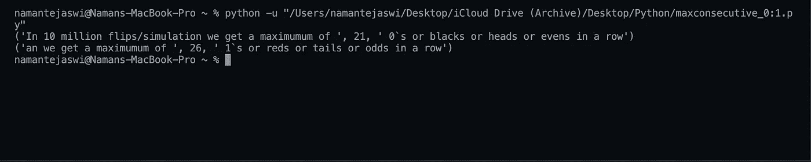
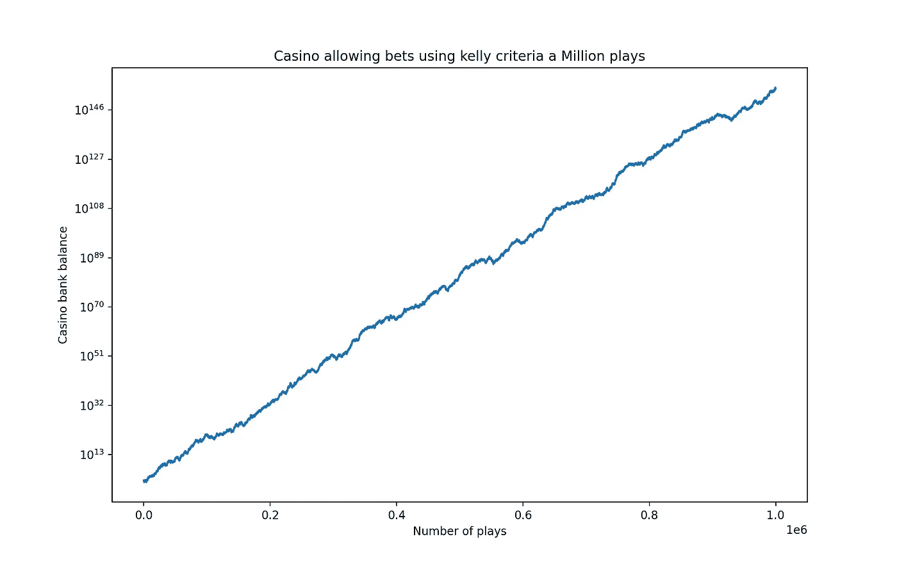
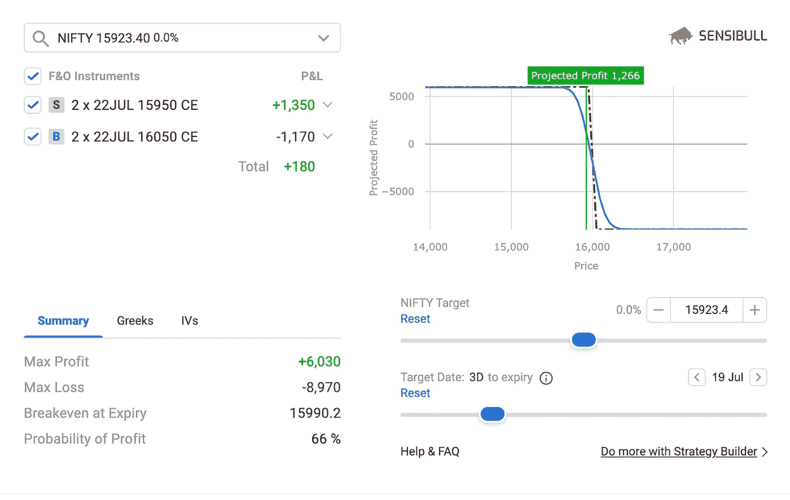

# 具有统计优势的交易

> 原文：<https://medium.com/coinmonks/trading-with-a-statistical-edge-2afea137b261?source=collection_archive---------0----------------------->

长期以来，金融市场一直被金融业以外的人视为一个随机过程，因此是一个充满风险的到来。一个随机事件必然有风险的假设需要一些解释。

> 让我们首先把一个随机过程分成两种不同的类型，首先说我们有一个事件，我们知道确切的可能结果，然后我们想到一个过程，我们不能 100%确定结果集。

掷骰子是一个过程，在这个过程中，我们可以 100%肯定地说，我们知道滚动的数字将是 1、2、3、4、5 或 6 中的一个。另一方面，考虑加利福尼亚的年降雨量，虽然根据过去的数据，我们可以说在一定的置信区间内预计会有多少降雨量，但我们永远不能说这是我们今年将获得的最大降雨量，至少在数学上是这样。简而言之，一方面我们有一个有界的结果集，另一方面我们有一个无界的集。这场讨论为我们提供了一个有趣的故事。

> 在大约 2 世纪的拉丁民间传说中，我们第一次看到黑天鹅，思路是，人们一生中看到的所有天鹅都是白色的，因此他们推断出我们世界上存在的所有天鹅都是白色的。然而，在 17 世纪末，荷兰探险家在西澳大利亚发现了一只黑天鹅，因此“黑天鹅事件”一词被创造出来。

从那时起，这个词就被用来比喻那些被认为是不可能的，或者说是不可思议的，但实际上却发生了的事情。从我们之前的例子来看，骰子永远不会有黑天鹅的结果，但是对于我们预期的降雨量来说，情况就不一样了。这让我们想到了另一个有趣的说法，墨菲定律。

> 墨菲定律表明，如果我们进行足够多的尝试，任何可能发生的事情都会发生。也就是说，任何概率大于零的事件，如果我们继续实验直到永远，最终都会发生。这句格言最初是负面的，意思是“任何可能出错的事情都会出错”。

我们可以想到墨菲定律，简单地说，如果一个事件的概率大于零，不管这个数字有多接近零，它强调了一个事实，即事件最终会发生，否则它的概率将为零。这通常会偏离到一个哲学讨论，即没有什么是不可能的，但我们现在会避免它。

一个实际的例子是 1913 年 8 月 18 日在蒙特卡洛赌场的轮盘赌上发生的事情。轮盘赌中的球连续 26 次出现在黑色插槽中，正如人们所料，赌徒谬误开始出现，人们不断地在红色上下注，无视每次旋转都是独立的。人们可以预期连续 26 个黑人，其概率为(18/37) ⁶或 7.30 * 10-⁹或轮子旋转 100 亿次中的 73 次。这强调了一个事实:足够的模拟和所有可能的事件都出现了。

这里有一个简单的函数来复制一个公平的轮盘赌(没有绿色)，1000 万个二进制结果的模拟可能是正面或反面。继续自己检查理论概率是否合理。

A million spins on a fair roulette

> 在这里，我们学到了第一条交易原则，“不要把不可能和不可能与不可能混为一谈。”我们更喜欢使用风险定义系统，否则总有一天，金融市场上一个不可思议的事件会让我们破产。活着为了战斗/赌一天。

现在，我们将注意力转向期望值、大数定律，并深入研究金融市场中的衍生工具。

期望值是单个事件的概率数学结果

假设我们有一个事件 X，其离散结果为 O1 和 O2，概率为 P1 和 P2，那么事件 E 的期望值将为

E(x)=P1* *O1+P2** O2

例如，考虑一个数字为 1 到 6 的骰子，期望值是多少？

假设我们手头有一个公平的骰子，每个数字出现的可能性都是相等的，所以

E(x)=1/6[1+2+3+4+5+6] E(x)=3.5

现在一次掷骰子不可能得到 3.5，这就是大数定律发挥作用的地方，

> 当我们重复事件/实验的实例时，事件的结果将收敛到它的预期值。

这意味着，随着我们继续多次掷骰子，我们结果的平均值将接近 3.5。

关键是，一个人可能将硬币抛 10 次，得到 8 个正面，但如果一个人继续将硬币抛 1000 次，他不太可能得到 800 个正面，结果更可能是 50:50，当我们重复我们的实验时，也就是说，观察值将收敛到它的期望值。

现在，在交易、赌博或赌场环境中，预期回报或利润将取决于两个参数，即您下注的事件发生的概率以及您赢得赌注或输掉赌注时的支出或支付(赔率)。在赌场的情况下，由于 00 和绿色槽的存在，偶数或奇数红色或黑色的概率被改变。(在欧洲轮盘赌中 18 红 18 黑 1 绿，而非 0 不被认为是偶数或奇数或 00 的存在)在博彩事件的情况下，支付比率是倾斜的，赌场从所有投注者收集的钱数中抽取一部分，并支付其余部分。

赌场优势总是存在于任何赌场或博彩行业，也就是说，如果下注的金额与所有事件的结果概率成比例，那么你也会在许多下注中输钱。简单地说，投注者对回报的期望值为负，庄家对回报的期望值为正。

这意味着在很长一段时间内，赌场在数学上保证最终盈利，玩得越多，赌场的预期利润就越多。这就是为什么人们会说，从长远来看，房子永远是赢家。然而，我们还没有看到一个关键条件，即防止赌场停业的牌桌限制。

> 赌场永远不会允许在单一游戏上下大赌注，但它宁愿允许几个较小的赌注加起来就是那个大赌注。期望值和凯利标准建议何时下注以及下注多少。

首先，一个人应该总是只在期望值为正的情况下下注，也就是说，他应该是赌场或庄家，而不是赌徒或投注者。单个实例的下注金额由凯利标准给出，该标准为

> K%=(P*R-Q)/R=P-(Q/R)其中 K 是必须下注的可用资金的百分比，P 是赢的概率，Q 是输的概率，R 是回报:风险比率或支付比率。

如果遵循凯利标准，它将在每次胜利后减少我们下注的绝对值，并在每次胜利后增加绝对值，因为它的值是可下注资金的百分比。这导致对数正态概率分布，也就是说，这将是积极的偏斜，我们期望赚钱。

> 还要注意的是，即使赢的机会是 99 %, 1:1 的赔付率，凯利也不会建议赌上你所有的钱，因为 1%是有原因的，就像我们在多次事件中了解到的那样，最终 1%会出现，凯利会解释这一点。

我们有赌场的收益图，初始余额为 1000 个单位，玩了 100 万次，这是为了证明赌场优势的影响或在牌桌限制的重复事件中具有正期望值，即根据凯利标准下注。一个看似很小的房子对冲放大了多场比赛，这是欧洲肉饼，比美国肉饼有更好的赔率。

> 人们可以将赢的概率改变为衍生产品交易中的利润概率和支付率，并看到多个正期望值交易的影响，并决定他们是否希望成为投注者或庄家。同样，在放大图表时，你会看到赌场出现了一系列亏损，就像蒙特卡洛的连续亏损一样，但由于每次亏损我们都会减少赌注，因此我们能够在游戏中呆得更久，这是金融市场中交易衍生品的本质。

现在我们来看看如何将这些概念应用到衍生合约交易中，我假设你熟悉期权和一级希腊人的基本术语，以及期货合约的工作机制，但如果你不熟悉，你可以简单地把它们想象成有获胜概率和支付率的赌注。

现在，我们的策略非常适合定义了最大风险和最大回报的交易，熟悉的交易者可能还记得典型的借方差价、铁鹰、铁飞等。这些是多个看涨和看跌期权的组合，它们有各自的动态盈利概率，因此组合策略也有动态盈利概率。

> 期权到期的概率用希腊 delta 表示，delta 不代表最大利润的概率，同样 1-delta 也不代表最大损失的概率，它代表任何利润或损失的概率。概率密度函数，即每一点的盈利概率，由期权的隐含波动率来表示，但为了简单起见，我们将把最大亏损或最大盈利作为二进制结果。
> 
> 请注意，Delta 是动态的，任何期权的利润概率都会随着标的的变化而变化，但为了简单起见，我们将把它视为一个点函数和一个静态事件。
> 
> 简单说一下隐含波动率，隐含波动率是基于模型如 Black Scholes 建议(隐含)的波动率的值，如果我们知道其他参数如到期时间、执行价格、利率等。从历史上看，隐含波动率很多时候都大于实际波动率，简单来说，这意味着基于市场变动的期权很多时候都被高估了。这就是为什么期权卖方在理论上有优势。如果隐含波动率经常接近实际波动率，那么卖方和买方都没有优势，如果隐含波动率开始低于实际波动率，那么买方就有优势。但是由于隐含波动率在很多时候(不总是！)高于已实现的波动性，多重押注的卖方(正预期值)预计将击败期权的买方(负预期值)，并具有理论优势，就像赌场预计长期获胜一样。不同罢工的隐含波动率构成了利润概率的正态分布。请注意，期权的卖方有潜在的无限风险，这意味着卖方下注的金额超过了他所有的钱，而买方下注的金额是固定的，尽管通常预期值为负。这是通过创建对冲来实现的，即通过限制最大损失和我们定义的最大战略风险，在距离卖出的执行价更远的执行价处买入期权。现在我们可以遵循凯利标准来确定我们交易的仓位大小。

总的来说，我们必须进行在多个事件中具有正期望值的交易，并且必须根据凯利标准来确定我们的头寸。

最后，我们将使用一个潜在交易来演示我们所谈论的内容。

考虑以下借方差额:

我们做空 15950 看涨期权，做多 2021 年 7 月 22 日每周到期的 16050 看涨期权，交易价格为 15923。

> 盈利的概率是 66%(而不是来自 delta 的绝对值，我们采用平台告诉我们的，因为我们讨论过概率密度函数是一个值的范围)，最大利润是每手 3015，最大损失是 4485。现在，我们的交易有一个正的预期值，即每手 465 英镑，然后凯利标准建议，我们应该将 15.42%的交易资金押在这笔交易的一个实例上，这将有助于我们定位大小或选择交易的手数。

A Positive Expected Value Trade

> 最后，从这篇文章中得到的关键是，正的期望值是一个好交易的标志，因为我们将在一生中交易。正的期望值意味着如果我们继续坚持我们的交易，我们肯定会获利，因为大数法则意味着在许多交易中，我们将平均获得与期望值相等的利润。

请理解隐含波动率在很多时候大于实际波动率，但并不总是如此，也就是说，期权并不总是定价过高，长期利润概率就像任何事件一样适用于类似交易的大型模拟。还要注意，在相关工具中的多次交易意味着事件是相关事件，在这种情况下，您可能希望降低您的对称风险，因为从技术上讲，您不会根据凯利标准下注。

您可以在这里找到 github 库

 [## namantejaswi/Trading _ With _ Statistical _ Edge

### 我们探索某些统计概念如何帮助我们成为更好的交易者…

github.com](https://github.com/namantejaswi/Trading_With_Statistical_Edge) 

免责声明:我不对你的交易负责。这是一个教育博客，期权有很大的风险。请在交易前理解这些。

## 也阅读

 [## 加密交易机器人——2021 年最佳免费加密交易机器人

### 2021 年币安、比特币基地、库币和其他密码交易所的最佳密码交易机器人。四进制，位间隙…

medium.com](/coinmonks/crypto-trading-bot-c2ffce8acb2a)  [## 最佳 6 个加密交易信号电报通道

### 这是乏味的找到正确的加密交易信号提供商。因此，在本文中，我们将讨论最好的…

medium.com](/coinmonks/best-crypto-signals-telegram-5785cdbc4b2b)