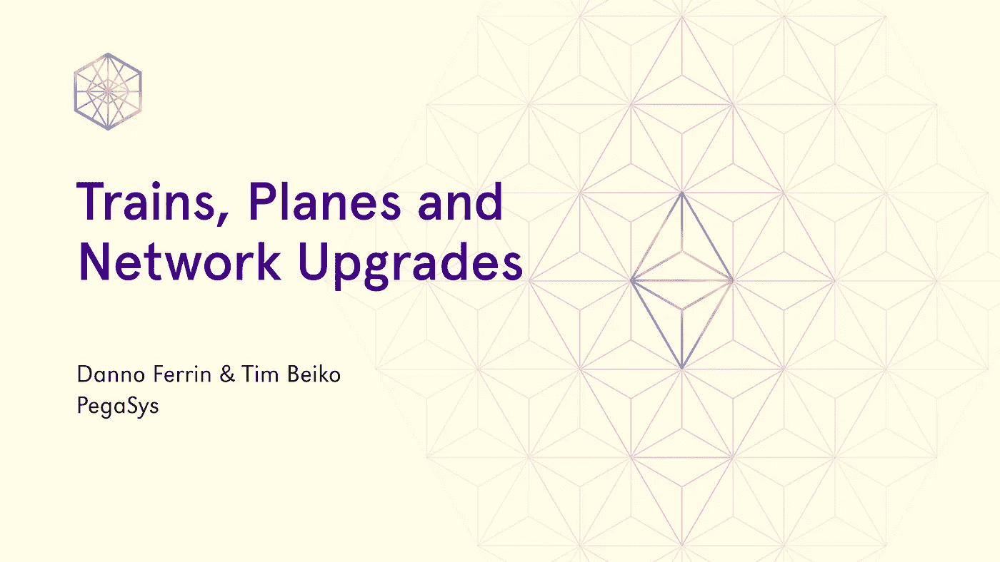
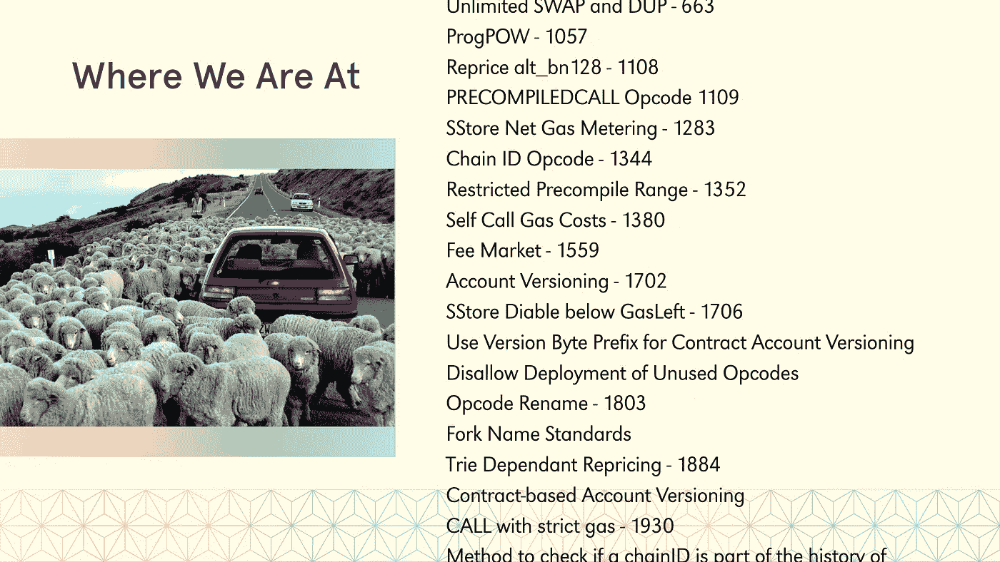
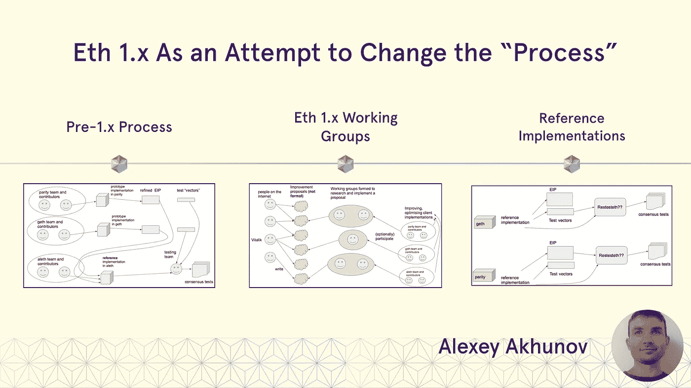
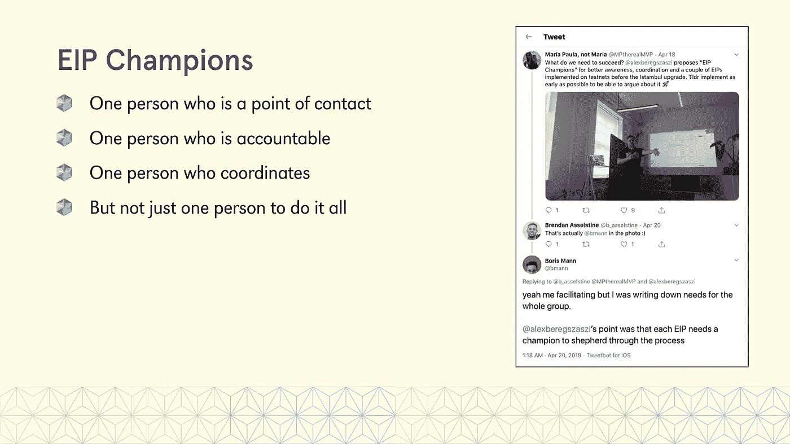
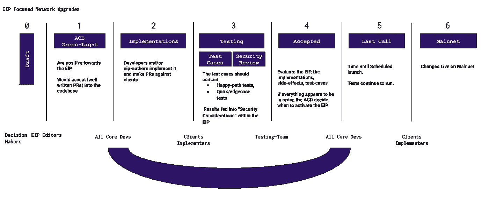
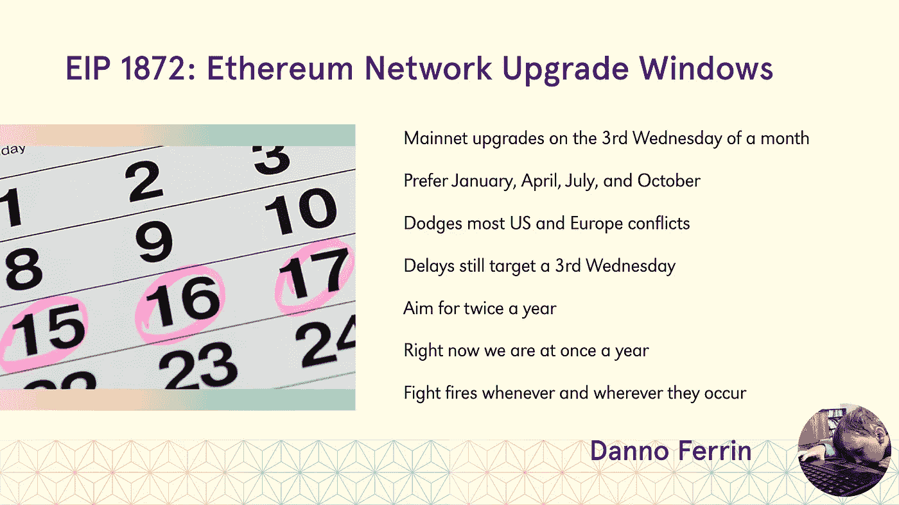
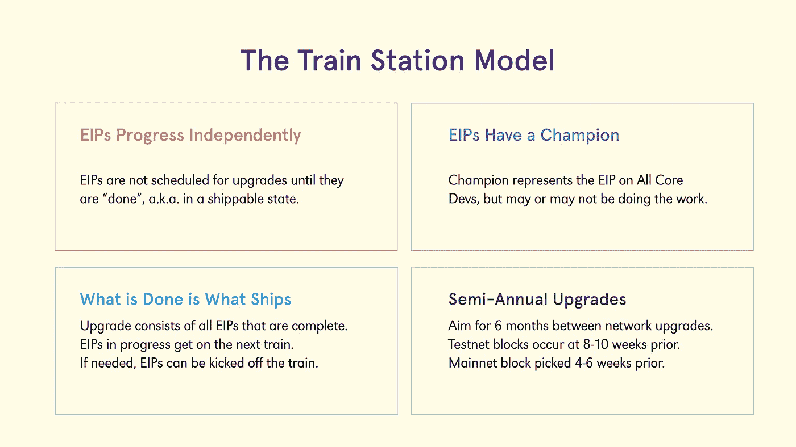
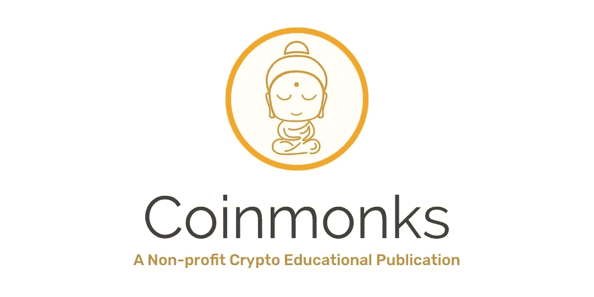

# 火车、飞机和网络升级

> 原文：<https://medium.com/coinmonks/train-planes-network-upgrades-6edfc9f6b7dd?source=collection_archive---------0----------------------->

## 以太坊 1.x 的常规发布节奏

他的帖子是我和[丹诺·费林](https://medium.com/u/fc9328854053?source=post_page-----6edfc9f6b7dd--------------------------------)在[敌无双五世](https://devcon.org/)演讲的粗略记录。它讨论了社区在过去一年中提出的一些 EIPs 流程改进，并将它们合并到一个框架中，以帮助我们更顺利地进行以太坊网络升级。

我们把它命名为火车站模型。

# TL；博士:

我们提出了一种协调以太坊网络升级的新方法，这是基于过去一年中社区提出的一些建议。具体来说，我们认为:

*   升级应该每年进行两次，以便为社区提供可预测性；
*   升级应该只包含准备发货的 EIP，任何仍在进行中的都应该转移到下一次升级，而不是推迟当前的升级；
*   EIP 应由工作组以独立的方式开发，并且只有在完成升级后才应考虑包含在升级中；
*   EIPs 和工作组应该有一个拥护者，作为社区关于 EIP 的主要联系人。

如果你想进一步讨论这个提议，请到🧙的[ethmagicians thread](https://ethereum-magicians.org/t/a-train-station-model-for-network-upgrades/3721)来🏻‍♂️

L et 我们先从一点点“以太坊网络升级史”说起。第一批网络升级，Frontier，Homestead，Byzantium 和 Constantinople，有点像 20 世纪 50 年代的家庭度假:妈妈和爸爸会打包汽车，我们会跳上车，也许会带上我们最喜欢的玩具，他们会带我们安全到达目的地。

这是一个简化的复述，但是，对于那些升级，核心开发人员编写了大部分 EIP，以太坊社区足够小，它们在某种程度上被有机地社会化到正确的人，forks 顺利地发生了。

….除非他们没有！有几次，我们不得不救火。在那些场合，所有人都在甲板上。无论是上海的[攻击](https://www.coindesk.com/so-ethereums-blockchain-is-still-under-attack)、道的[攻击](https://www.coindesk.com/understanding-dao-hack-journalists)，还是君士坦丁堡发现的[最后一分钟漏洞](/chainsecurity/constantinople-enables-new-reentrancy-attack-ace4088297d9)，社区总是一起提出修改建议，实施修改，并让用户及时升级他们的节点。

An Ethereum-colored waterfall

然后来了**伊斯坦布尔**。到那时，我们已经很好地掌握了我们的过程，并决定更彻底地计划事情。我们为升级过程的每个阶段设定了一些截止日期，从 EIPs 提交一直到 mainnet 升级。在我们知道之前，我们正在看一个[以太坊-瀑布过程](https://eth.wiki/en/roadmap/istanbul#timeline)！

正如我们所知，瀑布对于软件开发并不适用。但是，不管怎样，我们还是去了伊斯坦布尔。

我们计划在一月份开始，花几个月的时间审查 EIP，并在五月中旬接受最后期限，然后花两个月的时间为客户实现，这将使我们在七月中旬。完成所有这些后，我们可以在八月中旬进行测试网升级，并在十月中旬在 mainnet 上上线……比我们预计的 devcon 发布时间提前了两周。

那么，我们实际上完成了多少个截止日期呢？一个。开球。

T4:在这个过程中，很多事情都出了差错。更重要的一点是，由于以太坊社区自上次升级以来已经有了很大的发展，当开始审查伊斯坦布尔的 EIP 时，核心开发人员不得不考虑 30 多个提案，而不是只有少数几个提案需要审查！

这大大减慢了进程。不仅有许多 EIP，而且它们处于完全不同的发展阶段(一些没有合并，而另一些运行着 testnets ),并且有几个相互依赖或竞争的 EIP。

We couldn’t fit the full list of proposed Istanbul EIPs our my devcon slides using the font they gave us…

当我们得到伊斯坦布尔 EIP 的最终清单时，已经是仲夏了，也就是我们应该准备好客户端实现的时候。

当这种情况发生时，许多人意识到这个过程远非最佳。有几个建议是关于我们如何使柏林，伊斯坦布尔之后的升级，运行得更顺畅。

我们现在将检查其中的一些建议，然后将它们组合成我们所说的“火车站模型”。

Berlin could be nice and sunny

## Eth 1.x 作为改变“过程”的尝试

第一个在伊斯坦布尔尝试解决流程问题的人是 Alexey Akhunov。他写了[一篇博文](/@akhounov/ethereum-1x-as-an-attempt-to-change-the-process-783efa23cf60)描述我们如何组建工作组，并使用 [ReTestEth](https://github.com/ethereum/retesteth) 作为一种方式来增加可以为以太坊贡献协议改进的人数，同时也减轻现有核心开发人员的负担。

在“pre-1.x”流程中，提交的 EIP 将由主要来自 Geth、Parity 和 Aleth 的客户端开发人员实现。当这发生时，EIP 将由这些团队协作改进。一旦客户就 EIP 的最终规格达成一致，就会产生参考测试。Aleth 是唯一可以这样做的客户端，因此任何 EIP 都必须在 Aleth 中实现，以便生成这些测试。然后，EF 的测试团队将运行测试，并编写所有客户都将运行的共识测试。

Images on the slide are taken from Alexey’s [original post](/@akhounov/ethereum-1x-as-an-attempt-to-change-the-process-783efa23cf60)

这个过程有几个瓶颈:实现的主要客户团队，生成参考测试的 Aleth，以及编写一致测试的 EF 测试团队。

作为这种方法的替代方案，Alexey 提出了建立工作组的想法。这些小组将由有着共同愿望去改善以太坊的一部分的人组成。他们可以在 EIP 的最早期阶段就开始工作，并帮助完善它，直到它的规格差不多是最终的。通过这种方式，客户端开发人员将使用相当先进的 EIP，可能至少有一个初始实现，并且其公开的问题大部分已经得到了回答。

与此同时，由 EF 测试团队开发的新测试工具 ReTestEth 将使工作组能够通过任何支持它的客户端(目前是 Geth、Aleth 和 Hyperledger Besu)为其 EIP 生成自己的参考测试。

因此，这个工作组框架不仅会使 EIPs 细化过程更加分散，而且还会减少测试方面的瓶颈。

## EIP 冠军

在伊斯坦布尔之前，AllCoreDevs 打电话给没有人在场的人谈论某个具体的 EIP，这种情况并不少见。这不仅减慢了 EIP 的开发，而且在存在依赖关系或竞争的 EIP 的情况下，它将减慢整个升级的过程。

Alex Beregszaszi 在 ETH 1.x 柏林会议上提出了一个解决这个问题的简单想法，即要求 EIP 有一个冠军。

Props to [MP](https://twitter.com/MPtherealMVP) & [Boris](https://twitter.com/bmann) for facilitating the workshop where this was discussed

冠军的角色是与 EIP 相关的所有事情的联系人。他们充当 EIP 的协调人，负责确保事情向前发展，并确保适当的人参与正确的讨论。他们不负责做所有的工作，也不一定必须是实现者，但是他们应该是 EIP 的关键人物，并投入时间在社区内将其社会化。

## 以 EIP 为中心的分叉

EF 的[马丁·霍尔斯特·斯温德](https://twitter.com/mhswende)最近提出的另一个想法是修改我们的网络升级流程，使其更加以 EIP 为中心。

我们不应该专注于升级本身，也不应该确保所有的 EIP 在升级的各个阶段都以相同的速度运行，我们应该专注于使 EIP 处于可运输的状态，然后，只有到那时，才安排 EIP 进行升级。

如果有人想从 mainnet 的草案中获得 EIP，这里是他们在这个框架下如何做的(引用自[原始提案](https://notes.ethereum.org/@holiman/S1ELAYY7S?type=view)、*并为了可读性做了一些小的编辑*):

> **第一步:获得 ACD 祝福**
> 
> 假设 EIP 存在(步骤 0)，Allcoredevs 将正式决定 EIP 是否“最初被接受”。
> 
> “最初被接受”(或“被认可”)意味着 ACD 代表主要客户*和*生态系统利益相关者等。对 EIP 是积极的，会接受(写得很好的)PRs 来将 EIP 包含到代码库中，这样它就可以被切换到测试…但没有实际的块号来激活

这种“最初被接受”的状态对于像 EF、ConsenSys 甚至 MolochDAO 这样资助协议升级团队的组织来说也是一种有用的信号机制。资金可以分成几个阶段(即“初步接受”前和“初步接受”后)，以确保大部分资金用于极有可能在 mainnet 上运行的计划。

> **第二步:实施**
> 
> 一旦 ACD 批准了，开发者和/或 EIP 作者就执行它，并针对客户制定 PRs。
> 
> 如果实现被*合并*到主要客户端，这个里程碑就完成了。
> 
> **第三步:测试用例**
> 
> 由于该特性现在在客户端中是“可激活的”,因此现在可以为该特性生成跨客户端的测试用例。
> 
> 测试用例应该包含愉快路径测试，和古怪/边缘案例测试。
> 
> 此步骤应与许多不仅对 EIP，而且对整个 EVM 都有深入了解的人一起执行，以最大限度地覆盖应被视为边缘案例的内容。
> 
> 此时，应完成安全审查，并将审查项目反馈给 EIP，放在“安全考虑事项”下。审查还应该集中在寻找测试的边缘案例上。
> 
> 一旦测试团队认为测试完成，这个里程碑就完成了。
> 
> **第四步:ACD 最终验收。**
> 
> 在这一点上，ACD 可以再次讨论 EIP，并评估 EIP、实现、副作用、测试用例等。
> 
> 如果一切正常，ACD 可以简单地决定何时激活 EIP。

> *“是的，让我们一个月后在 testnet 上激活这个 EIP(在块 X)，两个月后在 Mainnet 上激活(在块 Y)”。从现在起一周内，所有客户端将在下一个版本中包含升级，并且还包含通过命令行标志推迟 EIP 的功能。*

> 如果发生多个 EIP 同时到达步骤 4 的情况，ACD 可能会决定同时推出两个或三个——除非担心 EIP 可能具有内部依赖性/耦合，这可能会干扰(或导致测试的额外边缘情况)。

为了形象地表现这一新过程，[詹姆斯·汉考克](https://twitter.com/JHancock)制作了一张图片，展示了 EIP 将如何通过上述每个阶段进入 mainnet。

Thanks for the great graphic, James!

使用这个框架将允许每个 EIP 按照自己的步调前进，将减少争论升级的时间和范围所花费的时间，并且将通过提供更可预测的 EIP 流来减轻测试团队的压力，而不是在升级截止日期到来时出现单个 EIP 突发。

## EIP-1872 年

另一个有助于平稳以太网升级过程的想法是 [EIP-1872](https://eips.ethereum.org/EIPS/eip-1872) ，作者是[丹诺·费林](https://medium.com/u/13fa7b42fe5e?source=post_page-----6edfc9f6b7dd--------------------------------)。随着越来越多的公司依赖以太坊作为其基础设施的核心部分，我们应该致力于使网络升级更可预测。

EIP 提议对网络升级采用一个默认的时间表，类似于微软对[补丁星期二](https://en.wikipedia.org/wiki/Patch_Tuesday)所做的。通过这种方式，运行以太坊节点的人很有可能知道他们何时应该监控潜在的升级。

简而言之，EIP 提议:

*   让 mainnet 升级默认在每月的第三个星期三进行，最好是在一月、四月、七月或十月，以避开大多数主要的美国和欧洲假期。
*   在升级延迟的情况下(如君士坦丁堡事件)，将升级推迟到每月的第三个星期三
*   现在的目标是每 6 个月对 mainnet 进行一次升级
*   **无论何时何地发生火灾，继续灭火**

如果发生特殊情况，这个 EIP 不会将我们锁定在这些日期，但会提供强大的默认设置，有助于减少下一次升级何时到来(从现在起 6 个月)的不确定性，从而减少核心开发人员尝试协调升级确切时间所花费的时间。

它还在我们目前的方法和以 EIP 为中心的 Forking 提出的“一个 EIP，一次升级”方法之间提供了一个“中间地带”。

# 火车站模型

结合上述建议的各个部分，我们得出了一个更接近火车站运作方式的流程，而不是我们当前的“更接近机场运作方式”。

今天，我们的升级类似于购买机票:日期和时间是固定的，无论如何，我们都会努力让每个人都上飞机，特别是如果他们已经托运了行李，即使这会导致延误。

我们相信，转向这样一种模式，即人们提着行李出现在火车站，准备出发，乘坐下一趟列车离开，将有助于使网络升级比现在顺利得多。

具体来说，这个火车站模型有四个主要组件。

首先是生态工业园应该独立发展。工作组可以努力推进他们的 EIP，只有当它处于准备就绪的状态时，才会安排网络升级。

第二是 **EIPs &工作组需要冠军**。这些拥护者应该作为 EIP 的代表和默认联系人。他们负责在 AllCoreDevs 和其他论坛上代表它，可能是也可能不是实际的实现者。

第三是**做的是什么船**。当升级到来时，无论哪个 EIP 都准备好投入使用，它们都是升级的一部分。任何仍在进行中的事情都不会被安排在升级中。同样，如果最后一分钟出现了 EIP 问题，我们会将其转移到下一次升级，而不是推迟整个升级。

第四个也是最后一个要素是**升级每年发生两次**。通过设定 6 个月的升级间隔，我们可以减少从事 EIP 工作的团队的不确定性和延迟。通过这种方式，如果某个特定的升级中没有包含某些东西，那么几个月后就会有后续的升级。虽然升级日期是提前选定的，但测试网的特定块是在 mainnet 升级日期前 8-10 周选定的，mainnet 块是在升级前 4-6 周选定的。

…这就是你想要的！我们希望这种模式能够为以太坊提供更加高效、可预测和频繁的网络升级。

*特别感谢 Alexey Akhunov、Alex Beregszaszi、María Paula Fernández、* *Boris Mann、Martin Holst Swende、James Hancock 以及所有为我们如何改进以太坊升级方式提供建议的人。*

> [直接在您的收件箱中获得最佳软件交易](https://coincodecap.com/?utm_source=coinmonks)

