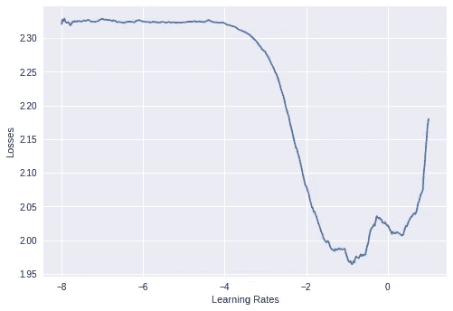
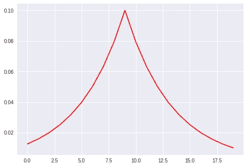

# 训练神经网络的速度提高了 10 倍

> 原文：<https://medium.com/coinmonks/training-neural-networks-upto-10x-faster-3246d84caacd?source=collection_archive---------4----------------------->

这是物体探测软件 [wiki](https://github.com/karanchahal/object-detection/wiki) 的摘录。我目前正在实现一些最**前沿**的物体检测算法[这里](http://github.com/karanchahal/object-detection)，我将把我实现它们的经历写在博客上。

今天我们讨论如何通过使用两种技术来训练神经网络，使其比正常情况快得多。**循环学习率**和**超收敛**。

该项目的培训方法旨在使培训简单快捷。最近，像超收敛和循环学习率这样的技术已经极大地改善了模型收敛的时间。

目标检测软件试图使用最先进的训练技术。在寻找最佳方法的过程中，我偶然发现了 fastai 图书馆使用的这项技术。

# 学习率探测器

学习率查找器首先由 CLR (link) fame 的 Leslie N Smith(link)介绍，它寻求找到最佳学习率来开始任何数据集/架构的训练。

这个技术很简单。有一个时期，

1.  以非常小的学习速率(大约 1e-8)开始，然后*线性增加学习速率*。
2.  绘制 LR 每一步的损失。
3.  当亏损停止下降并开始增加时，停止学习率查找器。

我想到了一些问题:

1.  你如何线性增加 LR？
2.  如果损失没有停止减少，你什么时候停止这个过程**？**

**Ans 1**:LR 的线性变化策略如下。我们有一个初始学习率(~1e-8)和一个最终学习率(8)(很大)。下面给出了一些示例代码:

```
num = 100 # the number of mini batches in an epoch
mult = (final_value / init_value) ** (1/num) # the lr multiplier
new_lr = old_lr*mult
```

**Ans 2** :这是一种非常罕见的情况，如果确实发生了，那么再次运行 LR 查找器，使**最终值**增大一个因子。一般来说，一个好的最终学习率应该在 8%左右。

学习率查找器非常适合查找最佳学习率，并且还能提供关于模型如何与数据集收敛的更多信息。

我们使用学习率查找器中的信息来实施我们的 1 周期策略，该策略将在下一节课中介绍。

学习率查找器的代码如下所示:

该功能的执行图表如下所示。



.

从这个图看，0.01 的学习率似乎是训练网络的一个好值。我们可以选择的最大学习率大约是 0.1。

# 1 周期政策

*1 周期策略*规定，使用周期学习率可以在比标准时间短得多的时间内收敛模型。使用这种方法，我们旨在实现所谓的超收敛。

超收敛是在相同硬件条件下，模型在比范数更短的时间内进行训练。

在训练 cifar10 数据集时，可以找到超收敛的一个例子。

使用 *1 周期策略*，网络在 20 个时间段内收敛到 93%的准确率，批量为 150 个。

这比使用手动学习率步骤的 500 个纪元要好得多，手动学习率步骤为 1-150 个纪元 0.1，0.01-150-300 个纪元 0.001-300-500 个纪元，批量为 150。

所有结果都已在配备约 11 GB 单 GPU (Nvidia Tesla K80)的 **Colab** 笔记本上测试过。

一个周期的保单如下:

注:我们称 LR 查找器找到的学习率为 **L** 。

1.  **从比学习率查找器找到的学习率低 1/10 的学习率开始**。
2.  训练模型，每个纪元后**将 LR 线性增加至 L** 。
3.  达到 L 后，开始**降低左后**直到 L/10。

学习率变化的图表如下所示:



将该学习率序列划分为~ 20 ~ 30 个时期，并检查*验证准确性*。如果模型达不到要求的精度，增加纪元数。

在使用这种方法进行实验时，在 Cifar10 数据集上获得的一些结果在此处给出

然而，这种方法存在许多问题。具体如下:

1.  一个人应该使用什么样的**乐观者**？
2.  应该选择什么**批量**？
3.  这适用于**大数据集和小数据集**吗？
4.  什么**模型架构**不支持 1 周期策略？
5.  你应该测试**循环动量**吗？

这些问题需要一个可靠的答案，我们将适当地研究这些问题，并在训练网络时达成一套可靠的规则。

> [直接在您的收件箱中获取最佳软件交易](https://coincodecap.com/?utm_source=coinmonks)

[](https://coincodecap.com/?utm_source=coinmonks)