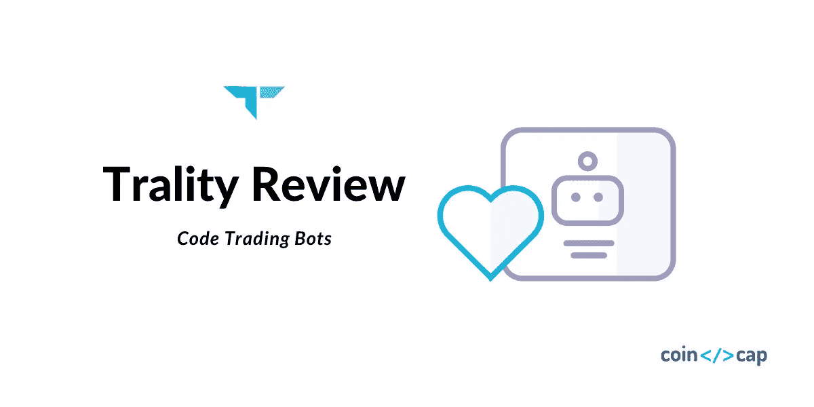
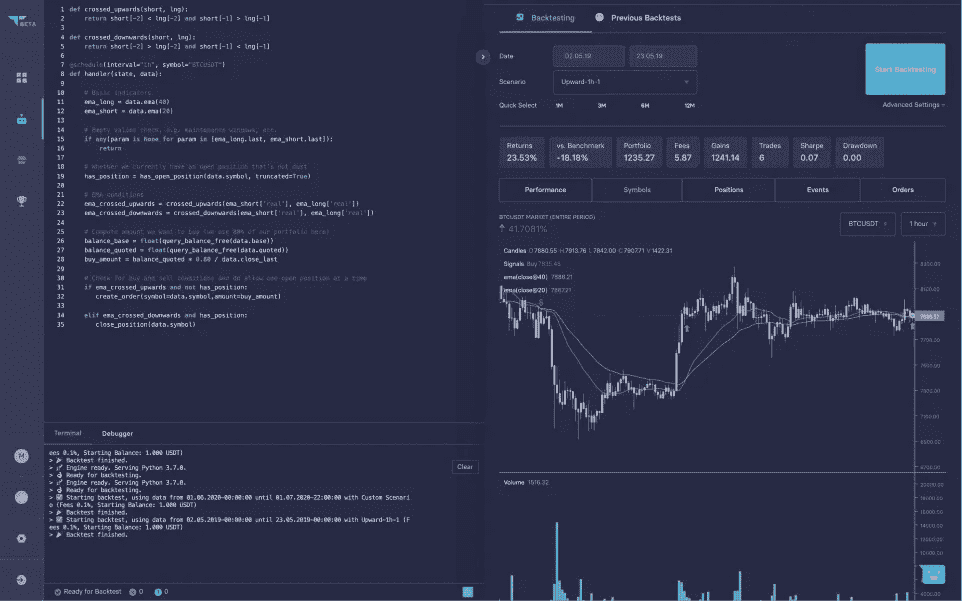
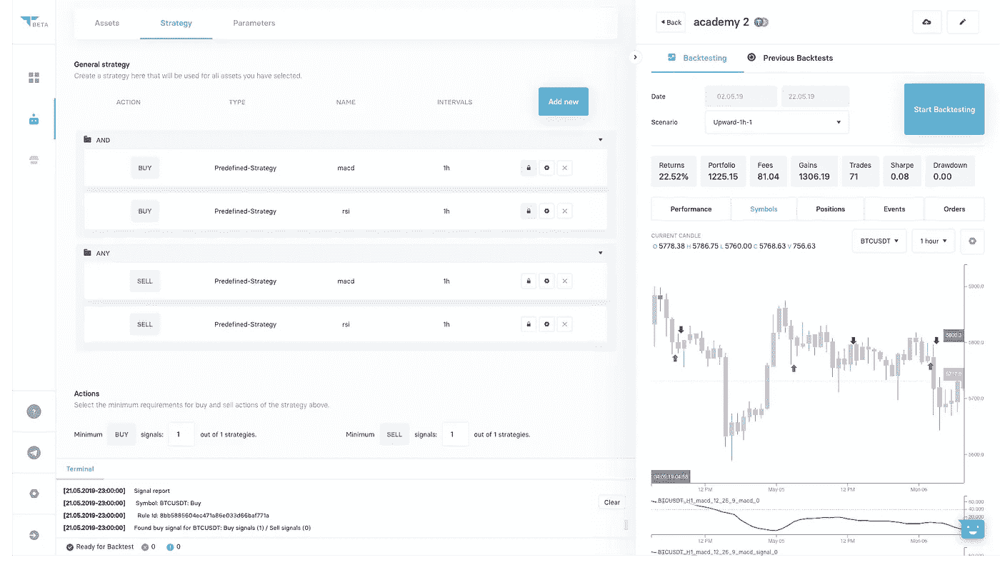
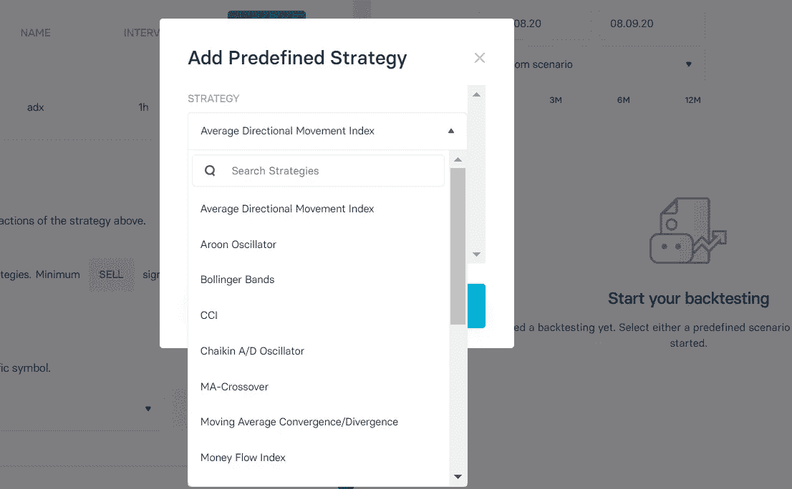
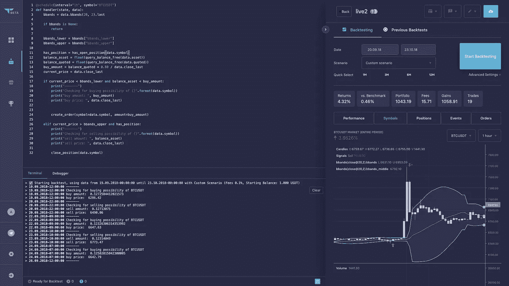
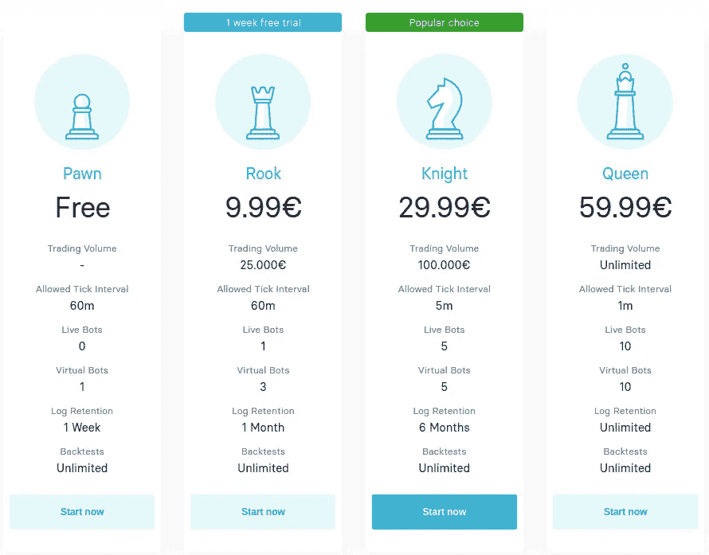

# trality Review——免费编写您的下一个盈利交易机器人

> 原文：<https://medium.com/coinmonks/trality-review-ce5125376ee5?source=collection_archive---------1----------------------->

今天，我很兴奋地回顾了一个加密交易机器人平台 [Trality](https://blog.coincodecap.com/go/trality) ，它确实有一些独特的功能。

我已经发表了我对 2020 年最佳加密交易机器人解决方案的概述。

交易机器人市场充斥着现成的机器人、信号市场、复制交易策略以及有限的定制选项。基本上，所有这些都让用户可以很容易地使用预定义的策略，而不会让他们走得太远。

这正是 Trality 介入的地方。

相比之下， [Trality](https://blog.coincodecap.com/go/trality) 提供了最全面的工具来实际开发一个交易机器人。

这意味着用户可以用他们自己开发的策略来创建、回溯测试和实时交易。

Trality 吸引我的另一个原因是简单。

с公司开发了几个易于理解和用户友好的工具，为不同交易背景的用户提供最佳服务。

结合回溯测试设施和集成交换，该平台使整个过程变得轻而易举。

正如 Trality 所说，这个平台是为临时交易者、python 大师和任何介于两者之间的人设计的**。**

让我们更深入地了解一下 Trality，看看它还隐藏着什么。

# 摘要

*   Trality 为所有经验水平的用户提供算法交易的可能性。
*   世界上第一个基于浏览器的 Python Bot 代码编辑器，它带有最先进的 Python API、许多包、调试器和端到端加密。
*   为“临时交易者”提供了一个基于布尔逻辑的规则构建器，无需编码技能即可创建机器人。
*   支持回溯测试和交换集成
*   该平台仍处于测试阶段，因此所有功能目前仍是免费的

# 旅游特色

## 代码编辑器

Trality 在加密机器人领域的突破是其用于机器人创建的代码编辑器。该公司表示，它是第一个为交易机器人提供完全基于浏览器的 Python 编辑器的公司。

这使得精通 Python 的用户能够从他们的编码技能中受益，甚至以最小的延迟和最高的安全性编写最复杂的策略。

代码编辑器也用调试器和流行的库完成，如 NumPy、Pandas、Tulip、TAlib 等。作为一个快速的开始，你可以选择一个已经准备好的 bot 模板作为你未来交易 bot 的基础。

## 规则生成器

另一方面，Trality 有规则生成器。它基本上是一个拖放界面，为那些不喜欢编码，但仍然想利用算法[密码交易](https://blog.coincodecap.com/tag/crypto-trading)的人服务。

规则生成器使用布尔逻辑帮助创建灵活的机器人。

机器人的交易逻辑只是通过将指标和策略按照各自的顺序排列而创建的。

各种预定义的策略也可用于将来的定制。

各种预定义的策略也可用于将来的定制。

## 回溯测试和票据交易

Trality 的酷在于你可以慢慢习惯算法交易的过程。

创建一个有利可图的加密机器人不可避免地需要体面的回溯测试，该平台似乎在这方面也取得了成功。

经过多次尝试后，我可以说 Trality 的回溯测试工具运行得非常快(大概是因为浏览器内的实现)。考虑到大量历史数据的可用性，回溯测试的速度确实是一项成就。

此外，回溯测试工具本身非常灵活。它允许用户选择各种场景和自定义时间框架来测试算法。

另一个方便的特性是所有的回溯测试历史都被记录下来，所以你可以随时切换回最有利可图的设置。在算法触及实时交易之前，它也可以被发送到纸上交易，作为一个前瞻性的测试。

# 支持的交换

一旦一个机器人被创造出来并经过适当的测试，它就可以被立即部署到越来越多的加密交易所进行实时交易。现阶段，Trality 仅支持 4 种交换:

# 全天候云交易

我特别喜欢 Trality 的一点是，它是一个全圈平台。机器人可以在一个界面中创建、回溯测试和部署。

最重要的是，整个基础设施是基于云的，这意味着不需要任何额外的分期付款，也不需要为自己管理服务器而烦恼。因此，实时交易可以很容易地设置为 24/7 模式，不会错过任何潜在的有利可图的交易。

# 用户体验

Trality 平台有一个非常友好和方便的用户界面/UX。不管你是一个有经验的密码交易者，python 开发者，或者只是一个初学者，界面都非常干净和简约。它不会用各种各样的选项淹没你，一切都很直观，很容易访问。

就我个人而言，作为一名新人，我对整体友好的环境感到满意。我花了不到 5 分钟的时间学习如何使用规则生成器来创建和回测我的第一个交易机器人。

平台有[完善的文档和帮助页面](https://docs.trality.com/)，方便了旅程。如果出现任何问题，总有一个[电报支持聊天](https://t.me/Trality)来帮助您。

我也喜欢 Trality 的博客，因为他们经常在那里发布教程和方便的阅读材料，例如，最近有一篇由专业交易者撰写的[系列文章](https://blog.trality.com/strategy-building-basics-pt-i/)，他在其中一步一步地描述了一个机器人的创建过程。

# 性能和安全性

与其他现成的机器人不同，Trality 不保证在其平台上创建的机器人有 N%的利润。

bot 的性能取决于许多因素，如市场条件或交易量，但最重要的是取决于您的 bot 配置。

所以一切都在你的掌握之中，你想出的策略越聪明，利润就越大。

反过来，Trality 给予您的是资金和知识产权的完全安全。该平台无法直接获得你的资金，机器人只是向交易所发送交易信号，这是用户允许的。

此外，如果启用了撤销权限，API 键连接将总是故意失败。用户的策略和算法是完全沙盒化和端到端加密的，这意味着除了用户之外没有人可以访问它们。

# 城市定价

目前，Trality 仍处于测试阶段，他们的所有工具都是免费的。他们已经起草了一个初步的价格结构，可以在 Trality pricing 页面上找到，从€9.99 英镑起。

然而，请记住，这种结构可能会改变，所以请确保在他们发布最终版本时再次检查它。

最让我惊讶的是，尽管该平台仍处于测试阶段，但我可以使用他们的大多数工具，没有任何限制或错误。从我的角度来看，这些服务已经足够完善，并且已经可以收费了。

所以赶快，在它还是免费的时候自己测试一下，让我们看看创作者是否会坚持他们最初建议的价格。

# 与其他产品的比较

如上所述，与大多数加密机器人提供商相比，Trality 从另一端进入市场。

它不是提供预定义的机器人以供立即使用，而是将重点放在机器人创建工具上，使它们对大量受众来说是通用的和可访问的。

Trality 对黑盒信号提供商的反对似乎很有趣，因为他们打算经营**加密机器人市场**。

该公司声称将整合 bot 质量筛选和足够的 bot 文档。

奇怪的是，它是如何以不同于现有市场的方式实现的。再说一遍，让我们拭目以待，看看结果会如何，但目前为止，这个想法似乎真的很有希望。

# 旅游的利弊

**优点**

*   高级 bot 创建工具
*   用 Python 编写机器人的代码编辑器
*   通过拖放创建机器人的规则生成器
*   全面的回溯测试工具
*   在一个浏览器界面中创建、回溯测试和实时交易
*   算法的端到端加密
*   资金的提款-禁用权限
*   写得好的文件
*   完全基于云

**缺点**

*   期货和短期交易不可用
*   到目前为止只支持 4 个交换
*   还没有市场/副本交易
*   没有移动应用程序

# 结论

经过一些深入的测试，我可以说 T2 交易中心为所有级别的交易者提供了一个非常独特的平台。如果使用得当，它可以彻底改变一个人的交易。

如果你是该领域的新手，你可以很容易地访问规则生成器和教程来练习你的技能，并在做纸上交易时获得经验。

然而，如果你是一个交易老手，并且你了解 Python，你只需要使用带有回溯测试工具的 ode Editor 就可以开始打破受支持的加密交换的壁垒。

当然，有人可能会认为该项目仍处于测试阶段，可能会出现一些错误，一些功能缺失，没有移动应用程序来监控移动机器人的性能。

然而，该平台是免费的，因此提供的服务质量肯定超过了它的弱点。即使定价生效，初步的价格似乎相当合理。

无论如何，不管你是否喜欢和使用它，它绝对值得你花时间去尝试！

# 常见问题

*   贸易合法还是安全？

是的，Trality 是安全合法的。[在一些可靠投资者的支持下，Trality 正在开发工具，轻松地创建、测试和执行复杂的交易算法。](https://www.crunchbase.com/organization/trality)

*   Trality 有手机 app 吗？

Trality 目前还没有适用于 iOS 或 Android 设备的移动应用。

*   旅行费用是多少？

Trality 为您提供了一个免费的计划，让您可以创建和测试您的策略。一旦你对你的策略感到满意，并想用真钱交易，你可以选择我们的计划之一，起价为 9.99€。更多信息请参见 Trality [定价页面](https://www.trality.com/pricing)。

*   支持什么编码语言？

Trality 目前支持 Python，该团队致力于在未来支持更多的语言。

# Trality 替代品

1.  [**Quadency**](https://blog.coincodecap.com/go/quadency) ，2018 年推出的密码交易自动化平台。它给你带来了一个更聪明的方式来交易和管理你的密码。阅读[四项审查](https://blog.coincodecap.com/quadency-review-a-crypto-trading-automation-platform)。
2.  [**Bitsgap**](https://blog.coincodecap.com/go/bitsgap) ，满足您所有交易需求的一站式加密交易平台。它允许用户将他们所有的密码交易账户放在同一个屋檐下，通过一个集成的界面进行交易。另外，请阅读 [Bitsgap 评论](https://blog.coincodecap.com/bitsgap-review)。
3.  [**3commas**](https://blog.coincodecap.com/go/3commas) 是一个在线平台，面向对使用自动化机器人进行[加密货币交易](https://blog.coincodecap.com/tag/trading/)感兴趣的人。对于没有金融技术背景或没有丰富股市经验的人来说，这尤其具有吸引力。另外，请阅读 [3commas review](/coinmonks/3commas-review-an-excellent-crypto-trading-bot-2020-1313a58bec92) 。

*原载于 2020 年 9 月 9 日 https://blog.coincodecap.com***。**