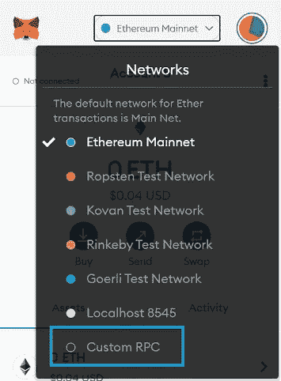
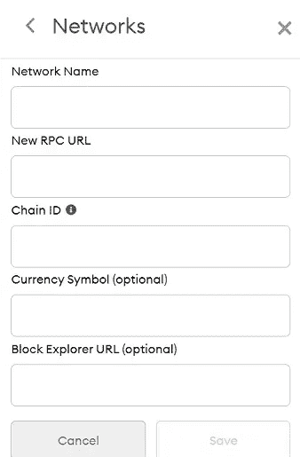
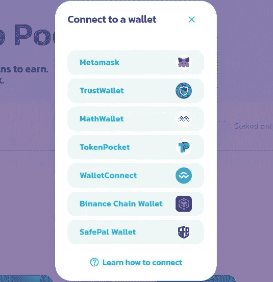
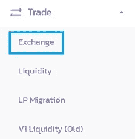
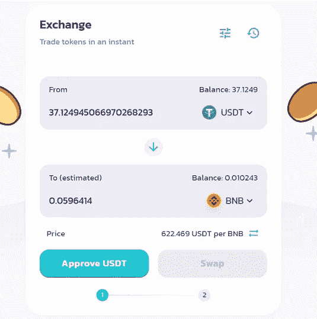
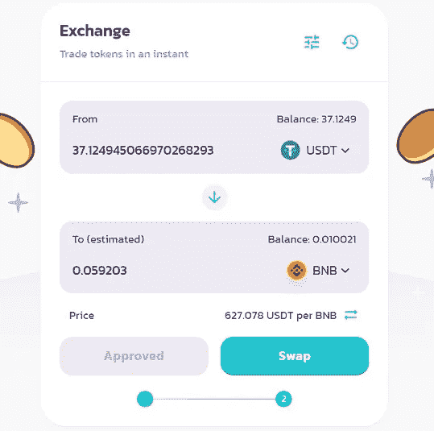

# 使用 Metamask 在煎饼交换上购买硬币的交易

> 原文：<https://medium.com/coinmonks/transaction-to-buy-coins-on-pancake-swap-using-metamask-86d510f016f9?source=collection_archive---------0----------------------->

在 metamask 中，我们不仅可以存储和转移硬币，我们还可以使用 metamask 在煎饼交换中购买硬币。

您可以将 PancakeSwap 与 MetaMask 一起使用，并交换 BEP20 令牌和 stake CAKE & LP 令牌。如果你想通过 MetaMask 使用 PancakeSwap，你应该首先设置你的 MetaMask 钱包，然后连接到币安智能链。

你可以跟随我们的[元掩码教程](/@purbaryandi/what-is-metamask-c15080cc31af)来设置你的元掩码钱包，并学习如何使用它。

# 将 MetaMask 连接到币安智能链

如果您已经有一个 MetaMask 钱包，但尚未将其连接到币安智能链，请首先单击“以太坊主网”，然后单击钱包上的“自定义 RPC”将 BSC 网络添加到 MetaMask。

在必填字段中填写以下信息，您的 MetaMask 钱包将连接到币安智能链。

*   网络名称:智能链
*   新的 RPC 网址:【https://bsc-dataseed.binance.org/ 
*   ChainID: 56
*   象征:BNB
*   区块浏览器网址:【https://bscscan.com 

# 如何连接 MetaMask 和 PancakeSwap？

要将您的 MetaMask 钱包连接到 PancakeSwap，首先，解锁您的 MetaMask 钱包，然后切换到币安智能连锁网络。

解锁连接到币安智能链的 MetaMask 钱包后，访问 [PancakeSwap](https://pancakeswap.finance/) 将钱包连接到平台。

点击 PancakeSwap 上的“连接”按钮，然后选择“MetaMask”将您的钱包连接到 PancakeSwap。

点击“元掩码”后，您可以选择要连接到 PancakeSwap 的地址(帐户),然后点击元掩码通知上的“连接”按钮。

如果你使用 MetaMask 的移动版，你可以使用“WalletConnect”选项将你的钱包连接到 PancakeSwap。

如果你打算使用 PancakeSwap 等币安智能链 dapps，你需要在你的 MetaMask 钱包中放置 BNB 来支付交易费用。

此外，如果你想在 PancakeSwap 上下注蛋糕，你可以从[币安](https://dappgrid.com/binance-tutorial/)或其他交易所发送蛋糕到你的 MetaMask 钱包。

# 如何用 MetaMask 在 PancakeSwap 上交易？

一旦你的 MetaMask 钱包里有了一些 BNB 来支付 BSC 网络上的汽油费，你就可以去 [PancakeSwap](https://exchange.pancakeswap.finance/#/swap) 上的交换页面开始交易。

如果你想在 PancakeSwap 上出售一个特定的 BEP20 代币，你可以把它从交易所或其他钱包转移到你的元掩码地址。

要在 PancakeSwap 上购买 BEP20 代币，你主要可以使用 BNB、BUSD (BEP20)和蛋糕。站台上还有 BTCB 和瑞士联邦理工学院的对子。

要在 PancakeSwap 上交易，首先点击交易菜单下的“交换”页面。

选择您想要交换的代币并输入金额，然后在“到”栏中选择您想要接收的代币。

在下面的例子中，我正在为 BNB 出售我的 USDT(币安-佩格 BUSD-T)。

选择代币并输入金额后，您应该批准要交换的代币，这将允许智能合约使用您的代币。

点击“批准”按钮，确认 MetaMask 钱包上的交易。正如你在下面的图片中看到的，它只需要 0.15 美元，你需要在你的钱包 BNB 进行“批准”交易。

交易费可能会因网络不同而有所变化，所以不要指望只支付 0.15 美元。但是，总的来说，币安智能链比以太坊便宜得多。

批准您要交换的令牌后，您可以单击“交换”按钮，并在 MetaMask wallet 上确认交易。

当你在 PancakeSwap 上进行交易时，你将支付 0.25%的交易费。在这个例子中，我将支付 0.0928 的 USDT 互换费(37.1249/100*0.25)。

在进行交易之前，你也可以通过点击设置图标来改变你的滑点容差和交易截止日期。

单击交换按钮后，再次检查费率，然后单击确认交换按钮。您可以在 [BscScan](https://bscscan.com/) 和 MetaMask wallet 上的 activity 选项卡下查看交易。

> 加入 Coinmonks [电报频道](https://t.me/coincodecap)和 [Youtube 频道](https://www.youtube.com/c/coinmonks/videos)了解加密交易和投资

## 也阅读

 [## 最佳加密交易所| 2021 年十大加密货币交易所

### 编辑描述

blog.coincodecap.com](https://blog.coincodecap.com/crypto-exchange)  [## 2021 年 10 大最佳加密贷款平台| CoinCodeCap

### 编辑描述

blog.coincodecap.com](https://blog.coincodecap.com/crypto-lending)  [## 2021 年最佳免费加密交易机器人

### 2021 年币安、比特币基地、库币和其他密码交易所的最佳密码交易机器人。四进制，位间隙…

medium.com](/coinmonks/crypto-trading-bot-c2ffce8acb2a)  [## 最佳 4 个加密交易信号电报通道

### 这是乏味的找到正确的加密交易信号提供商。因此，在本文中，我们将讨论最好的…

medium.com](/coinmonks/best-crypto-signals-telegram-5785cdbc4b2b)  [## BlockFi 评论 2021:利弊和利率| CoinCodeCap

### 编辑描述

blog.coincodecap.com](https://blog.coincodecap.com/blockfi-review)  [## 如何在印度购买比特币？2021 年购买比特币的 7 款最佳应用[手机版]

### 如何使用移动应用程序购买比特币印度

medium.com](/coinmonks/buy-bitcoin-in-india-feb50ddfef94)  [## 加密税务软件——五大最佳比特币税务计算器[2021]

### 不管你是刚接触加密还是已经在这个领域呆了一段时间，你都需要交税。

medium.com](/coinmonks/best-crypto-tax-tool-for-my-money-72d4b430816b)  [## 存储比特币的最佳加密硬件钱包[2021] | CoinCodeCap

### 编辑描述

blog.coincodecap.com](https://blog.coincodecap.com/best-hardware-wallet-bitcoin)  [## Pionex 评论 2021 |免费加密交易机器人和交换

### Pionex 是为交易自动化提供工具的后起之秀。Pionex 上提供了 9 个加密交易机器人…

medium.com](/coinmonks/pionex-review-exchange-with-crypto-trading-bot-1e459d0191ea)