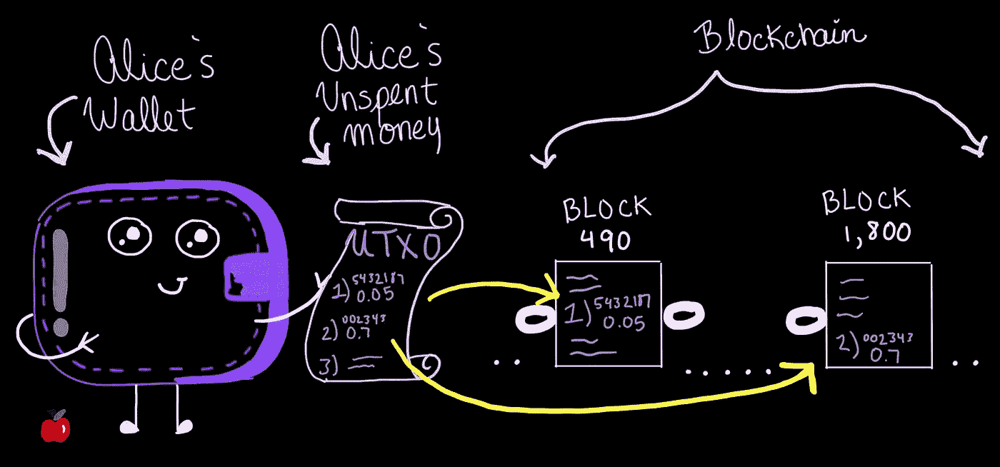
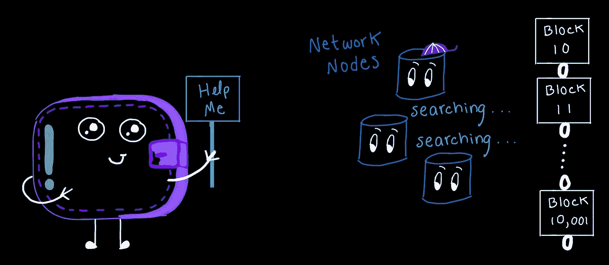
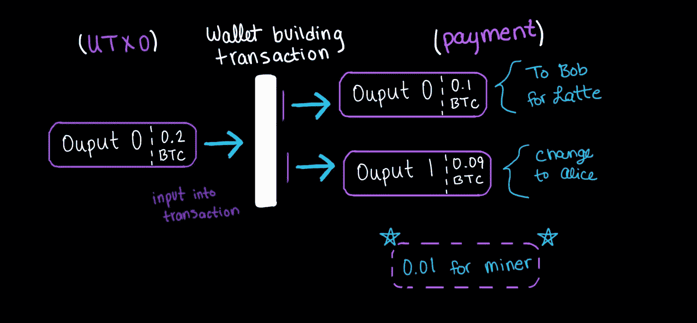
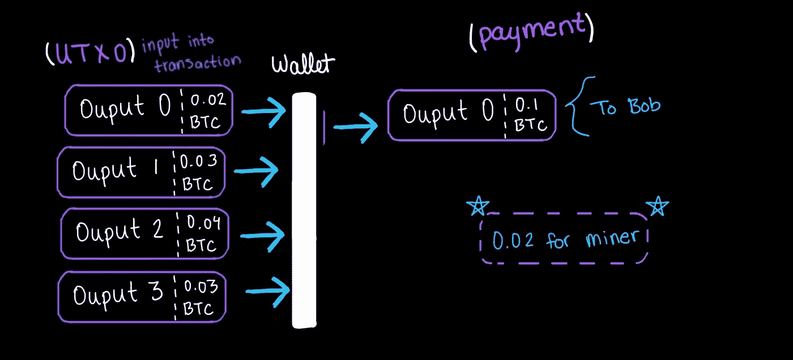
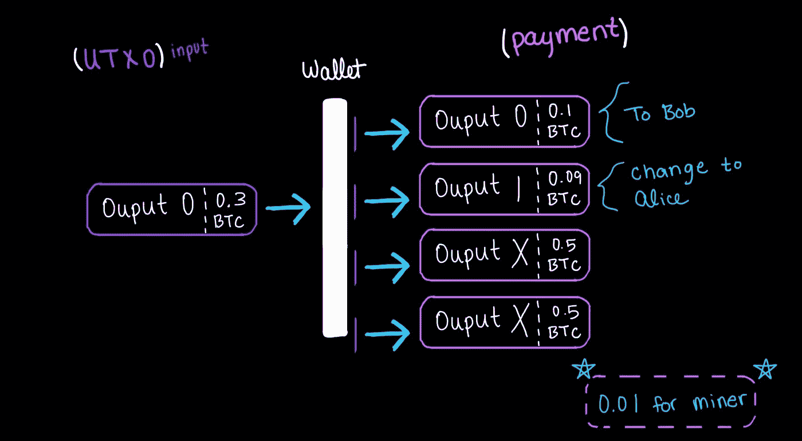
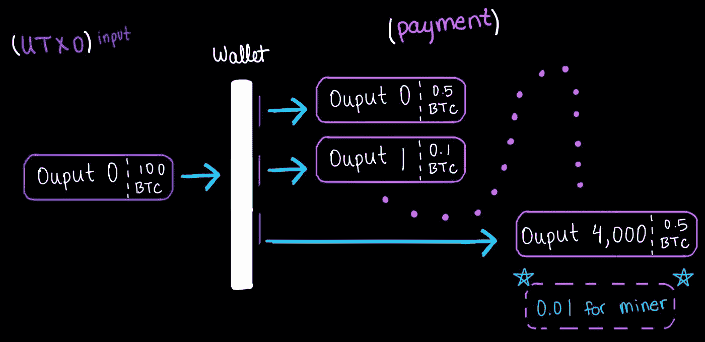
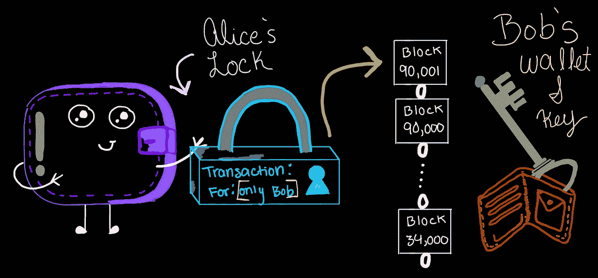
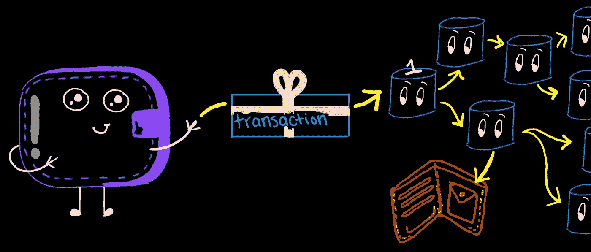

# 比特币技术中的交易~第二部分

> 原文：<https://medium.com/coinmonks/transactions-within-bitcoin-technology-part-2-bef191f6fe2b?source=collection_archive---------4----------------------->

在我之前的文章[比特币技术概述](/@ginasomara15/mastering-bitcoin-technology-chapter-1-summary-aceee65fa737)中，我们简单讨论了比特币底层技术和系统的概述。现在，我们将在这些基础概念的基础上，更深入地理解比特币技术最重要的领域之一——交易。没有交易，生活将如何塑造？我们每天都在交易，从购买杂货到自动汽车付款。无关紧要的交易不会得到太多的考虑，因为我们天生信任它们。当你的信用卡在杂货店被批准时，从那一刻起，你就和那家店联系在一起了。当你吃东西的时候，你信任商店供应链的质量和安全。此外，你有信心在供应链中坚持某些标准，等等。这个过程和比特币没什么区别。当对等体在网络上进行交易时，在它们和区块链之间建立了一座桥。为了理解这座桥的建造、可信赖性和可接受性，我们将跟踪一个单一的交易，从它存在的开始，到它最终被区块链接受，从而巩固它的存在。

让我们从爱丽丝进入纽约一家古雅舒适的咖啡店开始。店主 Bob 欢迎并告诉她，他的商店现在自豪地接受比特币作为支付方式！为了用比特币支付，她只需要用钱包应用程序扫描他商店的二维码。令人高兴的是，她点了拿铁，然后扫描二维码，支付相当于 5 美元的比特币；为了简单起见，让我们假设这是 0.1 个比特币或 BTC。当爱丽丝扫描鲍勃的二维码时，她的钱包记录了比特币地址和要发送到那里的金额，以便开始交易过程。

Alice 的钱包将执行一组任务(在后面的章节中详细解释)，以便扫描其可用资金集，以确保她能够支持购买。可支出的资金被称为 UTXOs，即未支出的交易产出。简单地说，未用资金被称为“输出”，因为它们来自另一个钱包的已用交易或输出。你从某人那里收到的每一笔付款都被存储为一个单独的 UTXO，就像一个实体钱包可能包含不同的钞票:20 美元、10 美元、1 美元等。例如，如果爱丽丝从她的雇主那里获得了她未用完的比特币数量，那么这些都是从她雇主的钱包中单独输出的。

*从其雇主的钱包到其个人钱包的交易被认为是可信和有效的，因为它们已经被网络验证；如果不是这样，它们就不会被爱丽丝的钱包登记。*

Alice 的钱包将在一个列表中存储和维护这些 UTXO，或者更常见的称为 UTXO 集合。然而，与实体钱包不同，爱丽丝的钱包软件不直接存储它的 UTXOs。所有未用完的事务输出都存储在区块链上，这使得它们是不可变的和安全的。取而代之的是，钱包保存了区块链上 UTXOs 所在的所有位置的列表。例如，Alice 可能有 UTXOs 可供她在区块 490、1，800、30，000 等中花费。

但是，这个 UTXO 集可能会占用大量内存。因此，轻量级钱包(依赖于钱包应用程序)，基本上可以在智能手机、平板电脑等设备上运行。，可以简单地在网络中查询他们的 UTXO 集。当查询网络时，存储完整区块链的任何“监听”节点将编译所有 Alice 的 UTXOs 的列表，并将其返回给钱包，允许钱包继续构建交易。

一旦钱包找到并确认足够的资金，它就可以建立交易。但是，根据 UTXOs 的可用性，事务的构造会有所不同；Alice 的钱包可以构建 3 种交易形式。第一种也是最简单的形式是普通事务，只包含一个输入和两个输出:

**输出以 0 开始，而不是以 1 开始* *

在左边，我们看到更暗的紫色 UTXO。这个“输出 0”由钱包定位，并被发现作为 Alice 购买的足够资金。由于这一产出正在被消耗，它现在被称为交易过程中的输入。包含 0.2 BTC 的 UTXO(输出)中的资金现在被转移到另一个钱包中，因此使该输出成为输入。一旦耗尽，该 UTXO(输入)就变成 STXO，即耗尽的交易输出，Alice 的钱包可以将该 UTXO 从其可用资金列表中删除。

此外，如果我们仔细观察，我们可以看到输入(STXO)包含 0.2 BTC，但爱丽丝的拿铁只需要 0.1 BTC。这一细节对于理解这一交换过程是如何进行的至关重要；UTXOs 在消耗时不能被分解成更小的单位，整个 0.2 的 BTC 必须进入交易。因此，爱丽丝似乎为她的拿铁咖啡多付了钱，但是有一个解决办法:改变。

如果爱丽丝用一张 10 美元的钞票为她价值 5 美元的拿铁咖啡支付现金，那么她会收到零钱。她不能把 10 美元的钞票从中间撕开，然后付一半的钱，她必须付完整的钱。这类似于 BTC 交易的操作方式，如果我们看图片的右侧，我们可以看到这个过程。有两个较浅的紫色输出。第一个是“输出 0”，向鲍勃的钱包发送 0.1 BTC。第二个，“输出 1”，是爱丽丝的零钱被送回给自己(相当于爱丽丝用 10 美元的钞票付款后收到零钱)。仔细一看，我们可以看到爱丽丝的变化只有 0.09 BTC，剩下 0.01 未计算在内(0.2–0.1–0.09 = 0.01)。根据钱包应用程序的不同，将使用预先确定的金额作为费用。这个金额并没有被记录为官方输出，而是用于奖励那些正在利用自己的计算能力来保护区块的矿工，区块中包含了爱丽丝的交易(这里简单介绍了一下——第一章总结，)。这笔费用是必要的，以获得交易，在块，固化到区块链。由于只有一个输入(STXO ),普通事务通常具有较小的挖掘费用，因此网络验证的工作较少。

Alice 的钱包可以构建的第二种交易类型是聚合交易。与普通事务不同，只产生一个输出，因此没有任何变化被发送回 Alice 的钱包。由于在 UTXO 集合中找到了准确的金额，因此无需对此交易类型进行更改。

查看左侧较暗的紫色 UTXO 集合，我们可以看到有多个较小的 UTXO 被输入以创建所需的数量。一旦交易完成，所有这 4 个输入都将变成 STXOs。您可能会注意到，这 4 个输入的总和超过了 Bob 所需的 0.1 BTC(0.02+0.03+0.04+0.03 = 0.12)。由于矿工的奖励没有零钱可以提取，钱包里包括了所需总额中的 0.02 英镑费用。此外，我们可以看到征收的费用从 0.01 增加到 0.02；这是因为由于所需计算能力的增加，聚合事务比普通事务更昂贵。

简而言之，交易的输入越多，在交易最终完成并封存到区块链之前，网络需要验证的数据就越多。一个普通的交易包含一个输入，因此网络只有一个 UTXO 来验证 Alice 确实拥有这些资金的所有权。然而，对于聚合事务，网络可能必须验证数百甚至数千个 UTXOs，才能允许它们被使用并变成 STXOs 单笔交易中可以花费的 UTXOs 数量没有限制。验证 UTXOs 开销的概念将在后面的文章中进一步解释。目前，重要的信息是，交易的投入越多，费用越高。

此外，这种类型的交易被有意用来帮助清理 wallet 的 UTXO 列表。通过聚集大量较小的交易，然后将它们发送回自己，wallet 可以帮助压缩 UTXO 集的大小。

最后，Alice 的钱包可以组装的第三种类型的事务是分布式事务，由一个输入和多个输出组成。

但是，在这种情况下，分发事务不是必需的。Alice 只打算支付 Bob，因此她最多不需要超过 2 次输出支付。然而，这可能是一个很好的例子，说明爱丽丝的雇主最有可能如何支付其多名雇员。

由于分配交易的交易费用比聚集交易的交易费用低，因为只有一个输入需要验证，所以这是一次性支付无数人的最佳解决方案(假设雇主有足够大的 UTXO 来覆盖所有输出)。

现在我们已经讨论了所有三种交易类型，假设 Alice 的钱包通过普通交易为 Bob 创建了交易，允许她支付较低的交易费用。

除了 UTXOs 输入之外，Alice 的 wallet 还需要创建一个锁定脚本。锁定脚本只是保护事务的一种方式，这样只有 Bob 可以访问并使用 BTC。当爱丽丝扫描鲍勃的二维码时，她的移动钱包知道只有鲍勃的公共钱包地址才能访问这些资金。当 Bob 准备花掉他的 UTXO 集合中的任何 UTXO 时，包括这次交易，他的钱包将向网络呈现一个解锁脚本。然后，网络将验证他的解锁脚本确实解锁了交易，允许他消费。

解锁和锁定脚本由 wallet 实现，并且可以采取各种形式。当事务被广播到网络时，锁定脚本数据被包括在事务数据中。然而，我们将在另一篇文章中详细讨论这一点。现在，重要的是要注意，交易数据包含一个锁定脚本，用于保护 Bob 的资金，直到他准备花掉它们。

Alice 对 Bob 的事务现在从她那端完成，并准备好向网络广播；我们可以说她的事务大小在 250 字节左右，以供参考。现在，一旦爱丽丝的钱包广播了信息，连接到她的钱包的最近的节点将首先接收到它。这个第一个节点将检查事务的有效性(在后面的文章中有关于这个过程的更多细节)。一旦被评估为有效的事务，该节点将把它广播给它的所有连接，依此类推。

该事务将在几秒钟内到达数百到数千个节点。这意味着鲍勃的钱包也将在几秒钟内收到支付确认。

一旦 Bob 的钱包收到此确认，就可以认为交易成功了。然而，这里有一些关键的细节。在包含您的事务的块的顶部添加了六个块之后，事务被认为是 100%安全的和最终确定的。大约每 10 分钟生产一个区块并添加到区块链。从今以后，如果 Bob 想要 100%确保交易是可信的，Alice 将需要等待大约一个小时来接收她的咖啡。对于我们喝咖啡的人来说，这根本不是一个选择…..

幸运的是，对于相对较小的交易，这是不必要的。只有在发生网络攻击(也称为 51%攻击)时，该交易才会被视为无效，从而导致潜在的双重支出和交易受阻(关于这一点，请参见另一篇文章)。尝试，然后成功实现这一壮举，需要大量的散列能力(计算能力)和巨大的预先规划，因此这种情况不被认为是一个严重的威胁。虽然，如果 Alice 从 Bob 那里购买了价值 450，000 美元的 24k 纯金拿铁雕像，那么 Bob 在允许 Alice 拿走她的商品之前等待 6 个街区被验证将是极其明智的。

在这种情况下，信任网络是绝对安全的，因此允许 Bob 将交易视为已结案例。他可能会向 Alice 展示她的拿铁咖啡，然后称交易过程完成。

总之，我们在所谓的事务链中跟踪了一个事务；爱丽丝的雇主在 BTC 付给她钱，这些钱随后被存入她钱包的 UTXO 设备中。然后，Alice 的钱包从 UTXO 集中提取资金，以准备一笔足够的交易来支付 Bob。在构建了所有需要的数据之后，她的交易被广播到网络，在那里进一步检查其可信度。Bob 的钱包随后收到通知，他的钱包中有新的 UTXO 可用。在接下来的一个小时内，这笔交易将被包含在一个区块中，由矿工附加到区块链上，最后由更多开采的区块密封在其上，确保其在比特币公共账本上的不可改变的位置。

在下一篇文章中，我们将简要介绍比特币核心，以及更重要的私钥和公钥。此外，我们将检查从公钥和私钥创建钱包地址的详细过程。

更多信息参考:

[https://github . com/bitcoinbook/bitcoinbook/blob/develop/ch02 . asciidoc](https://github.com/bitcoinbook/bitcoinbook/blob/develop/ch02.asciidoc)

> 加入 Coinmonks [电报频道](https://t.me/coincodecap)和 [Youtube 频道](https://www.youtube.com/c/coinmonks/videos)了解加密交易和投资

## 另外，阅读

*   [我的加密副本交易经验](/coinmonks/my-experience-with-crypto-copy-trading-d6feb2ce3ac5) | [AAX 交易所评论](/coinmonks/aax-exchange-review-2021-67c5ea09330c)
*   [Bybit 融资融券交易](/coinmonks/bybit-margin-trading-e5071676244e) | [币安融资融券交易](/coinmonks/binance-margin-trading-c9eb5e9d2116) | [Overbit 审核](/coinmonks/overbit-review-9446ed4f2188)
*   [有哪些交易信号？](https://blog.coincodecap.com/trading-signal) | [比特斯坦普 vs 比特币基地](https://blog.coincodecap.com/bitstamp-coinbase)
*   [ProfitFarmers 点评](https://blog.coincodecap.com/profitfarmers-review) | [如何使用 Cornix 交易机器人](https://blog.coincodecap.com/cornix-trading-bot)
*   [加密货币储蓄账户](/coinmonks/cryptocurrency-savings-accounts-be3bc0feffbf) | [YoBit 评论](/coinmonks/yobit-review-175464162c62)
*   [Botsfolio vs nap bots vs Mudrex](/coinmonks/botsfolio-vs-napbots-vs-mudrex-c81344970c02)|[gate . io 交流回顾](/coinmonks/gate-io-exchange-review-61bf87b7078f)
*   [CoinFLEX 评论](https://blog.coincodecap.com/coinflex-review) | [AEX 交易所评论](https://blog.coincodecap.com/aex-exchange-review) | [UPbit 评论](https://blog.coincodecap.com/upbit-review)
*   [AscendEx 保证金交易](https://blog.coincodecap.com/ascendex-margin-trading) | [Bitfinex 赌注](https://blog.coincodecap.com/bitfinex-staking) | [bitFlyer 点评](https://blog.coincodecap.com/bitflyer-review)
*   [Bitget 回顾](https://blog.coincodecap.com/bitget-review)|[Gemini vs block fi](https://blog.coincodecap.com/gemini-vs-blockfi)|[OKEx 期货交易](https://blog.coincodecap.com/okex-futures-trading)
*   [AscendEx Staking](https://blog.coincodecap.com/ascendex-staking)|[Bot Ocean Review](https://blog.coincodecap.com/bot-ocean-review)|[最佳比特币钱包](https://blog.coincodecap.com/bitcoin-wallets-india)
*   [霍比评论](https://blog.coincodecap.com/huobi-review) | [OKEx 保证金交易](https://blog.coincodecap.com/okex-margin-trading) | [期货交易](https://blog.coincodecap.com/futures-trading)
*   [麻雀交换评论](https://blog.coincodecap.com/sparrow-exchange-review) | [纳什交换评论](https://blog.coincodecap.com/nash-exchange-review)
*   [美国最佳加密交易机器人](https://blog.coincodecap.com/crypto-trading-bots-in-the-us) | [不断回顾](https://blog.coincodecap.com/changelly-review)
*   [在印度利用加密套利赚取被动收入](https://blog.coincodecap.com/crypto-arbitrage-in-india)
*   [Godex.io 审核](/coinmonks/godex-io-review-7366086519fb) | [邀请审核](/coinmonks/invity-review-70f3030c0502) | [BitForex 审核](https://blog.coincodecap.com/bitforex-review)
*   [最佳比特币保证金交易](/coinmonks/bitcoin-margin-trading-exchange-bcbfcbf7b8e3) | [萝莉点评](/coinmonks/lolli-review-e6ddc7895ad8) | [比特币保证金交易](https://blog.coincodecap.com/bityard-margin-trading)
*   创造并出售你的第一个 NFT | [密码交易机器人](https://blog.coincodecap.com/best-crypto-trading-bots)
*   [折叠 App 回顾](https://blog.coincodecap.com/fold-app-review) | [本地比特币回顾](/coinmonks/localbitcoins-review-6cc001c6ed56) | [Bybit vs 币安](https://blog.coincodecap.com/bybit-binance-moonxbt)
*   [加密保证金交易交易所](/coinmonks/crypto-margin-trading-exchanges-428b1f7ad108) | [赚取比特币](/coinmonks/earn-bitcoin-6e8bd3c592d9) | [Mudrex 投资](https://blog.coincodecap.com/mudrex-invest-review-the-best-way-to-invest-in-crypto)
*   [WazirX vs CoinDCX vs bit bns](/coinmonks/wazirx-vs-coindcx-vs-bitbns-149f4f19a2f1)|[block fi vs coin loan vs Nexo](/coinmonks/blockfi-vs-coinloan-vs-nexo-cb624635230d)
*   [杠杆令牌](/coinmonks/leveraged-token-3f5257808b22) | [最佳密码交易所](/coinmonks/crypto-exchange-dd2f9d6f3769) | [Paxful 点评](/coinmonks/paxful-review-4daf2354ab70)
*   [加密套利](/coinmonks/crypto-arbitrage-guide-how-to-make-money-as-a-beginner-62bfe5c868f6)指南| [如何做空比特币](/coinmonks/how-to-short-bitcoin-568a2d0b4ae5) | [1xBit 回顾](https://blog.coincodecap.com/1xbit-review)
*   [AscendEX 审查](/coinmonks/ascendex-review-53e829cf75fa) | [OKEx 交易机器人](/coinmonks/okex-trading-bots-234920f61e60) | [OKEx 交易机器人](/coinmonks/okex-trading-bots-234920f61e60)
*   [火币交易机器人](https://blog.coincodecap.com/huobi-trading-bot) | [如何购买 ADA](https://blog.coincodecap.com/buy-ada-cardano) | [Geco。一次复习](https://blog.coincodecap.com/geco-one-review)
*   [币安 vs 比特邮票](https://blog.coincodecap.com/binance-vs-bitstamp) | [比特熊猫 vs 比特币基地 vs Coinsbit](https://blog.coincodecap.com/bitpanda-coinbase-coinsbit)
*   [如何购买 Ripple (XRP)](https://blog.coincodecap.com/buy-ripple-india) | [非洲最好的加密交易所](https://blog.coincodecap.com/crypto-exchange-africa)
*   [非洲最佳加密交易所](https://blog.coincodecap.com/crypto-exchange-africa) | [胡交易所评论](https://blog.coincodecap.com/hoo-exchange-review)
*   [eToro vs robin hood](https://blog.coincodecap.com/etoro-robinhood)|[MoonXBT vs Bybit vs Bityard](https://blog.coincodecap.com/bybit-bityard-moonxbt)