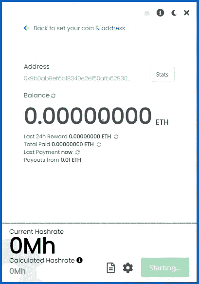
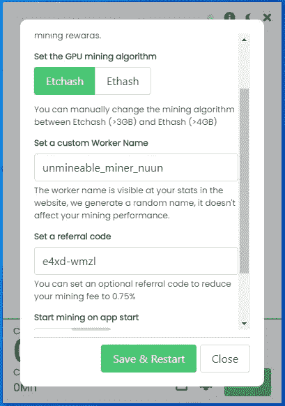

# 2021 年将以太坊转移到您的 Metamask 钱包中，无需支付汽油费

> 原文：<https://medium.com/coinmonks/transfer-ethereum-to-your-metamask-wallet-paying-0-gas-fees-in-2021-c393e452ad33?source=collection_archive---------2----------------------->

有很多人同时使用 4 或 5 个以太坊钱包，对他们来说管理起来真的很麻烦。不仅如此，由于高昂的汽油费，将以太币从一个账户转到另一个账户非常昂贵。

如果这种情况听起来对你来说很熟悉，那么你来对地方了，因为你将在文章的结尾学习如何更好地管理你的以太坊，而不必进行转账和保留单独的钱包。

假设你有一个像 *Atomic Wallet* 或 *Exodus* 一样的钱包，并且只有一个 Ethreum 账户，这些钱包的问题是可能很难参加 Dapps 或 DEFI，例如 *Uniswap* 。

或者想象一下这样一种情况，你想购买一些 NFT，网站要求你验证并链接你的 *Metamask 钱包。*

在这种情况下，你可以将资金从 *Exodus* 或 *Atomic* 转移到 *Metamask* 中，但是你的一些宝贵的以太坊将会花在汽油费上，这当然对任何人都没有好处。

**如果我告诉你有一种方法可以直接在 Metamask 中使用你的以太坊账户，这样你就不用付任何油费了，会怎么样？**

这不是一个梦，如果你的钱包可以提供你的私人密钥(不要给任何人看)，那么你可以在 Metamask 中导入这些私人密钥，你的以太坊就会神奇地在 Metamask 中显示为余额。

两个钱包 *Metamask* 和 *Exodus 或 Atomic* 都将链接到同一个以太坊地址，你可以自由选择哪个更方便。

所以，在我开始给你看一些截图和其他漂亮的东西之前，让我们做一个简单的回顾吧！！！

对于想同时在 Exodus 或者 Atomic Wallet 和 Metamask 中使用同一个以太坊地址的人，你要做的就是**从 Exodus / Atomic 中导出你的私钥，将私钥导入 Metamask 中。**

通过这种方式，你可以用手机转账，还可以用 Metamask 登录 Sushiswap 或 Uniswap 等网站。

你不会有双倍余额或双倍的钱，因为两个钱包都将链接到以太坊区块链中的同一个地址。

**第一步:**导出以太坊私钥。

*   打开你的钱包，在这个例子中是原子的。
*   寻找设置。
*   点击私钥。
*   为您的帐户复制以太坊私钥。

**第二步:**导入以太坊私钥。

*   打开元掩码。
*   点击右上角的圆圈。
*   单击导入帐户。
*   粘贴您的以太坊私钥。

**第三步:**享受您在 Metamask 上的帐户。

> *正如你所看到的，这是一个超级简单的过程，现在如果你还想了解如何在 2021 年用你的笔记本电脑或台式机或任何其他加密硬币来挖掘以太坊，那么请继续阅读下面的内容:*

**第一步:**准备一个钱包和一个公共地址，这样你就可以在区块链为你想要开采的硬币获得资金。

你有一些钱包选项，我个人喜欢那些你可以直接安装到你的浏览器中的选项:

*   元掩码。
*   瓜达。
*   特朗林克。
*   幻影。

其他选项可能包括*原子钱包*、*出埃及*、*信任钱包*。

有纸质钱包和其他网络钱包或免费钱包。

例如，如果您选择了 Metamask.io，那么建议您向其添加一些网络，如币安智能链和多边形，这样您将能够使用 Metamask 与这些区块链进行交互。

确保您将币安智能链网络连接到 metamask 从该链接获取详细信息和说明:[币安学院](https://academy.binance.com/en/articles/connecting-metamask-to-binance-smart-chain)

**第二步:**下载无法运行的软件。

在下载文件之前，在 Windows Defender、防病毒软件和浏览器中设置一些文件夹排除，这样你就可以下载文件，而不会受到危险文件通知的困扰。

官方的不可通软件可以从这个网站下载:[不可通下载](https://www.unmineable.com/miner)

下载 MFI 版本(包括矿工文件)。

**第三步:**提取并以管理员身份运行 Unmineable。

不可挖掘的软件只是一个可执行文件，它已经包含了所有的配置，所以这是挖掘任何加密货币的最佳和最简单的方法。

**在 windows 中以管理员身份运行文件。**

当您运行它时，它看起来就像这样:

可以选择 GPU 卡或者 CPU。

它将带你到第二个屏幕，在那里你将输入你想要的加密货币的地址，在这个例子中是比特币黄金 BTG 和**代码，这将允许你把你的开发费从 1%降到 0.75%** 。

使用代码: **e4xd-wmzl** 将您的开发费用从 1%降至 0.75%(这有所不同)。

您的屏幕应该是这样的:

单击开始按钮后，您应该会看到一个类似的屏幕:

此时，我建议您单击底部的选项来显示日志(看起来像一张纸)，这里单击强制停止。

然后点击设置图标(看起来像一个齿轮)，在弹出的屏幕中你要仔细检查几件事情:

1.  确保选择的算法是 etcash 如果您使用 4GB 卡进行挖掘，使用 ETHASH 用于 6GB 或更大的卡，如果您选择了 CPU，一切都准备好开始挖掘，不需要选择任何东西。
2.  确保代码 **e4xd-wmzl** 显示在推荐框中(推荐，非强制)。
3.  为您的员工(您从中进行挖掘的计算机)设置一个名称。
4.  将你的挖掘强度设置为最高，我建议你在不使用电脑的时候使用高强度。

它看起来像这样:

点击保存和重启按钮开始挖掘！！

一旦它开始，你可以检查你的图形卡或 CPU 的速度，显示为当前的哈希值。

你也可以点击右上角的统计按钮，直接转到 Unmineable 网站，在那里你可以检查你的余额，并要求手动支付。

**重要提示**建议您更改 Windows 中的一些设置，有人会禁用更新，还会禁用睡眠模式、休眠或任何可以在电脑不使用时关闭电脑的功能。

请考虑到您的防病毒或防火墙将阻止连接到池，所以你将无法地雷，检查这一点！！

使用笔记本电脑时，确保它有一些电池或插上电源，这样它就不会关机。

恭喜，如果你正在使用不可采矿，你现在是一名矿工了！！

如果您正在寻找购买 crypto 以获得额外投资回报的方法，那么我建议您看看这篇文章:

# [2022 年如何购买 Crypto 折 8 折返现](/@lumabooks/how-to-buy-crypto-with-10-discount-and-8-cashback-in-2022-4488c1bde8d1)

**现在你可以登录 Unmineable 查看你的状态:**

Unmineable.com 是一个采矿池，允许你用你的 CPU 使用 RandomX 或 GPU 使用 etcash 或 Ethash 采矿，并支付你选择的任何硬币。

为了检查您的余额，请登录[不可挖掘的](https://unmineable.com/)，然后选择您想要挖掘的硬币。在这个例子中，涟漪 XRP。

然后，您可以根据您的算法选择显示 RandomX 或 ETCHAS 或 ETHASH 的选项卡，并在显示“输入您的地址以检查您的统计数据:”的框中输入您的地址。

这样做后，你会看到你的帐户余额，你甚至可以要求付款。

*如果你有任何困难，请加入我的讨论，这样我可以进一步帮助你*

[https://discord.gg/sPbV8kcK](https://discord.gg/KNwsgX7uN5)

如果您正在寻找更多关于 CPU 挖掘的信息，PDF 电子书中有很好的指南，并且是免费的，请访问:

[用 CPU 挖掘密码](https://leanpub.com/how-to-start-mining-crypto-with-cpu/)

**转介披露:**

请阅读以下链接中的不可推荐政策，以更好地了解推荐代码如何详细工作[不可推荐推荐](https://www.unmineable.com/referrals)

> 加入 Coinmonks [电报频道](https://t.me/coincodecap)和 [Youtube 频道](https://www.youtube.com/c/coinmonks/videos)了解加密交易和投资

## 也阅读

 [## 最佳加密交易所| 2021 年十大加密货币交易所

### ICON _ PLACEHOLDEREstimated 预计阅读时间:28 分钟加密货币交易所的加密交易需要知识…

blog.coincodecap.com](https://blog.coincodecap.com/crypto-exchange)  [## 2021 年 10 大最佳加密贷款平台| CoinCodeCap

### 当谈到加密货币贷款时，大量因素等同于良好的收入状况。此外，借款的一部分…

blog.coincodecap.com](https://blog.coincodecap.com/crypto-lending)  [## 2021 年最佳免费加密交易机器人

### 2021 年币安、比特币基地、库币和其他密码交易所的最佳密码交易机器人。四进制，位间隙…

medium.com](/coinmonks/crypto-trading-bot-c2ffce8acb2a)  [## 最佳 4 个加密交易信号电报通道

### 这是乏味的找到正确的加密交易信号提供商。因此，在本文中，我们将讨论最好的…

medium.com](/coinmonks/best-crypto-signals-telegram-5785cdbc4b2b)  [## BlockFi 评论 2021:利弊和利率| CoinCodeCap

### 今天，我们提出了一个全面的 BlockFi 评论，这是一个成立于 2017 年的加密贷款平台，拥有其…

blog.coincodecap.com](https://blog.coincodecap.com/blockfi-review)  [## 如何在印度购买比特币？2021 年购买比特币的 7 款最佳应用[手机版]

### 如何使用移动应用程序购买比特币印度

medium.com](/coinmonks/buy-bitcoin-in-india-feb50ddfef94)  [## 加密税务软件——五大最佳比特币税务计算器[2021]

### 不管你是刚接触加密还是已经在这个领域呆了一段时间，你都需要交税。

medium.com](/coinmonks/best-crypto-tax-tool-for-my-money-72d4b430816b)  [## 存储比特币的最佳加密硬件钱包[2021] | CoinCodeCap

### 保管您的数字资产很容易，但找到正确的存储方式却是一项繁琐的任务。在线钱包有一个风险…

blog.coincodecap.com](https://blog.coincodecap.com/best-hardware-wallet-bitcoin)