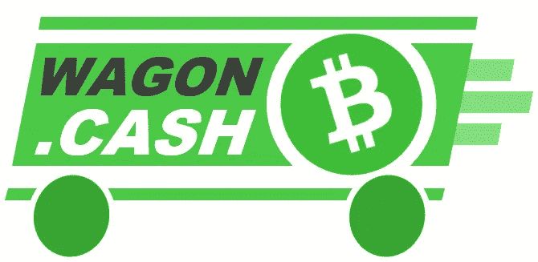
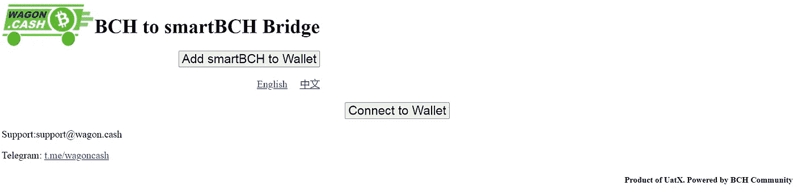
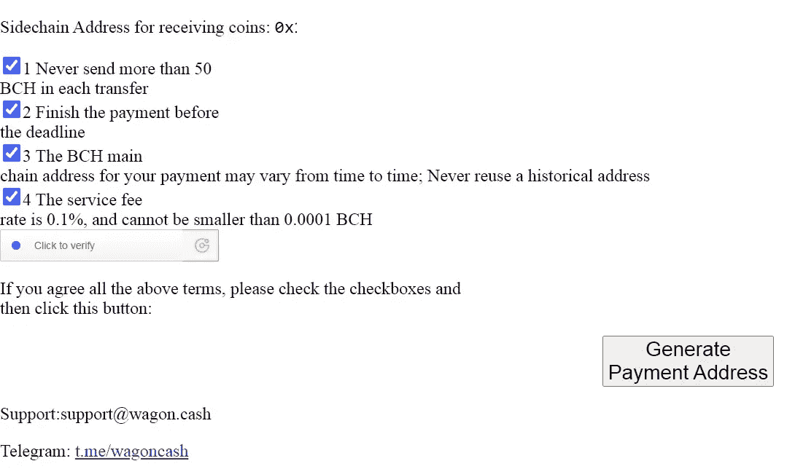
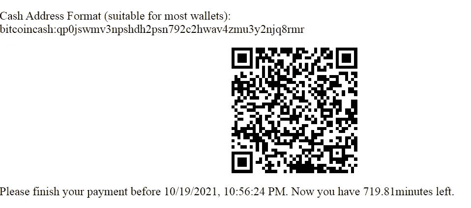
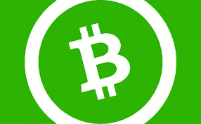
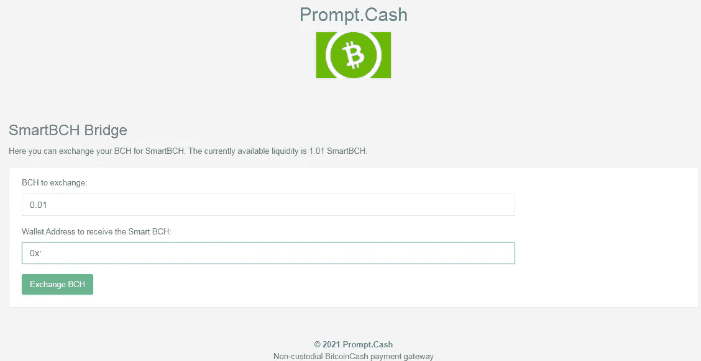
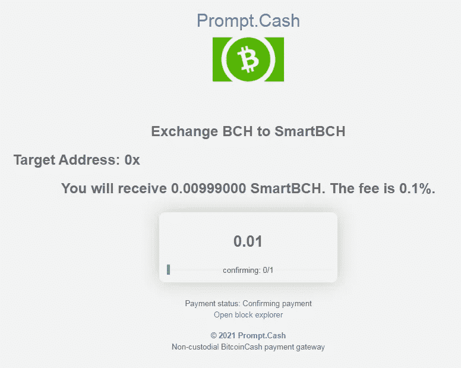
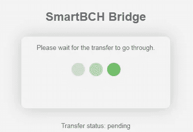
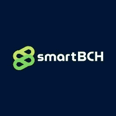

# 使用 Wagon 轻松将您的 BCH 转移到 SmartBCH。现金和提示。现金

> 原文：<https://medium.com/coinmonks/transfer-your-bch-to-smartbch-easily-with-wagon-cash-prompt-cash-a88842bd52ef?source=collection_archive---------2----------------------->

* * *[编辑:5/8/2022]这篇文章是旧的和过时的。这两个选项都不行了。smartBCH 目前使用的网桥是玻利瓦尔网桥，它允许在 BSC 和 smartBCH 网络之间传输 BCH 和更多令牌。
链接:[https://blockng.money/#/bridge](https://blockng.money/#/bridge)* * *

将 BCH 转移到 SmartBCH 需要一定的程序来创建一个 Coinflex 帐户，首先将我们的 BCH 转移到那里，然后转移到 SmartBCH。

然而，作为一个作为金融实体注册和监管的集中交易所，Coinflex 不为某些地区提供服务。

此外，程序很漫长，必须登录网站，转移比特币现金，等待一次确认，然后再次转移到 SmartBCH 钱包，这是我们的 BCH 令牌化版本(SEP20)。

时间就是金钱，这个动作需要 15-20 分钟，甚至更长。Coinflex 是一家提供期货和其他交易选项的顶级交易所，但我认为转移资金的程序更好，因为它有一个快速的桥梁，只需几秒钟就可以以代币形式交换 BCH。

目前，我们有两个以上的选择:

*   [**wagon . cash**](https://wagon.cash/)**&**
*   [**prompt . cash**](https://prompt.cash/bridge)**(桥)**

Wagon.cash 支持 0-确认，因此交易应该只需要几秒钟，而 prompt.cash 需要一次批量确认，因此可能需要 10 分钟或更长时间。

# 货车.现金桥

[Source](https://wagon.cash/)

UatX 发布了一个 Web3 Dapp，将我们的 BCH 转移到 SmartBCH 生态系统中。

这是货车。

我昨天测试了这个，因为我想发送一些 BCH 到 SmartBCH。我现在已经锁定了超过 2BCH 的 SmartBCH 合同，并将尽快增加。

Wagon.cash 花了几秒钟发送 BCH。它是可靠的，而且像往常一样，最好先执行一个小的测试事务，以检查在您想要使用它的时候是否一切就绪。

这个设计是简约的，因为它的唯一目的是作为一座桥。目前，它只提供向 SmartBCH 发送资金的选项，所以这是一种单向方法。prompt.cash 也是如此，因此，对于那些想要从 SmartBCH 网络中提取比特币现金的人来说，Coinflex 暂时提供了唯一可用的桥梁。尽管如此，我不建议在每天有更多的 BCH 人因为 DeFi 和 NFT 的目的被关在 SmartBCH 的时候撤退。

将我们的 Metamask SmartBCH 钱包连接到 Dapp 后，我们阅读条款并勾选方框:

阅读要求，记住每次传输不要发送超过 50BCH。

Wagon.cash 对其提供的服务收取每笔交易的 0.1%。

勾选所有复选框并按下“生成支付地址”后，会出现一个二维码。

我用了不到一分钟的时间转移了 BCH，没有遇到任何问题。然而，对于任何问题，旅行车。Cash 通过其电报服务提供支持，电话: [t.me./wagoncash](https://t.me/wagoncash) 。

# 提示。现金桥

[提示。Cash](https://prompt.cash) 是一个受欢迎的、即时的、非托管的比特币现金支付网关。它也支持 SLP 令牌，最近还在 SmartBCH 中添加了这个桥。

从[桥页面](https://prompt.cash/bridge/)可以看出，这个过程很简单:

[https://prompt.cash/bridge](https://prompt.cash/bridge)

[https://prompt.cash/bridge](https://prompt.cash/bridge)

[https://prompt.cash/bridge](https://prompt.cash/bridge)

从 prompt.cash 团队中，我们了解到所需的平均时间:

> **-3 分钟内数量≤1 BCH**
> 
> - **1 bch <金额≤ 50，bch 区块链 1 次确认后**
> 
> ***特殊:***
> 
> 2 如果 BCH 来自多重签名钱包，则交易(≤ 1 bch)必须等待 1 次确认
> 
> 3 如果金额> 50BCH，订单将手动处理，会很慢。
> 
> *来源:* [*电报*](https://t.me/wagoncash/232)

我经常使用 prompt.cash，发现它既快捷又可靠。

链接:[prompt.cash/大桥](https://prompt.cash/bridge/)

这个桥是一个刚刚发布的服务，目前只有 1BCH 的流动资金。

# 最后

smartbch.org

比特币现金讲的是交易的便利性。开发者正在倾听用户的需求，并采取行动来促进交易的便利性。这种面向用户的行为是大多数其他区块链网络所缺少的特征。

比特币现金关乎速度、安全和低费用，SmartBCH 的创建也是为了通过智能合约功能增强这一强大的网络，在侧链上运行。

我们已经在 SmartBCH 内部进行了大量开发，网络和比特币现金的未来看起来很光明，比特币现金是 SmartBCH 以令牌形式使用的原生货币。

这两个选项将帮助我们立即将 BCH 转换为 SmartBCH 令牌形式，并享受在该网络中创建的 DeFi、NFTs 和 Dapps。

Follow me on: ● [ReadCash](https://read.cash/@Pantera) ● [NoiseCash](https://noise.cash/u/Pantera99) ● [Medium](/@panterabch) ● [Hive](https://hive.blog/@pantera1) ● [Steemit](https://steemit.com/@pantera1) ●[Vocal](https://vocal.media/authors/pantera) ● [Minds](https://www.minds.com/pantera99/) ● [Twitter](https://twitter.com/Panterabch) ● [LinkedIn](https://www.linkedin.com/in/panterabch/) ● [email](https://read.cash/@Pantera/localcryptos-p2p-exchange-is-now-offering-bitcoin-cash-trading-06637230#bad-link)

***支持内容创作者。***

如果你喜欢这个故事，就订阅吧！

*原发布于*[*https://read . cash*](https://read.cash/@Pantera/transfer-your-bch-to-smartbch-easily-with-wagoncash-promptcash-936f88a7)*。*

> 加入 Coinmonks [电报频道](https://t.me/coincodecap)和 [Youtube 频道](https://www.youtube.com/c/coinmonks/videos)了解加密交易和投资

## 也阅读

*   [德国最佳加密交易所](https://blog.coincodecap.com/crypto-exchanges-in-germany) | [WazirX P2P](https://blog.coincodecap.com/wazirx-p2p)
*   [如何购买 Monero](https://blog.coincodecap.com/buy-monero) | [IDEX 评论](https://blog.coincodecap.com/idex-review) | [BitKan 交易机器人](https://blog.coincodecap.com/bitkan-trading-bot)
*   [币安 vs 比特邮票](https://blog.coincodecap.com/binance-vs-bitstamp) | [比特熊猫 vs 比特币基地 vs Coinsbit](https://blog.coincodecap.com/bitpanda-coinbase-coinsbit)
*   [如何购买 Ripple (XRP)](https://blog.coincodecap.com/buy-ripple-india) | [非洲最好的加密交易所](https://blog.coincodecap.com/crypto-exchange-africa)
*   [非洲最佳加密交易所](https://blog.coincodecap.com/crypto-exchange-africa) | [Hoo 交易所评论](https://blog.coincodecap.com/hoo-exchange-review)
*   [eToro vs robin hood](https://blog.coincodecap.com/etoro-robinhood)|[MoonXBT vs by bit vs Bityard](https://blog.coincodecap.com/bybit-bityard-moonxbt)
*   [Stormgain 回顾](https://blog.coincodecap.com/stormgain-review) | [Bexplus 回顾](https://blog.coincodecap.com/bexplus-review) | [币安 vs Bittrex](https://blog.coincodecap.com/binance-vs-bittrex)
*   [Bookmap 评论](https://blog.coincodecap.com/bookmap-review-2021-best-trading-software) | [美国 5 大最佳加密交易所](https://blog.coincodecap.com/crypto-exchange-usa)
*   [如何在 FTX 交易所交易期货](https://blog.coincodecap.com/ftx-futures-trading) | [OKEx vs 币安](https://blog.coincodecap.com/okex-vs-binance)
*   [如何在势不可挡的域名上购买域名？](https://blog.coincodecap.com/buy-domain-on-unstoppable-domains)