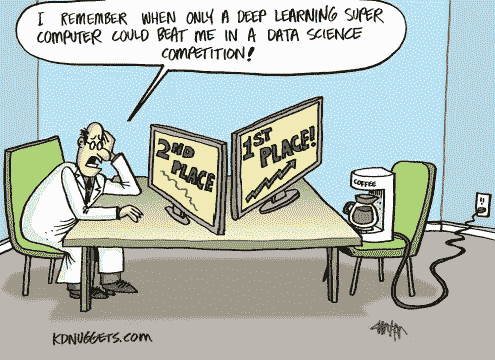
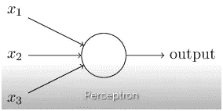
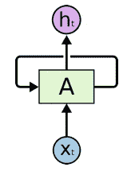
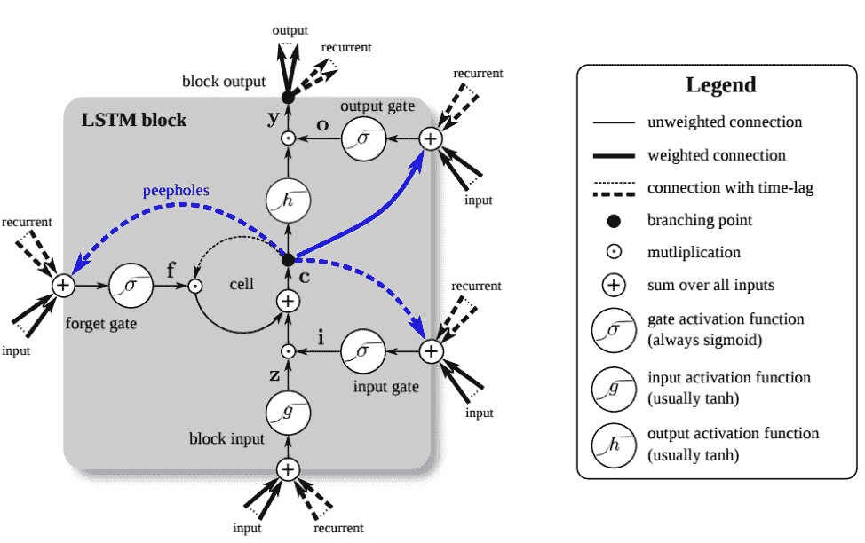
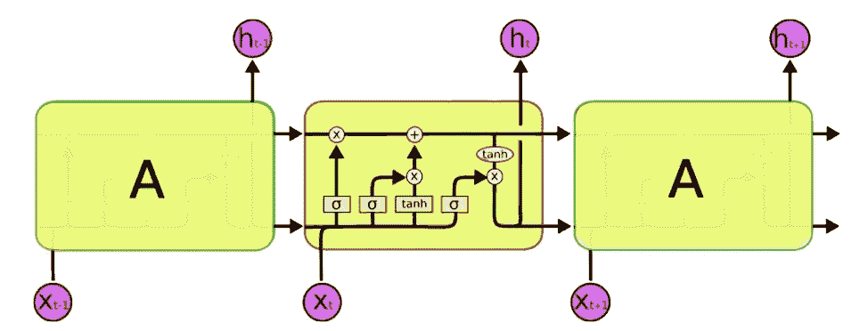
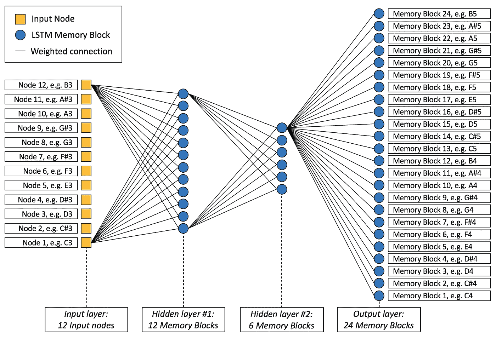

# 将机器学习转化为商业——第 1 部分:深度学习和股票市场

> 原文：<https://medium.com/coinmonks/translating-machine-learning-into-business-part-1-deep-learning-the-stock-market-c9982b2244bb?source=collection_archive---------2----------------------->

当你读这篇文章的时候，我会给你三个警告。如果你继续阅读过去，所有的希望都失去了，你已经成功地确定为像我一样的极客。

[https://www.kdnuggets.com/2015/n41.html](https://www.kdnuggets.com/2015/n41.html)

这里是我的第一个警告:如果你读了这个标题，并认为“这是另一个关于如何使用 TensorFlow 在 Python 中实现时间序列预测的递归神经网络的教程”，那么你几乎是对的。这篇文章确实是关于神经网络和时间序列预测的，只是，它不是关于人工智能工程的复杂性。你将要进入的是在商业环境中对深度学习的解释，适用于没有数学、统计或计算机科学背景的人。这并不是说以前接触过这些话题没有帮助，但这不是先决条件。我已经可以听到那些讨厌的人大喊“真正理解深度学习需要真正理解它的学科——不能知道你是否不会编码”——他们是对的。然而，这个关于翻译机器学习的 4 部分系列的目的不是从技术角度教育其他人；这是为了激发数据科学家和非数据科学家的兴趣，以弥合科学和商业之间的差距，也许，开始问一些简单的问题，如“那又怎样？”作为我们日常工作的一部分。这无疑激励我继续走基于事实的商业管理之路(你会问“基于事实的商业管理”到底是什么？现在，让我们将它简化为使用数据驱动的决策和快速创新周期来保持业务和员工的满意度。

在接下来的四篇文章中，我将试图阐明机器学习的一些臭名昭著的组件的关键问题是什么，以及它们如何转化为关键的商业问题。随着战略和商业的发展，同样的问题可能会有不同的解释，这取决于它们所适用的环境。因此，我们将用实际例子来说明这些问题。在这一部分，我们将讨论神经网络和美国股票价格的预测，正如我在上面警告过你的那样。在第二部分，我们将讨论强化学习。第三部分将讲述一种已有十年历史的方法，数据科学家和商界人士都称之为“探索性数据分析”，鉴于企业所处的经济环境越来越复杂，这种方法变得越来越重要。在最后一部分，也可能是最不专业的一部分，我将谈谈科学企业管理的途径。这是一个我已经思考了一段时间的想法，但直到现在才真正表达出来，因为 ML 使这个概念比以往任何时候都更重要。或者，正如马克·库班所说:

> 人工智能、深度学习、机器学习——不管你在做什么，如果你不懂，就去学吧。因为否则你会在三年内变成恐龙。”

那是一年前的事了。在我们进入数据科学的侏罗纪公园之前，我们只剩下两年时间了，所以我们最好现在就开始。

将机器学习转化为商业战略并非易事，事实上，从科学到管理，这是一个活跃的研究领域。虽然 ML 的研究人员目前非常积极地参与制作模型，并使他们的结果更容易被人类理解(看[这里](https://towardsdatascience.com/interpretability-vs-accuracy-the-friction-that-defines-deep-learning-dae16c84db5c)，经济学家正在研究行为心理学和人类决策的交叉点([这里](http://fortune.com/2017/03/18/behavioral-economist-startups/))。虽然我还没有遇到数据科学民主化的真正代表([这里是](https://hbr.org/2018/07/the-democratization-of-data-science)，尽管许多人都有这种共同的说法，但该领域似乎仍然是为拥有广泛 CS、统计或数学知识的人保留的)，但学习数据科学肯定比以往任何时候都更容易。我个人的信念是，学习如何从 ML 中获得商业洞察力的最好方法是通过与社区讨论这两者之间存在的复杂关系。

我的第二个警告:下面我们将讨论股票和神经网络。虽然理解它们的内部工作方式不是先决条件，但是我假设如果您已经阅读了本文，那么您已经对它们是什么以及它们是如何工作的有了基本的了解。为了简化起见，让我们来看看非数据科学家对神经网络的人类可读定义:

> *“神经网络是一类机器学习模型，它基于一系列计算来预测结果，这些计算是按照人脑的架构非常松散地排列的。”*

让我们用股票市场来举例说明这一点。由于其典型的属性(例如价格曲线中的微观和宏观波动)，它是深度学习教程的常见选择目标，也是数据科学家的持续挑战。然而，股票价格是高度不可预测和波动的，即使对于现代深度学习架构来说，也几乎没有能力持续和正确地预测未来一天以上的时间。引用伯顿·马尔基尔在他 1973 年的著作《漫步华尔街》中的观点，如果市场是真正有效的，股票价格在所有因素公布后立即反映出来，那么一只被蒙住眼睛的猴子向报纸上的股票上市投掷飞镖应该和任何投资专业人士一样出色。回到我们的神经网络。下面是一个简单神经网络结构的高级示例，只有一个感知器。

[https://www.analyticsvidhya.com/blog/2017/05/neural-network-from-scratch-in-python-and-r/](https://www.analyticsvidhya.com/blog/2017/05/neural-network-from-scratch-in-python-and-r/)

在我们的股票价格世界中，这意味着输入(x 编号)是我们的信息，如价格、指数、美国石油价格，甚至是从分析师博客上收集的观点和情绪。输出将是某一天的股票价格，感知器保存一些统计和数学运算，用于从所述输入推断所述股票价格。这种网络中的信息只“向前”流动。这意味着，当我们从不同报纸的经济版块输入指标、新闻稿或新闻标题等模型信息时，这些信息会在感知器中进行处理，以实现“预测股价”的输出。然而，“预测的股票价格”不能作为输入流回感知器，我们最初提供给感知器的信息也不能再次“使用”(例如，我们输入的新闻稿和新闻)。然而，由于我们谈论的是“循环”神经网络，所以它不仅仅是上面所说的。下面是一个典型的递归神经网络架构的例子，主要用于时间序列预测，或者在我们的例子中，用于尝试预测股票价格。

[http://colah.github.io/posts/2015-08-Understanding-LSTMs/](http://colah.github.io/posts/2015-08-Understanding-LSTMs/)

这个网络在你可以看到的循环中显示了它的“循环”,现在用一个块代替了感知器，Xt 是输入(例如我们的股票信息), Ht 是输出(例如我们的股票价格预测)。

这与更特殊的 RNN(称为 LSTM 网络)的区别在于，LSTM 具有“存储”长期信息的能力，这是标准神经网络无法做到的(甚至是标准的递归神经网络也无法做到——因此有了特殊的长短期记忆版本)。这种能力基本上是在类似感知器的结构中继承的，在 LSTM 的例子中称为 LSTM 块。普通神经网络和递归神经网络之间的另一个区别是，网络中的信息可以“反向”流动，或者，更简单地说，我们提供给网络的输入信息可以被网络重用，块的输出同样可以被该块用作输入。现在，如果这只是你的平均 RNN 股票价格预测教程，我们现在将继续谈论这个模块的复杂性:模块状态，激活函数，偏差，权重，遗忘门，输出门，输入门，…事实上，你可以很快回到这里查看我写的关于这个主题的张量流代码教程。然而，在这篇文章中，我想把我们的注意力集中在从商业角度来看这些组件意味着什么，以及一个对股票市场感兴趣的非技术人员在他们的决策过程中会如何考虑它们。为此，我将给出一个简单易懂的描述，然后提供一些问题的例子，这些问题会影响这个部分，并最终影响股票或指数的预测。

[https://www.semanticscholar.org/paper/LSTM%3A-A-Search-Space-Odyssey-Greff-Srivastava/0be102aa23582c98c357fbf3fcdbd1b6442484c9](https://www.semanticscholar.org/paper/LSTM%3A-A-Search-Space-Odyssey-Greff-Srivastava/0be102aa23582c98c357fbf3fcdbd1b6442484c9)

虽然上述典型的 LSTM 架构乍一看似乎令人生畏，但还是让我们如上所述一个接一个地深入了解这些组件。那么，在像这样的深度学习环境中，股价预测究竟是如何工作的呢？

在块内部，我们有信息流、统计和数学运算，以及输入和输出。我们可以看到，诸如股票价格、指数、新闻稿、新闻信息、情绪分析和其他信息可以作为输入流入块中(外部箭头进入框中)。从商业角度来看，这可能是你能对股市预测产生的最重要的影响。关于使用什么样的信息来“训练”网络的商业观点(稍后将详细介绍)几乎是一种哲学观点，但是数据科学家的观点是“让网络决定什么信息是相关的”。也就是说，如果我们有一个由标准普尔 500 和过去 5 年的每日数据以及过去 5 年每天的新闻标题组成的数据集，您如何确定这些信息是否与预测明天的标准普尔 500 指数相关？凭直觉，有人会说“当然，历史是最伟大的老师。为什么埃隆·马斯克[通过推特再次发脾气](https://www.cnbc.com/2018/08/10/elon-musk-takes-trump-style-twitter-trash-talk-to-the-business-world.html)不会影响特斯拉明天的价格？”。虽然这并不完全错误，但机器学习研究表明，人类并不擅长“选择”正确的信息来建立模型，也就是说，与让机器学习帮助人类选择正确的信息相比。这就是商务人士现在的想法:让我们收集所有高层次的相关表面信息，如价格、情绪、新闻、公司数据等。并将这些作为输入来预测明天的标准普尔 500 指数&。数据科学家对此的理解是，以某种方式构建网络，模型选择某些 LSTM 板块(如上图所示)对明天的标准普尔 500 价格有或多或少的影响。这可以以多种方式发生，例如对块中发生的每个操作进行加权，或者更彻底地甚至完全去激活(“丢弃”)块。注意，权重也被分配给块外的信息流，并且它们对于网络“学习”如何预测股票价格的过程是至关重要的。我们将在以后讨论“反向传播”时深入探讨这个问题。现在，我们只能说当模型“学习”时，它更新了箭头处和块内的权重。接下来，积木的一个重要组成部分是激活功能(LSTM 积木中的那些希腊符号)。有许多类型的激活函数，它们是所有神经网络的组成部分。虽然它们的数学构成超出了本文的范围，但是让我们简单地讨论一下它们是做什么的。你可以把它们想象成不同大门的看门人，LSTM 区块让信息进入或阻挡信息。下面是对他们工作的一般性解释:

> *[*激活功能基本上决定一个块是否应该被激活。该块正在接收的信息是否与给定信息相关，或者是否应该被忽略。*](https://www.analyticsvidhya.com/blog/2017/10/fundamentals-deep-learning-activation-functions-when-to-use-them/)*

*这个目的是在信息可以进入的块中的不同位置实现的。进入块的信息可以是不同的东西:*

*   *输入:这是我们定义的数据特征，如指数价格、新闻、新闻稿、股票等。*
*   *前一个块的输出:这是前一个块的输出(在多层 LSTM 的情况下，它们都是。我们会再深入一点。)*
*   *前一个块的内存(图中的“循环”箭头):这也是前一个块的输出，但是，现在让我们称之为“未处理的”输出。*

***忘记门** —这个门接受两个输入，我们提供给网络的信息(例如，股票价格、新闻、新闻稿……)以及前一个块的输出(例如，提前一步描述股票价格、新闻和新闻稿与我们的标准普尔 500 价格的相关性)。在该门的激活函数确定该信息是否与当前块的上下文相关或不太相关。*

***输入门***

***输出门** —该门再次接受与其他两个门相同的两条信息作为输入，但它也接受块存储器的当前状态(遗忘门和输入门转换的部分)作为输入。这样做是为了放大输入中经过过滤的相关信息，或者换句话说，确保只有真正相关的信息从模块中返回。*

*好吧，这是很多信息，你可能觉得还不清楚 LSTM 块真正做什么。在我们进入压轴戏之前，让我试着用更简单的语言总结一下以上所有内容:*

> *LSTM 模块接收新信息(如新闻、股票价格、新闻稿……)和/或前一模块的信息(如新闻、股票价格、新闻稿，前一模块查看这些信息并确定其相关性)，过滤掉不相关的信息，存储相关部分，不仅输出新的相关信息，还输出这些信息与前一模块认为相关的信息的组合。换句话说，它获取以前记忆的信息，添加新信息，决定它是否仍然相关，然后保留它的相关部分，并吐出迄今为止所有相关信息的组合。*

*唷。我们快完成了。我们只是遗漏了一条重要的信息。这里是我最后的警告:如果你读完这篇文章，很可能你会花更多的时间在 LSTMs 上，而不是我花在这篇文章上的时间(我很欣赏你的毅力！).*

*我们在开始讲了很多关于时间序列的内容，以及为什么 LSTMs 对于时间序列建模如此完美。在这一点上，你可能已经有了一个想法，但是，让我们解开为什么 LSTMs 都在这方面如此之大，为什么企业正在努力理解他们缺乏可解释性。下图显示了具有多个块的 LSTM 网络的架构。*

**

*[https://www.analyticsvidhya.com/blog/2017/12/fundamentals-of-deep-learning-introduction-to-lstm/](https://www.analyticsvidhya.com/blog/2017/12/fundamentals-of-deep-learning-introduction-to-lstm/)*

*这一个只有三个块，但是我们可以看到第一个块接收例如两天前的信息。下一个从昨天获取信息，下一个从今天获取信息，以此类推。这样，网络“将输入转化为预测的股票价格”。每个模块接受输入并将其转换为两天前、昨天和今天的股价。因此，按照上面 LSTM 块的解释，除了我们传递给它的信息(新闻、媒体、天气——你能想到的)之外，第一个块还接受两天前的标准普尔 500 价格，然后去掉不相关的信息，这些信息不能帮助它“理解”当天的标准普尔 500 价格。然后，下一个块将此信息作为输入，除此之外，我们还传递其他信息，并重复相同的过程。通过这种方式，网络了解到哪些信息与标准普尔 500 的价格相关。这也是数据科学家让网络决定什么信息是相关的，而不是凭直觉的一种方式。最后，我们可以让网络告诉我们明天的标准普尔 500 价格走势，使用它刚刚从以前的区块中学习到的信息。但是网络如何“知道”它的预测是否准确呢？这就是所谓的反向传播原理派上用场的地方。通俗地说，反向传播意味着以下内容:*

*该网络通过基本上查看其错误程度(“误差”)来比较其预测的股票价格和某一天的实际股票价格。在这种情况下，“错误”意味着它将正确预测股票走势的次数与错误预测股票走势的次数进行比较。然后，它将信息“反向传播”到内存块中，并更新我们通过网络传递的每个信息的权重以及激活函数中的权重，以便最大限度地减少这种误差。它这样做，直到我们告诉它停止，或者，没有进一步改善错误。通过反向传播信息来更新权重的过程可以说是神经网络中最不直观的数学运算。它的内部工作超出了本文的范围，但是你可以在这里找到更多的信息(数学和代码)。*

*好吧。你成功了！为什么这很难解释呢？因为我们在这里使用的是一个非常简单的 LSTM 的描述，事实上，它在预测明天标准普尔 500 的方向方面表现很差。实际上，强大的 LSTM 网络看起来更像下图:*

**

*[https://stats.stackexchange.com/questions/304585/what-are-blocks-of-an-lstm](https://stats.stackexchange.com/questions/304585/what-are-blocks-of-an-lstm)*

*如果我们只看输入节点(我们关于股票、新闻、天气、新闻、埃隆·马斯克的数据)，这很容易解释。但是一旦你在这条路上走了几层，它就变得非常具有挑战性。想象一下，在这个例子中，你发现自己在隐藏层#2。LSTM 程序块从前一个程序块获取的信息已经是前一个程序块获取的信息的复杂版本。它不再被定义为“新闻”、“新闻”或“价格”。现代 LSTM 网络可以有多达 1000 层，这使得几乎不可能将后期存储块的工作方式转化为人类可读的格式。从技术角度来看，看看安德烈·卡帕西的著名博客[“递归神经网络的不合理有效性”](http://karpathy.github.io/2015/05/21/rnn-effectiveness/)。或者，正如我在康奈尔科技大学的数据科学教授所说:*

> *“人工智能研究人员面临的最大挑战是缺乏人类可读的输出，无法了解高度复杂的网络中正在发生的事情——我们只是不知道，如果一个信息在网络中太深，为什么机器会选择与另一个信息相关”。*

*我希望你喜欢这篇文章，如果你有关于如何让商业更接近数据科学的评论、问题和其他有趣的观点，请使用下面的评论部分，因为我在那里非常活跃。*