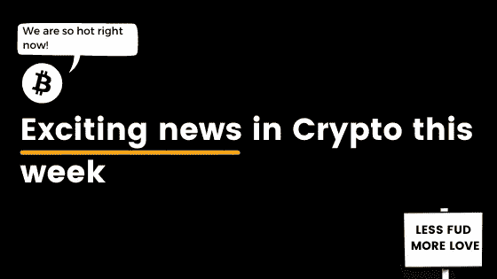

# 本周热门加密新闻

> 原文：<https://medium.com/coinmonks/trending-crypto-news-this-week-f96b6d7a7993?source=collection_archive---------10----------------------->

## 学生投资，NFT 繁荣和建议一个 NBA 球星

在加密领域，我们每天都会收到很多负面新闻和 FUD。

所以，我想把焦点放在一些积极的消息上，这些消息为我们所有人带来了这个星期的希望。

# 😮学生投资加密激增 3 倍

考虑到学生背负的沉重债务和每月高昂的生活费用，可能没有人会感到惊讶的是，越来越多的学生转向加密作为收入来源。

英国的一项调查发现，在过去的 12 个月里，对 2000 多名大学生的加密投资增加了两倍，从 2%增加到 6%。我们可以假设疫情在这方面发挥了作用，但毫无疑问，媒体对加密空间的更大关注为新兴一代打开了新的大门。

你可以在这里找到更多信息。

# 💡NFT 成功的原因是什么？

在过去的几个月里，感觉像十亿 NFT 涌入市场，你怎么知道什么是热门，什么不是？

嗯，不用担心，现场的一些顶级投资者在这里[分享他们关于评估值得购买的艺术品的最佳技巧。](https://www.theblockcrypto.com/news+/116524/how-the-most-profitable-nft-collectors-decide-what-to-invest-in)说到那些曾经流行的 NFT 综合症，[下面是现在的流行趋势。](https://decrypt.co/80194/7-hottest-nft-trends-happening-right-now)

# 🤔想在 crypto 上给 NBA 球星提建议？不，说真的！

是的，时候到了。

世界上的高绩效者想要进入加密世界，他们需要你的帮助。

# 🤑比特币到 175k 美元，以太坊到 35k 美元？这家银行似乎是这样认为的

英国渣打银行看好加密技术，尤其是以太坊。

在他们最近出版的“以太坊投资者指南”中，银行陈述了他们的案例，为什么他们认为以太坊有很多案例的巨大潜力。说着说着，他们不忘比特币里的王者。注意到它的稀缺性将是其增长的关键，并预测大 b 的近期估值为 17.5 万美元。

# 💬本周推特

# 那都是乡亲们！

我的朋友们，这一次到此为止，但不要担心，这只是从积极的消息中挑选出来的，我们可能不会经常看到。

> 加入 Coinmonks [电报频道](https://t.me/coincodecap)和 [Youtube 频道](https://www.youtube.com/channel/UCbyDhTbOiKh2iUMKBi4-4Zg)了解加密交易和投资

## 另外，阅读

*   [尤霍德勒 vs 考尼洛 vs 霍德诺特](/coinmonks/youhodler-vs-coinloan-vs-hodlnaut-b1050acde55a) | [Cryptohopper vs 哈斯博特](https://blog.coincodecap.com/cryptohopper-vs-haasbot)
*   [币安 vs 北海巨妖](https://blog.coincodecap.com/binance-vs-kraken) | [美元成本平均交易机器人](https://blog.coincodecap.com/pionex-dca-bot)
*   [新加坡十大最佳加密交易所](https://blog.coincodecap.com/crypto-exchange-in-singapore) | [购买 AXS](https://blog.coincodecap.com/buy-axs-token)
*   [投资印度的最佳加密软件](https://blog.coincodecap.com/best-crypto-to-invest-in-india-in-2021) | [HitBTC 评论](/coinmonks/hitbtc-review-c5143c5d53c2)
*   [MXC 交易所评论](/coinmonks/mxc-exchange-review-3af0ec1cba8c) | [Pionex vs 币安](https://blog.coincodecap.com/pionex-vs-binance) | [Pionex 套利机器人](https://blog.coincodecap.com/pionex-arbitrage-bot)
*   [我的密码交易经验](/coinmonks/my-experience-with-crypto-copy-trading-d6feb2ce3ac5) | [《比特币基地评论》](/coinmonks/coinbase-review-6ef4e0f56064)
*   [CoinFLEX 评论](https://blog.coincodecap.com/coinflex-review) | [AEX 交易所评论](https://blog.coincodecap.com/aex-exchange-review) | [UPbit 评论](https://blog.coincodecap.com/upbit-review)
*   [AscendEx 保证金交易](https://blog.coincodecap.com/ascendex-margin-trading) | [Bitfinex 赌注](https://blog.coincodecap.com/bitfinex-staking) | [bitFlyer 审核](https://blog.coincodecap.com/bitflyer-review)
*   [麻雀交换评论](https://blog.coincodecap.com/sparrow-exchange-review) | [纳什交换评论](https://blog.coincodecap.com/nash-exchange-review)
*   [加密货币储蓄账户](/coinmonks/cryptocurrency-savings-accounts-be3bc0feffbf) | [加密交易机器人](https://blog.coincodecap.com/best-crypto-trading-bots)
*   [BigONE 交易所评论](/coinmonks/bigone-exchange-review-64705d85a1d4) | [CEX。IO 审查](https://blog.coincodecap.com/cex-io-review) | [交换区审查](/coinmonks/swapzone-review-crypto-exchange-data-aggregator-e0ad78e55ed7)