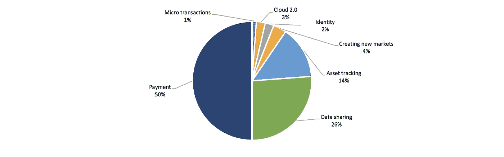
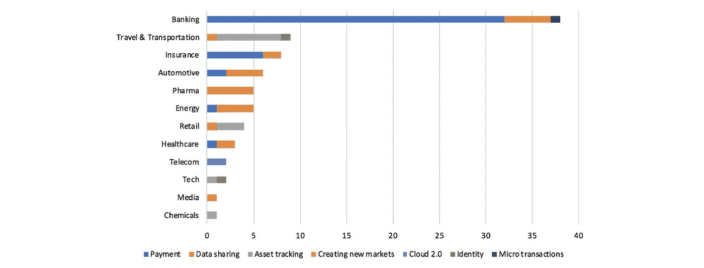

# 企业区块链实施趋势

> 原文：<https://medium.com/coinmonks/trends-in-enterprise-blockchain-implementation-314cde67e56a?source=collection_archive---------1----------------------->

## 过去 5 年的行业试点分析

不久前，我发表了一篇关于当前 70 多个行业驱动的区块链项目的帖子，这些项目涉及各个行业，包括银行、大型科技、汽车、制药等等。当我最近更新数据时，我**从中提取了一些定量统计数据，我想与大家**分享我对数据的解读。

该数据集包含 2014 年至今 **145 家企业区块链相关公告**。我使用 4 个类别来分解数据项:1)试点项目，2)产品(即市场供应)，3)专利，以及 4)其他(非特定)项目。除去这些其他项目，剩下 126 项，其中 85 项是关于行业试点的。我进一步使用我的[其他帖子](/coinmonks/enterprise-blockchain-where-is-the-business-value-ead60bbd2cb2)中的用例框架对试点项目进行了分类。

从数据中可以得出一些观察结果:

Enterprise blockchain activity by industry

*   由银行和保险组成的**金融服务业是最活跃的**，从事大量试点工作，收集专利，并将产品推向市场，如 R3 Corda。
*   作为一个群体，参与产品制造和分销的行业同样活跃，包括旅游运输、零售、汽车、制药和化工。
*   科技和电信业一直专注于创造区块链产品。作为开发过程的一部分，他们一直在收集专利，科技行业开始将产品推向市场。

Enterprise pilots by use case area

*   最突出的企业用例仍然是支付，但是**数据共享和资产跟踪也非常重要**。

Enterprise pilots by use case area and industry

*   这种区别似乎是沿着行业边界的；**金融服务侧重于支付，产品制造&分销侧重于数据共享和资产跟踪**。

Enterprise pilots by use case area and year

*   逐年稳步增长。 **2018 年将有可能创造企业区块链项目的新纪录。**
*   对支付用例的调查似乎在减少，而数据共享和资产跟踪显然在增加。

Enterprise pilots by industry and year

*   银行业的活动似乎在减少，尽管它们在早些年占主导地位。
*   就在去年，几乎所有行业都开始调查区块链项目。

很明显，跨行业的企业区块链解决方案的势头正在增强，但是 T2 产品制造和分销行业的公司似乎超过了金融服务业，成为了主要的推动力。

他们还在研究更新的用例，随着第一批生产性解决方案，如来自[马士基](https://cointelegraph.com/news/maersk-ibm-launch-blockchain-shipping-supply-chain-platform)或[IBM/家乐福](https://www.coindesk.com/ibm-food-supply-chain-blockchain-carrefour-live-production/)的解决方案进入市场，大规模企业采用很可能会更早更晚。

> [直接在您的收件箱中获得最佳软件交易](https://coincodecap.com/?utm_source=coinmonks)

