# 从 IOTA Tangle 触发电子邮件警报

> 原文：<https://medium.com/coinmonks/triggering-email-alerts-from-the-iota-tangle-3362219d2846?source=collection_archive---------6----------------------->

## DIY 指南

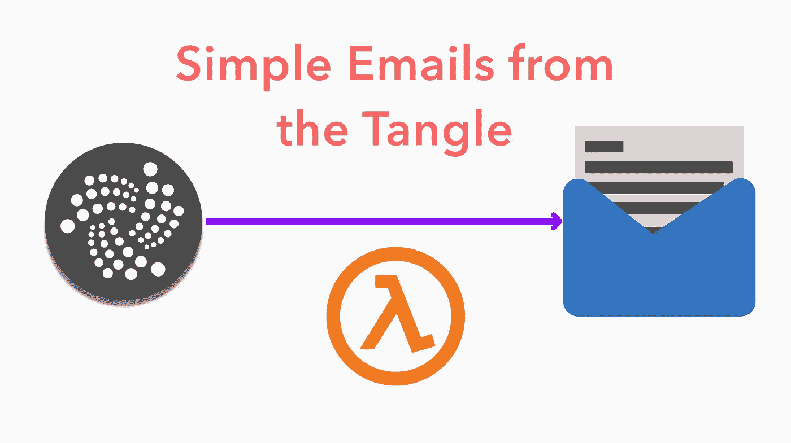

我最近遇到了一个新项目，叫做 [Totangle](https://totangle.com/) 。Totangle 将 tangle 与 Zapier 集成在一起，这允许您将 tangle 上发生的事情集成到您现有的 API 或工作流中。他们提出的第一个用例是，当您在 tangle 上获得付款时，设置一个电子邮件提醒。

受此启发，我自己也需要这个工具(我想在收到来自我的中型文章的提示时得到提醒，而不必经常打开钱包)，我想看看是否可以制作一个开源的 lambda 函数来复制这个基本功能。

# 它是这样工作的:

*   我们编写了一个 lambda 函数，每 30 分钟左右在 tangle 上寻找一个`address`或`tag`。
*   如果 lambda 函数看到以前没有看到的新交易，它会使用 SNS 向我的电子邮件地址发送一封电子邮件。
*   一旦它发送了电子邮件，它会将最近看到的交易保存到某个地方的某个列表中——也许 S3 现在可以工作，或者将来我们可以使用 DynamoDB。

# 第一部分:设置 lambda

我们将使用优秀的，尽管名字不好的，无服务器框架来管理我们的 AWS lambdas 和触发器。

让我们从创建一个新项目开始。

```
$ npm install -g serverless
$ serverless create --template aws-nodejs --path tangle-trigger
$ cd tangle-trigger
$ npm init -y
```

我们还需要安装 iota 库，并设置一些好的环境变量

```
$ touch .env
$ npm install --save iota.lib.js
```

让我们先编辑一下`.env`文件:

```
export AWS_PROFILE=default
export IOTA_URL="http://localhost:14265"
export IOTA_ADDRESS="9999"
```

我们使用`AWS_PROFILE`环境变量来控制将无服务器部署到哪个 AWS 帐户。我经常不得不在帐户之间导航，所以这个环境变量非常有用。

这两个`IOTA_*`环境变量只是占位符，但是我想向您展示如何将它们放入运行的 lambda 函数中。

让我们给`package.json`添加一个`deploy`脚本:

接下来，我们需要修改`Serverless.yml` 文件来定义 lambda 函数和触发该函数的事件。

现在，我们每分钟都在调度 lambda 函数——这样我们就不必等待 30 分钟来调试任何问题。您还可以看到我们是如何通过`IOTA_*`环境变量的，这些变量将被自动放置到 lambda 运行时中。

我们需要做的最后一件事是实际编写 lambda 函数！这里有一个占位符`handler.js`

很简单，对吧？但是它让我们确保我们的环境变量被正确地传入，并且还确保我们的 lambda 被正确地与 `iota.lib.js`依赖项打包在一起。

让我们部署它，并探索一下 AWS 控制台。

```
$ npm run deploy
```

您应该会看到如下的一些终端输出(我使用的是`yarn`而不是`npm` btw)。

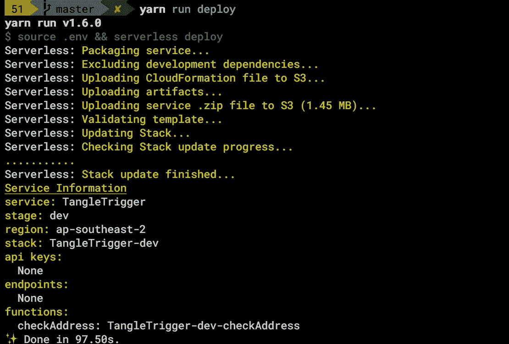

导航到 AWS 控制台，我们应该能够看到一个 Cloudformation 堆栈:

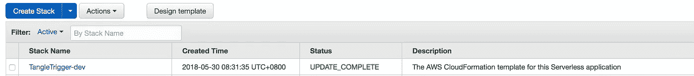

λ函数:

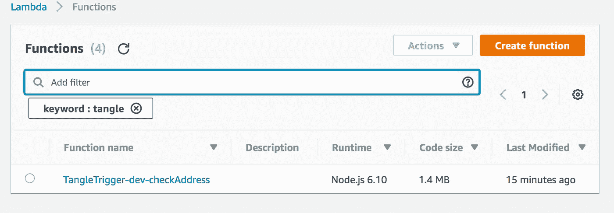

以及一些 Cloudwatch 日志，每次触发 lambda 时都会写入:

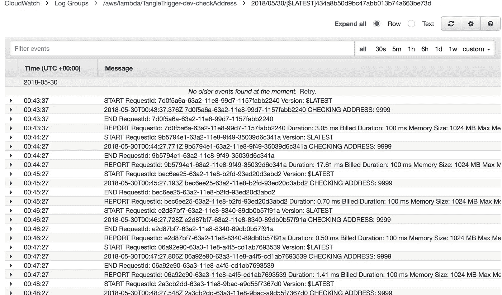

# 第二部分:与纠结对话

现在我们有了一个每隔 *n* 分钟运行一次的基本 lambda 函数，我们需要一种方法来检查对特定地址的传输。我们将在 iota js lib 上使用`findTransactionObjects()`方法来完成这项工作。

然而，在我们实现它之前，我们应该想办法在本地运行无服务器功能，否则调试这个功能将是一件非常痛苦的事情。

创建一个名为`local.js`的新文件:

现在我们可以用下面的代码运行`local.js`:

```
$ node local.js
```

您应该会看到如下所示的内容:

```
CHECKING ADDRESS: undefined
```

好吧！它只工作了一半。我们需要确保我们的。首先是 env 文件。我们可以将所有这些放在一个 npm 脚本中:`package.json`

现在，当我们运行`yarn run test`(或`npm run test`)时，我们得到如下结果:

```
yarn run v1.6.0
$ source .env && node local.js
CHECKING ADDRESS: 9999
✨  Done in 0.22s.
```

我们的环境变量被很好地传递进来。让我们和泰戈谈谈

# 与纠结对话

首先，让我们在`.env`文件中放一些合适的值:

我目前在新加坡，所以`durian.iotasalad.org`似乎很合适。

让我们更新 handler.js 来调用 api:

现在，当我们运行我们的测试时，我们应该得到类似如下的结果:

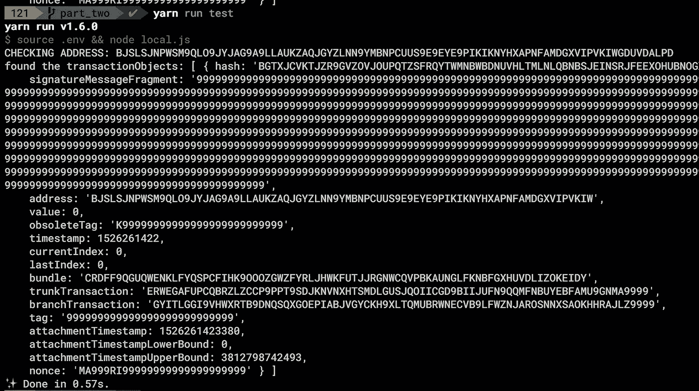

太好了！我们可以查到给定地址的转账记录！现在我们需要计算转移的数量，并确保我们过滤掉已经看到的转移。为此，我们将使用 S3 自动气象站。

让我们安装 aws-sdk:

```
npm install --save aws-sdk
```

现在我们需要添加一个 s3 存储桶到我们的`serverless.yml`文件，以及一个新的环境变量:

`serverless.yml`

`.env`

```
...
export S3_BUCKET_NAME="tangletrigger"
```

好的。现在我们需要稍微整理一下，从 s3 读写的函数。这是我想到的。

`handler.js`

希望这是不言自明的。在这种情况下，我们只是使用 tx hash 作为关键字将新文件写入 s3 bucket。它有点懒，使用数据库会更好，但是 s3 是免费的，更容易上手。我将让你来建立一个数据库。

现在，当在本地再次运行这个命令后，我们可以检查我们的 aws bucket:(您需要安装 aws cli，否则您可以使用 web 控制台)

```
$ aws s3 ls s3://tangletrigger/
2018-05-30 10:05:01          6 BGTXJCVKTJZR9GVZOVJOUPQTZSFRQYTWMNBWBDNUVHLTMLNLQBNBSJEINSRJFEEXOHUBNOGXMXKEA9999
```

# 添加电子邮件通知

最后，如果我们在 tangle 上看到任何新的事务，我们需要发送一封电子邮件。AWS 让 SNS 变得非常简单，所以首先，让我们在`serverless.yml`中添加一个新的 SNS 主题

我们的`serverless.yml`部分现在应该是这样的:

请注意，我们现在已经定义了一个 SNS 主题，它将发送到在我们的`.env`文件中定义的电子邮件，我们使用`Ref`函数将它设置为一个环境变量，然后将它传递给我们的 lambda。我们将在下面的`publishSNSMessage()`中使用它。

这是我们最后的`handler.js`，添加了电子邮件设置。

这是一封电子邮件，告诉我我有新的交易:

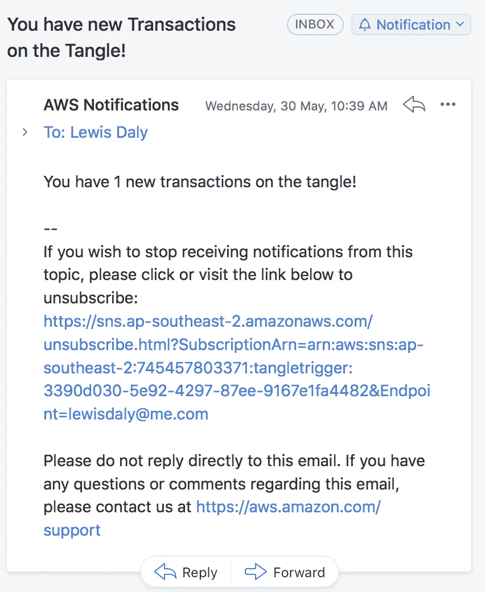

测试电子邮件。现在越来越真实了！

现在，我们只需将通知时间改回 30 分钟，就可以再次部署它了。

我还将向这个地址发送一个事务，看看会发生什么！

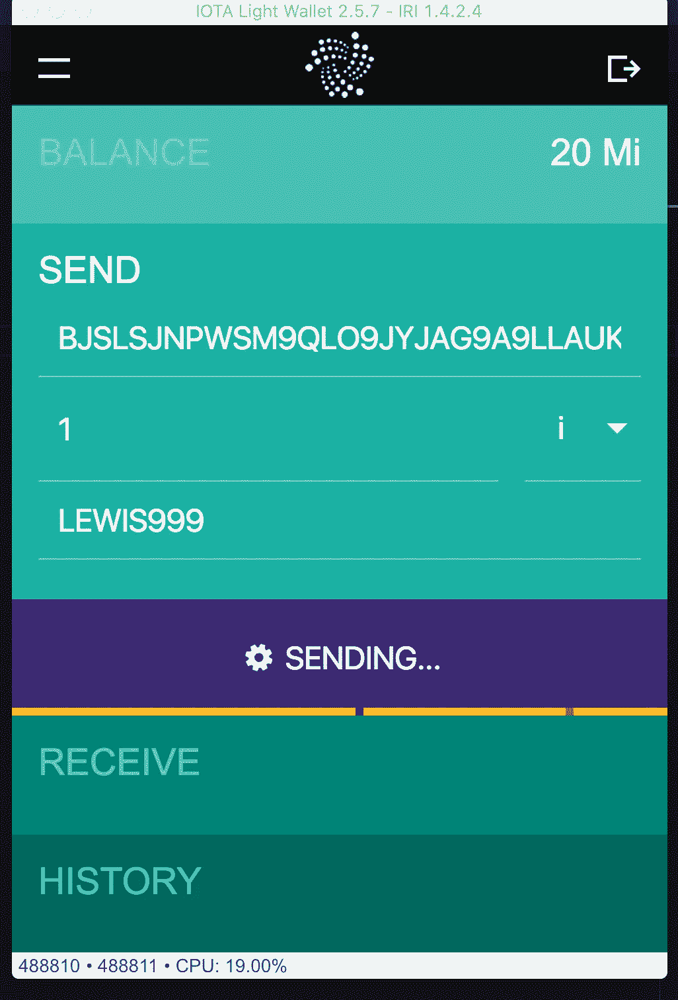

Sending myself 1 IOTA

现在我需要做的就是等一封邮件。

等了大约一个小时后，我在收件箱里发现了以下内容:

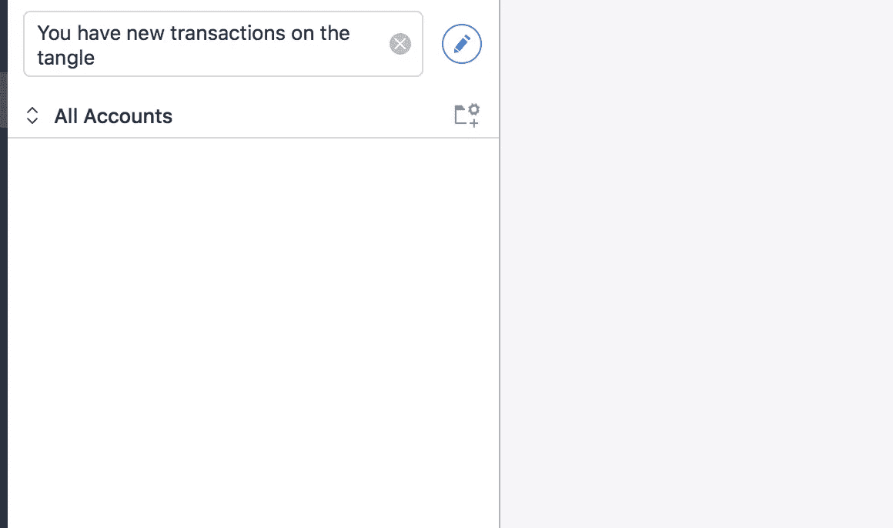

Nada. Nothing. Zip.

让我们看看我们的 Cloudwatch 日志，看看发生了什么。

我导航到`CloudWatch` > `Logs` > `/aws/lambda/TangleTrigger-dev-checkAddress`，选择了最新的日志(最上面的那个)。

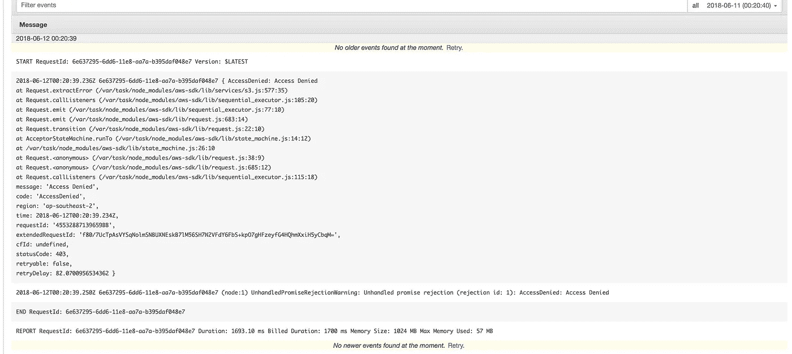

嗯。S3 好像有点不对劲。

好的。说实话，我有点期待这个。我们的 Lambda 函数所使用的 IAM 角色无权与我们的 S3 bucket 对话，也无权发布到我们之前创建的 SNS 主题。这很容易解决:

将以下内容添加到`serverless.yml`的提供商部分:

这定义了 Lambda 函数执行时使用的 IAM 角色权限，上面我们给它读写 s3 bucket 的权限，以及发布到我们创建的 SNS 主题的权限。

让我们再部署一次，看看会发生什么。

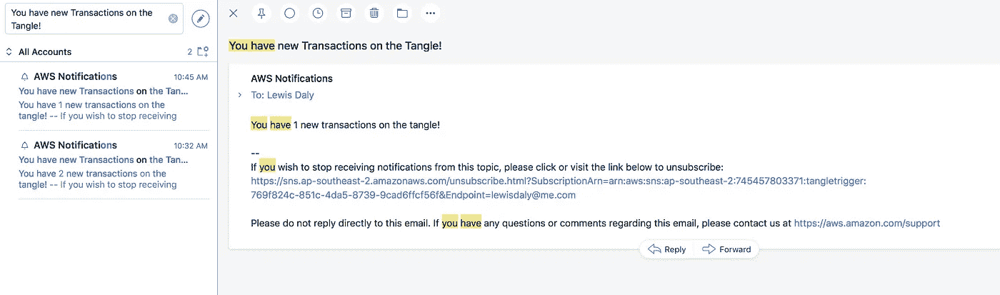

IT’S WORKING!

它起作用了。这并不难，是吗？您可以在这里查看完整代码[，并确保您查看了我们上面所经历的每个步骤的其他分支。](https://github.com/vessels-tech/tangletrigger)

你设法让它工作了吗？还是卡住了？让我知道。我很乐意帮忙。你也可以通过推特`@lewdaly`联系我，或者通过`lwilld`联系 IOTA Discord。

> 如果你喜欢这篇文章，或者有任何建议或问题，请在评论中告诉我。如果你喜欢这篇文章，给它一个❤️或👏或者随便你们这些疯猫现在怎么称呼它。
> 
> *随时欢迎提示🙌🙌🙌* `*BJSLSJNPWSM9QLO9JYJAG9A9LLAUKZAQJGYZLNN9YMBNPCUUS9E9EYE9PIKIKNYHXAPNFAMDGXVIPVKIWGDUVDALPD*`