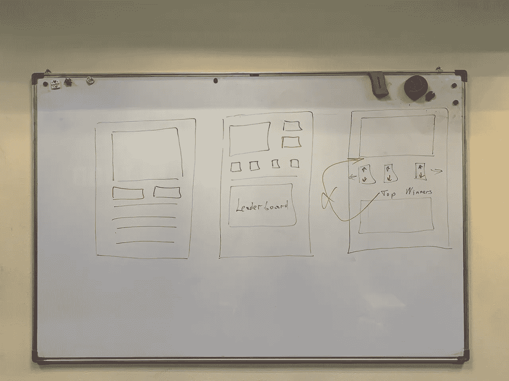
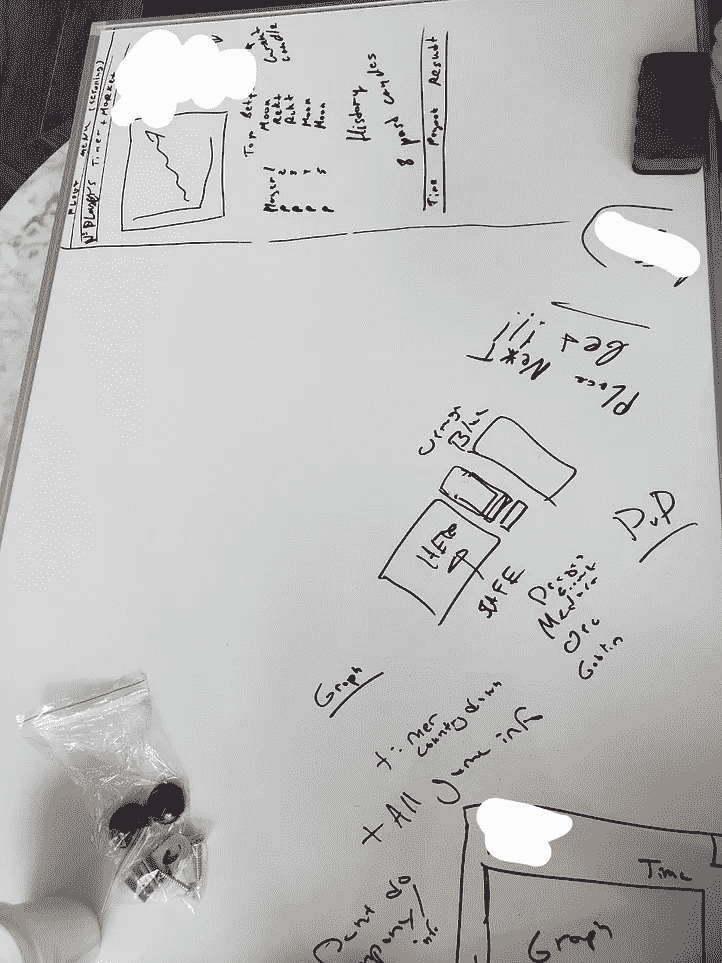
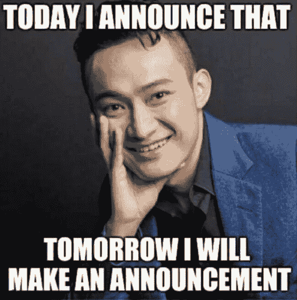

# TRON DAPP 开发者自白

> 原文：<https://medium.com/coinmonks/tron-dapp-developer-confession-19dbd77f4824?source=collection_archive---------1----------------------->

过去几年，我一直在加密货币/区块链领域工作。在那段时间里，我做了不同的事情——营销、交易、投资，但我总是被创建我的 DAPP 的想法所鼓舞。

在某个时刻，我想我找到了一个完美的主意。我会游戏化交易！

> **跳过简单的部分:**
> 
> 我利用最近从 MBA 学位中学到的技能做了市场调查，并创建了一个平台来筹集资金。很快就找到了一个团队来做编程和设计。

# 现在好戏开始了

在地板和墙上使用白板后，我觉得必须找到完美的概念。

我不得不选择一个链来建立我的 DAPP。我们有非常标准的要求:

*   快速便宜的交易
*   活跃社区
*   DAPP 开发者支持

我最喜欢以太坊的社区，但是它太慢了，不能在网上做任何事情。是的，我们可以把一些计算转移到后端，但是这违背了我的想法。下一个最好的选择是创，他们有一个相当不错的玩家基础。

但是引爆点是——**支持！**

Tron 正在提供一系列[的东西](https://tron.network/tronecp):免费能源、营销支持、开发者社区。一切都是为了将有前途的 DAPPs 开发者带入生态系统。

*我想从一开始就概述一下，我们的应用不是 TronBet 的廉价翻版或另一个可疑的 dice2win 克隆。我们在设计、风格和技术方面进行了投资，以在平台上引入一些新的体验。*

# 最初的麻烦

我们的第一个问题是文档。当我们开始构建智能合约时，我们发现一些开发人员文档不完整或已经过时。一些非常简单的任务，比如注册你的令牌让我非常痛苦。

# 能源和资金支持

我对从创那里获得任何额外的资助不抱幻想，但这很平常。当我们的新 DAPP 每天消耗数亿的能源时，你至少可以补贴一部分。

但相反，他们推出了能源租赁应用 tronlending，并将我的请求转发到那里。最有趣的是，有时候，租赁能源可能比燃烧 TRX 还要昂贵。

# 营销和社区支持

所以，我在用他们的网络。我花大力气经营智能合同。我吸引用户，他们每次下注和交易都要付费。

当我们开始谈论营销时，他们的基本反应是:

> 你要么给我们你的 DAPP(又名股权)的股份，要么我们需要一个收入分享协议。

没有推特，没有电报，什么都没有。我不知道，但在我看来，你不能这样对待你的伴侣。

# 底线

如果我们抛开 Tron Foundation 及其技术堆栈的可疑做法，只从用户的角度考虑问题:

*   赌博/赌博生态系统正在蓬勃发展，如果这是你的事情，创是一个很好的选择
*   这个链条很快，交易很便宜，不到一秒钟就可以确认
*   TRX 有很多流动性好的交易所
*   一堆装有 DAPP 手机浏览器的钱包
*   从 TRX 到菲亚特的匝道不是一项简单的任务，你需要一些额外的步骤，它们**会** **让你头疼**

# 那我们现在处于什么位置呢？

Tron 需要停止过分关注利润，试图从他们的生态系统中榨取额外的利润。他们需要支持他们的开发者和成员，并与他们密切合作。

现在，我正在为我未来的项目选择另一家连锁店。

附言

如果你有兴趣阅读我的项目进展，请鼓掌或评论让我知道。

在推特上关注我:[丹尼尔·亚金](https://twitter.com/danilmyakin)

> [直接在您的收件箱中获得最佳软件交易](https://coincodecap.com/?utm_source=coinmonks)

