# 创 TRX 逐步赌注教程 2021

> 原文：<https://medium.com/coinmonks/tron-trx-step-by-step-staking-tutorial-2021-6a9bc6efb37d?source=collection_archive---------1----------------------->

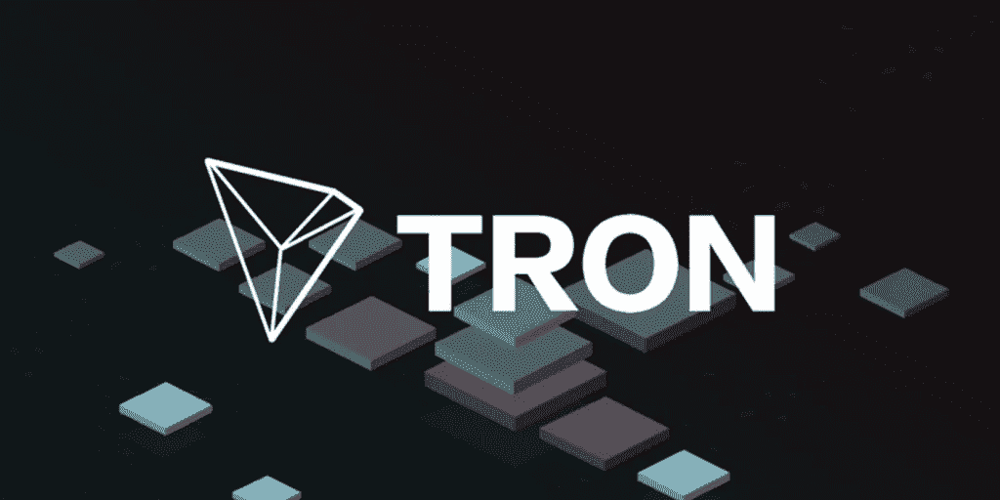

How to Stake Tron TRX in 20221

一步一步的指导初学者了解赌注和赌注创 TRX 获得最佳回报！！

在文章的第一部分，我会试着向初学者解释:

*   什么是赌注？
*   创 TRX 是什么？

然后我会用一些截图一步一步地展示如何用最简单的方法来赌注创·TRX。

在帖子的最后，我将简要介绍如何用笔记本电脑或电脑为那些想在家赚取或开采创的人开采创 trx。

现在就开始吧！！

## 什么是创 TRX？

TRON 是一个分散的、开源的、基于区块链的操作系统，具有智能合约功能，利益证明原则作为其共识算法，以及一种系统原生的加密货币，称为 Tronix。

Tron 和许多其他区块链一样，在“利害关系证明”共识机制下工作。这意味着 Tron 网络依赖于多个验证器节点。验证者是负责保护所有事务和生成新块的人。

这些节点被称为代表和超级代表，要成为验证者节点需要一定数量的股份，因此该节点需要拥有一定数量的 TRX，可以认为这是保持保证金以获得成为验证者的权利。

那么，**什么是跑马圈地？**什么是 Tron staking？如果我们不是验证者，我们怎么能通过下注赚钱呢？

所有这些都是很好的问题，这是我们可以进来并参与该过程以获得一些奖励的地方。

超级代表需要人们借给他们一些 TRX 硬币，这样他们就可以在赌注中获得大量的创，并获得每轮成为验证者的权利。

作为回报，验证者将把他们从每一个区块中得到的部分奖励发给我们，奖励将与我们的赌注成比例，因此我们将得到 TRX 作为回报。

我真的很喜欢 Tron 网络，因为它是区块链速度最快的网络之一，你可以尝试将资金从一个账户转到另一个账户，你会对交易速度感到惊讶。

我最喜欢 Tron 的第二大优点**是交易是免费的**，在 Tron 中每个账户都有一个叫做 Bandwith 和 Energy 的东西。

每次您进行交易时，您将使用 bandwidth(交易费)，bandwidth 每天都会重新生成。因此，如果你一天没有完成一百万笔交易，你应该对每日交易量感到满意。

另一方面，能源是人们执行智能合同和代码所需要的，基本上是你支付计算能力的方式，也是给你每天免费分配的再生资源。

好消息，当你冻结你的 TRX 时，你可以获得额外的带宽和能量。

让我们进入有趣的部分！！

在我们开始下注之前，你应该已经有一些 TRX(至少 1 英镑)和一个钱包。我推荐 Tronlink，这是一个 Chrome 扩展钱包。

尽量不要通过一些支持下注的应用或钱包下注，因为这些应用和钱包的回报可能很少。

如果你没有 TRXs，请按照文章末尾我解释如何用你的计算机挖掘 TRX 的那一节中的步骤操作。

## **立桩 Tron 的步骤:**

1.  前往 Tronscan，使用您的 Tronlink 钱包登录。
2.  进入超级代表页面 [Tronscan SRs](https://tronscan.org/#/sr/representatives)
3.  点击绿色的“投票”按钮。
4.  点击顶部中间的“获得”以获得投票权。
5.  选择你想下注的 TRX 的数量，同时选择获得创能量和带宽。
6.  与 Tronlink 签署交易。
7.  现在你应该有一些 Tron 权力(选票)，你需要分配他们，把选票分配给几个超级代表。
8.  再次点击绿色按钮投票并签署新的交易。
9.  一旦网站给你确认，你已经成功地把你的 Trx。

在此之后，等待一天，当您返回 Tronscan 并搜索您的帐户地址时，您应该会看到一个框，其中有您未提取的奖励。

在下面的截图中一步一步地看看整个过程:

我将收回之前未兑现的奖励:

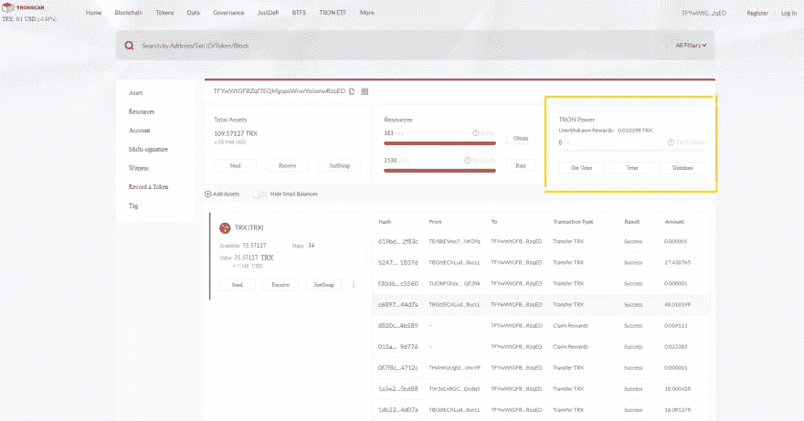

然后，我将进入 SR 投票页面，这样我就可以获得一些 Tron 权力(冻结我的 Trx):

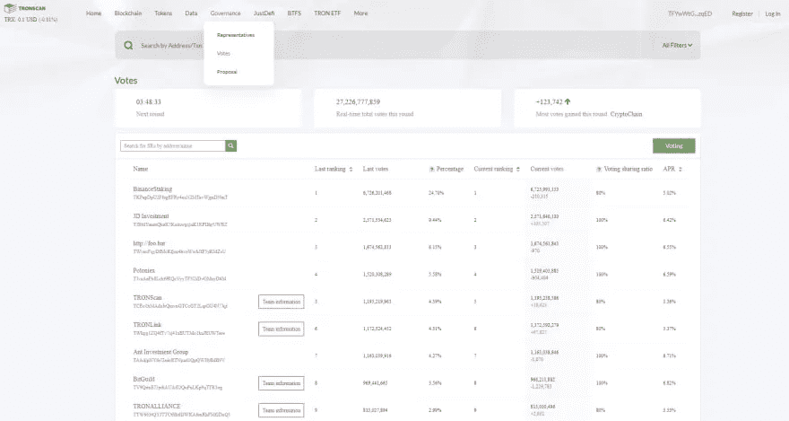

我将点击绿色投票按钮，然后获得:

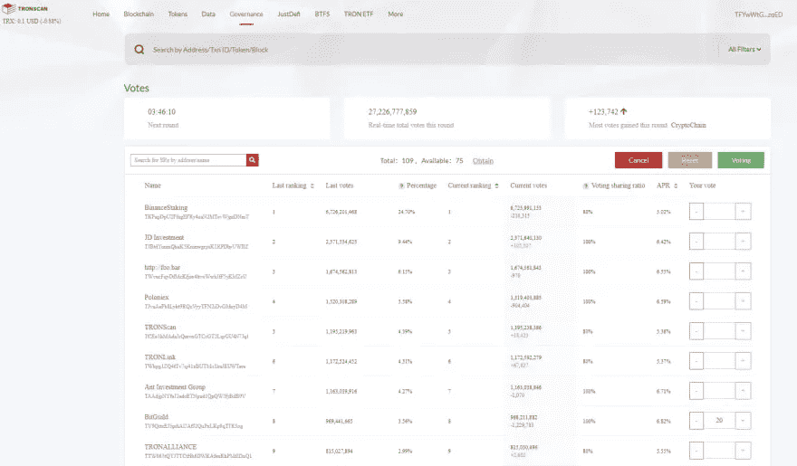

我会确认我想得到创的力量(选票)和带宽:

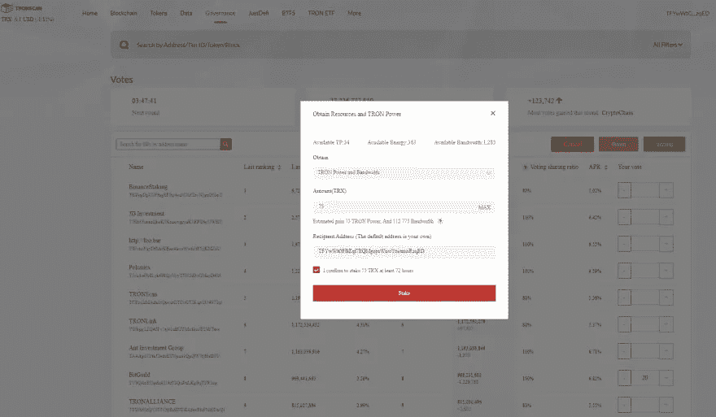

从这里我将确认，然后一旦我得到 Tron 权力(选票)，我将把它们分配给列表中的一些超级代表:

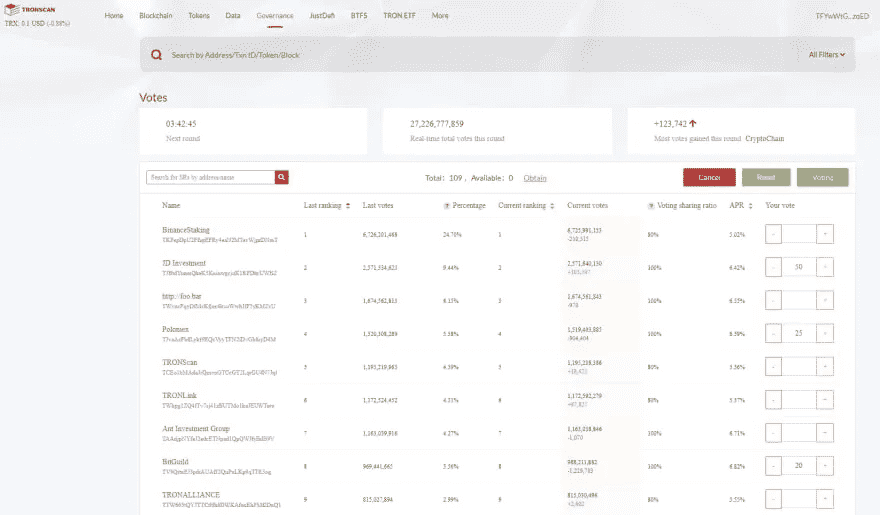

然后，我将单击绿色按钮，等待确认我已押下 Trx:

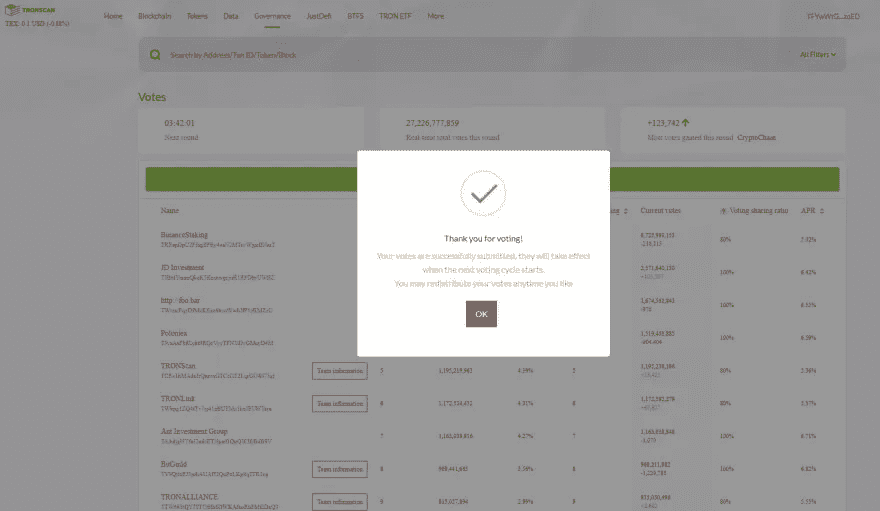

所有这些完成后，你可以看看你是如何分配你的选票的:

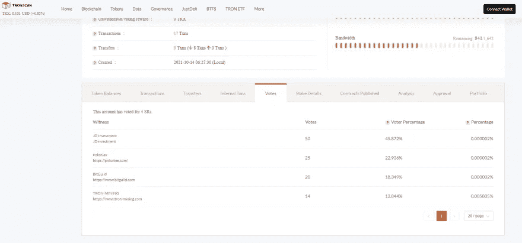

这就是你必须遵循的所有程序，以便把你的 TRX 押在创区块链上。

你可能会有另外一个重要的问题:

# 在 Tron Staking 中我如何选择超级代表投票？

为了让您从 SR 获得最佳 Tron 奖励，您必须将您的投票分配给超级代表，他们通常被选为验证者。

另一点要考虑的是他们提供的奖励分配(投票分享比率)和 APR。

我试着去找那些拥有超过 6.40%的良好 APR 的人，他们的投票分享率为 100%，并且最好是排名前 10。

也投票给那些选民较少的人是一个好策略，因为他们将有较少的人来分配奖励。

希望这对你有用！如果你遇到问题，你可以随时问我，我很乐意帮忙！！！

如果你正在寻找一种方法来获得额外的投资回报，那么我建议你看看这篇文章:

# [2022 年如何购买 Crypto 折 8 折返现](/@lumabooks/how-to-buy-crypto-with-10-discount-and-8-cashback-in-2022-4488c1bde8d1)

# 最后，一个快速指南，以我的一些创 TRX 与您的计算机使用您的 CPU 或 GPU。

**下载无法开采的矿工软件**

在下载文件之前，在 Windows Defender、防病毒软件和浏览器中设置一些文件夹排除，这样你就可以下载文件，而不会受到危险文件通知的困扰。

官方的无敌软件可以从这个网站下载:[无敌下载](https://www.unmineable.com/miner)

下载 MFI 版本(包括矿工文件)。

不可挖掘的软件只是一个可执行文件，它已经包含了所有的配置，所以这是最好的和最容易的方式来挖掘 TRX。

**在 windows 中以管理员身份运行文件。**

当您运行它时，它看起来就像这样:

可以选择 GPU 卡或者 CPU。

这将带您进入第二个屏幕，在那里您将输入您的币安智能链地址，以及**代码，这将允许您将开发费用从 1%降至 0.75%** 。

使用代码: **e4xd-wmzl** 将您的开发费用从 1%降至 0.75%(这有所不同)。

您的屏幕应该是这样的:

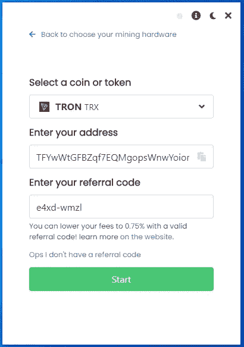

单击开始按钮后，您应该会看到一个类似的屏幕:

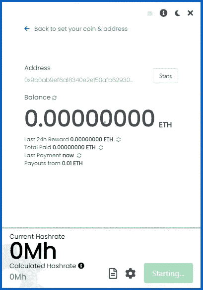

此时，我建议您单击底部的选项来显示日志(看起来像一张纸)，这里单击强制停止。

然后点击设置图标(看起来像一个齿轮)，在弹出的屏幕中你要仔细检查几件事情:

1.  确保选择的算法是 etcash 如果您使用 4GB 卡进行挖掘，使用 ETHASH 用于 6GB 或更大的卡，如果您选择了 CPU，一切都准备好开始挖掘，不需要选择任何东西。
2.  确保代码 **e4xd-wmzl** 显示在推荐框中(不是强制的，你可以不使用它)。
3.  为您的员工(您从中进行挖掘的计算机)设置一个名称。
4.  将你的挖掘强度设置为最高，我建议你在不使用电脑的时候使用高强度。

它看起来像这样:

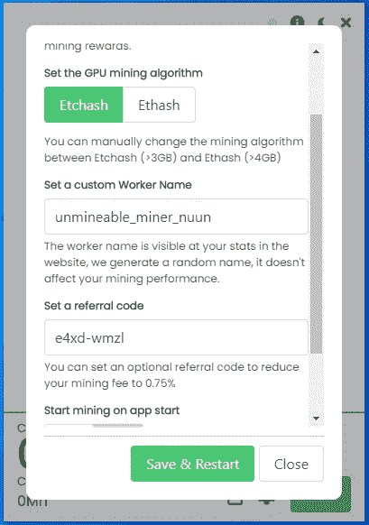

点击保存和重启按钮开始挖掘！！

一旦它开始，你可以检查你的图形卡的速度，显示为当前的哈希值。

你也可以点击右上角的统计按钮，直接转到 Unmineable 网站，在那里你可以检查你的余额，并要求手动支付。

**注意**建议您更改 Windows 中的一些设置，有人会禁用更新，还会禁用睡眠模式、休眠或任何可以在电脑不使用时关闭电脑的设置。

如果您使用的是笔记本电脑，请确保它有一些电池或插上电源，这样它就不会关机。

恭喜，如果你正在使用不可采矿，你现在是一名矿工了！！

如果你遇到任何麻烦，我可以在我为你创建的这个不和谐频道中提供帮助:[https://discord.gg/sPbV8kcK](https://discord.gg/KNwsgX7uN5)

如果您正在寻找更多关于 CPU 挖掘的信息，PDF 电子书中有很好的指南，并且是免费的，请访问:

**转诊披露:**

请阅读以下链接中的不可撤销推荐政策，以更好地了解推荐代码如何详细工作[不可撤销推荐](https://www.unmineable.com/referrals)

> 加入 Coinmonks [电报频道](https://t.me/coincodecap)和 [Youtube 频道](https://www.youtube.com/c/coinmonks/videos)了解加密交易和投资

## 也阅读

 [## 最佳加密交易所| 2021 年十大加密货币交易所

### 编辑描述

blog.coincodecap.com](https://blog.coincodecap.com/crypto-exchange)  [## 2021 年 10 大最佳加密贷款平台| CoinCodeCap

### 当谈到加密货币贷款时，大量因素等同于良好的收入状况。此外，借款的一部分…

blog.coincodecap.com](https://blog.coincodecap.com/crypto-lending)  [## 2021 年最佳免费加密交易机器人

### 2021 年币安、比特币基地、库币和其他密码交易所的最佳密码交易机器人。四进制，位间隙…

medium.com](/coinmonks/crypto-trading-bot-c2ffce8acb2a)  [## 最佳 4 个加密交易信号电报通道

### 这是乏味的找到正确的加密交易信号提供商。因此，在本文中，我们将讨论最好的…

medium.com](/coinmonks/best-crypto-signals-telegram-5785cdbc4b2b)  [## BlockFi 评论 2021:利弊和利率| CoinCodeCap

### 今天，我们提出了一个全面的 BlockFi 评论，这是一个成立于 2017 年的加密贷款平台，拥有其…

blog.coincodecap.com](https://blog.coincodecap.com/blockfi-review)  [## 如何在印度购买比特币？2021 年购买比特币的 7 款最佳应用[手机版]

### 如何使用移动应用程序购买比特币印度

medium.com](/coinmonks/buy-bitcoin-in-india-feb50ddfef94)  [## 加密税务软件——五大最佳比特币税务计算器[2021]

### 不管你是刚接触加密还是已经在这个领域呆了一段时间，你都需要交税。

medium.com](/coinmonks/best-crypto-tax-tool-for-my-money-72d4b430816b)  [## 存储比特币的最佳加密硬件钱包[2021] | CoinCodeCap

### 保管您的数字资产很容易，但找到正确的存储方式却是一项繁琐的任务。在线钱包有一个风险…

blog.coincodecap.com](https://blog.coincodecap.com/best-hardware-wallet-bitcoin)