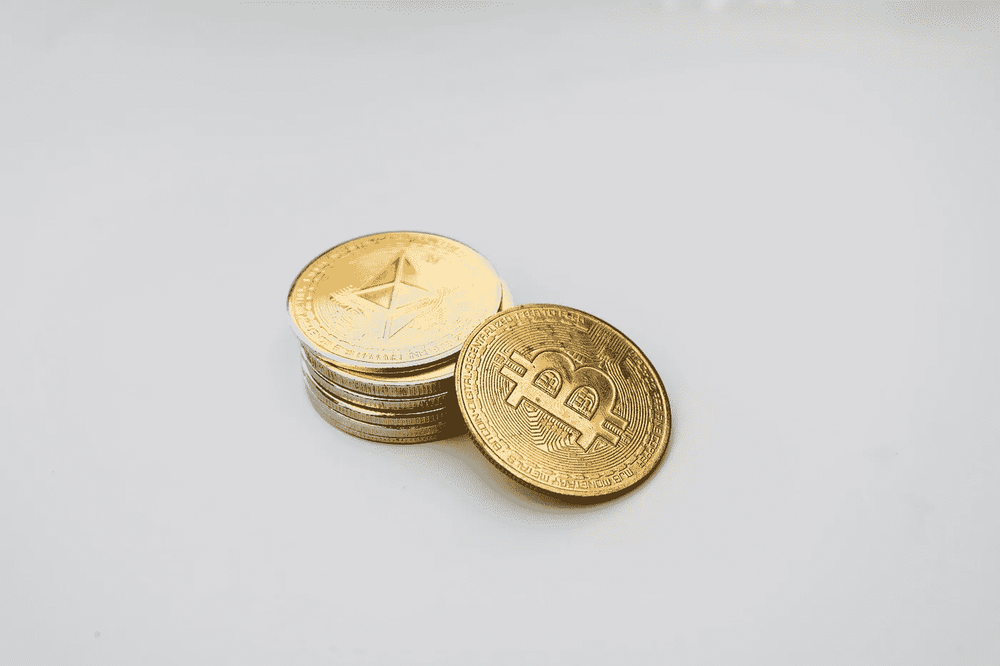

# 以太网的真正潜力

> 原文：<https://medium.com/coinmonks/true-potential-of-ethereum-network-78b19f782073?source=collection_archive---------9----------------------->

unsplash

以太坊是世界第二大区块链网络。比特币的发明导致了区块链技术的发展。换句话说，区块链之于比特币就像互联网之于电子邮件——一个开发应用和程序的平台。比特币只是几种选择之一。这一想法激起了人们的兴趣，他们开始考虑社会的哪些其他方面将受益于分权，如投票、复杂的金融操作或数据存储。

以太坊由《比特币》杂志的联合创始人维塔利克·布特林(Vitalik Buterin)于 2013 年构思，并于 2014 年投入使用。以太坊是一个用于分散应用程序(Dapps)的 DIY 平台。如果你想在以太坊上构建一个去中心化的软件，你可以使用 solidity 编程语言。

## 为什么不用比特币？为什么是以太坊？

source: unsplash.com

比特币的区块链由于其编程语言 C++(图灵-完全语言)和强调安全性和去中心化的设计而相对有限。这样做是因为比特币这样的系统对行为一致性有非常严格的要求。在我们看来，这是故意的，目的是让比特币成为现在的样子——数字黄金。比特币的区块链不适合复杂的分散应用，因此以太坊应运而生。

## 今日以太坊

以太坊网络由数千台独立的计算机提供动力，使其真正实现了去中心化。这是运营 Dapps 的全球基础设施。以太坊网络现在托管着数以千计的 Dapps，如稀缺数字商品的点对点市场、借贷、分散交易、NFTs(或数字艺术)、数字广告、算法货币市场、分散储蓄应用、域名、云存储、游戏、身份网络、足球迷代币、社交媒体等。

目前，以太坊网络上的分散金融应用锁定了大约 1600 亿美元的价值。随着 NFT 主要市场 OpenSea 的总销售额即将超过 100 亿美元，数字艺术正迅速获得牵引力。

以太坊的最终目标是真正去中心化互联网，到目前为止，它已经相当有效。

## 互联网是集中式的吗？

Source: visualcapitalist.com

是也不是。原则上，它是分散的，因为任何人都可以访问互联网来建立和启动一个网站。然而，事实上，亚马逊、谷歌、脸书、苹果、网飞等巨头公司控制了互联网的绝大部分。互联网上几乎没有任何行为是在没有第三方参与的情况下发生的。

有了以太坊这样的区块链技术，我们现在可以想象一个直接连接消费者而不需要集中的第三方的互联网。例如，你可以通过直接连接司机和乘客来淘汰优步，或者你可以通过分散的交易所直接购买股票/债券/加密货币资产。

## 它是如何工作的？

Source: geeksforgeeks.org

智能合同。Solidity 编程语言创建了智能合同。在现实生活中，合同是一组条款、条件和行为。开发者可以在以太坊上为他们的 Dapp 定义条件，以太坊网络会执行这些条件。

智能合同处理合同的所有部分，包括执行、管理、履行和支付。以太坊的智能合约让我们有机会创造任何种类的代币，而不必推出全新的区块链。

## 让我们看一些真实的使用案例:

可以创建托管协议或期货，这些协议或期货依赖于特定情况的发生才能被释放。例如，智能合约可以配置为每年在某人生日时分发现金。如果有人确认收到了所提供的物品，也可以设置它来分发资金。它可能用于强制数字资产持有者的某些权利。

合同不可编辑或更正。修改合同的唯一方法是说服整个网络，改变是必要的，这几乎是不可能的。

要在以太坊上部署智能合约，其创建者必须以以太(以太坊的本地货币)支付，这激励个人在他们的计算机上运行以太坊协议。此外，作者支付以太坊安装智能合同保证了个人创建有效的代码，而不会在多余的杂务上浪费网络资源。

## 以太坊的未来潜力

以太坊在 2015 年 8 月的估值为 0.70 便士，市值不到 1 亿美元。今天，随着以太坊网络的人气上升，一个以太的价格是 4300 美元，市场估值超过 5000 亿美元。

以太坊有先发优势，因为它在所有主要交易所都有。当个人或组织创建新的 Dapps 时，他们很可能会从以太坊开始。以太坊网络正在快速发展。

以太坊仍需改进的一个领域是其可伸缩性和吞吐量，以及快速、廉价地处理大量交易的能力，目前远非如此。这就是以太坊 2.0 的用武之地，这一更新将允许以太坊显著增长，并以最低的成本从仅 13 笔交易执行多达 100，000 笔交易。这一改进计划于 2022 年初进行。此时，网络可以从活跃用户增长的进一步激增中获益，特别是在 DeFi 和 NFTs 中，因为网络变得更快、更便宜。

尽管有可供选择的智能合约区块链，以太坊是否会赢得全部或相当大的市场份额仍有待观察，这两者都是可取的。升级到 proof-of-stage(ETH 2.0)并使以太坊变得“绿色”，这将进一步刺激机构投资。

## 估价以太坊

在 2017 年，我们完全不知道以太坊能实现什么。只有一种预感，这可能是一台新的互联网计算机。在过去的两年中，出现了两个主要的用例:DeFi，即分散金融，它让人们做过去银行做的事情，如借贷；还有 NFTs，每个艺术家都有一个神奇的软件，允许他们创造独特和稀缺的数字资产。在以太坊的 NFT 技术之前，我们不可能创造出稀有的数字资产。

如果我们试图在 2017 年对以太坊进行估值，我们将无法得出任何一个结论，因为我们不知道它们会得到发展并产生重大影响。因此，如果我们看看总价值锁定在 1，600 亿美元的 DeFi，并考虑到世界十大资产管理公司的 AUM 总和超过 40 万亿美元，前 50 大资产管理公司的 AUM 总和超过 90 万亿美元(根据 IPE)，你可以将以太坊的价值视为金融系统的规模。假设以太坊的 DeFi 生态系统可以捕获 1%的 AUM，并考虑到该网络在“伦敦升级”后开始每天燃烧成千上万的硬币，我们可能会看到以太坊的市值上升到每 ETH 20，000 美元以上，到 2030 年市值超过 2.6 万亿美元。

*免责声明:本文包含的信息仅用于教育目的，不构成 Wheatstones 的任何形式的建议或推荐，也不打算供用户在做出(或避免做出)任何投资决定时依赖。*

> 加入 Coinmonks [电报频道](https://t.me/coincodecap)和 [Youtube 频道](https://www.youtube.com/c/coinmonks/videos)了解加密交易和投资

## 另外，阅读

*   [CoinLoan 评论](https://blog.coincodecap.com/coinloan-review) | [YouHodler 评论](/coinmonks/youhodler-4-easy-ways-to-make-money-98969b9689f2) | [BlockFi 评论](https://blog.coincodecap.com/blockfi-review)
*   [CoinFLEX 评论](https://blog.coincodecap.com/coinflex-review) | [AEX 交易所评论](https://blog.coincodecap.com/aex-exchange-review) | [UPbit 评论](https://blog.coincodecap.com/upbit-review)
*   [比特币基地评论](/coinmonks/coinbase-review-6ef4e0f56064) | [德里比特评论](/coinmonks/deribit-review-options-fees-apis-and-testnet-2ca16c4bbdb2) | [FTX 评论](/coinmonks/ftx-crypto-exchange-review-53664ac1198f)
*   [n rave ZERO Review](/coinmonks/ngrave-zero-review-c465cf8307fc)|[phe MEX Review](/coinmonks/phemex-review-4cfba0b49e28)|[PrimeXBT Review](/coinmonks/primexbt-review-88e0815be858)
*   最佳[区块链分析](https://bitquery.io/blog/best-blockchain-analysis-tools-and-software)工具| [赚比特币](/coinmonks/earn-bitcoin-6e8bd3c592d9)
*   [加密套利](/coinmonks/crypto-arbitrage-guide-how-to-make-money-as-a-beginner-62bfe5c868f6)指南| [如何做空比特币](/coinmonks/how-to-short-bitcoin-568a2d0b4ae5)
*   [比特币基地 vs 瓦济克斯](https://blog.coincodecap.com/coinbase-vs-wazirx) | [比特鲁点评](https://blog.coincodecap.com/bitrue-review) | [波洛涅克斯 vs 比特鲁](https://blog.coincodecap.com/poloniex-vs-bittrex)
*   [德国最佳加密交易所](https://blog.coincodecap.com/crypto-exchanges-in-germany) | [Arbitrum:第二层解决方案](https://blog.coincodecap.com/arbitrum)
*   [币安交易机器人](/coinmonks/binance-trading-bots-d0d57bb62c4c) | [OKEx 审查](/coinmonks/okex-review-6b369304110f) | [Atani 审查](https://blog.coincodecap.com/atani-review)
*   [最佳加密交易信号电报](/coinmonks/best-crypto-signals-telegram-5785cdbc4b2b) | [MoonXBT 评论](/coinmonks/moonxbt-review-6e4ab26d037)
*   [如何在 Bitbns 上购买柴犬(SHIB)币？](https://blog.coincodecap.com/buy-shiba-bitbns) | [买弗洛基](https://blog.coincodecap.com/buy-floki-inu-token)
*   [Godex.io 审核](/coinmonks/godex-io-review-7366086519fb) | [邀请审核](/coinmonks/invity-review-70f3030c0502) | [BitForex 审核](https://blog.coincodecap.com/bitforex-review)
*   [10 本关于加密的最佳书籍](https://blog.coincodecap.com/best-crypto-books) | [英国 5 个最佳加密机器人](https://blog.coincodecap.com/uk-trading-bots)
*   [ko only Review](https://blog.coincodecap.com/koinly-review)|[Binaryx Review](https://blog.coincodecap.com/binaryx-review)|[Hodlnaut vs CakeDefi](https://blog.coincodecap.com/hodlnaut-vs-cakedefi-vs-celsius)
*   [MoonXBT vs Bybit vs 币安](https://blog.coincodecap.com/bybit-binance-moonxbt) | [硬件钱包](/coinmonks/hardware-wallets-dfa1211730c6)