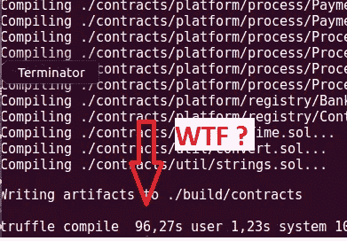

# “块菌编译”太慢了——solc 快多了

> 原文：<https://medium.com/coinmonks/truffle-compile-so-slow-solc-is-much-faster-2acfb7004bbe?source=collection_archive---------5----------------------->



Truffle compile speed

当我们使用 [truffle framework](http://truffleframework.com/) 并用“truffle compile”命令编译以太坊 solidity 智能合约时，实际上我们使用的是 solidity 编译器的 [javascript 版本](https://github.com/ethereum/solc-js)。但是 solidity 编译器运行非常慢，例如编译 20。sol 文件大约需要 2 分钟。

简单的解决方案是使用 [solc 二进制包](http://solidity.readthedocs.io/en/develop/installing-solidity.html#binary-packages)，这样工作起来要快得多。您可以通过命令安装此软件包:

```
sudo add-apt-repository ppa:ethereum/ethereum
sudo apt-get update
sudo apt-get install solc
```

但是接下来，我们必须将编译后的 EVM 字节码转储到 truffle 构建文件中，该文件位于 build/contract 文件夹中。我们可以通过简单的 [javascript 脚本](https://gist.github.com/vitiko/4a5e1a9b92b4c669c0e35538e77e9d99)来做到这一点:

现在编译同样的文件只需要 10 秒钟(相比之下使用 javascript solidity 编译器需要 96 秒钟)

[https://github.com/vitiko/truffle-fast-compile](https://github.com/vitiko/truffle-fast-compile)—通过 solc 二进制包编译可靠性合同的命令行实用程序