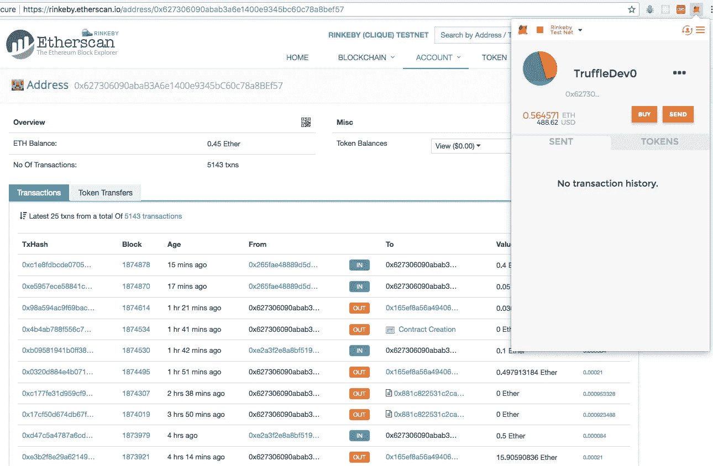
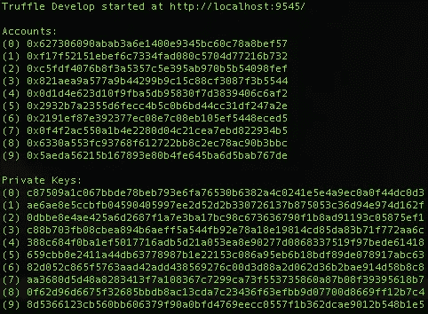
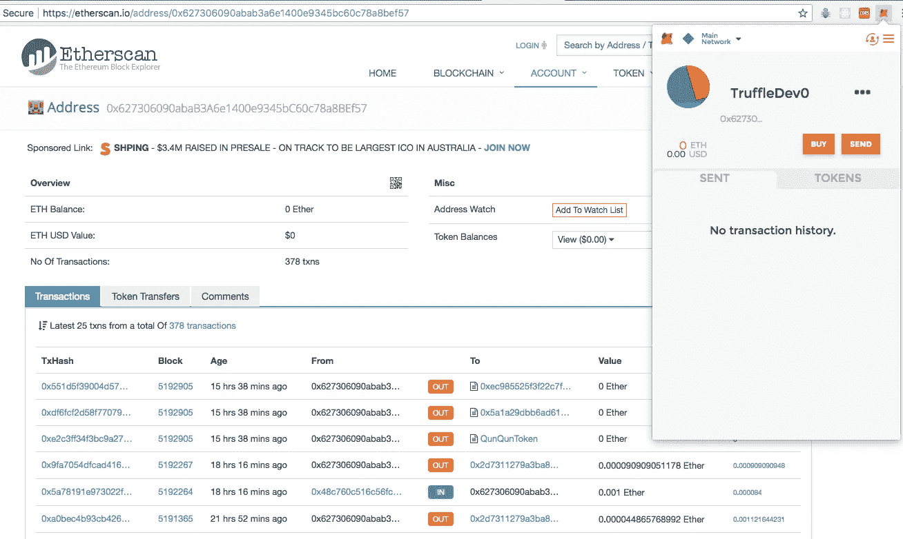
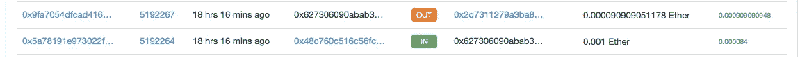

# Truffle TestRPC 帐户会让粗心的开发人员付出现实世界的代价

> 原文：<https://medium.com/coinmonks/truffle-testrpc-accounts-can-cost-unwarry-developers-real-world-ether-c314c9bc970a?source=collection_archive---------2----------------------->

DApp 开发人员在开发与其智能合约交互的用户界面时，通常会将帐户密钥从 Truffle TestRPC 导入 MetaMask。在使用 testRPC 或测试 EVM 进行开发时，这是模拟用户体验和工作流的一个很好的方法。不幸的是，这也是丢失真实世界 ETH 的快速有效的方法。

当我的团队正在将一个支持 web3 的 React 组件转换成一个 wordpress 插件时，我的一个队友，为了保护无辜，我们姑且称他为 [Brian](http://brian@web3devs.com) ，开始抓狂了，因为 Etherscan.io 显示了他的 Rinkeby 账户上发生的一大堆交易。原来他在看[0x 627306090 abab 3 a6 e 1400 e 9345 BC 60 c 78 A8 bef 57](https://rinkeby.etherscan.io/address/0x627306090abab3a6e1400e9345bc60c78a8bef57)的交易历史。如果这个地址看起来很熟悉，那是因为当你运行 Truffle Develop 时它是 Accounts(0)。

我们从来没有想到过相同的私钥会在每个网络上创建相同的地址。在实践中，我们会将正在处理的地址的私钥导入到元掩码中，并为其指定一个名称，如 TruffleDev0 或 MewRinkeby0。然后，当我们通过测试网络将提供商从本地主机切换到 Rinkeby 时，我们也会切换地址。这是我们中的一个人第一次忘记在 MetaMask 中切换帐户以反映 web3 provider 的变化。

> [在您的收件箱中直接获得最佳软件交易](https://coincodecap.com/?utm_source=coinmonks)

以下是 Brian 写的描述他如何发现漏洞的笔记:

> 我们发现了
> 1 漏洞。运行块菌开发
> 2。使用 truffle dev 种子短语或私钥导入元掩码
> 3。然后使用相同的元掩码帐户连接到本地以外的网络
> 这样做的目的:
> 在我连接到的每个网络上创建相同的钱包(使用相同的私钥)
> 我们如何发现:
> 元掩码不显示其他人的交易
> 当我们访问以太扫描时，注意到一堆我们没有启动的交易
> 漏洞:
> 每个运行 truffle dev 的人都知道那些私钥
> 所以，当我连接到 live net 时，其他所有以太坊开发者都知道

意识到松露私钥在 Rinkeby 上有效后，我们将提供商切换到主以太坊网络，并点击了以太扫描上的“[查看账户”按钮。原来自从松露 4.0 部署以来，Accounts(0)在主网上一直很活跃。在撰写本文时，通过一个完全开放的地址已经进行了 378 笔交易，价值约为 1 万美元。](https://etherscan.io/address/0x627306090abab3a6e1400e9345bc60c78a8bef57)

我们回顾了所有 10 个 Truffle TestRPC 地址的历史，发现它们目前正被一些 GETH 脚本利用，这些脚本重定向所有到达这些地址的 ETH。经过不断发现，我们在几个流行的 web3 应用程序中发现了以下漏洞:

*   通过在本地存储事务随机数，元掩码可以返回给定地址不完整的事务历史。此外，由于估计了 nonce，在部署契约时可能会产生冲突。
*   比特币基地允许通过这个账户购买 ETH。在我们的测试中，我们从 Accounts(0)购买了 0.001 ETH，交易执行时没有任何错误处理。三个街区后，另一个演员把一部分 ETH 寄到了另一个地址。那个[目标地址](https://etherscan.io/address/0x2d7311279a3ba818db2ad84eed09324a2577188a)在过去的 33 天里从账户(0)和账户(1)收集了超过 500 美元。

*   Etherscan 没有以任何方式标记这些地址，也没有相关公民在 Disqus 评论区为这些帐户留下任何评论。
*   Poloniex 合约在某一点上存放了 0.9 ETH，这表明他们的接口并不禁止他们的用户向这些帐户提款。
*   与合法 ico 相关联的各种帐户在其售前和代币销售期间向这些帐户汇款。

我的公司 [Web3Devs](https://web3devs.com/) 目前正在向上面确定的团队提出这个问题，以便他们可以标记这些帐户以保护他们的客户。但与此同时，我们想提供一些提示，以帮助其他开发人员在使用这些帐户时保持安全。

*   在 MetaMask 中命名您的帐户，以便您可以轻松地看到每个帐户应该活跃在哪个网络上。
*   不要在测试 EVM 上使用 testRPC 地址，因为在这些地址上有成千上万的其他事务，这会使测试出现不必要的错误。
*   不要在开发环境中存储的地址存储您的储蓄或接受实际付款。
*   在您的开发环境中，将生产部署所需的资金保持在绝对最低水平。

Truffle 4.0 帮了我们一个大忙，它从一个 Truffle TestRPC 实例到下一个实例都保持了相同的帐户和种子短语。但是这种便利是有代价的。让我们都确保我们的团队遵守最佳实践，并保持不同网络之间的地址分离。

此外，我们在发现过程中发现了[这份合同](https://etherscan.io/address/0xce853db3359326db6d03981c9fb42983bbcdd007#code)，如果你需要一个好的笑话，请阅读评论。