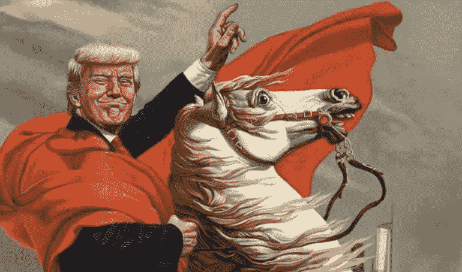
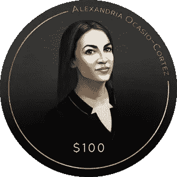
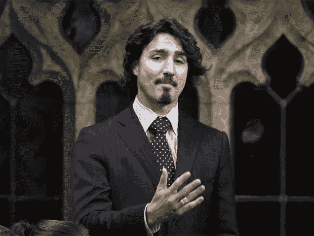

# 选举 2020 将在区块链上

> 原文：<https://medium.com/coinmonks/trump-rides-the-blockchain-use-case-a-f5d0fb469583?source=collection_archive---------4----------------------->

最初的标题应该是类似于*“区块链如何帮助竞选融资。”*然后我将展示两个具体的用例，但是这有多无聊呢？所以我加了点香料。享受吧。

yPresident Trump straddles a shocked blockchain back into the Whitehouse (circa 2020)

我想象下面的场景。川普总统没有像往常一样四处为他 2020 年的连任竞选筹款，而是决定聘请区块链协助这一努力。

为什么这很重要？嗯，竞选资金与竞选胜利高度相关([详情在此](https://www.theatlantic.com/politics/archive/2013/11/does-more-campaign-money-actually-buy-more-votes-investigation/355154/))。当然，这不是赢得选举的唯一因素，特朗普总统在 2016 年就证明了这一点。然而，特朗普竞选团队坚持 2016 年以来的相同战略，并假设挑战者没有机会重新调整，这也是愚蠢的。

我们可以同意，一场警惕的运动——坚持不懈的努力和灵活的战略——是最好的。区块链只是作为竞选战场上的一种新武器出现。问题是谁将首先使用这样的工具？谁将骑区块链？

> “抓住机会，机会就会成倍增加”——孙子

President Obama straddles a compliant corgi, assisted by a flying cat (circa 2008)

# **用例 A——直接捐赠**

## 向活动捐款

这是一个相当简单的用例。想象一下，你不使用现金或信用卡进行捐赠，而是简单地将*乙醚*或*比特币*转移到一个竞选钱包中。

这样做的好处是什么？直接的好处适用于公共区块链的所有用途:**透明**和**审计**。这有助于通过消除资金不足来降低活动成本。

现在，在任何人批评区块链也向不道德的来源(例如俄罗斯人)敞开大门之前，可能有必要重申一下，公开的区块链是可审计的。这意味着所有交易对公众都是可见的。如果一个竞选财务人员决定使用来自某个神秘来源的捐款，这将会敲响警钟。

同样重要的是要记住，竞选融资中*加密货币的监管格局*至今仍不正常:

> 早在 2014 年，联邦选举委员会(FEC)就发布了一份受欢迎的加密货币建议，但这一观点有点过时。目前，国家伦理机构已经通过了各种奇怪的裁决。结果是遍布 50 个州的矛盾拼凑而成(详情见)。

当前的监管混乱并不能保证这种局面在未来几年保持不变。在众多事件的推动下，政府可能会迅速采取行动。

例如，另一轮秘密牛市可能会刺激大批政客采取行动。同样，加密货币的广泛采用可能会给州政府和联邦政府造成足够大的压力，迫使它们简单地默许大众——想想*优步与监管者*。我们都知道最后谁赢了([详情在此](https://www.inc.com/justin-bariso/why-does-uber-keep-breaking-the-law-because-theyre-disrupting-of-course.html))。

## 接受捐赠徽章

竞选捐款不一定要以收据结束。贡献者可以获得各种徽章作为他们捐赠的交换。

例如，超过特定金额的捐赠可以触发向捐赠钱包发放徽章。因此，向 [*亚历山大·奥卡西奥-科尔特斯竞选*](https://ocasio2018.com/) 捐款 100 美元的人可能会收到一个看起来像这样的徽章:

然后，活动组织者可以将这个特殊令牌的所有持有者放在一个专用列表中。该名单中的成员可以获得各种活动的特殊权限:*独家晚宴、特色晚会、签名售书、优先访问、一对一会议等。*

这样做，徽章将获得基于实际价值的价格，而不仅仅是稀缺价值(*即*)。[隐猫](https://www.cryptokitties.co/)。由于徽章生活在区块链，它可以很容易地作为不可替代的令牌(*例如* ERC-721)在许多交易所进行交易: [OpenSea](https://opensea.io/) 、 [RareBits](https://rarebits.io/) 、*等。*

## 这一切意味着什么

捐款不需要令人厌烦，也不需要被浪费掉——如果候选人落选的话。区块链为竞选资金提供了三个好处:

1.  *易于访问的审计(透明)*
2.  *降低活动成本(消除资金效率低下)*
3.  竞选活动、候选人、支持者、投机者等的新价值。

着眼于最后一点，让我们想象一下这个价值是如何分配给所有参与者的。

**战役**

是的，这项运动确实立即从捐赠中受益。然而，徽章是进一步参与的*点。徽章的拥有者自然会受到激励来宣传这场运动，并有可能宣传新政权。*

**候选人**

哪里有赢家，哪里就有输家——至少在政治上是这样。然而，失败者不一定要“失败”徽章可以继续作为早期的“支持证明”由于它永久存在，候选人可以在未来的公共和私人企业中利用忠诚的一群人。

**支持者**

竞选支持者不再需要担心他们的贡献始于捐赠，也止于捐赠。新铸造的徽章可用于独家访问活动。不再是支持者？出售或交易你的徽章。

**投机者**

世界上有很多愤世嫉俗的人，在政治上也不乏其人。内特·西尔弗可能看不出两个候选人之间有什么不同，但他认为，仅仅是可能，其中一个很有可能获胜。候选人的头发本身就值得投票！为什么不投资(捐赠)他的竞选活动，并获得丰厚的回报(徽章)？

Prime Minster of Canada, Justin Trudeau, and his gorgeous hair.

# 接触

一小群朋友正在努力将这个想法从理论转化为实践。如果你有兴趣与我们交流——听到更多或其他——请给我们发短信到[**www.projectatlas.co**](http://www.projectatlas.co)或发电子邮件到**isaac@projectatlas.co**给我。

**接下来…**

*用例 B，营销活动资金中的令牌绑定曲线。*

> [直接在您的收件箱中获得最佳软件交易](https://coincodecap.com/?utm_source=coinmonks)

