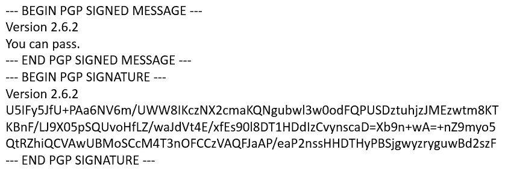
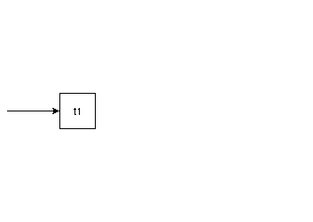
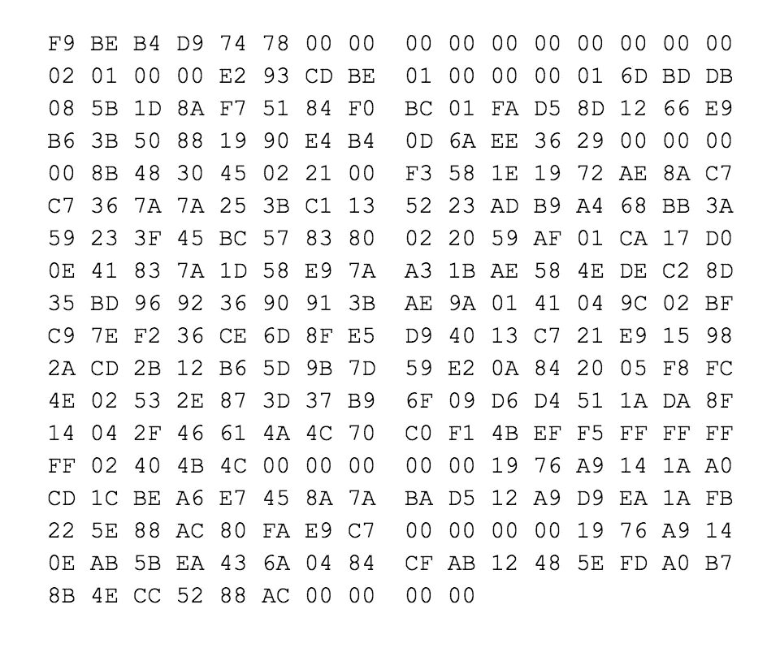
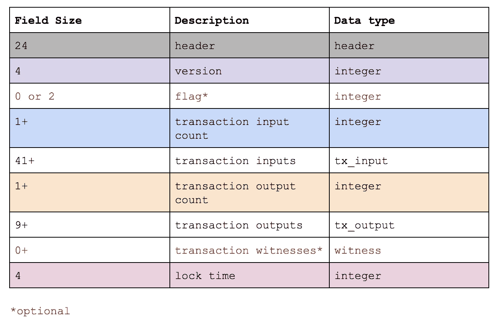
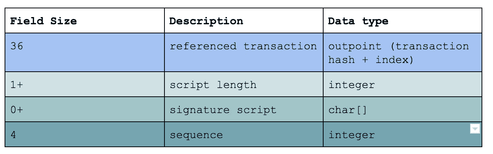
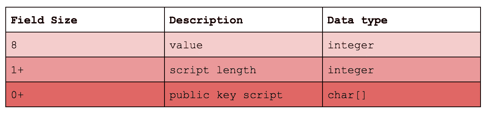
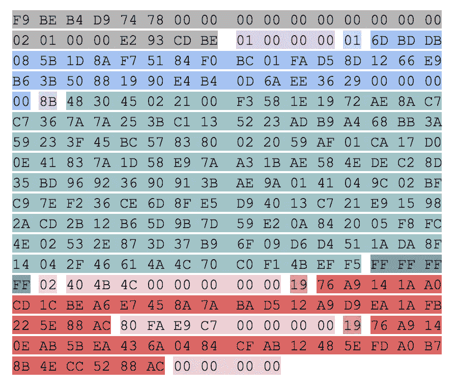

# 比特币的信任模型——第一部分

> 原文：<https://medium.com/coinmonks/trust-model-of-bitcoin-part-i-34aacf47d444?source=collection_archive---------2----------------------->

比特币是一种去中心化的数字货币形式，它基于一个信任系统，该系统由密码难题(如椭圆曲线的各种属性)支撑。不要过多地钻研它的数学方面，让我们看看比特币信任系统是如何构建的。要正确理解这篇文章中的关键思想，并不需要深厚的密码学知识。但是，您应该对私钥和公钥有基本的了解。

## “我在哪里签字？”

每次你想授权付款时，都会要求你进行某种验证。验证的目的是，一旦您以您的名义授权了一项交易，就不可撤销。当然，在某些情况下，您可能希望添加一个条款，规定如果不满足某些条件，付款必须向另一个方向进行(托管)。但是，一旦交易获得签字授权，它就是板上钉钉的了。唯一的问题是:你能完全肯定地证实它确实是由它应该代表的人授权的吗？随着安全漏洞被发现，这种验证机制不断发展。使用某人的签名来识别其身份的问题不仅仅局限于支付。这是一个古老的问题。曾经有一段时间，昂贵的徽章被用来密封信件，以证明这封信确实来自某个权威机构。

Sealed letters and application

封信的做法已经被 PGP 钥匙取代。PGP 密钥很有趣，因为在某些方面，它们与比特币密钥非常相似。让我们先看一下 PGP，然后看看比特币是如何建立在这个基础上的。

Sample PGP signed message

有两种方式可以使用 PGP 密钥:

1.用于加密和解密电子邮件。如果有人拦截，他们无法破译电子邮件中写了什么。
2。用于签署消息。如果有人截获，他们能够验证消息的真实性。

PGP signing flow diagram

我们对后者更感兴趣。

PGP 有效地替代了密封装置。该过程工作如下。首先，您必须生成一个公钥-私钥对。现在你写你的电子邮件。完成后，你拿着你的私人钥匙和电子邮件，运行 PGP 签名程序，签名就出来了。这个签名只能由持有私钥的人产生。一个人怎么能确定呢？好吧，你拿着信息和签名，运行一个 PGP 验证程序，提供发送者的公钥。这个程序会告诉你这封邮件是否真的是他声称的那个人写的。唯一需要回答的问题是:如何获得公钥？这是一个有趣的问题，因为加密技术没有为你提供任何机制。这完全掌握在用户手中。通常，在 PGP 的情况下，用户将他们的公钥上传到某个中央服务器，这样任何人都可以获取它。

比特币使用非常类似的公钥加密过程。然而，比特币程序允许你签署交易，而不是签署信息。

## 比特币交易是如何签约的？

所以现在你已经了解了 PGP 加密的工作原理，你可以开始考虑比特币签名了。然而这有点棘手。天真的想法是，当你创建一个交易提议，从你的账户中扣除 X 数量的比特币，并将它们转移到 Y，你会简单地签署这个提议。但这有一个问题。如果你只是创建交易，声明你想转移你的资产，那么谁来证明你确实有钱呢？这将需要一些中央权力机构进行核查。比特币不是这样设计的。权力最终掌握在用户手中。比特币提出了一个绝妙的解决方案。想法是这样的:只有在过去的某个时间点收到了比特币，你才有可能拥有比特币。嗯…啊哈！让公钥充当身份的角色。通过这种方式，唯一可以要求交易的人是持有私钥的人。因此，比特币签名有双重目的:

*   它验证您是交易的真正创建者，并且
*   你确实拥有你将要转移的比特币。

后者是根本。我们将在其他帖子中看到这是如何构成钱包(或账户集合)的基础的。顺便说一下，以太坊的工作方式略有不同，它引入了一个独立的账户概念。但比特币只是一个交易链。因此，对于所有权来说，你必须扫描交易链并使用它们，你必须解锁它们并在交易中使用它们。

***边注*** *:你可能会疑惑:以太坊有更好的设计，因为它允许创建账户。这真的取决于用例。设计的简单性使系统保持精简，比特币也实现了其价值储存的目的。另一方面，以太坊支持更多的用例，但代价是不那么精简和更庞大。*

每个事务都由输入和输出组成。每个输入包括一些先前的交易。并且每个输出包括资金被发送的目的地。当您签署交易时，您同时签署了输入和输出。通过签署输入，你有效地说，你是这些硬币的真正主人。通过签署输出，您同意您确实想要将这些硬币发送到指定的地址。为了保持资金流动，一个事务的每个输出都被用作另一个事务的输入。

outputs consumed as inputs

理论够了。我们来看一个真实的交易。

嘿，这是通过网络传输的实际交易。我们无法从中理解任何东西。我们该如何解读？一个词:协议。

> 协议是用于定义通过计算机网络交换数据的方法的标准

如果我们看看事务协议 rules⁴，我们可以看到事务是如何构造的。

transaction protocol

transaction input protocol

transaction output protocol

让我们根据协议分解交易。

## 页眉

包含元数据信息。例如，它告诉程序这是一个事务消息。

## 版本

允许向后兼容。如果协议用新的字段更新，旧的事务应该不会变得不可识别。

## 标志/交易见证人

这是作为隔离证人 change⁵.的一部分引入的一个字段我们改天再看。

## 参考交易

事务仅包含对正在使用的前一事务的特定输出的引用。它使用事务散列和输出索引号(从 0 开始)的组合。这里的想法是，只引用以前的事务更简单。如果需要，程序可以使用它的散列来获取完整的事务。通过使用索引号，它知道哪个输出将被用作输入。

为了计算事务散列，您连接事务的完整十六进制表示，并计算该字符串 twice⁶.的 SHA256

## 顺序

过时了。参见[https://bitcoin.stackexchange.com/a/55113](https://bitcoin.stackexchange.com/a/55113)。

## 价值

正在发送的数量(satoshi)。

## 锁定时间

解锁该事务时的块号或时间戳。

## 公钥脚本(scriptPubKey)

交易的目的地。隐藏在这个脚本中的是以十六进制表示的接收者的公钥散列。要获得相应的比特币地址，只需将这个十六进制转换为 Base58。

## 签名脚本(scriptSig)

与 scriptPubKey 类似，scriptSig 包含授权事务的签名。除了签名本身的每一部分都是签名的。

既然知道了编码的规则，那就来解码一下:
有*一个事务输入*，是 hash*2936 ee 6a 0 db 4 e 4901988503 bb 6 e 966128 DD 5 fa 01 BCF 08451 f 78 a1 D5 b 08 dbbd 6*的事务的*第 0 个*索引并且有*两个输出*。其中一个是 *0.05 BTC* 发给*3 swtkzdetsfxyjqzgdwtvpqulv 64 rvktbzsthukvxxre 4 th 6 tsgxnrg*另一个是 *33.54 BTC* 发给*3 q 7 mcidryx4d 9 pefdeqckquq 2 iug 4 I 4 efb 8 buho 7 gflckepytrnwkr4h*。

你可能已经注意到，我们可以称之为公钥**脚本**和签名**脚本**，而不是简单地称之为公钥和签名。这是一个非常强大的概念，我们将在其他时间彻底探索它。但是我将留给您这样一个想法:有时您想要创建一个可编程的事务，以便它只在满足某些条件时执行。例如，如果发现你刚买的东西有问题，你可能想退货。或者你的经理想批准你做的每一笔交易。脚本允许有趣的用例，并且正在努力进一步改进脚本。

交易是比特币去中心化点对点电子现金系统的关键组成部分。公共密钥加密确保没有人可以随便拿走你创建的交易并改变它，以便比特币现在被寻址到不同于你打算发送到的目的地。它还确保除了私钥的所有者之外，没有人能够访问发给他的资金。

总结一下:交易是不可逆转的，无可争议的。要使用前一个事务的输出作为新事务的输入，您需要私钥。这允许你*签署*消息。要将资产发送到某个帐户，您需要它们的公钥。交易是比特币系统的核心特征之一。

但这并不是信任体系的全部。如果我创建一个事务，广播它，然后快速创建另一个事务并广播它，会怎么样？谁来宣布其中一个无效？一般来说，谁保证系统内的所有交易都是公平进行的。又是怎么做到的？如果比特币需要一个实体来检查一切是否公平合理，它就不会被认为是去中心化的。在这篇文章的第二部分[中，你将会看到，没有一个中心机构，仍然可以确保一切顺利进行。](https://hackernoon.com/trust-model-of-bitcoin-part-ii-bfcfa15b8f09)

## 脚注

[1]最新的是[交易延展性](https://en.bitcoin.it/wiki/Transaction_malleability)
【2】PGP 常见问题:[公钥服务器](http://www.faqs.org/faqs/pgp-faq/part1/)
【3】[以太坊账户管理](http://www.ethdocs.org/en/latest/account-management.html)
【4】[比特币交易协议](https://en.bitcoin.it/wiki/Protocol_documentation#tx)
【5】[BIP:隔离见证](https://github.com/bitcoin/bips/blob/master/bip-0141.mediawiki)
【6】[如何计算交易哈希](https://bitcoin.stackexchange.com/questions/2859/how-are-transaction-hashes-calculated)

加密货币距离真正成为互联网货币还有很长的路要走。基础已经奠定，但前面还有许多挑战。在 twitter 上关注我以获取最新更新。