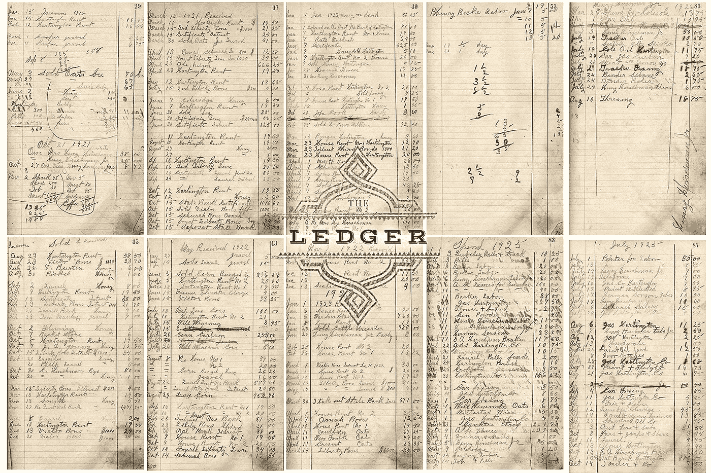
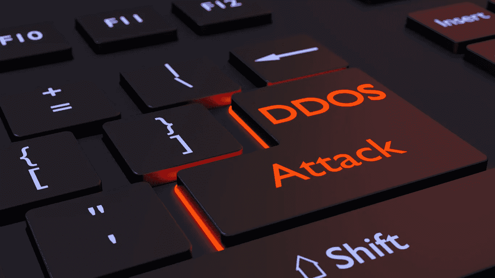
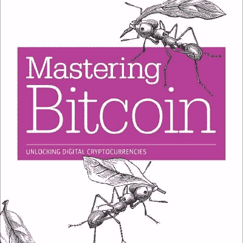

# 比特币的信任模型——第二部分

> 原文：<https://medium.com/coinmonks/trust-model-of-bitcoin-part-ii-bfcfa15b8f09?source=collection_archive---------3----------------------->

在这个由两部分组成的系列文章的第一部分中，我们探索了交易是如何被加密的，使得除了所有者之外的任何人都无法得到它们。我们简要讨论了这些事务是如何通过网络提交并广播到整个网络的。我们还讨论了接收方如何获取这些事务，并在后续事务中使用它们，从而创建一个排序，将以前事务的输出作为新事务的输入。

在创建了一个事务之后，需要把它记在某个地方，以便以后引用。这需要一个可以记录所有交易的存储模型(也称为*分类账*)。为什么我们需要以前的交易？因为为了验证一个特定的交易是正确的而不是欺诈的，你必须从**最开始**(从中本聪的账户开始)开始追踪。我建议你在这里停下来，想一想为什么需要这样做？有没有更有效的方法来处理这个问题？

这显然是一个繁琐的过程！由于每分钟都有数百万个事务发生，您不可能花费所有的计算资源来试图弄清楚事务是如何构造的。有一个简单、优雅的方法来处理这个问题。将大量事务存储在块中，并将这些块链接在一起。你不是在单个交易上盖章表示接受，而是在整个交易上盖章。通过这种方式，当检查某个交易是否确实是正确的而不是欺诈性的时，您只需获取之前引用的交易及其块，并进行验证。

这概括了比特币的存储模式。但是沟通呢？区块链有各种各样的演员，每个人都有自己的角色。一些人正在给区块链增加街区。有些只是相互传递数据块，确保所有数据块都考虑在内。一些人正在创建/传输实际的交易。有些人只是在核实这些交易。有些人只是在监视区块链上发生的活动。但是，这一切是如何在没有外部影响的情况下以一种自我持续的方式发生的。

在我们深入研究理论之前，我想介绍一下这个系统中的一些关键角色。稍后我们将进一步阐述它们的目的。这些参与者(更具体地说:*节点*)可能以某种形式重叠，但在概念上是独立的实体。

## 钱包

一个钱包(也称简单支付验证节点)有两个职责:
1。它需要扫描区块链来查看哪些交易属于他
2。它需要创建向网络广播(并最终被挖掘)的事务。

## 种子

在所有时刻，每个节点都与其他几个任意节点相连；形成对等节点的格子状结构。然而，为了发现其他节点，一个节点必须首先连接到“种子”节点，这将向它引入其他节点。

## 矿工

矿工把石块放在区块链里。他们汇集了所有未确认的交易；按采矿费用(最高的第一个)对它们进行分类，并将其添加到区块链中。这个新挖掘的块然后被广播到网络的其余部分。简单来说，矿工的工作就是把事务转换成块。

## 继电器

继电器只是监视活动。他们可以判断网络的健康状况；参与消息传递；或者查询区块链以获得其他统计数据。

在上一篇文章中，我们把讨论留在了注释上，即给定一个加密签名的事务系统，仍然有可能滥用该系统。您如何确保添加到区块链的交易没有被篡改？如果一个恶作剧的演员开始用虚假/不正确的交易/消息轰炸系统，该怎么办？如果有人几乎同时把 x BTC 寄给 A，把 x BTC 寄给 B(双重消费)会怎么样？哪个被认为是有效的？如果矿工接受两种不同的交易会怎样？节点之间如何就网络变化达成一致？用一个问题来概括:**系统是如何监管的？**

在一个加密的、安全的、无信任的网络中，这些都是难题——从某种意义上说，任何一方都不能危及生态系统。所有节点必须符合网络规则，并且在有分歧的情况下，一组节点可以拍摄当前区块链的快照；适用他们自己的法规；永远分叉。这发生在 2017 年年中比特币现金分叉期间。

比特币拟议解决方案中的一个关键概念是形成明确定义的区块排序。如果您已经订购了块，这是所有对等体一致同意的，那么同一事务不可能在区块链中出现不止一次。一种简单的方法是简单地向块(1，2，3 …)添加索引。稍微好一点的方法是添加时间戳而不是数字，因为时间戳还提供了关于块创建时间的附加信息，每个块可以引用前一个时间戳(假设每个时间戳都是唯一的)。在我们的系统中仍然有一个突出的问题。你能看出那可能是什么吗？

任何人都可以在任何时候创建一个块，并可以用几十个块向网络发送垃圾邮件。这将阻塞网络，比特币将完全无法使用。比特币白皮书中提出的解决方案如下:当在区块链上添加一个区块时，矿工被要求破解一个密码难题，并将结果散列添加到该区块上。这个谜题的设计方式使得验证它是否被正确解答很容易，但是如果事先不知道答案就很难解答。此外，比特币网络还可以定期调整谜题。例如，2019 年初，采矿的难度比 2 年前大约高了 1800%。这样做是为了抵消采矿机器不断上升的杂凑力量，维持 system⁴.的平衡当然，如果矿商没有开采交易的动机，所有这些工作都将毫无意义。这就是为什么所有的交易都要收取费用——费用归矿商所有。在 2140 年之前，矿工们还会收集一些 BTC 作为继续采矿的额外奖励。作为这种额外工作的结果而产生的散列也用于排序；而不是依赖时间戳。然而，我们仍然在块上使用时间戳，因为它们为我们提供了有价值的信息。

到目前为止，我们已经有了一个由看起来非常坚固的事务组成的*时间戳*、*垃圾邮件防护*、*链接在一起的* *块。让我们进一步测试一下。一个矿工有可能恶意行为吗？例如，他能在一个块中引入一个从未被任何人请求的事务吗？两个不同的块包含一组由两个不同的挖掘者几乎同时产生的相同事务，会怎么样呢？*

这是两个独立的问题，但值得探讨。为了解决第一个问题，我们需要介绍比特币区块链是如何巧妙地利用哈希的。哈希是固定大小的数据，用于确保某些输入的完整性。首先，我们计算块中所有事务的哈希值。之后，我们使用一种称为 Merkle-root 构造的技术来计算根 hash⁵.这个散列可以被认为是:所有散列的散列。简单地说，根哈希保证了块中所有事务的完整性。挖掘器或中继器不可能引入不属于原始块的事务，因为这会破坏整个块的散列。太好了，那么同时生产多个块呢？

这有点复杂，因为比特币论文没有提供具体的答案。相反，这是一场碰运气的游戏。不幸的是，有人必须输掉这场战斗。让我们画一幅画。假设中国的矿工 X 和美国的矿工 Y 都在他们的块中包含事务 T。x 产生块 B1，得到的区块链是[…A → B1]，而对于 Y，区块链看起来像[…A → B2]。这两个块被进一步广播和中继，直到最终 74%的节点知道区块链[…A → B1]，而 18%的节点知道区块链为[…A → B2]。这两个区块链似乎都有效，尽管相互矛盾。现在，德国的一个矿工 Y，他把区块链看成[…A → B1]，生产了另一个块 C 并广播出去。他的范围是 94%的节点。所有以前与区块链[…A → B2]打交道的矿工，现在看到这个新的区块链[…A → B1 → C]将决定放弃以前的链条，用最新的版本代替。如果他们不这样做，而是继续用旧的链开采，他们可能会失去他们开采的区块给大多数人。最终，*区块链最流行的版本被认为是标准的*。这就是为什么，一般来说，建议在接受交易之前等待 6 个街区，因为区块链可能会发生变化。作为一名矿工，您希望能够访问尽可能多的节点，否则您的所有努力都有可能付诸东流。另一方面，采矿权的统一给比特币网络的去中心化带来了风险。如果一群矿工获得了 51%的哈希能力，他们就能有效地衍生出他们喜欢的区块链。这是对比特币区块链的实际威胁，目前没有适当的保障措施来确保这种情况不会在未来发生。反对的理由是，这是极不可能的，而且对整个 participates⁶.都不利

垃圾邮件防护(工作证明)与区块链分支和最终整合相结合，意味着我们应该在事务被广播后等待一段时间，然后才能有足够的信心说它已经在区块链网络中持续存在。通常，开采一个新区块需要 10 分钟。如果我们等待 6 个街区，我们的交易将在分类帐中埋得足够深，我们可以很有把握地说交易已经完成。但是没有人喜欢为他/她的咖啡等一个小时。而这就是比特币的瓶颈。这项技术不能适应日常使用，但引领了互联网货币的发展方向。请记住，比特币本身是创造虚拟货币的各种尝试的高潮。因此，在我看来，说技术已经达到顶峰是不正确的。有许多改进建议。下一个版本的加密货币可能会处理当前系统面临的问题(如波动性和交易速度)，同时利用比特币(等人)带来的概念。

# 脚注

[1] [比特币现金叉的历史](https://en.wikipedia.org/wiki/Bitcoin_Cash#History)
【2】[Hashcash 限制垃圾攻击](https://en.wikipedia.org/wiki/Hashcash)
【3】[比特币难度图](https://data.bitcoinity.org/bitcoin/difficulty/2y?t=l)
【4】[工作证明](https://en.bitcoin.it/wiki/Proof_of_work)
【5】[Merkle 树构造](https://en.wikipedia.org/wiki/Merkle_tree)
【6】[51%攻击](https://en.bitcoin.it/wiki/Majority_attack)

*这是一本关于比特币的快速入门书。如果你想了解更多，可以看看安德烈亚斯·安托诺普洛斯的书* [*:掌握比特币*](https://www.amazon.com/Mastering-Bitcoin-Unlocking-Digital-Cryptocurrencies/dp/1449374042) *。它广泛涵盖了比特币的各个方面。一些值得探讨的主题是高级脚本；分层确定性钱包；采矿池；诸如此类。*

加密货币距离真正成为互联网货币还有很长的路要走。基础已经奠定，但前面还有许多挑战。在 twitter 上关注我以获取最新更新。

> [直接在您的收件箱中获得最佳软件交易](https://coincodecap.com/?utm_source=coinmonks)

