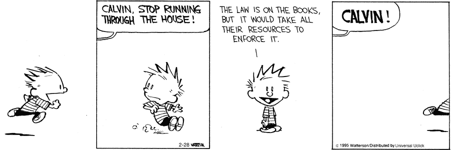

# 信任:可信第三方(TTP)、人性和利益冲突

> 原文：<https://medium.com/coinmonks/trust-trusted-third-parties-ttps-human-nature-conflicts-of-interest-f5fbeab616dc?source=collection_archive---------0----------------------->

[The infamous auctioning of Lehman Brothers sign](https://www.businessinsider.com/lehman-collapse-five-years-later-2013-9/?IR=T)

周末看了很多奇怪的东西，我不禁回忆起小时候骑自行车穿越美国郊区的刺激。除了挨家挨户敲门，整个城镇就像一个游乐场，我们可以在那里自由漫步，因为每个人都互相认识。这些都是如此美好的回忆，除了我出生并成长在马来西亚的一个城市，在那里骑自行车不仅意味着勇敢面对遥远的距离和不太友好的流浪狗，还意味着在陌生人的海洋中迷路，而谷歌地图还需要几年时间。我的社交焦虑告诉我，如果后者发生，我会像死了一样。

严肃地说，对这类社区的所有描述都隐含着这样一个意思:对社区的信任不仅基于声誉，还基于较小社区的简单性。如果我想做任何事情，无论是买东西，甚至只是去散步，我都必须面对那些很快就会变得熟悉的面孔。任何个人进行欺诈的机会都被大大降低，因为除非他离开自己并留下所有财产，否则这个人将被贴上终身被驱逐者的标签。在这种情况下，没有一个明确的系统，TTP 的作用是由社区本身通过一个声誉系统有效地执行。

对于我们许多在城市中长大的人来说，情况显然不是这样。在城市中，随着人口的增长，认出熟悉面孔的机会不成比例地减少了。随着人口的增长，不仅仅是人群中陌生人和可识别面孔的比例增加，更重要的是，我们的大脑无法跟上面孔的过载。即使我们可以，当谈到了解这些面孔背后的故事时，时间将是一个限制因素。因此，我们倾向于避开人群，只呆在自己的社交圈里。因此，“迷失在人群中”的能力为恶意行为者提供了理想的操作环境。如果没有办法追究这些行为者的责任，城市将不复存在。这就是 TTP 的作用变得不可或缺的地方，因为通过跟踪一些机构(政府、银行、企业)而不是超载的个人信息，个人被保证了他们的个人权利和财产。

值得注意的是，尽管声誉与信任密切相关，但在讨论可信技术时，正是这些细微的差异造成了天壤之别。网络越大，这些差异就越明显，因为对个人的信任越来越被对无定形系统的信任所取代。Olnes 的这篇论文很好的区分了这两种类型的信任以及一般的信任系统。它们如下:

*   技术信任是指个人确信系统按预期工作(可靠性)，免受攻击(安全性)，并保护用户利益(安全性)
*   组织信任是建立在系统的其他参与者/用户的诚实意图和合作意愿之上的信任

换句话说，这是对非个人的客观系统的信任和不可预测的主观行为者之间的区别。因此，根据定义，诚实的意图在完全不可信的系统中没有位置。

**为什么 TTPs 能够正常工作**

从今天大多数人的角度来看，TTPs 使生活变得更容易，因为它有效地将声誉信任从个人转移到组织。这就是为什么像德勤、EY、毕马威和普华永道这样的术语听起来耳熟能详，因为这些都是这些实体的名称，而这些实体的运作仍然不为大多数人所知。从本质上讲，我们不需要知道是谁或如何做到的，而是要知道这些组织的产出是有效的，无论是四大还是任何其他公司。重要的区别在于，这些产出现在是由一个实际上有自己一套规则和系统的黑箱产生的。实际上，TTP 为另一方担保的保证使我们能够建立间接信任。

这种贸易点的存在本质上并不是一件坏事，但当转移到替代品的摩擦成本太高时，或者即使一开始就有替代品，问题也会出现。这在一定程度上可以在审计行业看到，因为许多跨国公司会要求此类报告以四大之一的标志开头(在许多情况下是法律规定的),否则会有被怀疑的风险。声誉是审计公司的生命线，没有人会比这些公司自己更努力地确保它们的主要资产不贬值。

然而，这里存在潜在的利益冲突，因为一个由几个大玩家组成的行业想要保护他们的主要玩家，以免降低对整个系统本身的信任。这篇[评论](https://www.channelnewsasia.com/news/commentary/who-audits-the-big-four-auditing-firms-10283118)很好地总结了为什么审计行业不应该放任自流以确保独立审计。只要公司里有几个害群之马就能毁掉它的声誉，接下来只有两个选择:

*   罚款并揭露那些实际上代表这个行业的坏演员。在这个过程中，对行业本身的信任受到了严重打击。即使选择了这条路，减少寡头垄断企业的数量也可能会导致更严重的后果。
*   内部处理此事或推动秘密解决。在这种情况下，业外的任何人都不知道，业务照常进行。

从建立在信任基础上的寡头垄断的角度来看，不需要学位就能看出哪个选项更有吸引力。这里的问题是，即使行业本身对他们的业务是真实的，考虑到行业的自我参照性质(审计公司毕竟会相互审计)，我们也无从得知。一如既往，这个问题不是非黑即白，而是多重灰色阴影。不过，有一点是清楚的，那就是任何行业都不应该仅仅基于信誉信任或诚实意图来运作。这就是分散技术将发挥重要作用的地方，通过引入技术信任来检查人类更自然倾向的信誉信任。

**神秘的信任之谷**

[Something just feels “off”](https://www.strangerdimensions.com/2013/11/25/10-creepy-examples-uncanny-valley/)

对于那些熟悉恐怖谷现象的人来说，随着人形机器人的兴起，这一理论开始受到更多关注。当一个非人类的物体非常接近真实的人类，但没有完全欺骗人类大脑时，就会产生不适的感觉。同样，我相信随着去中心化技术的兴起，可信系统将会面临这种不适的感觉，去中心化技术正开始经历经过验证的用例，但还没有完全实现。

对于我们许多区块链爱好者来说，采用这种技术更容易，因为腐败机构的强大推动力，以及在较小程度上，对这种技术的影响的相对知情的信念的拉力。然而，对于世界上绝大多数人来说，从声誉信任到技术信任的跳跃将是一个困难的过程，因为目前的 TTP 已经做了足够的工作来润滑日常生活的齿轮。考虑到这一举措将意味着如果出现任何问题，没有一方对连锁经营负责，情况就更是如此。这种抽象技术要求其用户将控制权交给一个无定形的、没有面孔的黑盒实体，而这恰恰是人类最讨厌的两件事:对未知的恐惧和失去控制。

这种范式转变是人类历史上前所未有的，考虑到某些人群仍然不信任他们的计算机，人类对这种抽象变化的抵制将更加难以克服。与所有新的创新一样，主流采用将取决于早期采用者向技术不太倾向的人推荐成熟的产品，根据定义，技术不倾向的人总是占大多数。这意味着，在完全去中心化的技术被主流采用之前，技术本身需要有一个强大的社区基础，其声誉能够克服大多数人对变化的恐惧。正如上面所暗示的，最有可能发生的方式是通过目前的 TTP，因为他们有着超高的声誉。

**“信任需要多年来建立，几秒钟来打破，永远来修复”**

值得注意的是，信任本身并不能保证未来的行为。上面这句话经受住了时间的考验是有原因的。这句话的一个较少被考虑的含义是，如果恶意方一开始就不打算修复这种信任，会发生什么。这就是当前 TTP 基础设施的问题所在，因为它依赖于“先信任，后验证”的观点，而从逻辑上讲，信任应该仅在事件完成后建立。

这是区块链技术优于当前基础设施的一大优势，因为不同的共识协议使各方能够在无需任何一方信任另一方的情况下开展业务，无论是直接信任还是通过 TTP 间接信任。实现这一点的机制是另一回事，但这种架构的可能性确实提出了一个更重要的问题，即在哪些用例中，技术信任的好处大于声誉/组织信任的好处。

根据理性理论，只要恶意行为者有可能滥用提供给他们的信任来谋取私利，就应该实施这种技术。然而，如上所述，这种方法存在一些问题:

*   **对未知的恐惧:**声誉信任是主流采用的一个要求，因为大多数人不会也不应该理解这种系统的内部运作；
*   **利益冲突:**除了对行业造成严重破坏的背信弃义之外，那些名声过大的人的利益与分散技术承诺的好处直接冲突；
*   **抽象的好处:**分散化的技术不一定要比集中化的技术更好。问题是，这种技术的实际好处往往更抽象，而当涉及到关键的可量化指标如每秒交易量和确认时间时，集中式技术在理论上总是优于这种技术；
*   **人类易犯错误:**区块链本质上是人类编写的一组指令，因此也将继承我们的不完美。尽管软件正在迅速蚕食世界，但分散化的区块链技术处理的是金融和知识问题，这两样东西一旦被破坏就会产生严重后果。因此，即使是完美的分散技术代码也需要时间来建立自己的防弹能力。
*   **法规的实施:**最终，即使这些技术成为“唯一的真理来源”，它本质上仍然是个人在现实世界中可以选择遵循或忽略的数字记录。在代码能够通过现实世界的接口(比如机器人和物联网)自我执行之前，代码的执行仍然依赖于 TTP。

The always knowledgeable Calvin

值得注意的是，尽管信任是一种由声誉和/或经验决定的主观衡量标准，但责任在很大程度上可以通过事件记录来解决。在确定分布式账本技术的实际优势时，这导致了一个重要的观察结果:

> 简而言之，如果我们信任一方，它可以简单地维护一个包含其所有记录的数据库，并根据请求报告它们，而不需要全球和分布式的分类账。对该公司来说，额外的好处是它可以进一步控制对其数据的访问，这在参与全球分布式系统时是很难实现的。— [ABB 公司研究部](https://arxiv.org/pdf/1806.10929.pdf)

**金发女孩的原则**

理论上，当网络扩展到一定规模时，无信任系统是许多治理问题的理想解决方案。实施的规则和协议应该为系统中的参与者的行为提供数学保证，因为他们的最大利益与系统的最大利益一致。本质上，这些技术要求我们信任确定性的数学模型和算法。这在逻辑上是合理的，但根据定义，这种模型永远无法全面模拟现实的每个方面。尽管如此，它仍然是朝着正确方向迈出的一步，因为它为当前系统提供了一种替代方案，在当前系统中，信任过度依赖于声誉和诚实的意图。

与生活中的大多数事情一样，最佳解决方案可能介于我们今天看到的高度集中的系统和理想主义者设想的完全分散的未来之间。Goldilock 的观点将是高度具体的，但将在很大程度上取决于违反信任的潜在损害超过采用分散技术的运营成本的程度。从系统的角度来看，**潜在的利益冲突越大，推动这种技术的力量就应该越大**。

那些更有眼光的人会正确地指出，这些成本将取决于其他多种贸易点方案，其中最主要的是政府。在这一点上，我认为，即使在一个多方财团中使用私人许可的区块链技术，也将在解决系统性腐败方面发挥很大作用，因为只要把网撒得稍微宽一点(n>2)，就能显著降低流氓行为者的机会。这不仅会大大提高系统的安全性和效率，而且更重要的是，会提高对整个系统本身的信任。

对于某些用例，如价值存储和个人数据所有权，公共区块链技术似乎是正确的前进方向，因为它提供了关于自决的保证。然而，如上所述，通向完全去中心化系统的道路将首先由采用这种技术的 TTP 来铺设，这是因为 TTP 具有超大的声誉以及人类对声誉信任的自然倾向。零知识证明、可信执行环境和代码混淆等新技术的发展将令人兴奋，因为它开辟了可以进一步最小化利益冲突的替代模式。这是我们最终应该努力的目标，因为这是让我们的系统更能抵御腐败/欺诈的原因。

谢谢你坚持到最后。希望听到你的想法/评论，所以请留言。我在 twitter 上很活跃[*@*AwKaiShin](https://twitter.com/awkaishin)*如果你想收到更多易消化的密码相关信息，或者访问我的* [*个人网站*](https://www.awkaishin.com/) *如果你想要我的服务:)*