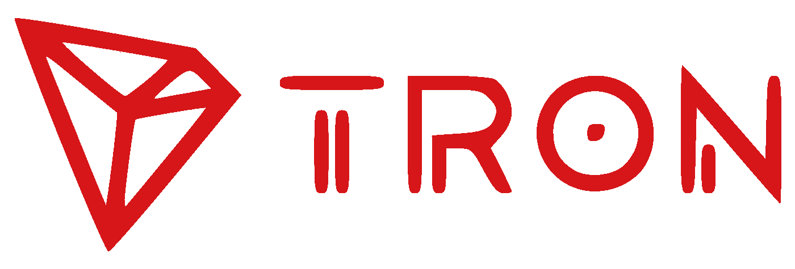
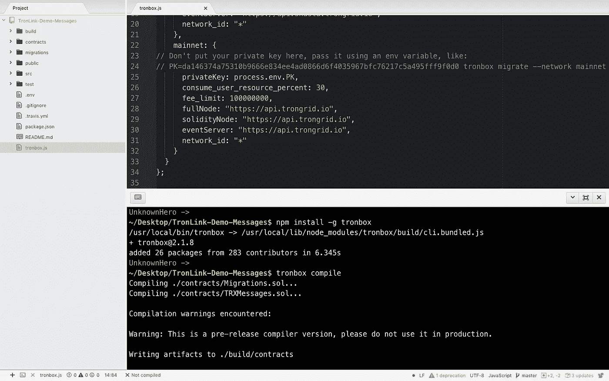
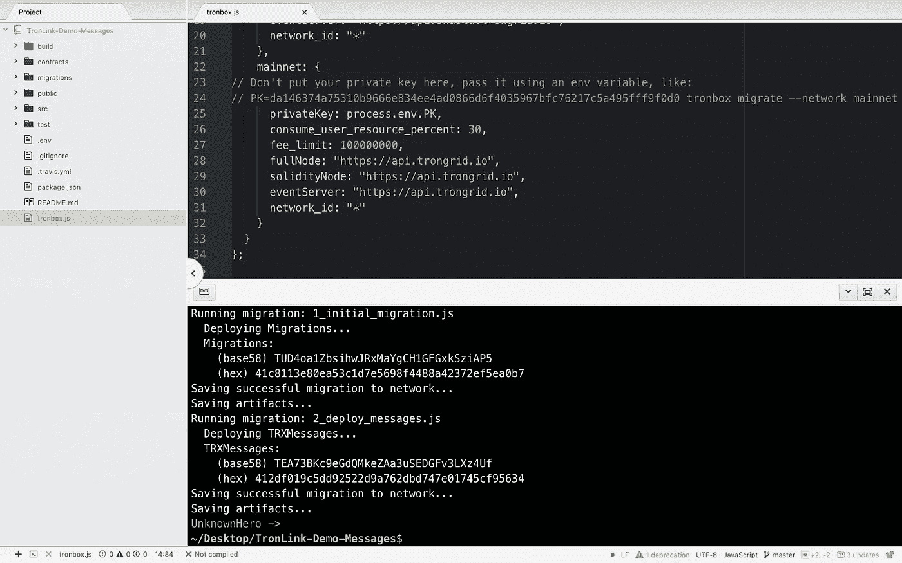

# TRX dApp 部署(如何部署 Tron 应用程序)

> 原文：<https://medium.com/coinmonks/trx-dapp-deployment-how-to-deploy-a-tron-app-e6b83608c0b?source=collection_archive---------1----------------------->

# TRX dApp 开发简介

如果有什么是我们必须注意的，那就是区块链。这种改变我们星球的力量从一开始就在不断发生。区块链技术提供的效率、安全性和高度信任，使它一旦被理解就变得显而易见。dApp 将是我们将开始看到更多的东西之一。作为开发人员，学习这项新技术是必不可少的。Tron 项目是一个旨在分散网络的项目。它已经获得了比比特币或以太坊更多的交易，在这里我试图解释如何将 dApp 部署到 Tron。

# 设置 Tron 链接帐户

你必须做的第一件事就是在这里下载这个。←就是 Tron Link。安装后，系统会要求您为您的钱包创建一个密码。是的，这是正确的，一个真正的 TRX 钱包，可以让您快速发送和接收创硬币。既然我们是来开发的，我们接下来应该从 Mainnet 切换到 Testnet(因为这是 Tron 建议我们做的)。为了从 TRX Mainet 转换到 Testnet，我们可以通过著名的 gear 图标快速完成，它会打开并向我们展示我们当前的网络。通过点击“选择节点”,我们切换到测试网。

一旦你切换到 Testnet，你需要从 Accounts 选项卡中获取你的钱包地址。在“默认帐户”的正下方，您应该会看到一串看起来很奇怪的字符。那是你的钱包地址。这是一个公共地址，你可以给人们发送创给你。(或者你可以把 TRX 作为小费送给你认为有价值的人(:事实上我的是这样的→tnamy 9 muptrweqc 8 nwomxfiklimesfd 4 qf

现在你已经找到了你的钱包地址，你可以申请免费测试 TRX 硬币。呜哇！我们离实现成为创大师的梦想又近了一步。我们可以通过点击这个令人敬畏的链接[这里](https://TronGrid.io/shasta#request)来请求 Testnet TRX。一旦你到了那里，只需添加你的钱包地址，在眨眼之间，看到你的 TRX 钱包从 0 到电力水平 10，000！

现在你有了这个真正的假 TRX 硬币，你可以进入更难的东西，比如学习开发工具。其中，我可能只是一个像你一样的新手，但我们可以一起做到这一点！一些命令行的东西要出现了，所以准备好谷歌你不理解的任何东西，否则你会迷失，一旦发生这种情况，就不好了。

# 下载 Tron 开发工具(TRX 链接演示消息)

首先，你肯定想 Git 克隆[这个精彩的演示。](https://github.com/kookiekrak/TronLink-Demo-Messages)一旦你把它克隆到你的机器上，把目录换成它。

现在，让我们…

**npm install -g tronbox**

现在，我们希望更改 tronbox.js 中的私钥，以包含位于我们最近创建的钱包中的私钥。如果您转到“帐户”选项卡，然后转到“导出”，您将会看到您的私钥。然后在 tronbox.js 文件中，您可以轻松地将该键粘贴到它所在的位置。

# 编译 Tronbox

现在，在您的命令行中运行漂亮的命令

**tronbox 编译**

这个命令将允许您*编译*我们最近下载的位于 contracts/子目录中的智能合同 TRXMessages.sol。

之后，我们可以部署我们的智能合同…

**tronbox 迁移-重置-网络沙斯塔**

确保记下部署合同的地址。它应该是 TRX 消息的 base58 地址。此外，如果您在这里遇到任何错误，您可能应该运行

**npm 安装**

话虽如此…打开 src 文件夹，转到 utils 目录并打开 index.js

通过粘贴我们部署到的复制地址来更新合同地址。

现在，我们终于可以运行我们喜欢运行的命令了…

**npm 启动**

这将打开 localhost:3000 和我们的第一个 Tron dApp！！！

# 恭喜官方创开发者！

您已经成功地将 Tron dApp 部署到 Tron Testnet 上。

现在最有趣的部分来了，发展。为此，你需要学习坚实的基础，这也是我需要学习的。如果你想马上开始，这里有免费的[隐型僵尸](https://cryptozombies.io)。在[你可以找到一些演练，我们将在](https://wewillcode.com/courses/CryptoZombiesTutorial(IntrotoSolidity))编写代码。

# dApp 的内部运作，学习可靠性

现在，安装了 Tronbox，我们可以自由地开始构建我们的 dApp 了。文件夹结构是我们将经历的最后一件事，然后你们可以自由地自己进行实验，并开始通过区块链的力量改变世界！

在我们的文件夹中，我们看到有一个合同目录，这是我们所有智能合同的存放位置。

在 migrations 文件夹中，您将找到我们的部署脚本。

我们的 react 和前端材料将放在 src 文件夹中。

这基本上就是我要让你自己去试验和疯狂的地方。希望每个人都发现这是有帮助的，如果是这样，不要忘记…

;)

→tnamy 9 muptrweqc 8 nwomxfiklimesfd 4 qf

> [直接在您的收件箱中获得最佳软件交易](https://coincodecap.com/?utm_source=coinmonks)

