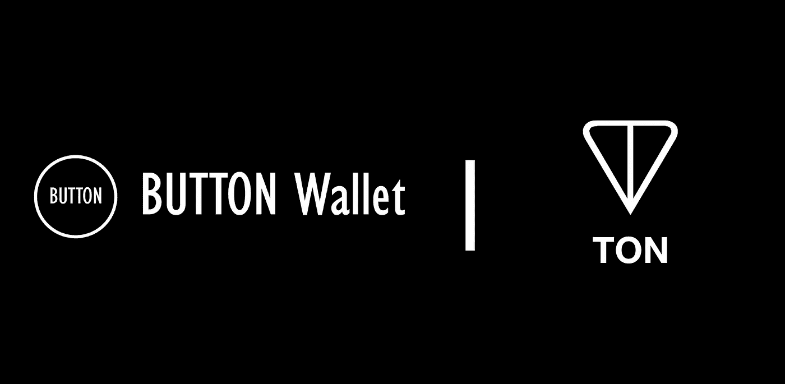
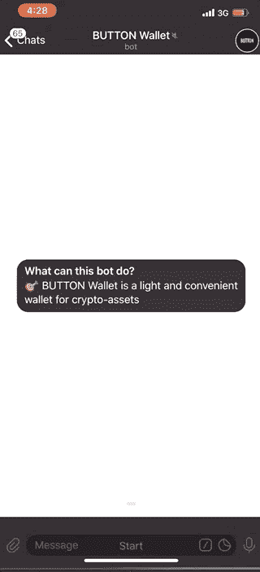
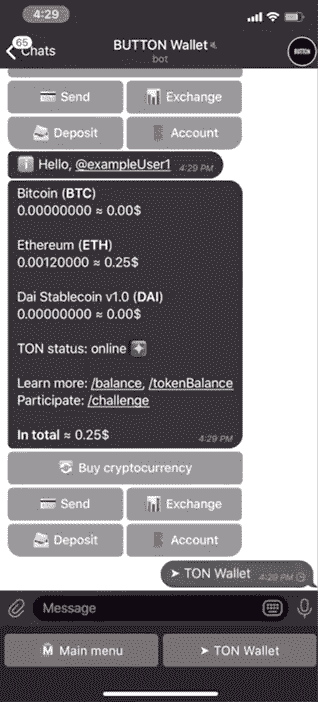

# 现在就打电报试试

> 原文：<https://medium.com/coinmonks/try-ton-at-telegram-right-now-44823b6d497d?source=collection_archive---------0----------------------->

## TON 现在由 Telegram 的按钮钱包支持

BUTTON Wallet — Telegram Cryptocurrency wallet now supports TON

电报开放网是今年最受期待的项目之一。几周前，TON 团队发布了一部分源代码，像往常一样受到了大肆宣传。然而，进入门槛很高，大多数用户甚至不尝试 TON。有些人说 TON 对于大规模采用来说太难了，然而，他们中的大多数人并没有意识到这仅仅是 light node 的第一个演示。当然，没有优秀的开发工具和文档，TON 团队永远不会发布 TON，他们也理解大多数开发人员和用户目前面临的困难:

> 当然，一个真正的 TON 区块链钱包应用会隐藏上面解释的所有中间步骤。它首先将新的智能合约的地址传达给用户，要求他们从另一个钱包或加密货币交易所向指定的地址(以不可弹回的用户友好形式显示)转移一些资金，然后提供一个简单的界面来显示当前余额，并将资金转移到用户想要的任何其他地址。(本文档的目的是解释如何创建新的非平凡智能合同并试验 TON 区块链测试网络，而不是解释如何使用 Lite 客户端而不是更友好的钱包应用
> [https://test.ton.org/HOWTO.txt](https://test.ton.org/HOWTO.txt)

那么，下一步是什么？还是等新发布吧？太无聊了。我们的团队希望展示如何利用我们从 TON 获得的当前代码库来简化用户体验。我们是按钮钱包，我们是第一个钱包，也是第一个支持 TON 的电报钱包。即使是现在！如果你不想运行你的 light node，也不关心开发者的东西，那么和我们一起[尝试一下](https://t.me/buttonwalletbot)是一个很好的选择。

# 集成详细信息

目前，只有一种方法与 TON 网络通信。这是在[https://test.ton.org/download](https://test.ton.org/download)发布的一个光节点

创建帐户、签署交易和发送交易的唯一方式也是通过 light node。因此，我们在 light 节点上编写了包装器，允许我们将用户界面放在上面。目前正在测试，所以我们做了几个假设:
1。用户私钥由我们创建(仅在测试期间，我们绝不会在真实资产上这样做)
2。我们默认为每个用户创建非零余额的 TON 帐户，调用 TON 水龙头。所以我们的每一个用户都已经拥有了克
3。TON 网络是不稳定的，所以所有用户都可能随时失去他们的帐户和资产，然而，在 Telegram 使用 Telegram 开放网络仍然是一个很大的乐趣

# 它是什么样子，我们是谁？

How to activate TON account and get TON balance

我们从 2017 年开始开发基于 Telegram 的金融钱包。我们热爱 Telegram 和他们的 API，并继续开发我们的项目。我们的钱包允许您通过 telegram @ nickname 向您的朋友发送比特币、以太坊、莱特币和其他加密货币。此外，你可以购买，与我们交换加密货币。所有这些都在你的电报应用中。

How to send 2 GRAMS to your friend by @ nickname

现在你可以通过电报用户名或短地址或完整地址给你的朋友发送电报。此外，您可以通过使用您的轻客户端获得私钥和地址来检查我们是否使用 TON。

我们现在正在为您开发新的强大功能，允许您直接在 Telegram 应用程序上以许多其他方式与 TON 互动。我们将很高兴通过我们的任何社交网络或直接通过 Telegram 获得您的反馈。

Full demo with TON console. (Proof that it is a real TON network)

特别感谢:
PepperSec 团队: [Pertsev Alexey](https://github.com/pertsev) 、 [Roman Storm](https://github.com/rstormsf) 和 [Roman Semenov](https://github.com/poma) 他们制作了很棒的工具，并通过与我们交流来帮助我们。

由 BUTTON Wallet 的 CTO Nick Kozlov
撰写——电报中基于信使的加密钱包
特别感谢 [Alexey Prazdnikov](https://github.com/prazd) 和 [Kirill Kuznecov](https://github.com/krboktv)

> [直接在您的收件箱中获得最佳软件交易](https://coincodecap.com/?utm_source=coinmonks)

