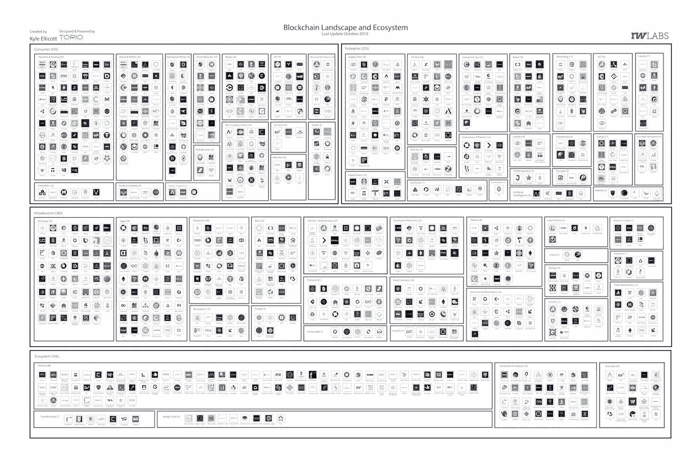

# 突尼斯使用沃尔沃、UPS、VeChain、Polkadot、摩根大通和淡马锡的区块链/更新推出国家货币

> 原文：<https://medium.com/coinmonks/tunisia-launches-national-currency-using-blockchain-updates-from-volvo-ups-vechain-polkadot-cf498b999214?source=collection_archive---------4----------------------->

Photo by [Darius Bashar](https://unsplash.com/@dariusbashar?utm_source=unsplash&utm_medium=referral&utm_content=creditCopyText) on [Unsplash](https://unsplash.com/s/photos/chaos?utm_source=unsplash&utm_medium=referral&utm_content=creditCopyText)

2019 年 11 月 13 日

*让我们直接进入本周的版本，宣布* ***突尼斯*** *将成为第一个开始将其国家货币转移到区块链平台的国家。在更多的头条新闻中，我们了解到* ***摩根大通*** *和* ***淡马锡*** *正在完成一个总部位于区块链的跨境支付系统的开发。* *也在本周* ***沃尔沃汽车*** *表示，他们将使用区块链技术追踪钴的原产地，而****UPS****则专注于可追溯性，完成从美国农场到日本的经过区块链验证的牛肉运输。****coin shares****和团队发布了一份关于最新【2019】加密趋势的高度推荐的 134 页报告。*

*在 DApps 风景画中，我们说的是在* ***【波尔卡多】****&***草间弥生上押赌注&。神话游戏*** *宣布整合* ***微软*** *Azure 区块链令牌与其****d goods****(数字商品)。我们甚至在大量的研究(* [*Q3 2019 区块链格局*](https://www.topionetworks.com/events/5d79268b78e00230faba6f77) *) &书籍(关于* [*数字资产*](https://www.scribd.com/document/430637579/Current-Market-Overview-of-Digital-Assets)*&*[*企业区块链*](https://www.amazon.com/dp/B07Z3LJCHW/ref=cm_sw_r_tw_dp_U_x_C6iSDbACJJN2Z) *)以及对风险投资的见解(新基金！！)、基础设施、DApps、比特币、经济学、交易所和 Stablecoins。为了了解更多信息，让你跟上时代的步伐，这里有一张本周业内热门新闻的快照。**

## 📈[突尼斯将推出使用区块链的电子第纳尔国家货币](https://cointelegraph.com/news/tunisia-to-launch-e-dinar-national-currency-using-blockchain)

俄罗斯 ICO 初创公司 Universa 将帮助突尼斯成为第一个开始将本国货币转移到区块链平台的国家。突尼斯中央银行宣布，突尼斯第纳尔的数字化已经开始，纸质 CBDC 将在 Universa Blockchain 上发行……[阅读更多信息](https://cointelegraph.com/news/tunisia-to-launch-e-dinar-national-currency-using-blockchain)

## 📖 [MAS、摩根大通建立区块链互联支付系统](https://www.coindesk.com/mas-jpmorgan-build-payments-system-with-inter-blockchain-connectivity)

新加坡国有投资公司淡马锡(Temasek)和摩根大通(JPMorgan)与新加坡金融管理局(MAS)合作开发了一个总部位于区块链的跨境支付系统，该系统可以支持一系列货币。MAS 表示，支付原型“将为其他区块链网络提供无缝连接和集成的接口。”… [阅读更多](https://www.coindesk.com/mas-jpmorgan-build-payments-system-with-inter-blockchain-connectivity)

## 📖[沃尔沃汽车采用区块链技术避免不道德的钴](https://www.bloomberg.com/news/articles/2019-11-06/volvo-cars-goes-for-blockchain-tech-to-avoid-unethical-cobalt)

沃尔沃汽车将使用区块链技术追踪其电池中使用的钴的来源，以避免儿童和不道德条件下生产的供应。沃尔沃采购主管 Martina Buchhauser 在一份声明中表示，公司一直致力于原材料的道德供应链，在区块链技术公司的帮助下，可以采取下一步措施，通过与供应商的密切合作，确保我们供应链的完全可追溯性，并将任何相关风险降至最低。沃尔沃与 RCS Global and International Business Machines corp .一起加入了福特汽车公司支持的计划，以监控 LG 化学的钴供应… [阅读更多信息](https://www.bloomberg.com/news/articles/2019-11-06/volvo-cars-goes-for-blockchain-tech-to-avoid-unethical-cobalt)

## 📖 [UPS 将美国牛肉运往日本，通过区块链追踪运输情况](https://www.freightwaves.com/news/ups-ships-u-s-beef-to-japan-traces-movement-via-blockchain)

UPS 宣布与农业技术解决方案提供商 HerdX 合作，成功地将区块链认证的牛肉从美国农场运送到日本。UPS 称这是牛肉行业在质量保证和可追溯性方面向前迈出的重要一步，顺便提一下，这也是 HerdX 首次通过区块链网络运输牛肉……[阅读更多信息](https://www.freightwaves.com/news/ups-ships-u-s-beef-to-japan-traces-movement-via-blockchain)

## 🇨🇳 [区块链解决贸易认证、融资问题:上海监管机构](https://www.reuters.com/article/us-china-cenbank-blockchain-idUSKBN1XH05S)

根据中国人民银行(PBOC)上海总部和上海市商务委员会——区块链技术的使用解决了贸易融资中的信息不对称问题和提供贸易真实性证明的核心问题……[阅读更多](https://www.reuters.com/article/us-china-cenbank-blockchain-idUSKBN1XH05S)

## 📖 [VeChain 宣布推出跨洲区块链物流解决方案 food gates](https://cryptobriefing.com/vechain-announces-foodgates-blockchain-logistics/)

总部位于新加坡的区块链应用平台 [VeChain](https://medium.com/u/27b156c1d5f3?source=post_page-----cf498b999214--------------------------------) 宣布将与 ASI Group 和 DNV GL 合作，共同发起一项在区块链实现食品追踪的计划。它名为 FoodGates，由区块链 VeChain Thor public 公司开发，是同类解决方案中的第一个… [阅读更多信息](https://cryptobriefing.com/vechain-announces-foodgates-blockchain-logistics/)

## 📖[科技投资先驱哈钦斯押注区块链](https://www.reuters.com/article/us-investment-summit-hutchins-idUSKBN1XH23I)

根据技术投资先驱格伦·哈钦斯(Glenn Hutchins)的说法，基于区块链的支付可能会改变金融，就像互联网公司从 20 世纪 90 年代开始改变信息和通信一样。他还表示，促进支付的区块链公司可能是有先见之明的赌注……[阅读更多](https://cointelegraph.com/news/china-introduces-blockchain-based-identification-system-for-cities)

> *👉立即注册领取 2019 年第三季度* [*区块链基础设施景观*](https://www.topionetworks.com/events/5d79268b78e00230faba6f77) *版*

## 🇨🇳 [研究:到 2023 年，中国区块链支出将超过 20 亿美元](https://cointelegraph.com/news/study-chinese-blockchain-spending-to-exceed-2b-by-2023)

官方媒体新华社[11 月 10 日报道](http://www.xinhuanet.com/english/2019-11/10/c_138544453.htm)，2023 年中国在区块链技术上的投资将超过 20 亿美元。该报告称，从 2018 年到 2023 年，中国区块链发展的复合年增长率将达到 65.7%。该报告援引美国市场情报公司 IDC 于 11 月 7 日发表的一项[研究](https://www.idc.com/getdoc.jsp?containerId=lcCHC45637319)，称 2019 年中国区块链支出的大部分投向了银行业。据报道，其他高消费行业包括制造业、零售业、专业服务业和流程制造业。… [阅读更多信息](https://cointelegraph.com/news/study-chinese-blockchain-spending-to-exceed-2b-by-2023)

## 📖 [IBM 道德矿产采购区块链将于春季亮相](https://www.coindesk.com/ibm-ethical-mineral-sourcing-blockchain-to-debut-in-spring)

福特、大众汽车、LG 和沃尔沃计划明年在生产中的精炼过程中进行跟踪钴的试点项目。建立在 [Hyperledger Fabric](https://www.hyperledger.org/projects/fabric) 基础上的国际财团[Responsible Sourcing block chain Network(RSBN)](https://www.rcsglobal.com/blockchain-traceability/)周三宣布，它已经成功完成了一个[试点项目](https://www.coindesk.com/ford-lg-to-pilot-ibm-blockchain-in-fight-against-child-labor)，以防止开采性采矿行为。经过五个月的提炼，这些公司将 1.5 吨刚果钴运往三个不同的大陆，为该项目在 2020 年春天投入运营扫清了道路。… [阅读更多信息](https://www.coindesk.com/ibm-ethical-mineral-sourcing-blockchain-to-debut-in-spring)

# 本周阅读的研究:

# 本周的更多内容:

📖[提高门槛:由](/bakkt-blog/raising-the-bar-announcing-bakkt-institutional-custody-ed5e2ad0da9a)[亚当·怀特](https://medium.com/u/1333dd5e6d23?source=post_page-----cf498b999214--------------------------------)宣布 Bakkt 机构托管

📖 [100 倍哈希表= 100 倍安全](/@DJohnstonEC/100-times-the-hashpower-100-times-the-security-66796de8118f)由[大卫·a·约翰斯顿](https://medium.com/u/a7467cf7c73?source=post_page-----cf498b999214--------------------------------)

📖[阿里巴巴与棒棒糖合作，允许美国购物者获得“免费比特币”](https://cointelegraph.com/news/alibaba-partners-with-lolli-to-allow-us-shoppers-earn-free-bitcoin)

📖[一款可收藏的数字纸牌游戏即将由威廉·麦肯齐(William McKenzie)推出](/tezoscommons/a-digital-collectible-card-game-coming-soon-to-tezos-ddd939f3b119)

📖[通过](/swlh/blockchain-to-become-the-dna-of-ai-d1c6a0ba8576) [Lance Ng](https://medium.com/u/ab685c989c2d?source=post_page-----cf498b999214--------------------------------) 成为 AI 的 DNA 的嵌段链

📖[孟加拉国采用区块链技术的土地核查系统](/coinmonks/land-verification-system-using-blockchain-technology-in-bangladesh-f718ebd39f13)由 [Md Shariful Islam](https://medium.com/u/fbf0f8746f99?source=post_page-----cf498b999214--------------------------------)

💰[数据令牌 1:数据托管](https://blog.oceanprotocol.com/data-tokens-1-data-custody-1d0d5ae66d0c)由[特伦特·麦康纳](https://medium.com/u/f1cb98e196bc?source=post_page-----cf498b999214--------------------------------) & [海洋协议团队](https://medium.com/u/1e7ff6f6df18?source=post_page-----cf498b999214--------------------------------)

💰[香港、泰国计划在 2020 年前发布 Q1 数字货币项目报告](https://www.theblockcrypto.com/linked/46241/hong-kong-and-thailand-plan-to-release-their-digital-currency-project-report-by-q1-2020)

📖 [5 部最佳比特币纪录片](/shapeshift-stories/5-of-the-best-bitcoin-documentaries-4fd58679b8a6)由[Ari Chernoff](https://medium.com/u/9643a2ce64c0?source=post_page-----cf498b999214--------------------------------)&[shape shift](https://medium.com/u/5ee4b8323e7a?source=post_page-----cf498b999214--------------------------------)

📖[当前数字资产市场概述](https://www.scribd.com/document/430637579/Current-Market-Overview-of-Digital-Assets)作者[大卫·内奇](https://medium.com/u/b23d2fb9948a?source=post_page-----b48e000a0f21----------------------)

# 分散式应用程序手表

## 📖 [KWasm:区块链的一种新的可执行语义](/dlabvc/kwasm-a-new-executable-semantics-for-the-blockchain-14e1bca8a360)

[Runtime Verification](https://medium.com/u/501a37f020aa?source=post_page-----cf498b999214--------------------------------)Inc .(RV)是一家总部位于伊利诺伊州厄巴纳的技术公司，是 K-Framework 的主要开发者。K 框架从一种编程语言的单一规范中自动生成用于形式分析的工具。运行时验证为航空航天、汽车和区块链的公司和机构提供定制验证服务……[阅读更多信息](/dlabvc/kwasm-a-new-executable-semantics-for-the-blockchain-14e1bca8a360)

## 📖[非营利组织:赌注&在波尔卡多特提名&草间弥生](/figment-networks/npos-staking-nominating-on-polkadot-kusama-ca9cc8fa1934)

Polkadot universe 被设计成在验证器集合上尽可能均匀地分布 stake backing。与现有的标桩设计有所不同，标桩方案称为“标桩证明”。不过，幸运的是，对于草间弥生(KSM)和波尔卡多特(dot)代币持有者来说，它的大部分复杂性都是隐藏的……[阅读更多](https://www.forbes.com/sites/cognitiveworld/2019/10/24/ai-and-blockchain-double-the-hype-or-double-the-value/#105d6d125eb4)并从 [Gavin](https://medium.com/u/73e5a85339e3?source=post_page-----cf498b999214--------------------------------) & [虚构网络](https://medium.com/u/7c8b629515af?source=post_page-----cf498b999214--------------------------------)查看更多

## 📖[区块链平台 FLETA 正式推出 Mainnet](https://www.prnewswire.co.uk/news-releases/blockchain-platform-fleta-officially-launched-its-mainnet-887129950.html)

旨在解决可扩展性、速度和去中心化问题的新区块链平台 FLETA Blockchain 于 11 月 11 日发布了其 mainnet。在正式启动之前，FLETA 网络已经进行了几个月的测试，以验证其独特的共识算法(称为公式证明(PoF))的正常运行。… [阅读更多](https://www.forbes.com/sites/lukefitzpatrick/2019/11/01/samsung-galaxy-s10-users-can-now-access-tron-dapps/)

## 📖[神话游戏宣布整合微软 Azure 区块链令牌与 dGoods 标准](https://www.businesswire.com/news/home/20191106005431/en/Mythical-Games-Announces-integration-Microsoft-Azure-Blockchain)

游戏开发者现在可以使用 Azure 区块链令牌来创建丰富的、兼容 dGoods 和 TTF 的游戏经济，以努力促进创作者、消费者和游戏开发者之间快速增长的数字资产全球市场。 [dGoods](https://medium.com/u/d17bf686ee7b?source=post_page-----cf498b999214--------------------------------) 标准(Digital Goods 的缩写)由[神话游戏](https://medium.com/u/3635f2e837f?source=post_page-----cf498b999214--------------------------------)开发，作为在区块链上创建、管理和分发游戏内资产的商业认可基准的一步，为创建数字物品经济和游戏体验提供了广泛的选择… [阅读更多信息](https://www.businesswire.com/news/home/20191106005431/en/Mythical-Games-Announces-integration-Microsoft-Azure-Blockchain)

## 📖 [DApp 墓地 2019 年 10 月](https://blog.stateofthedapps.com/dapp-graveyard-of-october-2019-385e482b26bd)由[野兽派奥特曼](https://medium.com/u/5a55fc135c4c?source=post_page-----cf498b999214--------------------------------)

亲爱的 DApp 开发者和团队，幽灵月已经降临到我们所有人身上，然而这一次，没有太多的 dapp 被转移到一个被遗弃的状态。让我们把这当成一个好兆头吧！… [阅读更多信息](https://blog.stateofthedapps.com/dapp-graveyard-of-october-2019-385e482b26bd)

# 📺收听:

本周，我向弹出式播客 [CoinDesk](https://medium.com/u/f2fa6f2d51a6?source=post_page-----cf498b999214--------------------------------) 推荐一份名单，邀请嘉宾 [Meltem Demirors](https://medium.com/u/6cf31b9735f9?source=post_page-----cf498b999214--------------------------------) 。

[Source](https://www.coindesk.com/podcast-meltem-demirors-on-the-3-things-bitcoin-represents)

> *👉下载最新* [*区块链用于基础设施景观*](https://www.topionetworks.com/events/5d79268b78e00230faba6f77) *Q3 2019 版*

Q3 2019 Edition of the Blockchain for Infrastructure & Ecosystem Landscape

不想等到下周，[现在就订阅](http://click1.m.readwritelabs.com/xsdqkbbrgsdtqkmntpjlstcnkytvpvphsnhsqlvbrhhd_yfqbfcmslnskglmckvqv.html?source=post_page---------------------------)📥有关区块链、DApps 等的实时行业见解！

> [直接在您的收件箱中获得最佳软件交易](https://coincodecap.com/?utm_source=coinmonks)

