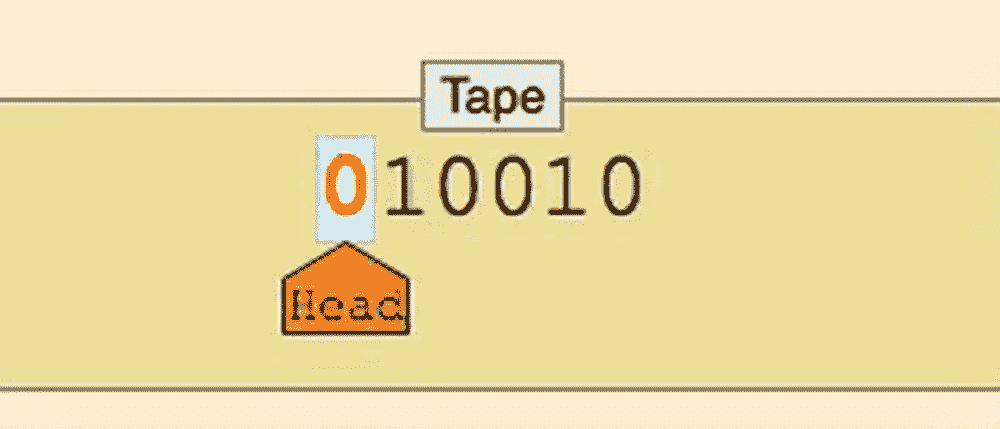
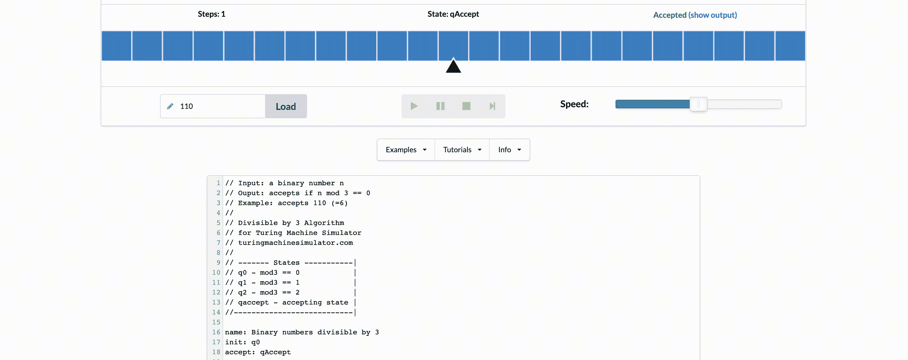

# 图灵完备性、Golang、以太坊和比特币

> 原文：<https://medium.com/coinmonks/turing-completeness-go-ethereum-and-bitcoin-a98e5623c48a?source=collection_archive---------7----------------------->

*最初发布于*[*https://aly . arriqaaq . com/turing-completenes-ether eum-比特币/*](https://aly.arriqaaq.com/turing-completenes-ethereum-bitcoin/)

我读过很多关于图灵机，一种图灵完备的语言，以及一般的图灵完备性的书，但是从来没有仔细研究过。在过去的几周里，我对它有了更多的了解，它在文学和实践上都很重要。这是我自己的日志，用来回顾我的发现。

# 什么是图灵完全性？

根据维基的说法，在可计算性理论中，一个数据操作规则系统(如计算机的指令集、编程语言或细胞自动机)被称为**图灵完全**或**计算通用**，如果它可以用来模拟任何[图灵机](https://en.wikipedia.org/wiki/Turing_machine)。

但是用外行的话来说这是什么意思呢？问题是如何验证一个数学任务是否是可计算的。为了回答这个问题，图灵提出了一种机器(图灵机)的抽象概念，如果可以编码(或逻辑构造)，它可以模拟任何问题。它没有考虑解决问题需要多少时间或资源(CPU、内存),但可以肯定的是，对于给定的输入，机器将产生输出。

 [## GIFER 上的应用科学 GIF

### 编辑描述

i.gifer.com](https://i.gifer.com/P8D.gif) 

因此，如果有人说“x 是图灵完备的”，这意味着原则上它可以用来解决任何计算问题。图灵机类似于[有限自动机/有限状态机](https://brilliant.org/wiki/finite-state-machines/)，但是不受内存或运行时约束的限制。

# 图灵机，详细来说

图灵机由一个无限**磁带**(作为内存)、一个**磁带头**(指向当前被检查的内存单元的指针)和一个状态转换表(管理机器的行为)组成。磁带的每个单元可以具有预定的有限符号集中的一个，其中一个是空白符号。

像算法一样，图灵机对输入的[串](https://brilliant.org/wiki/strings/)的[位](https://brilliant.org/wiki/binary-numbers/)执行。开始时，输入字符串写在磁带上，磁带头指向字符串的第一个单元格，其他所有单元格都是空白的。

在运行过程中，磁头处于某种状态。每一步，它只根据它所处的状态和头部下面的符号，查阅表(状态转换表)，以获得它的下一个选择:要么停止(结束操作)，要么通过向当前单元格写入一个符号，改变它的状态，然后向左或向右移动来恢复。通过这种方式，图灵机可以模拟程序由许多行组成的事实，因此它取决于程序正在执行的行，它还可以模拟程序可以对内存中的不同数据做出不同反应的事实。

因此，图灵机要么在某个点停止，要么永远运行。如果它停止，磁带的内容就是输出。

# 例子

网上有很多图灵机模拟器，其中一个就是[这个模拟器](https://turingmachinesimulator.com/)。这里有一个简单的机器例子，它检查二进制数是否能被 3 整除

# 编程语言图灵完备吗？

[丘奇-图灵论题](https://brilliant.org/wiki/church-turing-thesis/)声称任何可计算的问题都可以被图灵机计算出来。这意味着比图灵机更强大的计算机不是解决可计算问题所必需的。图灵完备性的思想与此密切相关。如果一个系统能计算每一个图灵可计算函数，那么它就是图灵完备的。图灵完备的编程语言理论上能够表达所有计算机可以完成的任务；几乎所有的编程语言都是图灵完全的。

一般来说，为了使命令式语言是图灵完全的，它需要:

1.  一种条件重复或条件跳转的形式(如循环`while`，条件句`if` + `goto`)
2.  一种读写某种存储形式(如变量、磁带)的方式

要检查某个东西是否是图灵完全的，看看你能否在里面实现一个图灵机。换句话说，检查以下情况:

**1)**

**2)可以永远运行** —图灵证明了你无法通过在计算机上模拟来预测一个程序是否会终止。简单地说，如果不运行程序，我们就无法预测它的路径。图灵完备系统可以在“无限循环”中运行，“无限循环”是一个用来描述程序不会终止的术语(过于简化)。

如果我们把 Java、Javascript 或 Python 去掉，去掉任何循环、转到或函数调用的能力，它就不是图灵完全，因为它不能执行永远不会结束的任意计算。 [Coq](https://en.wikipedia.org/wiki/Coq) 是一个定理证明器，不能表达不终止的程序，所以不是图灵完全。

**3)可以使用无限内存**——一种完全类似于 Java 但一旦使用超过 4gb 内存就会终止的语言不会是图灵机，因为图灵机可以使用无限内存。这就是为什么我们实际上不能*建立*图灵机，但是 Java 仍然是图灵完全语言，因为 Java *语言*没有限制阻止它使用无限内存。这是正则表达式不完整的一个原因。

**4)可以读写 RAM 中的数据**——这种语言只允许你通过对堆栈的`push`和`pop`操作来处理内存，这是不完整的。如果我有一个“语言”读取一个字符串*一次*，并且只能通过从堆栈中推入和弹出来使用内存，它可以通过在看到`(`时推入和看到`)`时弹出来告诉我字符串中的每个`(`是否都有自己的`)`。但是，它不能告诉我是否每个`(`在*之后都有自己的`)`并且每个`[`在*之后都有自己的`]`(注意`([)]`满足这个条件而`([]]`不满足)。图灵机可以使用它的随机存取存储器分别跟踪`()`和`[]`，但是这种只有堆栈的语言不能。

**5)可以模拟任何其他图灵机**——一台图灵机，当给定一个合适的‘程序’时，可以拿走另一台图灵机的‘程序’，在任意输入上进行模拟。如果你有一门被禁止实现 Python 解释器的语言，它就不是图灵完整的。

> ***简而言之，如果一门语言有无限 RAM，有条件执行，有某种形式的重复执行，那大概就是图灵完备。***

大多数现代编程语言(如 Go、Python、Java、JavaScript、Perl 等。)都是图灵完全的，因为它们都实现了上面提到的所有特性。还有一些“计算环境”,你可能不认为它们是图灵完全的，但实际上是。

*   例如，Excel 电子表格是图灵完整的。这并不完全令人惊讶，因为它们包含了一种用于编写宏/扩展的成熟的编程语言。但是即使不使用它，Excel 的公式语言也可以被认为是图灵完备的
*   游戏中的红石族*《我的世界》*定义了一种图灵完备的语言。
*   康威的[生命游戏](https://www.youtube.com/watch?v=R9Plq-D1gEk)(这里有一个演示)，一种比我们在本课程中关注的更有趣的自动机形式，也是图灵完成的

# 图灵整机的优势是什么？

我们以以太坊为例。以太坊能够在称为以太坊虚拟机的状态机中执行存储的程序，同时向内存读写数据，这使其成为一个图灵完全系统，因此也是一个 UTM。考虑到有限内存的限制，以太坊可以计算任何图灵机可以计算的任何算法。

现在，知道了一种语言是图灵完全的，就可以确保如果一个函数(或者一个脚本)运行，对于一个给定的输入，可以得到想要的输出。这对于 Solidity 这样的语言很重要，因为你可以理解图灵完备性对智能合约的影响。

图灵完备性非常容易实现；事实上，[已知的最简单的图灵完全状态机](http://bit.ly/2ABft33)有 4 个状态，使用 6 个符号，状态定义只有 22 条指令长。事实上，有时系统被发现是“意外地图灵完全的”在 http://bit.ly/2Og1VgX[可以找到这种系统的有趣参考。](http://bit.ly/2Og1VgX)

然而，图灵完全性是非常危险的，特别是在像公共区块链这样的开放存取系统中，因为存在停机问题。例如，现代打印机是 Turing complete，可以给打印文件，使它们进入冻结状态。以太坊是图灵完全的这一事实意味着任何复杂程度的任何程序都可以被以太坊计算出来。但是这种灵活性带来了一些棘手的安全和资源管理问题。可以关闭没有响应的打印机，然后再打开。这在区块链是不可能的。

# 图灵完备性的含义

图灵证明了你不能通过在计算机上模拟来预测一个程序是否会终止。简单地说，如果不运行程序，我们就无法预测它的路径。图灵完备系统可以在“无限循环”中运行，“无限循环”是一个用来描述程序不会终止的术语(过于简化)。创建一个运行永不结束的循环的程序是很容易的。但是，由于起始条件和代码之间的复杂交互，可能会在没有警告的情况下出现意想不到的永无止境的循环。在以太坊中，这带来了一个挑战:每个参与节点(客户端)必须验证每个事务，运行它调用的任何智能合约。但正如图灵所证明的，以太坊在没有实际运行(可能永远运行)的情况下，无法预测智能合约是否会终止，或者会运行多久。无论是意外还是有意，可以创建一个智能协定，使得它在节点尝试验证它时永远运行。这实际上是一种拒绝服务攻击。当然，在一个需要一毫秒验证的程序和一个永远运行的程序之间，有无限多的令人讨厌的、占用资源的、内存膨胀的、CPU 过热的程序，它们只是浪费资源。在世界计算机中，滥用资源的程序会滥用世界资源。

# 以太坊图灵完整吗？

不完全是。稳健是，EVM 不是。正如 Gavin Wood 提到的，以太坊虚拟机是一个准图灵完全状态机；**准**因为所有的执行过程都受限于有限数量的计算步骤，这是由任何给定的智能契约执行可用的气体量决定的。

以太坊无法预测一个智能合约是否会终止，或者会运行多久，而不需要实际运行它(可能永远运行)。以太坊引入了一种叫做*气体*的计量机制。当 EVM 执行智能合同时，它会仔细考虑每条指令(计算、数据访问等)。).每条指令都有一个以 gas 为单位的预定成本。当一个交易触发智能合约的执行时，它必须包括一定数量的 gas，该数量设置了运行智能合约可以消耗的气体的上限。如果计算消耗的气体量超过事务中可用的气体量，EVM 将终止执行。Gas 是以太坊使用的机制，它允许图灵完全计算，同时限制任何程序可以消耗的资源。

因此，以太坊区块链上的任何 I/O 都有两个限制。这些是气体成本和阻塞气体限制。

# 比特币图灵完成了吗？

比特币脚本目前不支持循环。因此，它们通常被认为不是图灵完全的。这将比特币脚本可以执行的算法类型限制为线性或树状指令。

# 一个系统必须是图灵完备的才是有用的吗？

不完全是。亚当·瓦塔尼安 [**写道**](https://increment.com/programming-languages/turing-incomplete-advantages/) 这是一个很好的例子，说明使用图灵不完全 DSL 有很多好处——从可预测的资源使用到改进的分析。让我们以 [Vyper](https://vyper.readthedocs.io/en/stable/) 为例，它是一种面向契约的 pythonic 编程语言，目标是以太坊虚拟机(EVM)。Vyper 不支持以下功能，这使得它的图灵不完整:

1.修改器
2。直列式装配
3。功能过载
4。操作员过载
5。递归调用
6。无限长循环
7。二元定点

但是 DSL 的缺点是它提供了额外的安全性。更少的功能、更强的可审核性、更高的安全性、更可预测的资源使用。

# 资源

*   [https://code golf . stack exchange . com/questions/11880/build-a-working-game-of-Tetris-in-con ways-game-of-life](https://codegolf.stackexchange.com/questions/11880/build-a-working-game-of-tetris-in-conways-game-of-life)
*   [https://stack overflow . com/questions/7284/what-is-turing-complete](https://stackoverflow.com/questions/7284/what-is-turing-complete)
*   [https://alan-lang.org/the-turing-completeness-problem.html](https://alan-lang.org/the-turing-completeness-problem.html)
*   [https://introtcs.org/public/lec_06_loops.html#examples](https://introtcs.org/public/lec_06_loops.html#examples)
*   [https://github . com/ethereum book/ethereum book/blob/develop/01 what-is . asciidoc](https://github.com/ethereumbook/ethereumbook/blob/develop/01what-is.asciidoc)
*   [https://hacker noon . com/turing-completity-and-the-ether eum-区块链-c5a93b865c1a](https://hackernoon.com/turing-completeness-and-the-ethereum-blockchain-c5a93b865c1a)
*   [https://level up . git connected . com/should-smart-contracts-be-non-turing-complete-Fe 304203 a 49 e](https://levelup.gitconnected.com/should-smart-contracts-be-non-turing-complete-fe304203a49e)

> 加入 Coinmonks [电报频道](https://t.me/coincodecap)和 [Youtube 频道](https://www.youtube.com/c/coinmonks/videos)了解加密交易和投资

## 另外，阅读

*   [Koinly 回顾](https://blog.coincodecap.com/koinly-review) | [Binaryx 回顾](https://blog.coincodecap.com/binaryx-review) | [Hodlnaut vs CakeDefi](https://blog.coincodecap.com/hodlnaut-vs-cakedefi-vs-celsius)
*   [MoonXBT vs Bybit vs 币安](https://blog.coincodecap.com/bybit-binance-moonxbt) | [硬件钱包](/coinmonks/hardware-wallets-dfa1211730c6)
*   [火币交易机器人](https://blog.coincodecap.com/huobi-trading-bot) | [如何购买 ADA](https://blog.coincodecap.com/buy-ada-cardano) | [Geco。一次审查](https://blog.coincodecap.com/geco-one-review)
*   [币安 vs 比特邮票](https://blog.coincodecap.com/binance-vs-bitstamp) | [比特熊猫 vs 比特币基地 vs Coinsbit](https://blog.coincodecap.com/bitpanda-coinbase-coinsbit)
*   [如何购买 Ripple (XRP)](https://blog.coincodecap.com/buy-ripple-india) | [非洲最好的加密交易所](https://blog.coincodecap.com/crypto-exchange-africa)
*   [非洲最佳加密交易所](https://blog.coincodecap.com/crypto-exchange-africa) | [晤交易所评论](https://blog.coincodecap.com/hoo-exchange-review)
*   [eToro vs robin hood](https://blog.coincodecap.com/etoro-robinhood)|[MoonXBT vs by bit vs Bityard](https://blog.coincodecap.com/bybit-bityard-moonxbt)
*   [有哪些交易信号？](https://blog.coincodecap.com/trading-signal) | [比特斯坦普 vs 比特币基地](https://blog.coincodecap.com/bitstamp-coinbase)
*   [ProfitFarmers 回顾](https://blog.coincodecap.com/profitfarmers-review) | [如何使用 Cornix Trading Bot](https://blog.coincodecap.com/cornix-trading-bot)
*   [如何在无法阻挡的域名上购买域名？](https://blog.coincodecap.com/buy-domain-on-unstoppable-domains)
*   [印度的加密税](https://blog.coincodecap.com/crypto-tax-india) | [altFINS 审核](https://blog.coincodecap.com/altfins-review) | [Prokey 审核](/coinmonks/prokey-review-26611173c13c)
*   [赢取注册奖金——10 大最佳加密平台](https://blog.coincodecap.com/earn-sign-up-bonus)