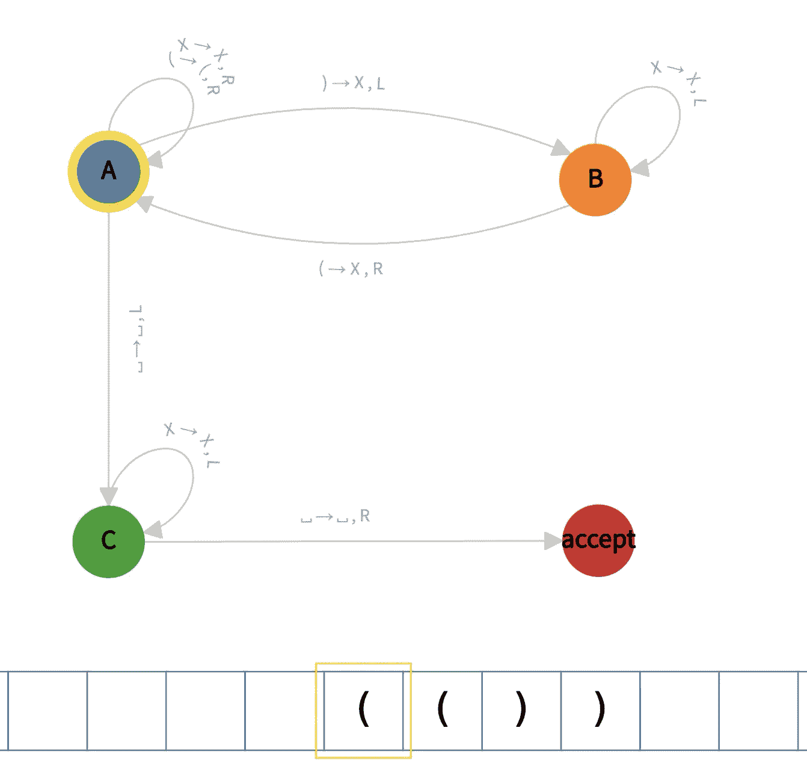
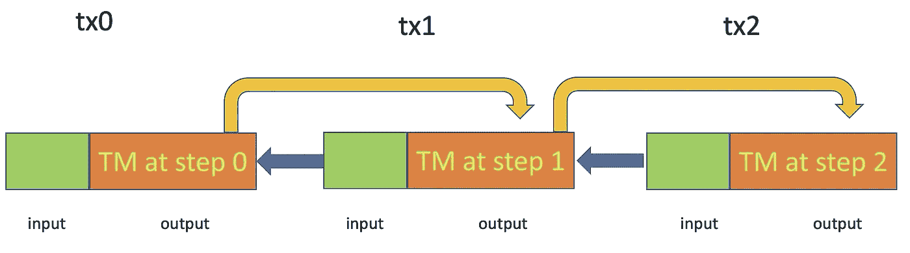
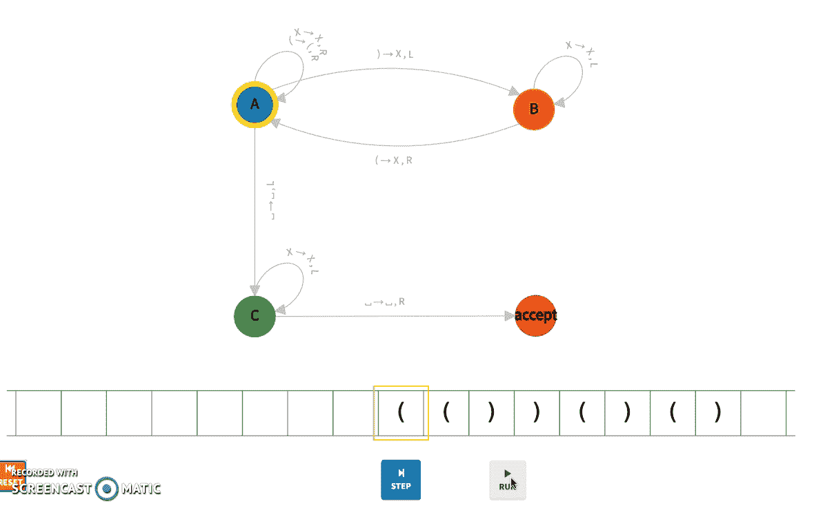
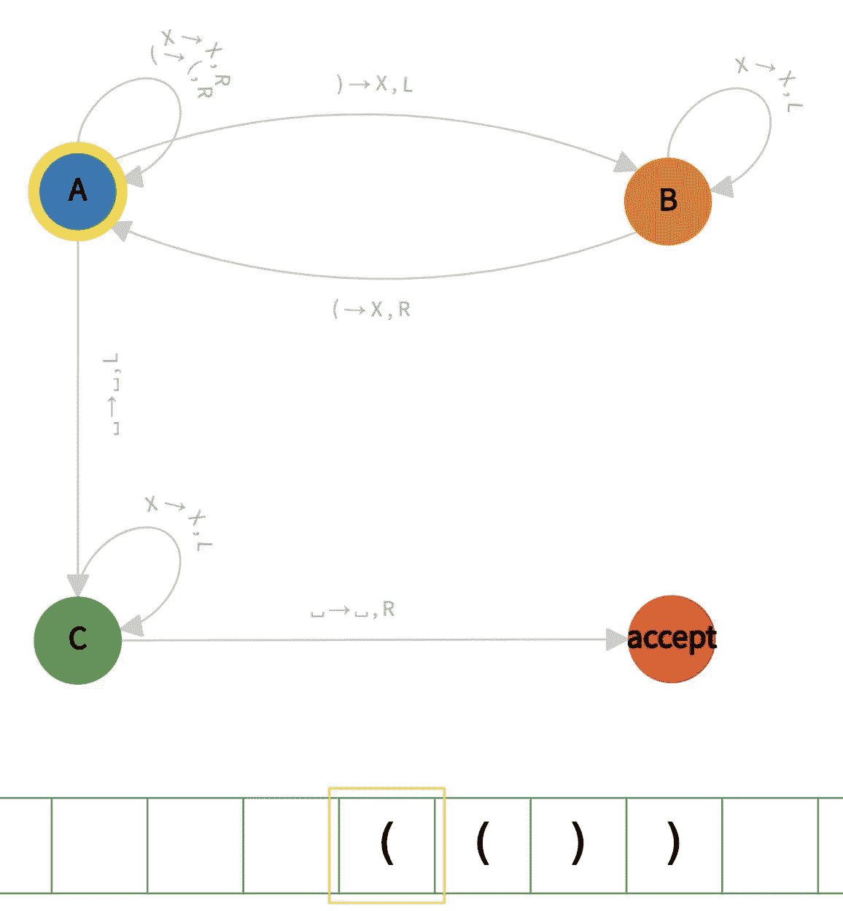
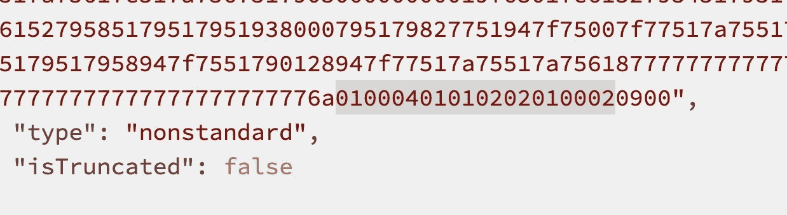
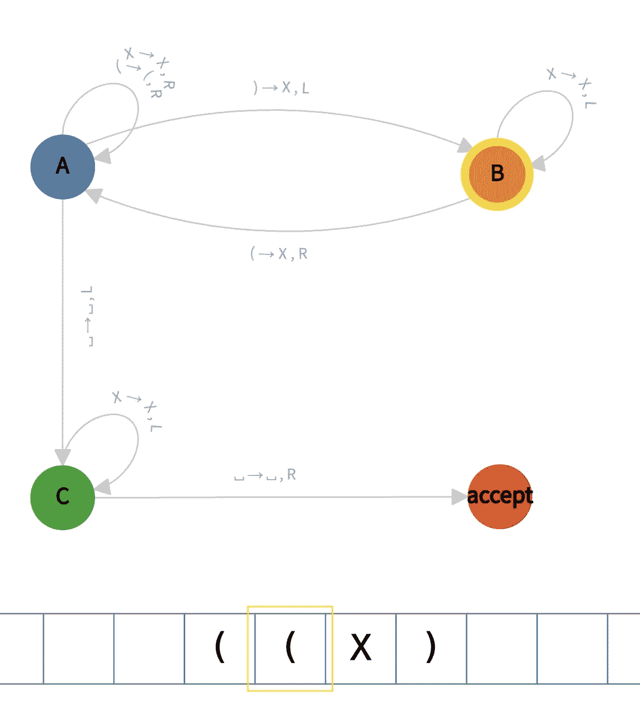
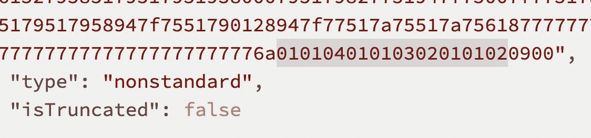

# 比特币上的图灵机

> 原文：<https://medium.com/coinmonks/turing-machine-on-bitcoin-7f0ebe0d52b1?source=collection_archive---------1----------------------->

## 比特币图灵-完全证明

我们已经根据经验证明，任何图灵机都可以在比特币上模拟，从而明确证明它是**图灵完全的**。我们实现了一个能够识别平衡括号的图灵机，并将其部署在比特币区块链上。其他任何图灵机都可以用同样的方法模拟。

# 图灵机导论

图灵机由以下组件组成(简化):

*   有限状态集合中的当前状态(其中一个状态被标记为*初始状态，一些状态被标记为接受状态*
*   一条带有存储单元的磁带和一个可以在磁带上移动的*读/写头*
*   一个所谓的*转换函数*告诉机器什么时候做什么。

在下面的例子中，我们展示了一个用于[检查平衡括号](https://math.stackexchange.com/questions/503853/how-do-you-argue-or-prove-that-a-certain-turing-machine-accepts-a-language)的图灵机。它的初始状态是 A，并且包含一个接受状态。例如，转换函数说，如果机器处于状态 A，并且它的磁头读取符号“)”，它应该在该单元中写入“X”并向左移动，转换到状态 b。

A Turing Machine checking balanced parentheses

## 丘奇-图灵论题

[丘奇-图灵论题](https://simple.wikipedia.org/wiki/Church-Turing_thesis)指出图灵机可以计算任何可以计算的东西。这正是计算的定义，也是对计算机进行推理的基本工具。

# 在比特币上模拟图灵机

我们展示了一种在比特币上模拟图灵机的通用方法。我们拍摄运行中的图灵机的快照:磁头位置、当前状态和磁带。快照存储在[一个有状态的比特币智能合约](/xiaohuiliu/stateful-smart-contracts-on-bitcoin-sv-c24f83a0f783)中。更具体地说，它们存在于比特币交易的产出中。运行图灵机的每一步都是由比特币交易触发的。图灵机可以继续运行，除非它进入一个可接受的状态。

Simulating Turing Machines (TM)

## 履行

为了证明在比特币上模拟图灵机的可行性，我们实现了前面提到的图灵机来检查平衡括号，如下所示。

A [Turing Machine contract](https://github.com/sCrypt-Inc/boilerplate/tree/master/contracts/turingMachine.scrypt) checking balanced parentheses

每次在事务中调用公共函数 ***transit()*** 时，机器前进一步。

*   第 3–6 行:定义状态，包括初始状态和接受状态
*   L9–12:定义所有符号
*   L19-30:将转移函数定义为表格
*   L37:从头部读取符号
*   L40–43:使用当前状态和磁头符号，我们在转换函数表中查找以找到新状态(L46)，写入磁带(L48)，并移动磁头(L50)。
*   l51–59:最初，磁带只包含输入字符串，如“ ***(())()()*** 。”如果磁带用完，无论是在左侧(L52)还是右侧(L56)，都会添加一个空白单元。这确保了 ***胶带可以任意长，并且是无界的*** (但不是无限的)。

## 部署

我们已经把上面的图灵机部署到比特币上，在输入字符串“ ***(())()()*** 上运行。”完整的执行如下所示。

Turing Machine Accepting **(())()()**

这是图灵机在第 0 步:

Turing Machine at Step 0

你可以看到图灵机的快照被编码在[这个事务](https://whatsonchain.com/tx/a0bc71204f8431c6c5df7a12fc3cb2638e987a0c308a60fcd120e1e148094dc9)中。

[Step 0: txid](https://whatsonchain.com/tx/a0bc71204f8431c6c5df7a12fc3cb2638e987a0c308a60fcd120e1e148094dc9)

同样，这是[步骤 3](https://whatsonchain.com/tx/9c6874ca372f0c02d27fedc9c17d9472e4e5642d04b217aef10fb75cb1dfe1ed) :

Turing Machine at Step 3

它的编码如下:

[Step 3 txid](https://whatsonchain.com/tx/9c6874ca372f0c02d27fedc9c17d9472e4e5642d04b217aef10fb75cb1dfe1ed)

# 图灵完全证明

通过简单地改变状态、符号和转移函数，修改上面的图灵机契约来实现任何其他的图灵机是很简单的。因此，任何图灵机都可以在比特币上模拟，最终证明比特币是定义为[图灵完全的](https://en.wikipedia.org/wiki/Turing_completeness)。QED。

> 在可计算性理论中，如果一个数据操作规则系统可以用来模拟任何图灵机，那么它就是**图灵完备的**。

# 更新日期:2022 年 12 月

有一篇独立论文使用与我们相似的逻辑证明了基于 UTXO 的区块链是图灵完全的:[自我复制硬币作为通用图灵机](https://link.springer.com/chapter/10.1007/978-3-030-00305-0_4)。

# 更新日期:2023 年 2 月

另一篇独立论文通过模拟任何[计数器](https://en.wikipedia.org/wiki/Counter_machine) : [计算合理的比特币代币](https://ieeexplore.ieee.org/document/9505235)，证明比特币是图灵完全的。它需要更改比特币脚本以包含契约，实际上并不需要，因为 [OP_PUSH_TX](https://xiaohuiliu.medium.com/op-push-tx-3d3d279174c1) 。

# 承认

感谢 Pasquale Valentin 帮助部署比特币合同。

[1]我们已经通过在比特币上实现图灵强制系统，珍贵地证明了比特币是图灵完全的，比如康威的生命游戏和 T2 的第 110 号规则。

[2] [无限与无界](https://craigwright.net/blog/math/infinite-and-unbounded/)作者克雷格·赖特| 2021 年 9 月 14 日