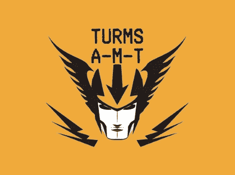
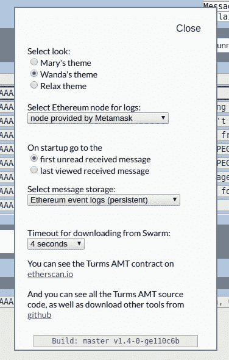
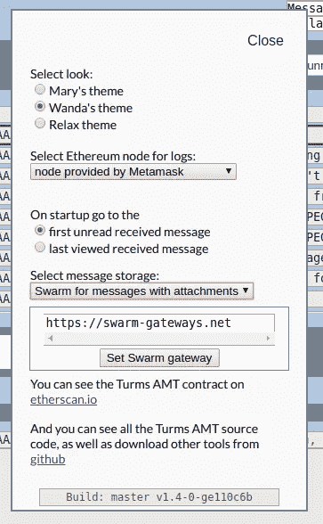

# Turms 匿名消息传输—现在使用 Swarm

> 原文：<https://medium.com/coinmonks/turms-anonymous-message-transport-now-using-swarm-b447e0cd76f2?source=collection_archive---------0----------------------->

我写 DApps。但我能想象的最引人注目的 DApps 需要一个可以集成到智能合同中的消息系统——对于所有令人印象深刻的以太坊开发工作，我无法找到一个可以集成到合同中的消息系统。

所以我写了 Turms AMT(匿名消息传输)。这是一个基于以太坊区块链的点对点、完全加密的匿名消息系统(参见[介绍 Turms 匿名消息传输](/@alejandrodiaz_71295/introducing-turms-anonymous-message-transport-2e40b31dbdc2?source=friends_link&sk=1cdec02ea57b2fd0bb66d5e711d0a256))。在 Turms AMT 的初始版本中，所有消息都作为事件日志存储在以太坊区块链上。我选择这种方法是因为:

1.  这是最简单的技术，有最少的“活动部件”也就是说，以太坊区块链是成熟的、稳定的，代表着突破性发展的最低风险。
2.  我设想的 DApps 需要保证消息存储的持久性——我在考虑一个基于区块链的高价值交易市场——而目前其他分散存储解决方案没有保证持久性。
3.  对于我所设想的应用程序来说，使用事件日志来存储数据并不昂贵，因为它传递的数据比通用邮件系统少得多。(注意:将数据存储在事件日志中比存储在状态 trie 中消耗的气体少得多。)

但自从引入 Turms AMT 后，我意识到启用可选的[群](https://swarm-gateways.net/bzz:/theswarm.eth/)信息数据存储将为其开辟新的应用可能性。今天，我很高兴地宣布，该功能在 Turms AMT 版中可用。

启用消息数据的群存储提供了以下好处:

*   当数据存储在 swarm 上时，发送大型消息要便宜得多。这是因为不管消息的大小，你只需要在区块链上存储群体散列(32 字节)。
*   存储在 Swarm 上的消息的最大大小由 Swarm 网关施加的限制控制。对于 swarm-gateways.net 来说，这大约是以太坊事件日志所能存储的最大数据量的十倍。

当然，当你在 Swarm 上存储消息时，你失去了持久性的保证，所以它并不适合所有的应用程序(比如我现在正在开发的 DApp 分散商务)。

要在 Turms AMT 中启用群组存储，只需打开“选项面板”:

在标记为“选择消息存储”的下拉选择器中，您有三个选项:

1.  默认情况下，将所有消息数据存储为以太坊事件日志。
2.  你的第二个选择是在 Swarm 上存储所有消息数据
3.  最后，您可以选择将任何带有附件的消息存储在 Swarm 上，并将所有其他消息存储为事件日志。

每当您选择在 Swarm 上保存消息数据时，您将有机会指定一个网关:

Turms AMT 还是比 email 慢；而且还是比较贵；并且对用户不太友好。但是现在有了在以太坊区块链或 Swarm 上存储消息数据的能力，我希望它能找到很多应用(包括前面提到的 DApp 商务)。

Turms AMT 是加密的、点对点的、完全 100%去中心化的、智能合同可访问的、假名的——您的以太坊地址是您的接收地址。您可以在以下网址试用:

[https://ipfs.io/ipns/messagetransport.turmsanonymous.io/](https://ipfs.io/ipns/messagetransport.turmsanonymous.io/)

 [## Turms 匿名消息传输

### 没有登录，没有密码，没有服务器，没有下载，没有管理团队，没有公司，没有创始人，没有 ICO…

ipfs.io](https://ipfs.io/ipns/messagetransport.turmsanonymous.io/) 

亚历杭德罗·迪亚兹

> [在您的收件箱中直接获得最佳软件交易](https://coincodecap.com/?utm_source=coinmonks)

