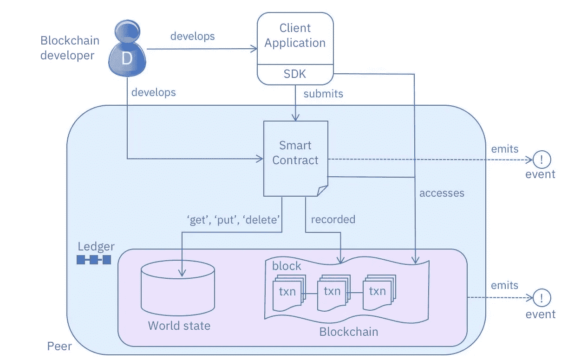

# Hyperledger Fabric Java SDK 上的 Chaincode 事件监听器教程

> 原文：<https://medium.com/coinmonks/tutorial-chaincode-event-listener-on-hyperledger-fabric-java-sdk-557304f1fe28?source=collection_archive---------2----------------------->

大家好！本教程面向所有对 fabric-sdk-java 有一定经验的 Java 开发人员。今天，我想向您展示如何设置一个“Chaincode 事件监听器”,以准确了解您提交的交易最终在区块链中提交的时间，如图中描述的工作流程。

> [发现并回顾最佳区块链软件](https://coincodecap.com)

在进入代码之前，我先给你事件的定义:事件是你将 fabric 与不同系统集成的主要方式。所以由此你可以理解掌握事件的创建、倾听和处理的重要性。



Developer Interaction in Hyperledger Fabric

先决条件是要有一个已经在运行的系统，正如[的](https://medium.com/u/86b31a38e345?source=post_page-----557304f1fe28--------------------------------)[这个教程](/@lkolisko/hyperledger-fabric-sdk-java-basics-tutorial-a67b2b898410)中很好地解释的那样。

有了可以从 Java SDK 调用的工作链代码的基本系统后，就可以开始在代码中包含事件了。

我们需要修改、创建或实现的文件依次是:

1.  **chaincode** —我们需要用[垫片在“PutState”之后设置来自 chaincode 的事件。ChaincodeStubInterface . set event](https://godoc.org/github.com/hyperledger/fabric/core/chaincode/shim#ChaincodeStub.SetEvent)。
2.  **chaincodeventcapture**—我们需要创建这个类来捕获链码事件。
3.  **chaincodeEvents**—这是一个列表，确切地说是当事件来自链码时填充的向量< ChaincodeEventCapture >。
4.  **chaincode event listener**—这是我们需要实现来接收 chaincode 事件的接口。

# 在链码中设置事件(发出事件)

这部分是最简单的一个过程(是啊，谢谢你去！)，你基本上要在 PutState 之后立即添加 SetEvent，让 chaincode 发出事件。关于事件的所有事情在[这个视频](https://www.youtube.com/watch?v=qf7Vr2IgL_Q)里真的解释的很好。

现在重要的是要知道每个事务只能设置一个事件(只有最后一个 SetEvent 会被传输回 SDK)


我展示了一个代码示例，您可以从这个 [repo](https://github.com/pavva91/invokeapi/blob/master/agentInvokeCall.go) 中找到。

```
// tSet Event in the chaincodehis call do the PutState after some checks
agent := a.CreateAgent(agentId, agentName, agentAddress, stub)  
// ==== Agent saved. Set Event ===
eventPayload:="Created Agent: " + agentId
payloadAsBytes := []byte(eventPayload)
eventError := stub.SetEvent("AgentCreatedEvent",payloadAsBytes)
```

添加我们为从链代码部分发出的事件所做的这 3 行代码，现在让我们跳到 Java 客户端应用程序— SDK 部分！

# 创建 ChaincodeEventCapture 类

现在是时候创建类来捕获链码事件了，我从 [fabric-sdk 官方测试](https://github.com/hyperledger/fabric-sdk-java/blob/master/src/test/java/org/hyperledger/fabric/sdkintegration/End2endIT.java)的端到端测试场景中学到了这种方法。

```
public class ChaincodeEventCapture { 
  private final String handle;
  private final BlockEvent blockEvent;
  private final ChaincodeEvent chaincodeEvent;

  public ChaincodeEventCapture(String handle, BlockEvent blockEvent,
      ChaincodeEvent chaincodeEvent) {
    this.handle = handle;
    this.blockEvent = blockEvent;
    this.chaincodeEvent = chaincodeEvent;
  }

  */**
   ** ***@return*** *the handle
   */* public String getHandle() {
    return handle;
  }

  */**
   ** ***@return*** *the blockEvent
   */* public BlockEvent getBlockEvent() {
    return blockEvent;
  }

  */**
   ** ***@return*** *the chaincodeEvent
   */* public ChaincodeEvent getChaincodeEvent() {
    return chaincodeEvent;
  }
}
```

# 创建 ChaincodeEventCapture 列表

这个列表是这种方法的核心，因为它将填充侦听器捕获的事件。

```
Vector<ChaincodeEventCapture> chaincodeEvents = new Vector<>();
```

# 实现链码事件监听器

这个列表是这种方法的核心，因为它将填充侦听器捕获的事件。([此处接口声明](https://github.com/hyperledger/fabric-sdk-java/blob/master/src/main/java/org/hyperledger/fabric/sdk/ChaincodeEventListener.java))

```
ChaincodeEventListener chaincodeEventListener = new ChaincodeEventListener() {

    @Override
    public void received(String handle, BlockEvent blockEvent,     ChaincodeEvent chaincodeEvent) {
        chaincodeEvents.add(new ChaincodeEventCapture(handle, blockEvent, chaincodeEvent));

        String eventHub = blockEvent.getPeer();if(eventHub != null){ 
            eventHub = blockEvent.getPeer().getName()
        } else {
            eventHub = blockEvent.getEventHub().getName();
        }
        // Here put what you want to do when receive chaincode event
        System.out.println("RECEIVED CHAINCODE EVENT with handle: " + handle + ", chaincodeId: " + chaincodeEvent.getChaincodeId() + ", chaincode event name: " + chaincodeEvent.getEventName() + ", transactionId: " + chaincodeEvent.getTxId() +", event Payload: " + new String(chaincodeEvent.getPayload()) + ", from eventHub: " + eventHub)); }
};
```

# 让我们把所有的东西放在一起！

首先，在我的实现中，我创建了封装 ChaincodeEventListener 实现及其注册的方法:

```
public static String setChaincodeEventListener(Channel channel,
    String expectedEventName, Vector<ChaincodeEventCapture> chaincodeEvents)
    throws InvalidArgumentException {

    ChaincodeEventListener chaincodeEventListener = new ChaincodeEventListener() {

        @Override public void received(String handle, BlockEvent blockEvent,
            ChaincodeEvent chaincodeEvent) {// ...the code up...}
    };
    // chaincode events.
    String eventListenerHandle = channel.registerChaincodeEventListener(Pattern.*compile*(".*"),
        Pattern.*compile*(Pattern.*quote*(expectedEventName)), chaincodeEventListener);
    return eventListenerHandle;
}
```

第二，我们去调用链码，因为你已经开始在[这篇文章](/@lkolisko/hyperledger-fabric-sdk-java-basics-tutorial-a67b2b898410)中添加事件处理部分。

```
public boolean createAgent(HFClient clientHF, User userHF, Channel channel, Agent newAgent)
    throws ProposalException, InvalidArgumentException {

    String chaincodeFunctionName = "CreateAgent";

    String agentId = newAgent.getAgentId().toString();
    String agentName = newAgent.getName().toString();
    String agentAddress = newAgent.getAddress().toString();

    String[] chaincodeArguments = new String[] {agentId, agentName, agentAddress};

    Collection<ProposalResponse> successful = new LinkedList<>();
    Collection<ProposalResponse> failed = new LinkedList<>();

    // START CHAINCODE EVENT LISTENER HANDLER----------------------
    String expectedEventName = "AgentCreatedEvent";
    Vector<ChaincodeEventCapture> chaincodeEvents = new Vector<>(); // Test list to capture
    String chaincodeEventListenerHandle =
        SdkIntegration.*setChaincodeEventListener*(channel, expectedEventName, chaincodeEvents);
    // END CHAINCODE EVENT LISTENER HANDLER------------------------

    Collection<ProposalResponse> invokePropResp =
        *writeBlockchain*(clientHF, userHF, channel, chaincodeName, chaincodeFunctionName,
            chaincodeArguments);

    boolean allPeerSucces = *printWriteProposalResponse*(successful, failed, invokePropResp);

    System.*out*.println("successfully received transaction proposal responses.");

    */**
     * Send transaction to orderer only if all peer success
     */

    sendTxToOrderer*(userHF, channel, successful, allPeerSucces);

    // START WAIT FOR THE EVENT-------------------------------------
    boolean eventDone = false;
    eventDone = SdkIntegration
        .*waitForChaincodeEvent*(150, channel, chaincodeEvents, chaincodeEventListenerHandle);
    *log*.info("eventDone: " + eventDone);
    // END WAIT FOR THE EVENT---------------------------------------return allPeerSucces;

}
```

正如您可以在上面的代码中看到的，我们向调用添加了两个部分(在注释中用尾随行突出显示了开始和结束部分:

1.  **在写入区块链**之前，我们首先创建一个空列表，该列表将由 event listener(Vector<chaincode event capture>chaincode events = new Vector<>())填充事件；)其次我们创建 ChaincodeEventListener，调用之前定义的函数(setChaincodeEventListener)。（
2.  **在将(成功的)交易建议发送给订购者**之后—在这一部分中，我们主要等待调用此处显示的 waitForChaincodeEvent 函数的事件，它基本上是一个超时的服务员:

```
public static boolean waitForChaincodeEvent(Integer timeout, Channel channel,
    Vector<ChaincodeEventCapture> chaincodeEvents, String chaincodeEventListenerHandle)
    throws InvalidArgumentException {
    boolean eventDone = false;
    if (chaincodeEventListenerHandle != null) {

        int numberEventsExpected = channel.getEventHubs().size() + channel
            .getPeers(EnumSet.*of*(Peer.PeerRole.*EVENT_SOURCE*)).size();
        *log*.info("numberEventsExpected: " + numberEventsExpected);
        //just make sure we get the notifications
        if (timeout.equals(0)) {
            // get event without timer
            while (chaincodeEvents.size() != numberEventsExpected) {
                // do nothing
            }
            eventDone = true;
        } else {
            // get event with timer
            for (int i = 0; i < timeout; i++) {
                if (chaincodeEvents.size() == numberEventsExpected) {
                    eventDone = true;
                    break;
                } else {
                    try {
                        double j = i;
                        j = j / 10;
                        *log*.info(j + " second");
                        Thread.*sleep*(100); // wait for the events for one tenth of second.
                    } catch (InterruptedException e) {
                        e.printStackTrace();
                    }
                }
            }
        }

        *log*.info("chaincodeEvents.size(): " + chaincodeEvents.size());

        // unregister event listener
        channel.unregisterChaincodeEventListener(chaincodeEventListenerHandle);
        int i = 1;
        // arrived event handling
        for (ChaincodeEventCapture chaincodeEventCapture : chaincodeEvents) {
            *log*.info("Event number. " + i);
            *log*.info("event capture object: " + chaincodeEventCapture.toString());
            *log*.info("Event Handle: " + chaincodeEventCapture.getHandle());
            *log*.info("Event TxId: " + chaincodeEventCapture.getChaincodeEvent().getTxId());
            *log*.info("Event Name: " + chaincodeEventCapture.getChaincodeEvent().getEventName());
            *log*.info("Event Payload: " + chaincodeEventCapture.getChaincodeEvent()
                .getPayload()); // byte
            *log*.info("Event ChaincodeId: " + chaincodeEventCapture.getChaincodeEvent()
                .getChaincodeId());
            BlockEvent blockEvent = chaincodeEventCapture.getBlockEvent();
            try {
                *log*.info("Event Channel: " + blockEvent.getChannelId());
            } catch (InvalidProtocolBufferException e) {
                e.printStackTrace();
            }
            *log*.info("Event Hub: " + blockEvent.getEventHub());

            i++;
        }

    } else {
        *log*.info("chaincodeEvents.isEmpty(): " + chaincodeEvents.isEmpty());
    }
    *log*.info("eventDone: " + eventDone);
    return eventDone;
}
```

为了简单起见，如果您想第一次测试事件处理的工作情况，您可以用这个空 while(我不推荐)替换最后一个函数(waitForChaincodeEvent):

```
 while (chaincodeEvents.isEmpty()) {
            // do nothing
        }
```

现在我们完成了！您正在 hyperledger-fabric Java SDK 上处理 chaincode 事件！


希望这个教程有用！如果是，不要犹豫，给我一个响亮的掌声！；)

再见！

— *瓦莱里奥*

> [直接在您的收件箱中获得最佳软件交易](https://coincodecap.com/?utm_source=coinmonks)

[](https://coincodecap.com/?utm_source=coinmonks)