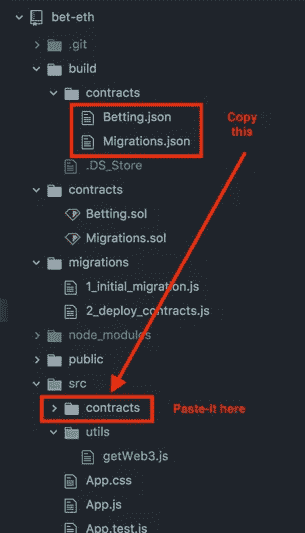
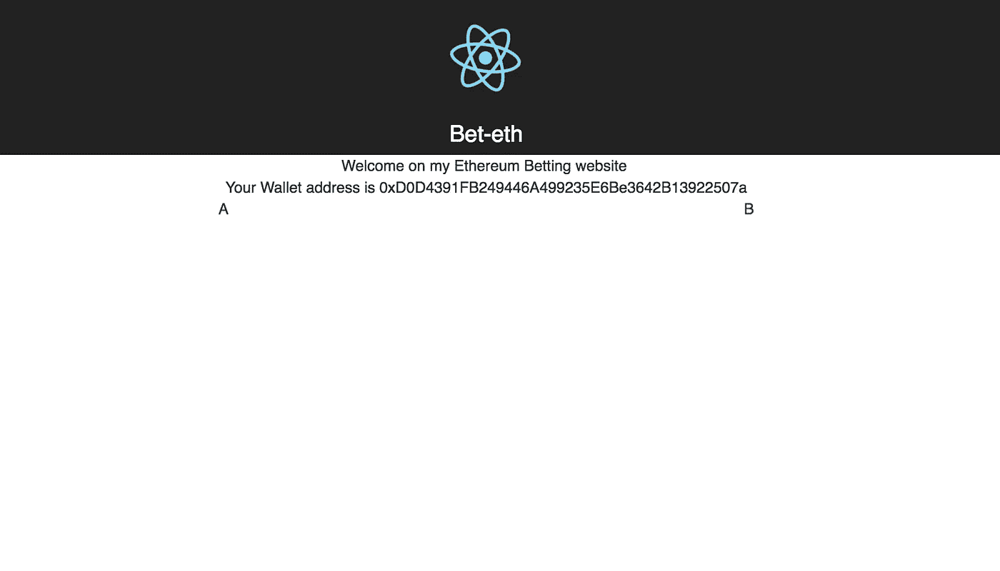
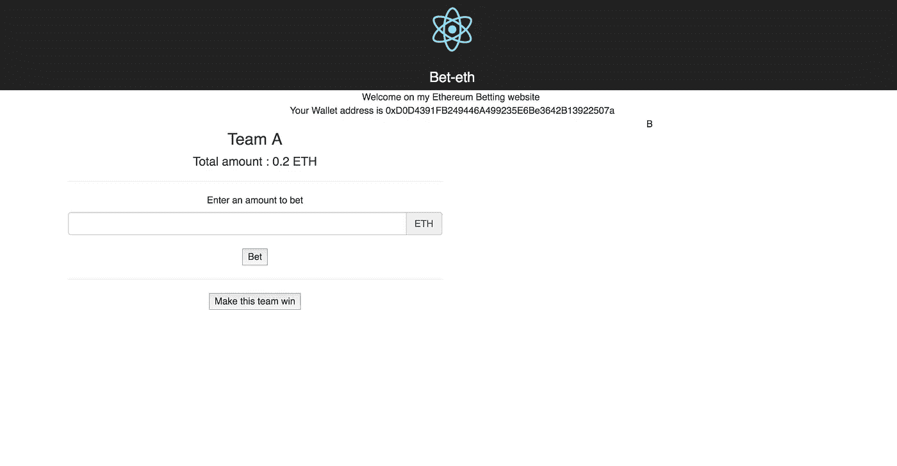
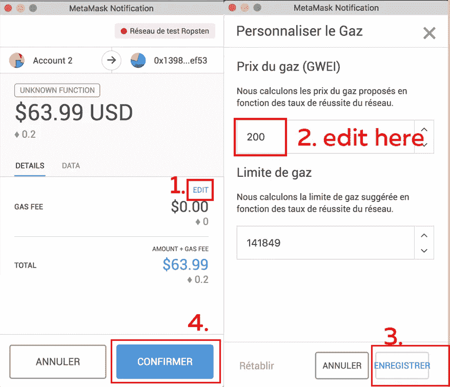
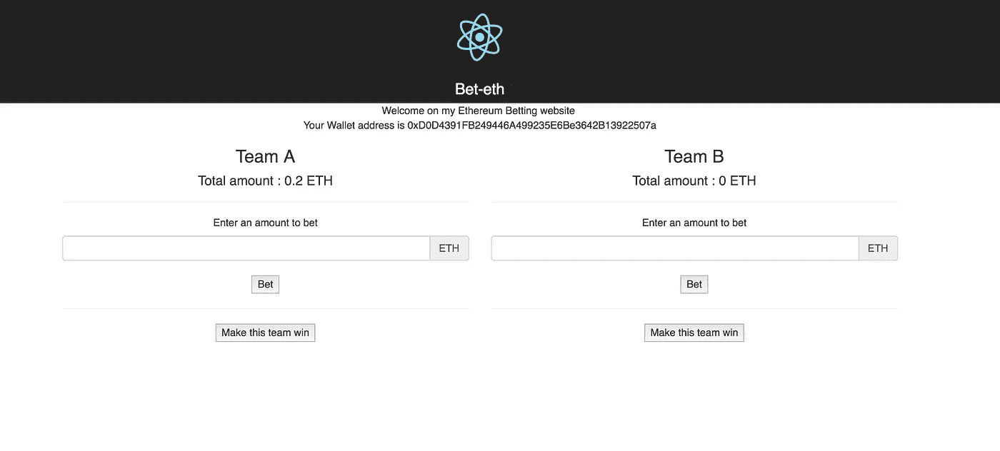

# 教程:在以太坊区块链创建一个体育博彩 dApp(第 2 部分)

> 原文：<https://medium.com/coinmonks/tutorial-create-a-sports-betting-dapp-on-the-ethereum-blockchain-part-2-cd4753afe702?source=collection_archive---------0----------------------->


Source : [https://www.pexels.com/](https://www.pexels.com/)

嘿，大家好，欢迎回来。我们开始开发的体育博彩 dApp 中的 2 个([第一部分在此处可用](/coinmonks/create-a-sports-betting-dapp-on-the-ethereum-blockchain-part-1-1f69f908b939))。这一部分将涵盖所有的前端开发，使用 React 框架。

让我们首先列出前端所需的不同元素:一个 div 显示关于 A 队的信息，一个 div 显示关于 b 队的信息。每个 div 还包含一个输入和一个按钮，允许用户对他喜欢的球队下注。

我们还将制作一个按钮来触发“A 队获胜”或“B 队获胜”事件，将乙醚重新分配给获胜者。对于一个真实的应用程序，这些事件可以链接到一个体育结果 API，以自动更新获胜队。

因为我们使用 React，所以让我们将每个部分分成不同的组件:

*   已经是首页的 App.js ，将包含关于 dApp 的一般信息，并导入其他组件。
*   **TeamA.jsx** ，将包含团队 A 的元素
*   **TeamB.jsx** ，将包含团队 B 的元素

*我个人使用* ***。jsx*** *格式但是可以随意使用自己喜欢的*

用你的终端进入 bet-eth 主文件夹，输入

`cd src`访问 src 文件夹，`touch TeamA.jsx && touch TeamB.jsx`创建这两个文件。

**还记得 web3 吗？我们在零件安装期间。现在我们需要它来使前端与区块链交互。为了加载它，我们将创建一个 **javascript 文件。**我们还将创建一个**文件夹来存放我们在教程的第一部分中创建的已编译的智能合同**。**

还是在 src 文件夹中，键入终端`mkdir utils`，用`touch utils/getWeb3.js`创建 **getWeb3.js** 文件。然后在 src 中创建一个名为`mkdir contracts`的文件夹，并将合同从 **build/contracts** 复制到这个文件夹中，如下图所示。(因为不可能用 React-create-app 访问 src 目录之外的文件)



# 配置 Web3

用您最喜欢的编辑器打开 **getWeb3.js** 文件，插入相同的代码让您的网站检测您正在使用的钱包:在我们的例子中是 Metamask。

```
import Web3 from 'web3'let getWeb3 = new Promise(function(resolve, reject) {
  // Wait for loading completion before loading web3, to be sure it's
  // already injected
  window.addEventListener('load', function() {
    var results
    var web3 = window.web3
    // Checking if Web3 has been injected by the browser MetaMask
    if (typeof web3 !== 'undefined') {
      // Use MetaMask's provider.
      web3 = new Web3(web3.currentProvider)results = {
        web3: web3
      }
      console.log('Injected web3 detected.');
      resolve(results)
    } else {
      // If no web3 is detected, then the local web3 provider is loaded.
      var provider = new Web3.providers.HttpProvider('[http://127.0.0.1:9545'](http://127.0.0.1:9545'))
      web3 = new Web3(provider)
      results = {
        web3: web3
      }
      console.log('No web3 instance injected, using Local web3.');
      resolve(results)
    }
  })
})export default getWeb3
```

# 首页:App.js

现在，从 smart-contract 到 web3 的所有内容都已配置完毕，让我们开始编辑主页，方法是编辑位于/src 中的 App.js。

我们将从导入我们需要的东西开始: **react-bootstrap** ，两个名为 **TeamA.jsx** 和 **TeamB.jsx、**的团队组件以及能够加载 Web3 的 **getWeb3.js** 文件。在 App.js 的顶部编写 imports**中的下一行:**

```
**import** getWeb3 **from** './utils/getWeb3.js';
**import** {Grid,Row,Col} **from** 'react-bootstrap';
**import** TeamA **from** './TeamA.jsx';
**import** TeamB **from** './TeamB.jsx';
```

您可以注意到，在默认的 App.js 文件中，有一个 App 类，包含一个 **render()** 函数。对于那些没有开始使用 React 的人来说，函数 render**用于编写 html 并将其呈现在网页上**。在编辑之前，我们将编写一些新的函数，从该类的**构造函数**开始:

```
import React, { Component } from 'react';
import logo from './logo.svg';
import './App.css';import getWeb3 from './utils/getWeb3.js';
import {Grid,Row,Col} from 'react-bootstrap';
import TeamA from './TeamA.jsx';
import TeamB from './TeamB.jsx';class App extends Component { **constructor(){
    super(); //This is needed in every constructor to allow the use of 'this'****//We define the two variables we need in the state of our component, so they can be updated
    this.state = {
      web3 : '',
      address: '',
    };
  }**render() {
    return (
      <div className="App">
        <header className="App-header">
          
          <h1 className="App-title">Bet-eth</h1>
        </header>
        <p className="App-intro"></p>
      </div>
    );
  }
}export default App;
```

在构造函数之后，我们将使用来自 React 生命周期函数的 **ComponentDidMount()** 函数。这个函数是在组件挂载后直接调用的，我们可以用它来**加载 Web3。**

我们将通过连锁承诺来做到这一点。承诺是异步任务，我们可以将它们链接起来，按照选定的顺序完成所需的任务。在这个链上，我们有两个承诺:第一个是将 web3 加载到也称为 web3 的状态变量中(用户地址也被保存)，第二个是调用 getAmount()函数。


Schema from developer.mozilla.org

```
import React, { Component } from 'react';
import logo from './logo.svg';
import './App.css';import getWeb3 from './utils/getWeb3.js';
import {Grid,Row,Col} from 'react-bootstrap';
import TeamA from './TeamA.jsx';
import TeamB from './TeamB.jsx';class App extends Component {
  constructor(){
    super();
    this.state = {
      web3 : '',
      address: '',
    };
  }**componentDidMount() {
    getWeb3.then(results => {
      /*After getting web3, we save the informations of the web3 user by
      editing the state variables of the component */
      results.web3.eth.getAccounts( (error,acc) => {
        //this.setState is used to edit the state variables
        this.setState({
          address: acc[0],
          web3: results.web3
        })
      });
    }).catch( () => {
      //If no web3 provider was found, log it in the console
      console.log('Error finding web3.')
    })
  }**render() {
    return (
      <div className="App">
        <header className="App-header">
          
          <h1 className="App-title">Bet-eth</h1>
        </header>
        <p className="App-intro"></p>
      </div>
    );
  }
}export default App;
```

## 添加一些元素

让我们编辑 **render()** 函数来显示页面的一些元素。


当我们使用 react-bootstrap 时，我们需要在我们的 html 页面上导入样式表，就像我们在基本的 html 网站上做的那样。react 组件渲染的 html 页面是***index.html****，位于****public/****文件夹。打开后添加:*

```
*<link rel="stylesheet" href="*[*https://maxcdn.bootstrapcdn.com/bootstrap/3.3.7/css/bootstrap.min.css*](https://maxcdn.bootstrapcdn.com/bootstrap/3.3.7/css/bootstrap.min.css)*" integrity="sha384-BVYiiSIFeK1dGmJRAkycuHAHRg32OmUcww7on3RYdg4Va+PmSTsz/K68vbdEjh4u" crossorigin="anonymous">*
```

*在* `*<head> </head>*` *块之间。*

让我们回到 **index.js** ，编辑位于 render()函数中的 html 代码**。**我添加了一个简单的短语来表示网站，一行显示用户钱包地址(可以调用状态变量 address)，一行包含两列，**每列对应一个团队**。我们将在这些行中导入每个团队组件(TeamA 和 TeamB)。

```
import React, { Component } from 'react';
import logo from './logo.svg';
import './App.css';import getWeb3 from './utils/getWeb3.js';
import {Grid,Row,Col} from 'react-bootstrap';
import TeamA from './TeamA.jsx';
import TeamB from './TeamB.jsx';class App extends Component {
  constructor(){
    super();
    this.state = {
      web3 : '',
      address: '',
    };
  }componentDidMount() {
    getWeb3.then(results => {
      /*After getting web3, we save the informations of the web3 user by
      editing the state variables of the component */
      results.web3.eth.getAccounts( (error,acc) => {
        //this.setState is used to edit the state variables
        this.setState({
          address: acc[0],
          web3: results.web3
        })
      });
    }).catch( () => {
      //If no web3 provider was found, log it in the console
      console.log('Error finding web3.')
    })
  }**render() {
    return (
      <div className="App">****<header className="App-header">
          
          <h1 className="App-title">Bet-eth</h1>
        </header>
        <div>
          Welcome on my Ethereum Betting website <br/>
        Your Wallet address is {this.state.address}
        </div>
        {/*We define a grid*/}
        <Grid>
          {/*corresponding to class="row"*/}
          <Row>
            {/* we define the two columns. The bootstrap grid is divided by 12
            parts so if we want two columns, they will take 6 parts each */}
            <Col xs={6} sm={6}>A {/*We will import Team A component here */}</Col>
            <Col xs={6} sm={6}>B {/*We will import Team B component here */}</Col>
          </Row>
        </Grid>****</div>
    );
  }**
}export default App;
```

完成所有这些步骤后，网站看起来应该是这样的(在终端上键入`npm start`启动它)，显示您当前的钱包地址:



front page

如果看不到任何地址，请确保您已正确登录元掩码。

# 团队 A 组件

让我们为第一个团队 Team A 创建组件:打开 TeamA.jsx。

该组件需要四个不同功能:

*   **()**，允许玩家下注
*   **getAmount()** ，看看队伍里已经打了多少醚
*   **setWinner()，**设定获胜的队伍
*   **handleInputChange()** ，控制用户输入他想要下注的数值。

和往常一样，让我们从导入文件顶部所需的内容开始:

```
**import** React, { Component } **from** 'react';
**import** {Grid,Row,Col} **from** 'react-bootstrap';
**import** getWeb3 **from** './utils/getWeb3.js';
**import** BettingContract **from** './contracts/Betting.json';
**import** './App.css';
```

与 **App.js** 唯一值得注意的区别是**我们还导入了智能合同，因此我们可以与之交互。**

导入之后，让我们在一个类中定义 React 组件:

```
import React, { Component } from 'react';
import {Grid,Row,Col} from 'react-bootstrap';
import getWeb3 from './utils/getWeb3.js';
import BettingContract from './contracts/Betting.json';
import './App.css';**class TeamA extends Component {****}****export default TeamA;**
```

然后，对于 App.js，让我们用我们需要的不同状态变量来编写构造函数:

*   **web3** ，用于存储 web3 实例。
*   **金额**，存储当前一个团队的总出场金额。
*   **InputAmount** ，存储玩家想要下注的乙醚量。
*   **weiConversion** ，将 wei 转换成醚，有更好的用户体验*(1 ETH = 10000000000000 Wei)*。

```
constructor(){
    super();
    this.state={
      web3: '',
      Amount: '',
      InputAmount: '',
      weiConversion : 1000000000000000000
    }
  }
```

下一步是**加载 web3** ，用生命周期 **ComponentDidMount()** 函数。至于 App.js，承诺是连锁的。

第一个承诺返回加载的 web3。在第二个承诺中，调用 getAmount()函数，传递结果 var(包含 web3 ),这样我们就可以在 getAmount()函数中使用它。

为什么将变量传递给函数而不使用我们刚刚保存的 web3 状态变量？因为当我们调用函数时，我们仍然在 ComponentDidMount()中，TeamA 组件的状态没有更新，调用`this.state.web3`仍然会返回空值。

```
componentDidMount(){
    getWeb3.then(results => {
      /*After getting web3, we save the informations of the web3 user by
      editing the state variables of the component */
      results.web3.eth.getAccounts( (error,acc) => {
        //this.setState is used to edit the state variables
        this.setState({
          web3: results.web3
        })
      });
      //At the end of the first promise, we return the loaded web3
      return results.web3
    }).then(results => {
      //In the next promise, we pass web3 (in results) to the getAmount function
      this.getAmount(results)
    }).catch( () => {
      //If no web3 provider was found, log it in the console
      console.log('Error finding web3.')
    })
  }
```

现在让我们编写 getAmount 函数:

```
getAmount(**web3**){
    //Get the contract
    const contract = require('truffle-contract');
    const Betting = contract(BettingContract);
    Betting.setProvider(**web3**.currentProvider);
    var BettingInstance;
    **web3**.eth.getAccounts((error, accounts) => {
    Betting.deployed().then((instance) => {//Instantiate the contract in a promise
      BettingInstance = instance}).then((result) => {
      //Calling the AmountOne function of the smart-contract
      return BettingInstance.AmountOne.call({from: accounts[0]})
    }).then((result) => {
      //Then the value returned is stored in the Amount state var.
      //Divided by 10000 to convert in ether.
      this.setState({
        Amount : result.c / 10000
      })
    });
  })
  }
```

正如您所看到的，当我们将这个函数调用到 ComponentDidMount()函数中时，我们使用了传递的 web3 变量。

首先，我们得到合同，并装入块菌合同。然后，我们在当前加载的提供者上设置契约的提供者(在我们的例子中是元掩码)。在第一个 Javascript promise 中，我们实例化了契约，然后在下一个中，我们从智能契约中调用 AmountOne()函数。我们使用`from: accounts[0]`,因此该函数由您正在使用的元掩码帐户调用。
最后，我们用智能合同函数给出的结果编辑金额状态值。


*正如我们在上面的函数中使用* `*this*` *一样，我们需要在构造函数中绑定它，因为我们希望* `*this*` *引用 App，而不是函数，当我们调用* `*this.setState*` *时。*

*所以在 TeamA.jsx 的构造函数中添加一行* `*this.getAmount = this.getAmount.bind(this);*` *我们将不得不为接下来要写的所有函数这样做。*

用于对团队下注的 **Bet()** 函数与 getAmount 函数非常相似:

```
Bet(){
    const contract = require('truffle-contract');
    const Betting = contract(BettingContract);
    Betting.setProvider(this.state.web3.currentProvider);
    var BettingInstance;
    this.state.web3.eth.getAccounts((error, accounts) => {
        Betting.deployed().then((instance) => {
          BettingInstance = instance
        }).then((result) => {
          // Get the value from the contract to prove it worked.
          **return BettingInstance.bet(1, {from: accounts[0],
          value: this.state.InputAmount})**
        }).catch(() => {
          console.log("Error with betting")
        })
      })
  }
```

首先，契约被加载、实例化，然后我们从智能契约中调用我们想要的函数:这里是“bet”。这里的调用有点不同，因为我们有一个参数要传递给函数。正如我们在第 1 部分中所定义的，int " **1** 定义了团队 A 的**，int " **2** 定义了团队 B** 。因此，由于我们想在此函数中对**团队 A** 下注，我们将在函数的参数中传递“ **1** ”。第二个区别是，我们向函数传递一个值，向契约发送 ethers。我们使用`**value : this.state.InputAmount**`，因为**值存储在状态变量 InputAmount** 中。

*不要忘记在构造函数*中添加 `*this.bet = this.bet.bind(this);*`

***MakeWin()** 函数将用于让团队获胜，并测试我们的应用程序是否工作良好*(例如，该函数可能由返回游戏结果的 API 触发，但我们将为其制作一个按钮)*。*

```
*MakeWin(){
    const contract = require('truffle-contract');
    const Betting = contract(BettingContract);
    Betting.setProvider(this.state.web3.currentProvider);
    var BettingInstance;
    this.state.web3.eth.getAccounts((error, accounts) => {
        Betting.deployed().then((instance) => {
          BettingInstance = instance
        }).then((result) => {
          **return BettingInstance.distributePrizes(1, {from: accounts[0]})**
        }).catch(() => {
          console.log("Error with distributing prizes")
        })
      })
  }*
```

*功能还是和其他类似，我们传 **1** 进去论证，因为是**A 队**。*

**别忘了在构造函数里加上* `*this.MakeWin = this.MakeWin.bind(this);*` *。**

*最后还要写一个小函数， **HandleInputChange()** ，改变状态变量 **InputAmount** 的值(即。某人想要在一个队上下注的数额)取决于用户在输入中写的内容。*

```
*handleInputChange(e) {
    this.setState({InputAmount: e.target.value*this.state.weiConversion});
  }*
```

**这是一个非常简单的函数，但是只有像往常一样将它绑定到构造函数时才会起作用:* `*this.handleInputChange = this.handleInputChange.bind(this);*`*

*现在我们可以编写 **render()** 函数，其中包含所有与我们之前编写的函数交互的组件:*

```
*render(){
        return(
          <div>
            <h3>Team A</h3>
            <h4> Total amount : **{this.state.Amount}** ETH</h4>
            <hr/>
            <h5> Enter an amount to bet</h5>
            <div className="input-group">
                    <input type="text" className="form-control" **onChange={this.handleInputChange}** required pattern="[0-9]*[.,][0-9]*"/>
                    <span className="input-group-addon">ETH</span>
            </div>
            <br/>
            <button **onClick={this.Bet}**>Bet</button>
            <br/>
            <hr/>
            <button **onClick={this.MakeWin}**> Make this team win</button>
          </div>
        )}*
```

*如你所见，有:*

*   *关于该队下注总额的信息*
*   *编辑用户想要下注的值的输入(所需的模式只允许用户下注 int 或 floats)*
*   *一个**下注**按钮，调用**下注()**函数*
*   *一个按钮**使团队获胜**，调用 **MakeWin()** 函数*

*团队 A 组件现在已经完成。返回到渲染函数中的 **App.js** 。**在 Team A div 应该出现的 col 中，写上** `**<TeamA/>**` **。***

*运行`npm start`查看结果:*

**

*你可以试着在队伍上下注，就像我在上面截图上用 0.2 醚做的那样。如果你在输入栏中填入你想要的金额，然后点击“下注”,一个 Metamask 界面将会打开:将油费编辑为大约 100-200 GWEI，然后点击“确认”。*

**

*Metamask interface, in french.*

*当交易将被确认时(我花了 15 秒)，它将在元掩码上显示如下:*

**

*这里是 TeamA.jsx 的完整代码*

# *团队 B 组件*

***B 队组件与 A 队**几乎相同，你只需调用与 A 队相同的函数，但对于另一个队，将 **AmountOne()** 替换为 **AmountTwo()** 并将**Bet()**和 **MakeWin()** 函数中的参数 1 替换为 2 。*

*[下面是 TeamB.jsx 代码](https://github.com/StephaneGcrd/bet-eth/blob/master/src/TeamB.jsx)*

*让我们把它导入到 **App.js** 中，就像我们为 TeamA 所做的那样，在右边的列中写上`<TeamB/>`，dApp 就结束了！*

**

*Our beautiful website*

*你可以用不同的账户玩它，让它变得更漂亮，甚至可以部署在你的 serveur 上，这样你就可以和你的朋友一起玩了*(下注后别忘了重新加载页面)*。*

*完整的项目可在此处获得:*

*[https://github.com/StephaneGcrd/bet-eth](https://github.com/StephaneGcrd/bet-eth)*

*如果您有任何问题或疑问，请随时联系我，我将乐意回答:)*

> *[在您的收件箱中直接获得最佳软件交易](https://coincodecap.com/?utm_source=coinmonks)*

*[](https://coincodecap.com/?utm_source=coinmonks)*