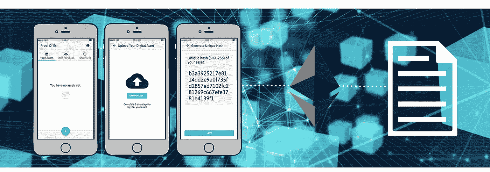

# 教程——如何将 JavaScript 前端连接到以太坊上的智能合约

> 原文：<https://medium.com/coinmonks/tutorial-how-to-connect-a-javascript-front-end-to-a-smart-contract-6af4bdf45f7a?source=collection_archive---------2----------------------->

*我叫马克，我开发了* [*的概念。金融*](https://notional.finance/) *，一款基于以太坊打造的全新 DeFi 应用。加入我的脸书群"* [*6 位数区块链开发者*](https://www.facebook.com/groups/583659522577259/) *"获取全球最大智能合约平台以太坊区块链开发最新培训。*

www.fullstackdapps.com

# 介绍