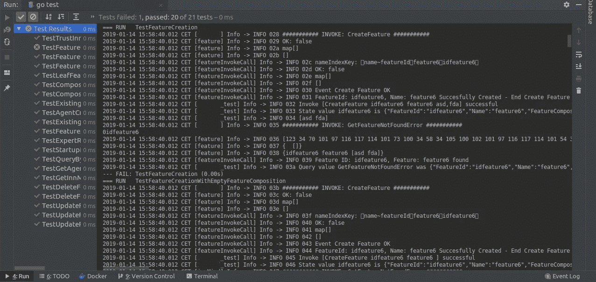

# Hyperledger Fabric 上的链码单元测试教程

> 原文：<https://medium.com/coinmonks/tutorial-on-hyperledger-fabrics-chaincode-testing-44c3f260cb2b?source=collection_archive---------1----------------------->

大家好！你正在寻找如何在 Hyperledger Fabric 中整合一个单元测试套件来改进链码开发吗？我在这里向您解释我是如何用 golang 创建测试环境的，这使我能够真正加速链代码的开发，因为这样您甚至不再需要设置开发环境(当然，如果您设计了一个好的测试套件)。

我是这样组织教程的:

1.  **MockStub** — Shim 包，为链代码提供 API 以访问其状态变量、事务上下文并调用其他链代码( [wiew source](https://github.com/hyperledger/fabric/blob/release-1.4/core/chaincode/shim/mockstub.go#L29) )。
2.  **Go 测试** —包测试为 Go 包的自动化测试提供支持。它旨在与“go test”命令配合使用，该命令自动执行任何功能([官方 go 文档](https://golang.org/pkg/testing/))。
3.  测试套件 —本教程的核心，我将展示我是如何实现我的测试套件的。

# 模拟存根

如前所述，MockStub 是 shim 包，它允许创建测试函数来直接测试链代码函数。

# 去测试

谢天谢地，从我们的角度来看，围棋测试非常非常简单。要运行测试套件，您只需在测试套件所在的存储库中运行命令:

```
go test
```

# 测试套

要编写一个新的测试套件，创建一个名为 ends _test.go 的文件，其中包含 TestXxx 函数，在我们的例子中是 <chaincode_name>_test.go</chaincode_name>

```
<chaincodeName>_test.go
```

现在我们深入了解我是如何使用 MockStub 功能开发一些专门针对链代码开发的测试函数的。

## 测试记录器

首先，我将记录器设置为打印有用的信息:

```
**var** testLog = shim.NewLogger("<chaincodeName>_test")
```

## 测试比较

之后，我开发了一个由一些嵌入了比较的函数组成的小“库”,以加速实际测试的开发:

*   检查状态
*   检查状态
*   检查查询
*   checkBadQuery
*   检查调用
*   checkBadInvoke

我们将详细研究所有这些函数。

*   检查状态:

```
**func** checkState(t *testing.T, stub *shim.MockStub, name string, value string) {
   bytes := stub.State[name]
   **if** bytes == nil {
      testLog.Info("State", name, "failed to get value")
      t.FailNow()
   }
   **if** string(bytes) != value {
      testLog.Info("State value", name, "was", string(bytes), "and not", value, "as expected")
      t.FailNow()
   } **else** {
      testLog.Info("State value", name, "is", string(bytes), "as expected")
   }
}
```

*   检查状态:

```
**func** checkNoState(t *testing.T, stub *shim.MockStub, name string) {
   bytes := stub.State[name]
   **if** bytes != nil {
      testLog.Info("State", name, "should be absent; found value")
      t.FailNow()
   } **else** {
      testLog.Info("State", name, "is absent as it should be")
   }
}
```

*   检查查询(1，2，…，n 个参数):

—对于 1 个参数:

```
**func** checkQueryOneArg(t *testing.T, stub *shim.MockStub, function string, argument string, value string) {
   res := stub.MockInvoke("1", [][]byte{[]byte(function), []byte(argument)})
   **if** res.Status != shim.*OK* {
      testLog.Info("Query", function, "failed", string(res.Message))
      t.FailNow()
   }
   **if** res.Payload == nil {
      testLog.Info("Query", function, "failed to get value")
      t.FailNow()
   }
   payload := string(res.Payload)
   **if** payload != value {
      testLog.Info("Query value", function, "was", payload, "and not", value, "as expected")
      t.FailNow()
   } **else** {
      testLog.Info("Query value", function, "is", payload, "as expected")
   }
}
```

—对于两个参数:

```
**func** checkQueryTwoArgs(t *testing.T, stub *shim.MockStub, function string, argument1 string, argument2 string, value string) {
   res := stub.MockInvoke("1", [][]byte{[]byte(function), []byte(argument1), []byte(argument2)})
   **if** res.Status != shim.*OK* {
      testLog.Info("Query", function, "failed", string(res.Message))
      t.FailNow()
   }
   **if** res.Payload == nil {
      testLog.Info("Query", function, "failed to get value")
      t.FailNow()
   }
   payload := string(res.Payload)
   **if** payload != value {
      testLog.Info("Query value", function, "was", payload, "and not", value, "as expected")
      t.FailNow()
   } **else** {
      testLog.Info("Query value", function, "is", payload, "as expected")
   }
}
```

我们可以注意到，差别仅仅在于函数调用中参数的数量，所以我们可以很容易地推广到 n…

*   checkBadQuery:

```
**func** checkBadQuery(t *testing.T, stub *shim.MockStub, function string, name string) {
   res := stub.MockInvoke("1", [][]byte{[]byte(function), []byte(name)})
   **if** res.Status == shim.*OK* {
      testLog.Info("Query", function, "unexpectedly succeeded")
      t.FailNow()
   } **else** {
      testLog.Info("Query", function, "failed as espected, with message: ", res.Message)

   }
}
```

*   checkInvoke:

```
**func** checkInvoke(t *testing.T, stub *shim.MockStub, functionAndArgs []string) {
   functionAndArgsAsBytes := lib.ParseStringSliceToByteSlice(functionAndArgs)
   res := stub.MockInvoke("1", functionAndArgsAsBytes)
   **if** res.Status != shim.*OK* {
      testLog.Info("Invoke", functionAndArgs, "failed", string(res.Message))
      t.FailNow()
   } **else** {
      testLog.Info("Invoke", functionAndArgs, "successful", string(res.Message))
   }
}
```

*   checkBadInvoke:

```
**func** checkBadInvoke(t *testing.T, stub *shim.MockStub, functionAndArgs []string) {
   functionAndArgsAsBytes := lib.ParseStringSliceToByteSlice(functionAndArgs)
   res := stub.MockInvoke("1", functionAndArgsAsBytes)
   **if** res.Status == shim.*OK* {
      testLog.Info("Invoke", functionAndArgs, "unexpectedly succeeded")
      t.FailNow()
   } **else** {
      testLog.Info("Invoke", functionAndArgs, "failed as espected, with message: "+res.Message)
   }
}
```

## 测试链码函数(示例)

现在，让我们继续对 chaincode 的功能进行真正的测试，例如，让我们以 chaincode 的一般“CreateFeature”功能为例:

```
//==================================================================
// TestFeatureCreation - Test the 'CreateFeature' function
// =================================================================
**func** TestFeatureCreation(t *testing.T) {
   simpleChaincode := new(SimpleChaincode)
   simpleChaincode.testMode = *true* mockStub := shim.NewMockStub("Test Feature Creation", simpleChaincode)

   **var** functionAndArgs []string
   functionName := *CreateFeature* // Invoke 'CreateFeature'
   featureId := *NewFeatureId* featureName := *NewFeatureName* args := []string{featureId, featureName}
   functionAndArgs = append(functionAndArgs, functionName)
   functionAndArgs = append(functionAndArgs, args...)

   checkInvoke(t, mockStub, functionAndArgs)

   feature := &a.Feature{FeatureId: featureId, Name: featureName}
   featureAsBytes, _ := json.Marshal(feature)

   checkState(t, mockStub, featureId, string(featureAsBytes))

   expectedResponse := "{\"FeatureId\":\"" + featureId + "\",\"Name\":\"" + featureName + "\",\"FeatureComposition\":null}" checkQueryOneArg(t, mockStub, "GetFeature", featureId, expectedResponse)
}
```

我们在这个测试函数中检查两件事:

*   Invoke —直接调用 checkInvoke，向其传递 function 和 Args。
*   查询—我们调用“GetFeature ”,并放置我们期望的响应 JSON 字符串。

如果一切顺利，我们将看到嵌入日志的输出，并以:

```
- - - PASS: TestFeatureCreation (0.00s)
```

如果一切顺利的话。

或者是:

```
- - - FAIL: TestFeatureCreation (0.00s)
```

如果有什么与我们的期望不同。在这种情况下，如果我们正确地设置日志，我们可以看到失败的来源，同样:

```
2019–01–14 15:48:26.198 CET [innMind_test] Info -> INFO 013 Query value GetFeatureNotFoundError was {“FeatureId”:”idfeature1",”Name”:”Color"} and not {“FeatureId”:”idfeature1",”Name”:”Shape"} as expected
```

我们可以很容易地发现，预期的特征的名称是“形状”，但我们得到的是“颜色”。

最后，我展示了如何看一个测试套件:



如果您也认为可以利用 Init 函数用您需要的所有数据填充测试分类帐来模拟您脑海中的任何场景，那么您就可以很容易地理解这是如何加速开发的。我们将在另一篇文章中讨论如何初始化分类帐。

我希望这篇教程给了你一个开始测试你的链码的简单介绍！如果是，不要犹豫，给我一个响亮的掌声！；)

再见！

— *瓦莱里奥*

> [在您的收件箱中直接获得最佳软件交易](https://coincodecap.com/?utm_source=coinmonks)

[](https://coincodecap.com/?utm_source=coinmonks)