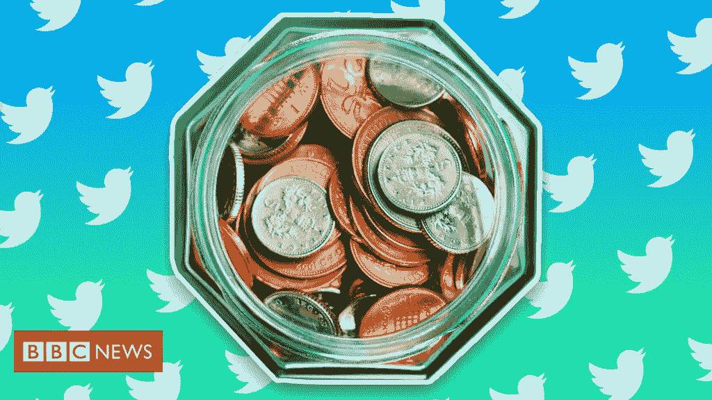
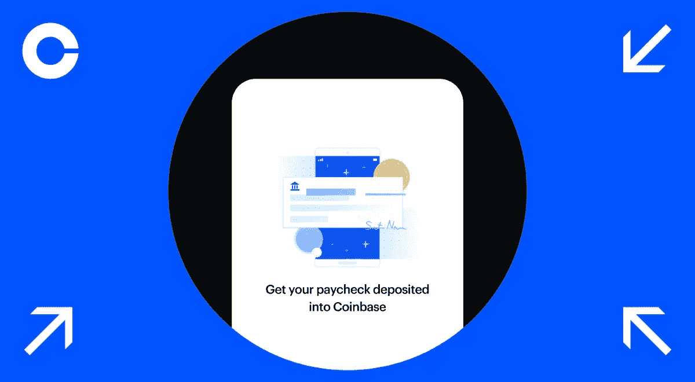
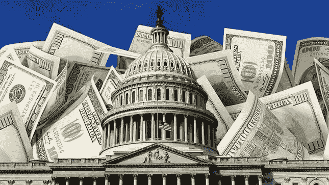

# 推特小费，比特币基地工资单，中国禁令，债务上限…

> 原文：<https://medium.com/coinmonks/twitter-tipping-coinbase-payroll-china-bans-debt-ceiling-8c7e1df12a1?source=collection_archive---------8----------------------->

# 大比特币新闻周！

**Twitter 启用比特币小费**

就在本周四，Twitter 启用了第三方小费服务，利用像 **Strike** 这样的公司，让用户能够几乎即时地向世界各地汇款。Twitter 的“小费罐”将利用闪电网络平台，使 Twitter 成为全球最高效的资金转移平台之一。

Strike 公司 23 岁的首席执行官**杰克·马勒斯**说，“Twitter 与 AOI Strike 公司的整合使 Twitter 成为世界上最好的汇款体验之一，世界上最伟大的全球支付体验之一，并允许互联网通信公司与世界货币标准互通。”

Twitter 在一份声明中表示，他们“没有参与资金流动”，也不会从汇款中收取任何佣金。马勒斯上周四在 Twitter 上发布了一段视频，展示了这项服务，视频显示比特币通过 Twitter 从芝加哥即时发送到萨尔瓦多。

这一声明引发了人们的猜测，如果 Twitter 在全球汇款业务中占据相当大的份额，鉴于主要参与者的市值，单个比特币的价值可能会超过 30 万美元。*(彼得·查瓦加，比特币杂志，9 月 25 日。)*

**比特币基地允许支票存款**

拥有超过 6800 万用户的加密货币交易所巨头比特币基地周一宣布，他们将开始允许用户将工资的任何比例存入他们的在线比特币基地账户。用户将能够立即将他们的法定美元直接转换成比特币等加密货币，而无需支付任何费用。

比特币基地表示，将与一家受 FDIC 保险的银行合作提供直接存款服务，但没有透露是哪家银行。此举推动上市公司比特币基地更深地进入传统金融服务领域，同时监管机构正在审查它们的加密贷款平台。

PayPal、Robinhood 和 SoFi 等其他金融服务公司也允许用户存入他们的工资支票。此举将比特币基地定位为提供全面加密货币服务的主要参与者之一。比特币基地产品副总裁 Max Branzburg 表示:“我们决心为我们的 6800 万用户提供最值得信赖的全套加密优先金融服务。”

**中国禁止所有加密交易**

似曾相识的感觉又来了。

中华人民共和国已经无数次禁止了一些或所有形式的加密货币活动。最近，中国禁止了该国许多省份的比特币挖矿活动，并在几年内禁止了各种加密活动。2013 年，该国禁止银行处理比特币交易，2017 年，该国封锁了所有初始硬币发行和加密交换。

本周宣布禁止所有加密货币交易之际，中国正计划推出自己的央行数字货币。数字货币电子支付(DCEP)将使用区块链技术，但所有数据都是集中控制的，将由政府保留。

许多人认为，中国有意退出比特币世界，将为其他国家在比特币领域的蓬勃发展提供更多机会。美国参议员 Pat Toomey (R-PA)在推特上表示，这将为美国在加密领域的发展提供更多空间。“中国对包括比特币在内的加密技术的专制打击，对美国来说是一个巨大的机遇，”图米说。嘉宝川崎财富管理公司首席执行官罗斯·嘉宝说，“中国的决定有效地将他们与未来的货币体系隔离开来。”他补充道，“这对比特币来说是个好消息。我们最不希望看到的就是中国被卷入一种世界货币之中。”

国会会提高债务上限吗？

下一财年，美国政府计划支出 6.8 万亿美元。

他们将不得不借其中的 3 万亿美元。(不是错别字。)

每隔几年，国会必须投票提高国家的债务上限，否则他们无法借到支付账单所需的资金。迄今为止，国会中的共和党人已经表示，他们不会批准提高借款限额，抗议他们认为拜登政府下的支出失控。交通堵塞。

这可能是过去 20 年中第四次提高上限，最后一次是在 2013 年。没人相信借款限额不会提高，也没人相信政府会完全关门。

但是，如果呢？就像，真的，如果？那么，在短期内，美国的国内生产总值将大幅下降，因为 3 万亿美元相当于美国国内生产总值的 15%。下一个财政年度不会花费的真正的钱。然而，没有印钞机的嗡嗡声，3 万亿美元不会以通货膨胀和购买力下降的形式从美国储蓄中抽走。长远，为民者胜。

还有，处理我们现在 29 万亿美元的国债有什么选择？嗯，有三个，其中两个华盛顿不会考虑。首先，政府可能部分或全部违约。永远不会发生。你会说全球经济衰退。第二，政府支出可能会在未来几年削减 30%左右，从而使美国陷入严重衰退。同样，不会发生。

唯一的选择是在未来十年左右积极(但不要太大声)推动通胀。你知道，用更便宜的美元偿还债务。这是你的赢家，一个把罐子踢到路边的政府游戏。

至少可以说，这很好地为有固定供应的价值储存做好了准备。一种在通货膨胀时期不会贬值的资产类别。你猜对了。比特币。黄金 2.0。

订阅 Substack——永远免费！

> 加入 Coinmonks [电报频道](https://t.me/coincodecap)和 [Youtube 频道](https://www.youtube.com/c/coinmonks/videos)了解加密交易和投资

## 另外，阅读

*   [网格交易机器人](https://blog.coincodecap.com/grid-trading) | [Cryptohopper 审查](/coinmonks/cryptohopper-review-a388ff5bae88) | [Bexplus 审查](https://blog.coincodecap.com/bexplus-review)
*   [币安期货交易](https://blog.coincodecap.com/binance-futures-trading)|[3 comas vs Mudrex vs eToro](https://blog.coincodecap.com/mudrex-3commas-etoro)
*   [如何购买 Monero](https://blog.coincodecap.com/buy-monero) | [IDEX 评论](https://blog.coincodecap.com/idex-review) | [BitKan 交易机器人](https://blog.coincodecap.com/bitkan-trading-bot)
*   [尤霍德勒 vs 考尼洛 vs 霍德诺特](/coinmonks/youhodler-vs-coinloan-vs-hodlnaut-b1050acde55a) | [Cryptohopper vs 哈斯博特](https://blog.coincodecap.com/cryptohopper-vs-haasbot)
*   [顶级付费加密货币和区块链课程](https://blog.coincodecap.com/blockchain-courses) | [币安评论](/coinmonks/binance-review-ee10d3bf3b6e)
*   [MXC 交易所评论](/coinmonks/mxc-exchange-review-3af0ec1cba8c) | [Pionex vs 币安](https://blog.coincodecap.com/pionex-vs-binance) | [Pionex 套利机器人](https://blog.coincodecap.com/pionex-arbitrage-bot)
*   [如何在印度购买比特币？](/coinmonks/buy-bitcoin-in-india-feb50ddfef94) | [WazirX 评论](/coinmonks/wazirx-review-5c811b074f5b) | [BitMEX 评论](https://blog.coincodecap.com/bitmex-review)
*   [印度的加密交易所](/coinmonks/bitcoin-exchange-in-india-7f1fe79715c9) | [比特币储蓄账户](/coinmonks/bitcoin-savings-account-e65b13f92451)
*   [币安收费](/coinmonks/binance-fees-8588ec17965) | [僵尸加密审查](/coinmonks/botcrypto-review-2021-build-your-own-trading-bot-coincodecap-6b8332d736c7) | [热点审查](/coinmonks/hotbit-review-cd5bec41dafb)
*   [币安 vs 比特邮票](https://blog.coincodecap.com/binance-vs-bitstamp) | [比特熊猫 vs 比特币基地 vs Coinsbit](https://blog.coincodecap.com/bitpanda-coinbase-coinsbit)
*   [如何购买 Ripple (XRP)](https://blog.coincodecap.com/buy-ripple-india) | [非洲最好的加密交易所](https://blog.coincodecap.com/crypto-exchange-africa)
*   [非洲最佳加密交易所](https://blog.coincodecap.com/crypto-exchange-africa) | [晤交易所评论](https://blog.coincodecap.com/hoo-exchange-review)
*   [eToro vs robin hood](https://blog.coincodecap.com/etoro-robinhood)|[MoonXBT vs by bit vs Bityard](https://blog.coincodecap.com/bybit-bityard-moonxbt)
*   [Stormgain 评论](https://blog.coincodecap.com/stormgain-review) | [Probit 评论](https://blog.coincodecap.com/probit-review) | [北海巨妖评论](/coinmonks/kraken-review-6165fc1056ac)
*   [如何在势不可挡的域名上购买域名？](https://blog.coincodecap.com/buy-domain-on-unstoppable-domains)
*   [印度的秘密税](https://blog.coincodecap.com/crypto-tax-india) | [altFINS 审查](https://blog.coincodecap.com/altfins-review) | [Prokey 审查](/coinmonks/prokey-review-26611173c13c)
*   [区块链 vs 比特币基地](https://blog.coincodecap.com/blockfi-vs-coinbase) | [BitKan 评论](https://blog.coincodecap.com/bitkan-review) | [期货交易机器人](/coinmonks/futures-trading-bots-5a282ccee3f5)
*   [南非的加密交易所](https://blog.coincodecap.com/crypto-exchanges-in-south-africa) | [BitMEX 加密信号](https://blog.coincodecap.com/bitmex-crypto-signals)
*   [MoonXBT 副本交易](https://blog.coincodecap.com/moonxbt-copy-trading) | [阿联酋的加密钱包](https://blog.coincodecap.com/crypto-wallets-in-uae)
*   [MoonXBT vs Bybit vs 币安](https://blog.coincodecap.com/bybit-binance-moonxbt)
*   [雷米塔诺审查](https://blog.coincodecap.com/remitano-review)|[1 英寸协议指南](https://blog.coincodecap.com/1inch)
*   [买 PancakeSwap(蛋糕)](https://blog.coincodecap.com/buy-pancakeswap)|[matrix export Review](https://blog.coincodecap.com/matrixport-review)