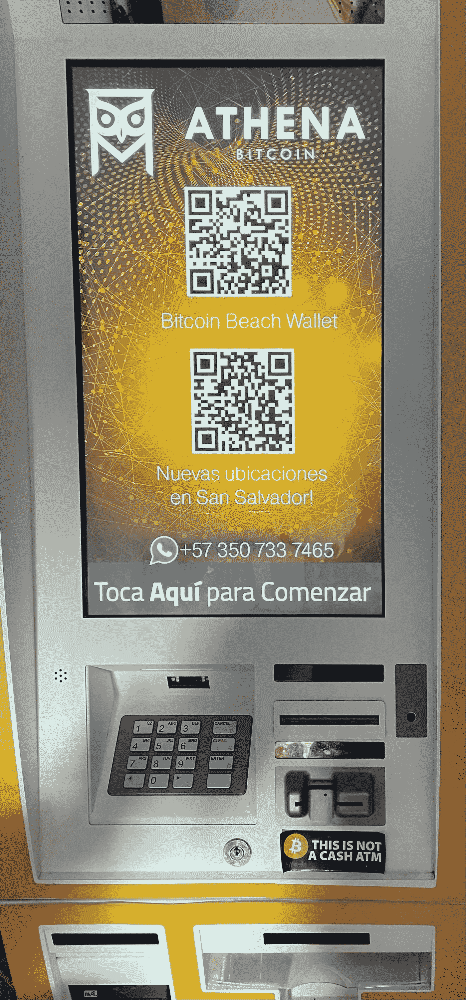
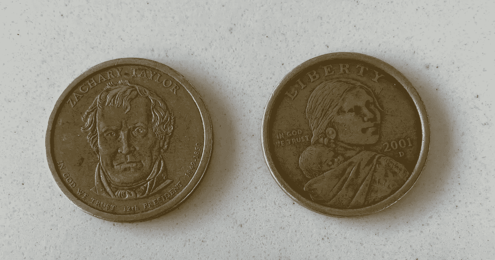
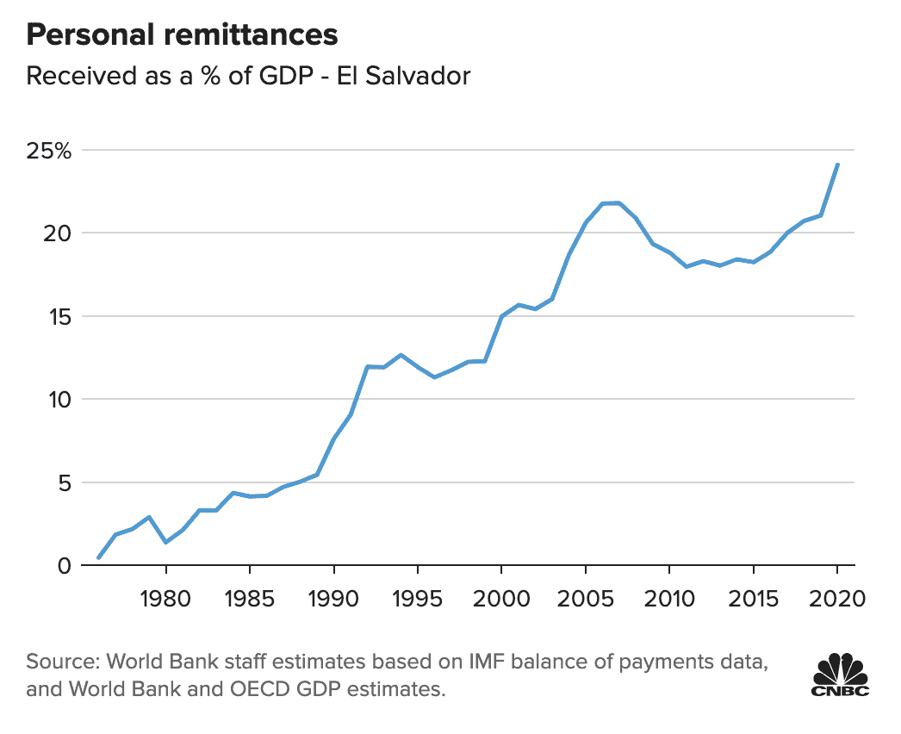
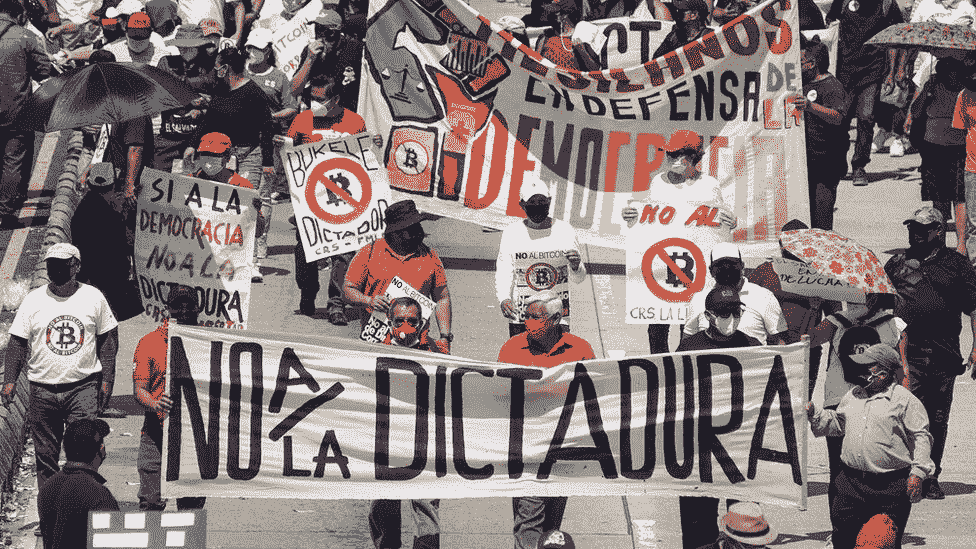
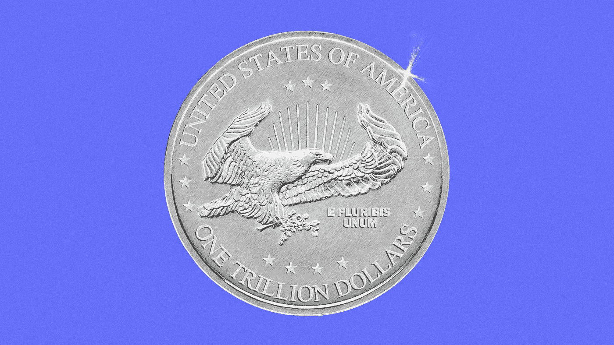
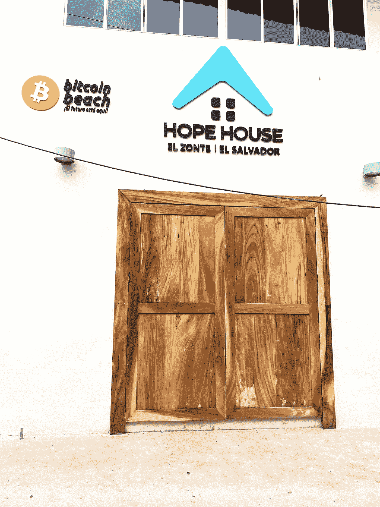
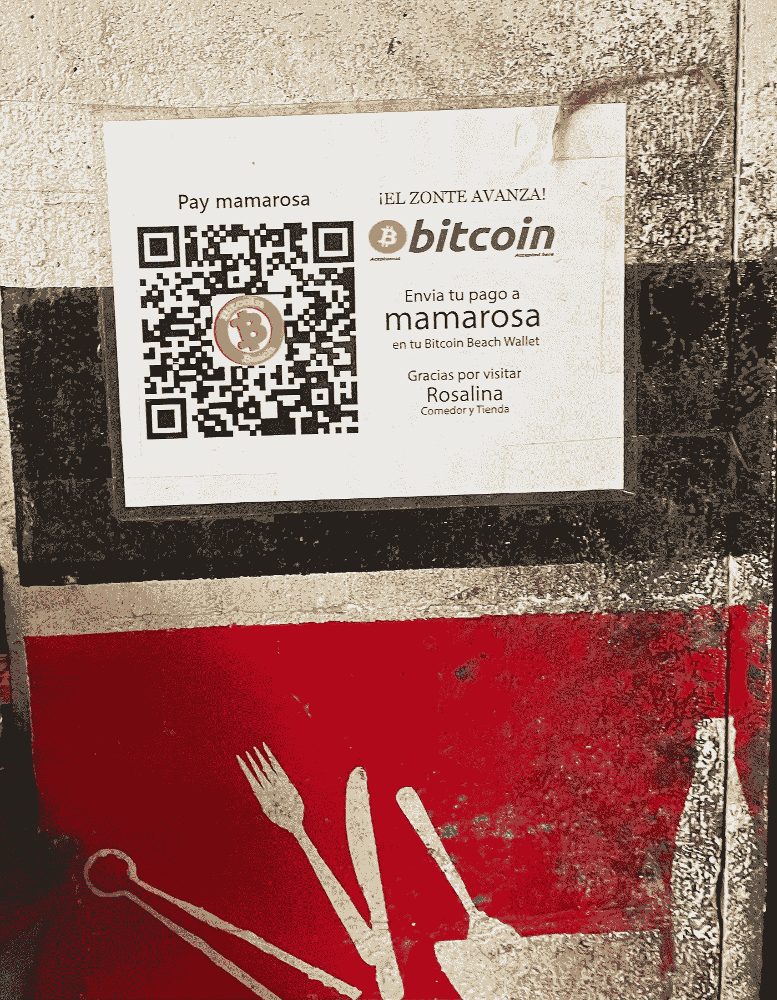

# 来自萨尔瓦多的两个比特币故事以及为什么两者都很重要

> 原文：<https://medium.com/coinmonks/two-bitcoin-narratives-emerging-from-el-salvador-and-why-both-are-important-c06fdd6ea870?source=collection_archive---------5----------------------->

One of the new bitcoin ATMs serving the unbanked communities of [El Zonte](https://elsalvadorinfo.net/el-zonte-beach-el-salvador/) and [El Tunco](https://gumnutsabroad.com/el-tunco-el-salvador/) beaches in El Salvador

*一个是比特币是数字* ***未来货币*** *，另一个——比特币是未来货币*

*在关注了我们在东非的区块链和医疗保健领域的工作后，我亲爱的朋友来自布宜诺斯艾利斯的 Johni Fisher 说:“ *Alex，你应该去萨尔瓦多，和我们一起开发加密健康解决方案。**

*的确，我一直想去 Johni 和拉丁美洲，但是当我读到萨尔瓦多总统 [Nayib Bukele](https://en.wikipedia.org/wiki/Nayib_Bukele) 在 9 月 6 日宣布他已经[购买了 200 BTC](https://cointelegraph.com/news/el-salvador-purchases-first-200-btc-president-bukele-confirms) 使萨尔瓦多成为*世界上第一个使用加密货币作为法定货币的国家*时，我决定是时候去亲自看看这是怎么回事了。*

*所以到了 9 月 26 日，我去参观了两个星期的比特币海滩和首都圣萨尔瓦多。我采访了参与比特币和政府发行的 Chivo 钱包实际推出的政府官员和技术专家，以及商业领袖、企业家和比特币用户。*

*我想分享这次访问的三个重要观察结果。*

# *#1:历史和政治气候必须为加密做好准备*

*回顾美国在萨尔瓦多之前[和](https://www.theatlantic.com/magazine/archive/1998/12/dirty-hands/377364/)1992 年内战结束后[的长期外交政策超出了本文的范围，但要理解为什么萨尔瓦多是世界上第一个**采用比特币作为货币的国家**，必须了解他们的经济史，包括 2001 年*美元化*(如下)。](https://www.courthousenews.com/hope-for-el-salvador-but-not-from-the-united-states/)*

**

*The flooding of the El Salvadorian market in 2001 with US dollar coins rendered its local currency, the Colón, useless (Zachary Taylor and Sacagawea $1 coins)*

*以克里斯托弗·哥伦布命名的萨尔瓦多银币在 1892 年取代了西班牙银币。一旦在 1931 年的军事政变中放弃金本位制，它就以 2 科朗兑 1 美元的汇率与美元挂钩(即:T2 美元化)。*

*但是 2001 年*的美元化*和与美国经济的政治/经济一体化付出了巨大的代价——不仅限制了萨尔瓦多中央银行的职能，而且导致萨尔瓦多人购买力的重大损失,通过 [SWIFT](https://www.investopedia.com/articles/personal-finance/050515/how-swift-system-works.asp#:~:text=Society%20for%20Worldwide%20Interbank%20Financial%20Telecommunications%20(SWIFT)%20is%20a%20member,financial%20transactions%20for%20its%20members.) 收取昂贵的汇款费用，并造成巨大的[贸易逆差](https://www.forbes.com/sites/rogerhuang/2021/06/27/an-economic-history-of-el-salvadors-adoption-of-bitcoin/?sh=50450af93fd4)。*

*面对一个没有创造就业机会的经济，一个不断增长的公共债务，以及来自美国的估计占 GDP 24%的不规则汇款*

**

*The growing dependence of El Salvador on its US diaspora deepened during COVID [Source](/the-capital/what-do-salvadorans-really-think-of-bitcoin-a6f0ce698327)*

*不是来自政治左派或右派的总统在立法议会中获得了绝对多数。*

*这让他得以推出一项[激进的(也是有争议的)](https://elfaro.net/en/202006/el_salvador/24542/The-Bukele-Clan-that-Rules-with-Nayib.htm)政策——**比特币将成为法定货币**，并被用于:*

1.  *将没有银行账户的人银行化，将经济去美元化*
2.  *[降低汇款费用](/quantum-economics/el-salvador-and-bitcoin-perfect-bedfellows-b4b2ebe4c8e8)(估计每年可充实美国银行系统 54 亿美元**)***
3.  *帮助萨尔瓦多成为一个国际秘密投资中心，特别是在采矿方面，利用他们的[地热能](/titan-mining-blog/el-salvador-effect-how-the-bitcoin-mining-landscape-is-changing-c8261b79583a)(又名 [*火山*](https://decrypt.co/82201/el-salvador-volcano-bitcoin-mining-first-steps?utm_campaign=daily_bundle_template&utm_content=Bitcoin%20as%20legal%20tender%3A%20following%20in%20El%20Salvador%27s%20footsteps%3F&utm_medium=email&utm_source=sg_email) )。*

# *#2:第一个故事——比特币是另一种数字化的未来货币*

*当我在那里的时候，我看到了反对使用比特币和钱包的示威游行。一些人担心这一变化是总统的专制攫取，另一些人反对它的强制推出，一些人担心私钥是如何管理的，许多人认为一切都如预期的一样。*

*自下而上的抵制是一个特征，而不是一个缺陷。*

**

*Protesters demonstrating in San Salvador, fear Bitcoin will anger the US and bring inflation ([source](https://www.bbc.com/news/world-latin-america-58579415))*

*然而，我感兴趣的不仅是仔细看看*说了什么，还有*谁*说了什么*什么*和*为什么*。**

*总的来说，我听到了对比特币推出的四种反应:*

*   ***比特币/加密多头**——[比特币狂热分子](https://www.investopedia.com/terms/b/bitcoin-maximalism.asp)认为推出是完美的。比特币是一种[永远升值的资产](/@muradmahmudov/bitcoin-past-and-future-45d92b3180f1)，它是未来，这是毋庸置疑的。*
*   ***美国/国际货币基金组织**的压力——布克莱[政府腐败](https://www.theguardian.com/business/2021/sep/24/el-salvador-adoption-of-bitcoin-as-legal-tender-is-pure-folly#:~:text=El%20Salvador%20this%20month,first%2C%20because%20others%20might%20follow.),这个比特币的想法和试图[减少对美元的依赖](https://www.theblockcrypto.com/linked/119664/digital-currencies-could-reduce-reliance-on-the-u-s-dollar-says-new-fed-paper)进一步证明了[他的无能](https://coingape.com/vitalik-buterin-criticizes-el-salvador-president-and-bitcoin-maximalist-heres-why/)并将[破坏金融市场的稳定](https://www.reuters.com/business/finance/emerging-market-cryptoization-threatens-financial-stability-imf-2021-10-01/)。*
*   ***中产阶级萨尔瓦多人**——布克勒是个强人[我们不认为](https://medium.datadriveninvestor.com/el-salvador-and-the-bitcoin-devil-19490d71a198)比特币是个好主意。*
*   *贫穷的萨尔瓦多人——布克勒是个圣人，但是我们还看不出比特币这件事有什么意义。*

*我必须说，当我想到中央集权货币的本质和美元化对萨尔瓦多人的影响时，至少可以说，这些批评在我听来没有说服力。*

*所有这一切都是在美国的秘密监管比我们想象的更具侵入性的背景下发生的，T2 的美联储放松管制大大削弱了保护大众的金融规则，最近发现的 T4 潘多拉文件揭露了 90 多个国家的 130 名亿万富翁和 330 名公职人员的 29，000 多个海外账户。*

*尽管如此，我确实认为萨尔瓦多推出比特币破除了关于加密货币的三个重要神话:*

1.  *“各国政府将禁止比特币”的想法被正式埋葬。虽然[墨西哥](https://decrypt.co/80646/mexicos-central-bank-governor-says-bitcoin-is-not-money?utm_campaign=daily_bundle_template&utm_content=Bitcoin%20as%20legal%20tender%3A%20following%20in%20El%20Salvador%27s%20footsteps%3F&utm_medium=email&utm_source=sg_email)、[巴拉圭](https://decrypt.co/74836/paraguay-bitcoin-legal-tender-why?utm_campaign=daily_bundle_template&utm_content=Bitcoin%20as%20legal%20tender%3A%20following%20in%20El%20Salvador%27s%20footsteps%3F&utm_medium=email&utm_source=sg_email)现在还没有考虑部署比特币，但[乌拉圭](https://www.theblockcrypto.com/news+/120043/the-tongue-in-cheek-origins-of-uruguays-neripeso)和[哥伦比亚](/coinmonks/colombia-borges-and-bitcoin-9df0ae369105)正在考虑，而[委内瑞拉](https://coingape.com/breaking-venezuelas-international-airport-set-to-start-accepting-bitcoin-btc/)正在试验，而[巴拿马](https://finance.yahoo.com/news/panama-introducing-legislation-bitcoin-legal-054123035.html?utm_campaign=Sunday%20Newsletter&utm_medium=email&_hsmi=158961834&_hsenc=p2ANqtz-_uEGELhxWJscpvlvO4XNu7Rux2xelJ25pLgWz5I1xh-dwvargTkYxTqe0aSuvZg2zja0FN3TPPYumeprAlGWVVZ6Ttlw&utm_content=158961834&utm_source=hs_email)、[汤加](https://decrypt.co/82534/tonga-politician-hopes-follow-el-salvadors-bitcoin-footsteps?utm_campaign=daily_bundle_template&utm_content=Bitcoin%20as%20legal%20tender%3A%20following%20in%20El%20Salvador%27s%20footsteps%3F&utm_medium=email&utm_source=sg_email)和[乌克兰](https://www.cnbc.com/2021/09/08/ukraine-legalizes-bitcoin-and-cryptocurrencies.html)正计划在今年晚些时候正式推出。*
2.  *“比特币因为[波动](/why-and-how/why-does-bitcoin-have-a-volatile-price-4e4327b703b1)而不是货币”的观点已经死亡。(如需深入分析，请阅读 Ark Invest 的分析[此处](https://research.ark-invest.com/hubfs/1_Download_Files_ARK-Invest/White_Papers/ARKinvest_091729_Whitepaper_Bitcoin_II_An%20Investment.pdf?hsCtaTracking=71be7529-9a39-404e-97b3-04fd4ccf80ec%7C07365ce1-0ed3-4835-9c3c-ac33c030cd70&utm_campaign=Sunday%20Newsletter&utm_medium=email&_hsmi=158961834&_hsenc=p2ANqtz--8K7AOr2pdvVPzJpVTDm3p6ZbP0s4lJZke65lSyHVabofofGLuGOCOI3bLFHBp5VGsCZSJeP4xNVvAk-Foh5QxNuC29A&utm_content=158961834&utm_source=hs_email))。*
3.  *认为菲亚特永远是好的，比特币只是一时的想法已经过时了，特别是有人呼吁美国财政部铸造一种*1 万亿美元的硬币*(下图)[，以避免由于国会无法达成政治妥协而导致的债务违约](https://www.nytimes.com/2021/10/06/opinion/trillion-dollar-coin.html)。*

**

*The idea that the U.S. Treasury should mint a $1T coin and deposit it at the Federal Reserve is to prevent debt default due to Congressional intransigence [Source](https://www.axios.com/newsletters/axios-markets-10f4f828-0cfa-4b50-a7c2-7d263fb998ed.html?chunk=2&utm_term=emshare#story2)*

# *#3:第二个故事——比特币是未来的货币，尤其是对没有银行账户的人来说*

*再说一遍，发生了什么？*

*[简而言之](https://medium.datadriveninvestor.com/the-worlds-poor-are-turning-to-bitcoin-221b2957a175)，一个经济状况不佳、没有本国货币的中美洲小国正在充当美国的经济殖民地*并依赖于美国央行的政策。由于完全无法获得金融服务，商业活动只能通过非正式的现金方式进行，大批逃离帮派暴力和内战的海外侨民没有可靠的手段转移或汇款。**

*但在参观 El Zonte(比特币海滩)时，我不仅看到了法定货币在现金匮乏、[无银行账户的](https://twitter.com/wintonARK/status/1443260466801696769?utm_campaign=Sunday%20Newsletter&utm_medium=email&_hsmi=166823857&_hsenc=p2ANqtz-9ByHGEFiIuvxLr7ZtMQzxC2Qqxo4zXf23crNkRxdwTQgDPsWDEv-1AYushK5kIvrUO3oO6qMn-1E2BWsVhAgyRQJsaTg&utm_content=166823857&utm_source=hs_email)社区中的[局限性，他们被迫支付 20-30%的交易费，](https://thecapital.io/article/bitcoin-basics-1-fiatmoney-Mk1QYQYdp-5t5_Ap7cy)*

> *我也看到了*对比特币* **的试验如何直接帮助了人们，提升了他们的数字和金融素养**。*

*在不到一个月的时间里，萨尔瓦多的银行账户数量从 190 万(其中 130 万使用借记卡)增长到超过 230 万拥有数字账户的成年人***。****

****但是，不仅越来越多的用户使用数字货币进行交易，受益于类似于东非 [M-Pesa](https://en.wikipedia.org/wiki/M-Pesa) 的无分支银行服务，他们也开始思考货币的真正本质，*推动比特币价值的力量是什么*以及他们如何才能成功参与这些新的经济活动。****

********

****HopeHouse, founded by [Mike Peterson](https://www.latimes.com/world-nation/story/2021-06-22/in-el-salvadors-bitcoin-beach), director of Bitcoin Beach, has over 20 social impact programs including education, healthcare, nutrition, transportation and vocational training- all in bitcoin****

****这种向本地比特币经济的转变令人兴奋，因为:****

1.  ****[*技术是稳固的*](https://bluepnume.medium.com/why-bitcoin-5710a57e391a) ，允许以极低的费用转移资金，使用[闪电网络](https://decrypt.co/81776/new-channels-nodes-lightning-network-up-20-after-twitter-integration)进行速度转移，使用[打击](https://michael-levin.medium.com/part-2-lightning-network-bitcoins-crossing-the-chasm-superpower-7fe4fd4702dc)进行开关斜坡转移****
2.  *****货币政策是不可改变的*(会有固定数量的硬币被创造出来，没有人能改变这一点，任何人都可以核实网络上目前的硬币数量)****
3.  ****比特币不受任何一个中央机构或政府的直接控制，提供了与其他资产不相关的新投资机会。****

> ****然而，使用比特币的真正神奇之处在于，人们和机构现在都在接受和信任它，从而产生了巨大的滚雪球式的网络效应。****

********

****Nothing like not being afraid from losing cash, and buying a delicious cheese [Pupusa](https://en.wikipedia.org/wiki/Pupusa) with Bitcoin!****

# ****最后的想法:我们需要更多的钱****

****富裕经济体的政府和中央银行通常会强制推行对他们有利的财政和货币政策，这些政策对 T2 有利，对 T4 有利，而对较弱的经济体不利。当这些脆弱的经济体推进[有利于加密的政策](https://decrypt.co/43513/countries-that-dont-tax-bitcoin-gains?utm_campaign=daily_bundle_template&utm_content=El%20Salvador%20won%27t%20tax%20Bitcoin%20gains%20for%20foreign%20investors&utm_medium=email&utm_source=sg_email)、[免除外国投资者](https://decrypt.co/80792/el-salvador-exempts-foreign-investors-from-tax-on-bitcoin-gains?utm_campaign=daily_bundle_template&utm_content=El%20Salvador%20won%27t%20tax%20Bitcoin%20gains%20for%20foreign%20investors&utm_medium=email&utm_source=sg_email)的税收，或者仅仅[降低汽油价格](https://bitcoinmagazine.com/culture/president-bukele-reduces-gas-price-for-chivo-bitcoin-wallet-users-in-el-salvador)以鼓励比特币的使用，他们对金融自由的追求被称为[威权主义](https://www.nytimes.com/2021/10/07/world/americas/bitcoin-el-salvador-bukele.html?campaign_id=2&emc=edit_th_20211008&instance_id=42310&nl=todaysheadlines&regi_id=61116760&segment_id=70976&user_id=304c85cc8cc3e99ed36059bf944873c5)。****

****比特币是否会成为[未来的金融标准](https://wire.insiderfinance.io/the-bitcoin-standard-what-when-and-how-5a180346d256)、对冲通货膨胀的或基于比特币的还有待观察。有人说[是](https://europeanblockchainconvention.medium.com/5-reasons-why-bitcoin-is-different-from-any-other-crypto-asset-5c4a47082be0)，有人说[绝对不是](https://medium.datadriveninvestor.com/its-best-for-everyone-if-bitcoin-bites-the-dust-9dafcc9c1e81)，各国央行正在开发 [CBDC](https://decrypt.co/80655/rise-stablecoins-defi-make-central-bank-currencies-urgent-bank-international-settlements) (央行数字货币)和[稳定币](https://www.brookings.edu/research/regulating-stablecoins-isnt-just-about-avoiding-systemic-risk/?utm_campaign=Brookings%20Brief&utm_medium=email&utm_content=167433820&utm_source=hs_email)作为未来国际贸易和结算的解决方案。****

****但是在一天结束的时候*精确的解决方案是不相关的*。即使布科勒总统早已去世，他的比特币经济的网络效应仍将持续。****

****他有意(或无意)让他的公民有能力公开参与一个面向未来的支付系统，这个系统一旦启动就不可逆转，给予他们甚至西方国家都无法提供的财务自由。****

********

****Only time will tell if the clouds of uncertainty will birth a new sunny day (another magical sunset in El Zonte)****

> ****尽管无法预测这一切的结局，但中央金融系统似乎无力维持我们对法定货币的信任(T21 ),却让这个星球上最贫穷的人能够参与全球经济，这表明我们正处于一个更好的开端。****

*****如果你觉得这个内容很吸引人，并且对自己的试运行内容感兴趣，请查看量子经济学的* [*按需分析*](https://quantumeconomics.io/market-analysis/) *服务*****

> ****加入 [Coinmonks 电报频道](https://t.me/coincodecap)，了解加密交易和投资。****

******同样，阅读******

*   ****[尤霍德勒 vs 科恩洛 vs 霍德诺特](/coinmonks/youhodler-vs-coinloan-vs-hodlnaut-b1050acde55a) | [Cryptohopper vs 哈斯博特](https://blog.coincodecap.com/cryptohopper-vs-haasbot)****
*   ****[币安 vs 北海巨妖](https://blog.coincodecap.com/binance-vs-kraken) | [美元成本平均交易机器人](https://blog.coincodecap.com/pionex-dca-bot)****
*   ****[如何在印度购买比特币？](/coinmonks/buy-bitcoin-in-india-feb50ddfef94) | [WazirX 评论](/coinmonks/wazirx-review-5c811b074f5b) | [BitMEX 评论](https://blog.coincodecap.com/bitmex-review)****
*   ****[比特币主根](https://blog.coincodecap.com/bitcoin-taproot) | [Bitso 点评](https://blog.coincodecap.com/bitso-review) | [排名前 6 的比特币信用卡](/coinmonks/bitcoin-credit-card-bc8ab6f377c6)****
*   ****[双子座 vs 比特币基地](https://blog.coincodecap.com/gemini-vs-coinbase) | [比特币基地 vs 北海巨妖](https://blog.coincodecap.com/kraken-vs-coinbase)|[coin jar vs coin spot](https://blog.coincodecap.com/coinspot-vs-coinjar)****
*   ****[印度密码交易所](/coinmonks/bitcoin-exchange-in-india-7f1fe79715c9) | [比特币储蓄账户](/coinmonks/bitcoin-savings-account-e65b13f92451) | [Paxful 审查](/coinmonks/paxful-review-4daf2354ab70)****
*   ****[杠杆令牌](/coinmonks/leveraged-token-3f5257808b22) | [最佳加密交易所](/coinmonks/crypto-exchange-dd2f9d6f3769) | [AscendEX 评论](/coinmonks/ascendex-review-53e829cf75fa)****
*   ****[Godex.io 审核](/coinmonks/godex-io-review-7366086519fb) | [邀请审核](/coinmonks/invity-review-70f3030c0502) | [BitForex 审核](https://blog.coincodecap.com/bitforex-review) | [HitBTC 审核](/coinmonks/hitbtc-review-c5143c5d53c2)****
*   ****[Crypto.com 费用](/coinmonks/binance-fees-8588ec17965) | [僵尸加密审查](/coinmonks/botcrypto-review-2021-build-your-own-trading-bot-coincodecap-6b8332d736c7) | [替代品](https://blog.coincodecap.com/crypto-com-alternatives)****
*   ****[有哪些交易信号？](https://blog.coincodecap.com/trading-signal) | [比特斯坦普 vs 比特币基地](https://blog.coincodecap.com/bitstamp-coinbase)****
*   ****[ProfitFarmers 点评](https://blog.coincodecap.com/profitfarmers-review) | [如何使用 Cornix 交易机器人](https://blog.coincodecap.com/cornix-trading-bot)****
*   ****[MXC 交易所评论](/coinmonks/mxc-exchange-review-3af0ec1cba8c) | [Pionex vs 币安](https://blog.coincodecap.com/pionex-vs-binance) | [Pionex 套利机器人](https://blog.coincodecap.com/pionex-arbitrage-bot)****
*   ****[我的密码交易经验](/coinmonks/my-experience-with-crypto-copy-trading-d6feb2ce3ac5) | [《比特币基地评论》](/coinmonks/coinbase-review-6ef4e0f56064)****
*   ****[CoinFLEX 评论](https://blog.coincodecap.com/coinflex-review) | [AEX 交易所评论](https://blog.coincodecap.com/aex-exchange-review) | [UPbit 评论](https://blog.coincodecap.com/upbit-review)****
*   ****[AscendEx 保证金交易](https://blog.coincodecap.com/ascendex-margin-trading) | [Bitfinex 赌注](https://blog.coincodecap.com/bitfinex-staking) | [bitFlyer 点评](https://blog.coincodecap.com/bitflyer-review)****
*   ****[麻雀交换评论](https://blog.coincodecap.com/sparrow-exchange-review) | [纳什交换评论](https://blog.coincodecap.com/nash-exchange-review)****
*   ****[加密货币储蓄账户](/coinmonks/cryptocurrency-savings-accounts-be3bc0feffbf) | [赌注加密](https://blog.coincodecap.com/staking-crypto)****