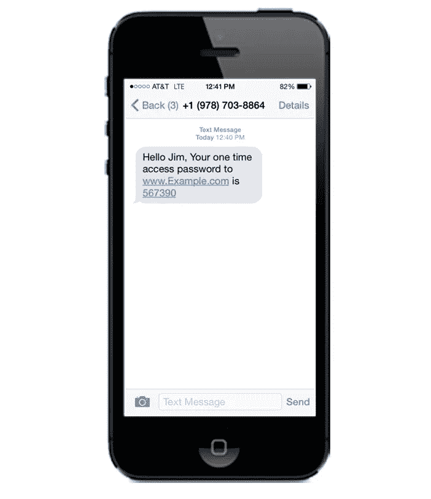
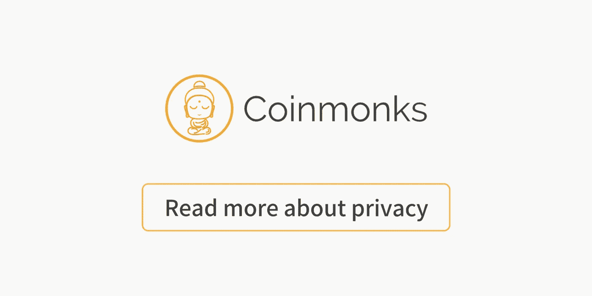

# 令牌的双因素身份验证

> 原文：<https://medium.com/coinmonks/two-factor-authentication-for-your-token-6f1e51b793a8?source=collection_archive---------3----------------------->

# 什么是双因素身份认证？

互联网充满了陷阱，许多人非常熟悉在线安全、登录、用户名和密码的重要性。由于标准的在线服务只需要用户名和密码，黑客获取用户数据变得越来越容易，尤其是在加密领域。如果你不小心你的密码，你将很容易失去你的数字资产。

双因素身份认证(也称为 2FA)是“多因素身份认证”家族中的一个额外安全层，该家族不仅需要密码和用户名，还需要一条只有他们应该知道或立即拥有的信息，例如从外部设备生成的代码。将所有这些信息结合在一起使用，会使潜在的入侵者更难获得访问权限并窃取该人的资产。您添加的因素越多，应用程序就越安全。

# 一段历史

自 20 世纪 80 年代以来，人们一直在努力实现这种双因素身份认证，当时安全动态技术公司获得了“积极识别个人身份的方法和设备”的专利到 2000 年代，从金融机构到视频游戏发行商的组织都具备了实施自己的双因素身份认证方法的基础设施和制造能力。

苹果推出了 iPhone，谷歌推出了 Android。智能手机让全球数十亿人拥有了能够进行双重认证的设备，解决了用户在 2005 年抱怨的便利性问题。

就在 2011 年 2 月，谷歌宣布为其用户在线提供双重认证，随后是 MSN 和雅虎。

# 它是如何实现的？

有三种方法可以实现 2fa。

## 2FA 带短信 OTP(一次性密码)

短信 OTP 是最不安全的方式。用户收到一次性的 6 位 SMS 消息代码，并且他必须在服务登录页面中键入该代码。许多银行一直使用这种方法。因为大多数消费者都有手机。

可悲的是，短信是不安全的。黑客可以很容易地获得短信代码，并危及你的帐户。这不是一个推荐的选项。

**短信动态口令的问题:**

用户必须一直带着他的电话。此外，用户的电话号码可能被劫持，黑客可以获得自己的手机号码。而且，很容易拦截短信。有人可以在您锁定的屏幕上阅读您的短信通知。该消息不安全。所以如果你有其他选择，不要用短信 OTP，这不是最好的解决方案。

## 带 OTP 应用程序的 2FA

使用 OTP 应用程序，如 [Authy](https://authy.com/) 或 [Google Authenticator](https://play.google.com/store/apps/details?id=com.google.android.apps.authenticator2&hl=zh) ，用户可以通过另一个应用程序获取 OTP 消息。首先，你必须先在手机中安装 OTP 应用程序，然后服务和应用程序会与你共享代码。该应用程序应该生成无限量代码。我们可以用密码保护代码的真实性。

*   **HOTP** : HMAC 的 OTP，它是基于事件的，没有代码有效期。所以这可能很危险。黑客可以在两周前获得 OTP，并在两周后仍然成功地使用它进行黑客攻击。
*   **TOTP** :基于时间的 OTP。它比 HOTP 好。生成的代码是循环的，所以每个代码只在一定时间内有效。所以我们不会有和 HOTP 一样的问题。

authy

因此，如果你正在使用基于应用的解决方案，TOTP 是一个不错的选择。在 iOS 上，我们有 2STP。在 Andriod 上，我们可以使用 [Authy](https://authy.com/) 和 [Google Authenticator](https://play.google.com/store/apps/details?id=com.google.android.apps.authenticator2&hl=zh) 。还有更高级的选项:Octor & Jio

【App OTP 的问题:

缺点是你不能访问你的手机，但你可以使用种子短语来备份。iCloud 中已经有备份选项了。由于你必须手动输入密码，你必须确保该网站是安全的，而不是一个钓鱼网站。仔细检查 URL。

## U2F —最安全的方式

U2F 代表通用双因素认证。这是一个开源协议，目前由一个名为 FIDO alliance 的组织维护。关键玩家是一家名为 [Yubico](https://www.yubico.com/) 的公司。他们的酷产品叫做 Yubikeys。

Yubikey

U2F 不同于其他 OTP 协议，因为每次你想认证某个东西时，你都必须插入一个实际的 USB 设备。该过程基于公钥加密，因此服务将保存公钥，私钥保存在 Yubikey 中。它使用与 TOTP 相同的共享秘密方法，但也集成了 web 浏览器以提供额外的安全性。这样，密钥可以验证你登录的网站是否是恶意的。这有助于排除钓鱼的可能性。你永远不会登录钓鱼网站。如果你按下 Yubikey 上的按钮，这个密钥将为你填写登录表单，所以你不再需要输入六位数字。一切都将自主完成。

**U2F 的问题:**

为了避免丢失密钥后的不便，您可以使用种子进行备份。而且目前 U2F 只支持 Chrome 和 Opera，可用的服务有限，像脸书和 Fastmails 等。并且它的使用仅限于桌面用户。但是这项技术正在不断发展，我们希望它将来能支持移动设备。

希望我们能一起设计一个更安全的世界。

**Click to learn more about Privacy**