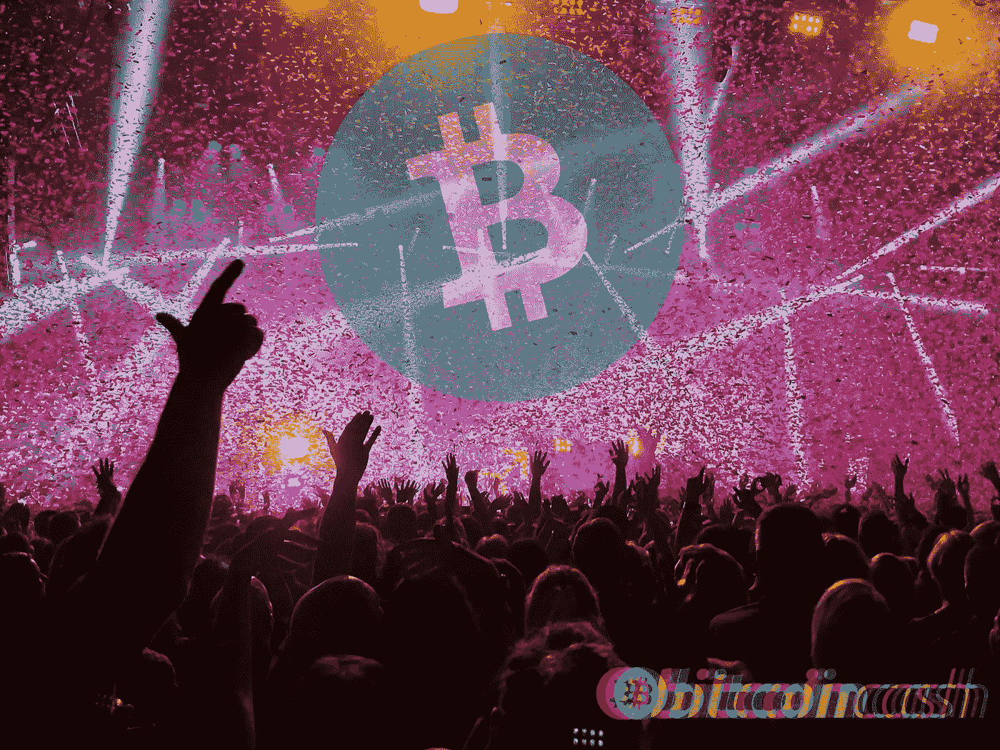

# Crypto-2021 还剩下两个激动人心的月

> 原文：<https://medium.com/coinmonks/two-more-exciting-months-left-in-crypto-2021-a005f730de94?source=collection_archive---------4----------------------->

2021 年还剩下不到两个月的时间，一些分析师表达了他们的观点，即本轮牛市的最佳时刻将很快出现。

我的加密之旅在我跟踪加密和区块链技术的四年半时间里，我经历了很多尝试。我历尽艰辛，不知道自己是不是做错了。虽然有一点是肯定的，但我知道我不应该放弃。

今年早些时候，我的一位前同事打电话给我，感谢我在所有人都声称 crypto 已经死亡的时候，让他看到了投资 crypto 的前景。

对于密码投资者来说，2017 年是快乐的一年。它可能永远不会重复，但也许 2021 年的最后两个月会开始类似它。

我们经常读到加密货币的估值只是一个泡沫。2013 年，2017 年，2021 年。即使在 2011 年 1 美元的价格，一些“分析师”称比特币是泡沫。只要仔细看看 BTC 的放大图，就能理解这个市场是如何运作的，以及为什么会出现极度兴奋的繁荣周期，然后是极度悲观和放弃的熊市周期。

纯粹的猜测导致了这一点，然而，让数百万(或数十亿)的密码工作可以停止这些循环，并允许有机增长。

# 2017 年牛市进入了最后阶段

2017 年是雄伟的，尤其是在牛市周期的末期。几个月来，我们有怀疑的 Bitconnect 支持者，他们在不知情或不知情的情况下不断宣传一个骗局。虽然，即使是当时的骗子，在技术方面对区块链世界也有更好的理解。

每个人都很高兴，因为大多数人都赚够了。兰博基尼也是真实的，但主要是对那些自 2013 年以来就迷上加密的人而言。

实时聊天室几乎没有 20-30 人观看和评论。到 12 月底，他们都接触到了成千上万的参与者。

我认为没有一天没有有趣的事情可以讨论。也有强烈的热情和支持改变腐败的银行机构。但也有太多的骗子试图操纵最无知的人的思维，强迫他们进行某些投资。

2017 年最有趣的时刻可能不会被重温。

我记得总是赶着完成工作，不是留下来加班，而是经常借口自己早点走。走到我的桌面屏幕前，打开我用来交易的所有交易所和网站的标签。我还关注了 YouTube 上的各种交易频道，以及 discord 和 TeamSpeak 上的一些频道，只是为了有一个更好的想法，尽管总是有太多的骗子，经常让聊天室变得可怕。

这不仅仅是交易，这是一个充满快乐和智慧的人的世界。当利润丰厚时，所有人都变成了好人。同样令人惊奇的是迷因。甚至在 BTC 达到 1 万美元后，对“hodl”的呼声也越来越高。

甚至连持怀疑态度的 Bitconnect 支持者和推广者看起来也很有趣。甚至这些骗子比我们今天在社交媒体和 YouTube 上看到的推广者更了解比特币。

我交易是因为我不知道还能做什么。我花了几个月的时间才开始明白发生了什么。我在任何交易所交易任何东西。从 Bittrex 向公众发布的第一天起，我就在使用它，北海巨妖，币安，以及其他各种现在不存在的交易所。

我在 Youtube 上有一个名为“当月亮？”自 2017 年 9 月以来，每天数小时在实时聊天中发送无聊的看涨消息，只是为了好玩。

# 2018-2019 熊市

2018 年和 2019 年是永不落幕的悲伤熊市。机会是有限的，我仍然记得我投资的一些加密资产的价格，但我没有勇气跟随。

后来在 Cryptopia，Livecoin，后来在更多被关闭的交易所，我都亏了钱(不算太麻烦)。

虽然这也是暂时的。

我不想让自己想起这两年。我对加密并不感兴趣，但仅仅 6 个月，市场就开始了持续两年的熊市。

2018 年对于 crypto 来说是可怕的一年。BTC 崩溃了，而且一直在崩溃。它的主导地位也在不断上升，因为其他加密货币的崩溃速度更快。

我仍然持有数百枚令牌和硬币，它们自 2018 年以来损失了 99%的价值，再也没有恢复。这些都是今天废弃的项目，没有挽回的机会。我持有的一些股票，三年后我设法卖掉赚了钱，其他的，只是在某一点上赚了钱，但从未到达新 ATH。

2019 年，复苏的迹象出现了，一个中国庞氏骗局使用加密货币，引诱中国和东南亚的投资者，说服他们投资数十亿美元。最终，庞氏骗局崩溃，中国当局抓获了所有罪犯。积累的加密财富的钥匙已经交给中国当局，中国政府今天拥有各种加密货币的巨大财富(BTC，瑞士联邦理工学院，EOS，XRP)。

# **总之**

我怀疑 Crypto 中的任何人都不是为了进行一些出色的投资。我从来不是一个只会在某个硬币上胡说八道的骗子，尽管我过去有时会随大流。这是任何新手和天真的投资者都会犯的错误(根据随机建议)，避免这种情况需要经验。

我不再随大流，虽然许多人会声称用柴犬赚了一大笔钱，但我敢肯定，他们和在骗局鱿鱼游戏令牌中损失惨重的人是一样的。有些硬币只是一场赌博，当赌博；我更喜欢对我有利的机会。

炒作不是当我们推广一种看起来比其他加密货币更好的加密货币时。当背景中什么都没有，只有不合理财富的承诺时。

炒作是指亿万富翁不懂技术，但只会投资，并称比特币是一项出色的投资。当被问及 BTC 的确切用途时，他们根本说不上来。他们陷入了这场价格行动，并认为参与增加他们的影响力。也许这一切都是因为 Twitter 上的粉丝数量。

我很高兴今天一些亿万富翁明白比特币最大化是一种对创新的破坏性方法。

Follow me on: ● [ReadCash](https://read.cash/@Pantera) ● [NoiseCash](https://noise.cash/u/Pantera99) ● [Medium](/@panterabch) ● [Hive](https://hive.blog/@pantera1) ● [Steemit](https://steemit.com/@pantera1) ●[Vocal](https://vocal.media/authors/pantera) ● [Minds](https://www.minds.com/pantera99/) ● [Twitter](https://twitter.com/Panterabch) ● [LinkedIn](https://www.linkedin.com/in/panterabch/) ● [email](https://read.cash/@Pantera/localcryptos-p2p-exchange-is-now-offering-bitcoin-cash-trading-06637230#bad-link)

**备注:**

> *免责声明:本内容中发布的所有材料均用于娱乐和教育目的，并符合合理使用准则。无意侵犯版权。如果您是或代表本文所用材料的版权所有者，并且对所述材料的使用有疑问，请发送* [*电子邮件*](https://read.cash/@Pantera/cryptouknowns-battlegrounds-the-crypto-battle-royal-part-i-0ca762da#bad-link) *。*

***支持内容创作者。***

如果你喜欢这个故事，就订阅吧！

*原载于*[*https://read . cash*](https://read.cash/@Pantera/two-more-exciting-months-left-in-crypto-2021-c4c4417e)*。*

> 加入 Coinmonks [电报频道](https://t.me/coincodecap)和 [Youtube 频道](https://www.youtube.com/c/coinmonks/videos)了解加密交易和投资

## 另外，阅读

*   [什么是融资融券交易](https://blog.coincodecap.com/margin-trading) | [成本平均法](https://blog.coincodecap.com/dca)
*   [维护卡审核](https://blog.coincodecap.com/uphold-card-review) | [信任钱包 vs 元掩码](https://blog.coincodecap.com/trust-wallet-vs-metamask)
*   [Exness 评测](https://blog.coincodecap.com/exness-review)|[moon xbt Vs bit get Vs Bingbon](https://blog.coincodecap.com/bingbon-vs-bitget-vs-moonxbt)
*   [如何开始用加密贷款赚取被动收入](https://blog.coincodecap.com/passive-income-crypto-lending)
*   [BigONE 交易所点评](/coinmonks/bigone-exchange-review-64705d85a1d4) | [电网交易 Bot](https://blog.coincodecap.com/grid-trading)
*   [新加坡十大最佳密码交易所](https://blog.coincodecap.com/crypto-exchange-in-singapore) | [收购 AXS](https://blog.coincodecap.com/buy-axs-token)
*   [投资印度的最佳加密软件](https://blog.coincodecap.com/best-crypto-to-invest-in-india-in-2021) | [WazirX P2P](https://blog.coincodecap.com/wazirx-p2p)
*   [7 个最佳零费用加密交易平台](https://blog.coincodecap.com/zero-fee-crypto-exchanges)
*   [最佳网上赌场](https://blog.coincodecap.com/best-online-casinos) | [期货交易机器人](/coinmonks/futures-trading-bots-5a282ccee3f5)
*   [AscendEx Staking](https://blog.coincodecap.com/ascendex-staking)|[Bot Ocean Review](https://blog.coincodecap.com/bot-ocean-review)|[最佳比特币钱包](https://blog.coincodecap.com/bitcoin-wallets-india)
*   [Bitget 回顾](https://blog.coincodecap.com/bitget-review)|[Gemini vs block fi](https://blog.coincodecap.com/gemini-vs-blockfi)|[OKEx 期货交易](https://blog.coincodecap.com/okex-futures-trading)
*   [美国最佳加密交易机器人](https://blog.coincodecap.com/crypto-trading-bots-in-the-us) | [经常性回顾](https://blog.coincodecap.com/changelly-review)
*   [在印度利用加密套利赚取被动收入](https://blog.coincodecap.com/crypto-arbitrage-in-india)
*   [霍比审核](https://blog.coincodecap.com/huobi-review) | [OKEx 保证金交易](https://blog.coincodecap.com/okex-margin-trading) | [期货交易](https://blog.coincodecap.com/futures-trading)
*   [麻雀交换评论](https://blog.coincodecap.com/sparrow-exchange-review) | [纳什交换评论](https://blog.coincodecap.com/nash-exchange-review)
*   最好的[加密税务软件](/coinmonks/best-crypto-tax-tool-for-my-money-72d4b430816b) | [硬币追踪评论](/coinmonks/cointracking-review-a-reliable-cryptocurrency-tax-software-5114e3eb5737)
*   [Stackedinvest 评论](https://blog.coincodecap.com/stackedinvest-review) | [北海巨妖评论](/coinmonks/kraken-review-6165fc1056ac) | [bitFlyer 评论](https://blog.coincodecap.com/bitflyer-review)
*   最佳[加密借贷平台](/coinmonks/top-5-crypto-lending-platforms-in-2020-that-you-need-to-know-a1b675cec3fa) | [杠杆代币](/coinmonks/leveraged-token-3f5257808b22)
*   最佳[加密制图工具](/coinmonks/what-are-the-best-charting-platforms-for-cryptocurrency-trading-85aade584d80) | [最佳加密交易所](/coinmonks/crypto-exchange-dd2f9d6f3769)
*   [比特币基地僵尸程序](/coinmonks/coinbase-bots-ac6359e897f3) | [AscendEX 审查](/coinmonks/ascendex-review-53e829cf75fa) | [OKEx 交易僵尸程序](/coinmonks/okex-trading-bots-234920f61e60)
*   [本地比特币评论](/coinmonks/localbitcoins-review-6cc001c6ed56) | [加密货币储蓄账户](https://blog.coincodecap.com/cryptocurrency-savings-accounts)
*   [比特币基地评论](/coinmonks/coinbase-review-6ef4e0f56064) | [德里比特评论](/coinmonks/deribit-review-options-fees-apis-and-testnet-2ca16c4bbdb2) | [FTX 评论](/coinmonks/ftx-crypto-exchange-review-53664ac1198f)
*   [n 零审核](/coinmonks/ngrave-zero-review-c465cf8307fc) | [Phemex 审核](/coinmonks/phemex-review-4cfba0b49e28) | [PrimeXBT 审核](/coinmonks/primexbt-review-88e0815be858)
*   最佳[区块链分析](https://bitquery.io/blog/best-blockchain-analysis-tools-and-software)工具| [赚比特币](/coinmonks/earn-bitcoin-6e8bd3c592d9)
*   [加密套利](/coinmonks/crypto-arbitrage-guide-how-to-make-money-as-a-beginner-62bfe5c868f6)指南| [如何做空比特币](/coinmonks/how-to-short-bitcoin-568a2d0b4ae5)
*   [德国最佳加密交易所](https://blog.coincodecap.com/crypto-exchanges-in-germany) | [Arbitrum:第二层解决方案](https://blog.coincodecap.com/arbitrum)
*   [币安交易机器人](/coinmonks/binance-trading-bots-d0d57bb62c4c) | [OKEx 评论](/coinmonks/okex-review-6b369304110f) | [Atani 评论](https://blog.coincodecap.com/atani-review)
*   [最佳加密交易信号电报](/coinmonks/best-crypto-signals-telegram-5785cdbc4b2b) | [MoonXBT 评论](/coinmonks/moonxbt-review-6e4ab26d037)