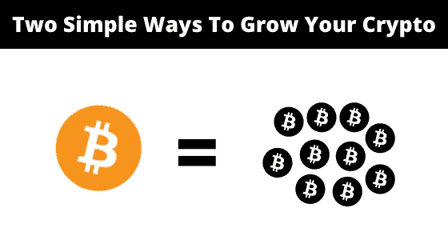
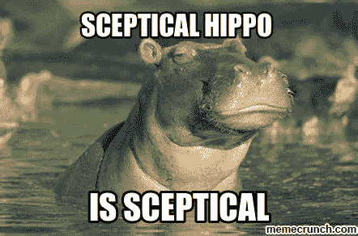

# 两种简单的方法来增加你的密码

> 原文：<https://medium.com/coinmonks/two-simple-ways-to-grow-your-crypto-66719697af53?source=collection_archive---------5----------------------->

## 最简方案

## 如此简单，你只需要 10 分钟

好吧，让我们直接进入正题。

> 两个超级简单的方法来增加你的硬保存加密是**赌注和加密储蓄账户**。最棒的是。您可以在不到 10 分钟的时间内设置好这一切。

现在我们知道了什么，让我们进入**为什么和如何**的细节，这样你就可以开始让你的密码为你工作。

# 打桩(在这个过程中没有吸血鬼受到伤害)

好吧，我们从跑马圈地开始。我不打算在这里重新发明轮子，所以这里有一个你需要知道的概述，来自我们在[比特币基地](https://www.coinbase.com/learn/crypto-basics/what-is-staking)的朋友。

"*如果你拥有的加密货币允许下注，你可以“下注”你持有的部分资产，并随着时间的推移获得一定比例的回报。这通常是通过一个“赌注池”来实现的，你可以把它想象成一个有息储蓄账户。*

你的密码在下注时获得奖励的原因是区块链让它发挥作用。允许赌注的加密货币使用一种称为“赌注证明”的“共识机制”，这是他们确保所有交易都得到验证和保护的方式，中间没有银行或支付处理器。你的密码，如果你选择赌注，成为这个过程的一部分。”

赌注只适用于以太坊、Cardano 和 Algo 等赌注证明协议。比特币不是公开交易，而是一种工作协议证明，这意味着它不能被下注(然而，我有另一种方法可以增加你的比特币，请继续向下滚动)。

赌注有点像采矿，你将为你决定投入现金的区块链项目的持续效率和安全性做出贡献，并获得一些丰厚的回报。

这听起来很简单，参与进来也正是如此简单。你通常可以通过你的项目钱包或一些大型平台如比特币基地、币安和北海巨妖来完成这项工作。

像往常一样，这不是没有风险的，我建议你总是做自己的研究，并非常特别地选择使用哪种服务来抵押你的资产。

# 储蓄账户

不，我说的不是那种可怕的传统储蓄账户，在那种账户中，你很幸运能获得 0.01%的利息。我说的是专门针对加密世界的储蓄账户(是的，他们也有这些)。

如果你曾经在传统银行使用过普通储蓄账户，那么你就知道该怎么做了。你在一个账户里存一段固定的或者有时是灵活的时间，银行会为你的存款支付利息。

这正是储蓄账户加密工作的方式，但是他们有办法，T2，我是说更好的利率。通过一些服务，你可以期望从你辛苦赚来的硬币上获得高达 12%的利息(是的，你读过那篇文章，12%，疯狂，我知道！).

这里有一些众所周知的服务，可以提供加密储蓄产品(请注意，我不是赞同或建议您使用这些服务。一定要自己研究)。

*   [摄氏度](https://celsius.network/)
*   [Block-Fi](https://blockfi.com/)
*   [Nexo](https://platform.nexo.io/)

看，还有很多我没有列出来，但这些 imo 是最大的玩家，在行业中有着最长的历史，也有很好的评论。

在你自己的研究中，你无疑会遇到大量的加密储蓄产品，其中一些会有奇怪的利率，听起来好得令人难以置信。那是因为他们好得不像真的！

如果你看到最大的服务只提供 12%的最大值，而另一个更闻所未闻的服务提供 60%，那么你的可疑的河马眼睛应该充分提高。生活中没有什么是没有风险的，正如我说过十几次，DYOR 和运用常识。

# 去，把那个密码弄出来

就这样了，伙计们。听着，我知道有很多方法可以增加你的密码，但是这两个是日常生活中最简单的设置和维护方法。

现在前进，让密码为你工作，我的朋友。

# 更多来自我

[你加入秘密组织的 10 个迹象](http://10 signs you’re in a crypto cult)

[矩阵影响了区块链、加密、去伪存真和 NFT 的一切](/coinmonks/how-the-matrix-paved-the-way-for-blockchain-and-decentralisation-e22ade176564)

# 想要更多这样的吗？

[订阅我的免费双周刊简讯](https://www.getrevue.co/profile/One_More_Thing)专注于分享提高你财商的最佳内容。没有垃圾邮件，随时退订。

# 重要的🚨

我不是财务顾问、心理学家或任何被认可的专业人士。因此，这不是财务建议，我没有资格或许可提供任何类似的东西。这些内容是一群来自人类同胞的想法，仅用于教育目的——仅此而已。

> 加入 Coinmonks [电报频道](https://t.me/coincodecap)和 [Youtube 频道](https://www.youtube.com/channel/UCbyDhTbOiKh2iUMKBi4-4Zg)了解加密交易和投资

## 另外，阅读

*   [币安 vs Bitstamp](https://blog.coincodecap.com/binance-vs-bitstamp) | [Bitpanda vs 比特币基地 vs Coinsbit](https://blog.coincodecap.com/bitpanda-coinbase-coinsbit)
*   [如何购买瑞波(XRP)](https://blog.coincodecap.com/buy-ripple-india) | [非洲最好的加密交易所](https://blog.coincodecap.com/crypto-exchange-africa)
*   [非洲最佳加密交易所](https://blog.coincodecap.com/crypto-exchange-africa) | [Hoo 交易所评论](https://blog.coincodecap.com/hoo-exchange-review)
*   [eToro vs robin hood](https://blog.coincodecap.com/etoro-robinhood)|[MoonXBT vs by bit vs Bityard](https://blog.coincodecap.com/bybit-bityard-moonxbt)
*   [Stormgain 回顾](https://blog.coincodecap.com/stormgain-review) | [Bexplus 回顾](https://blog.coincodecap.com/bexplus-review) | [币安 vs Bittrex](https://blog.coincodecap.com/binance-vs-bittrex)
*   [Bookmap 评论](https://blog.coincodecap.com/bookmap-review-2021-best-trading-software) | [美国 5 大最佳加密交易所](https://blog.coincodecap.com/crypto-exchange-usa)
*   [如何在 FTX 交易所交易期货](https://blog.coincodecap.com/ftx-futures-trading) | [OKEx vs 币安](https://blog.coincodecap.com/okex-vs-binance)
*   [如何在势不可挡的域名上购买域名？](https://blog.coincodecap.com/buy-domain-on-unstoppable-domains)
*   [印度的加密税](https://blog.coincodecap.com/crypto-tax-india) | [altFINS 审核](https://blog.coincodecap.com/altfins-review) | [Prokey 审核](/coinmonks/prokey-review-26611173c13c)
*   [区块链 vs 比特币基地](https://blog.coincodecap.com/blockfi-vs-coinbase) | [比特坎评论](https://blog.coincodecap.com/bitkan-review) | [币安评论](/coinmonks/binance-review-ee10d3bf3b6e)
*   [Coldcard 评论](https://blog.coincodecap.com/coldcard-review) | [BOXtradEX 评论](https://blog.coincodecap.com/boxtradex-review)|[uni swap 指南](https://blog.coincodecap.com/uniswap)
*   [阿联酋 5 大最佳加密交易所](https://blog.coincodecap.com/best-crypto-exchanges-in-uae) | [SimpleSwap 评论](https://blog.coincodecap.com/simpleswap-review)
*   购买 Dogecoin 的 7 种最佳方式
*   [最佳期货交易信号](https://blog.coincodecap.com/futures-trading-signals) | [流动性交易所评论](https://blog.coincodecap.com/liquid-exchange-review)
*   [南非的加密交易所](https://blog.coincodecap.com/crypto-exchanges-in-south-africa) | [BitMEX 加密信号](https://blog.coincodecap.com/bitmex-crypto-signals)
*   [MoonXBT 副本交易](https://blog.coincodecap.com/moonxbt-copy-trading) | [阿联酋的加密钱包](https://blog.coincodecap.com/crypto-wallets-in-uae)
*   [Remitano 审查](https://blog.coincodecap.com/remitano-review)|[1 英寸协议指南](https://blog.coincodecap.com/1inch)
*   [买 PancakeSwap(蛋糕)](https://blog.coincodecap.com/buy-pancakeswap)|[matrix export Review](https://blog.coincodecap.com/matrixport-review)