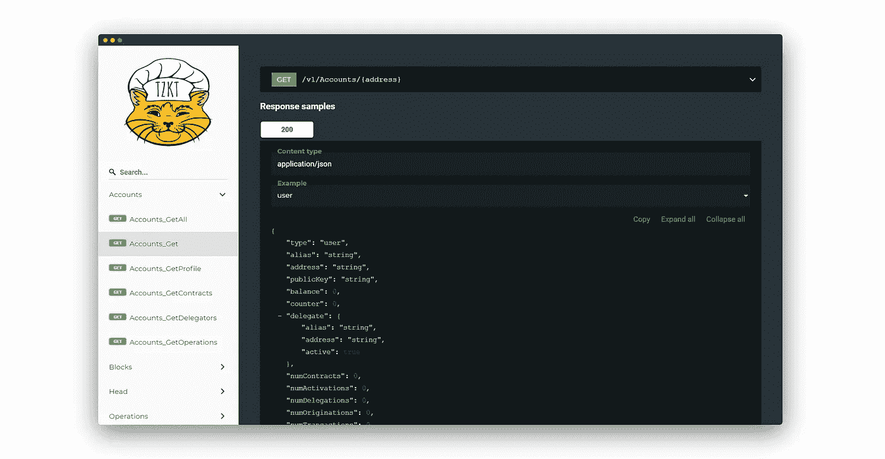
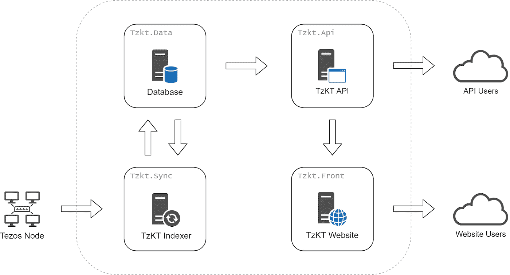
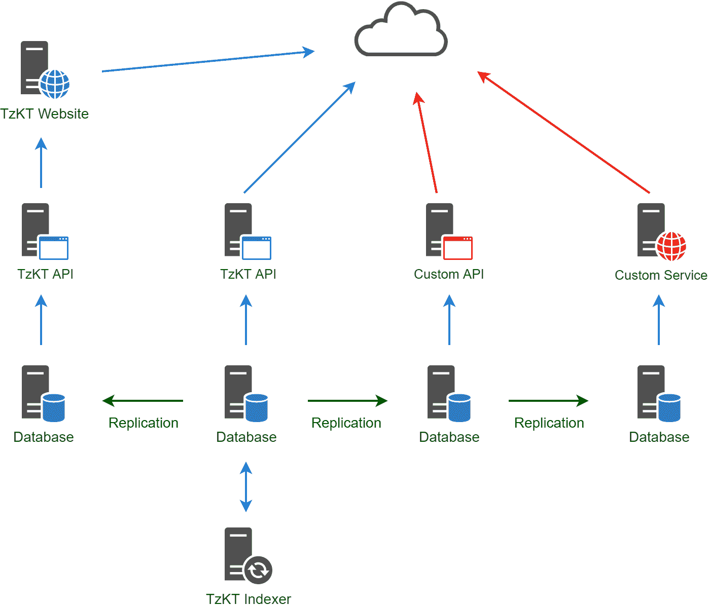
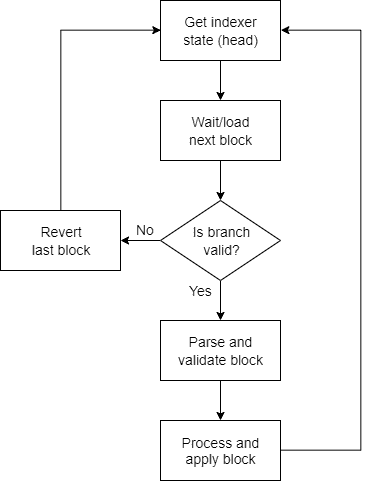
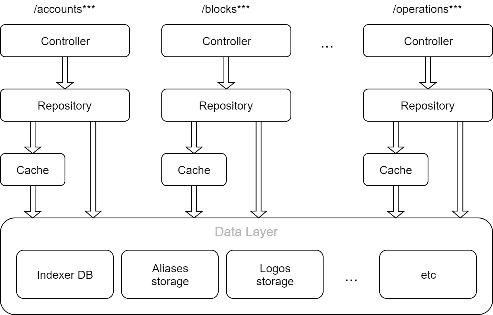

# TzKT #2 —架构和核心组件概述

> 原文：<https://medium.com/coinmonks/tzkt-2-overview-of-architecture-and-core-components-d18903a19d1c?source=collection_archive---------1----------------------->

欢迎来到致力于 [TzKT](https://tzkt.io/) 开发过程的 [Baking Bad](https://baking-bad.org/docs) 播客，这是一个轻量级、API 优先、面向帐户的块浏览器，基于它自己的索引器，由 Tezos 基金会支持。

在[的上一篇文章](/@_MisterWalker_/tzkt-1-reflections-on-an-ideal-block-explorer-4f18d3427657)中，我们讨论了关于理想块浏览器的几个假设，现在是时候展示一些实践了。在本文中，我们将讨论 TzKT explorer 的体系结构，它的优点和缺点，以及我们为什么选择这样或那样的方法。我们开始吧。

# 概貌

TzKT 由三个主要部分组成:区块链索引器、API 服务和前端部分。将它们结合在一起，我们得到了下面的图片。

值得注意的是，每个组件都是作为一个单独和独立的服务。这实际上非常好，因为它使消费者能够只使用所需的组件，甚至用自己的组件替换一些组件。

这样的微服务架构不仅灵活，而且具有很好的横向可扩展性。虽然一个工作的索引器足以收集数据，但一个 API 服务器甚至一个数据库实例可能不足以(取决于系统负载)提供高质量的服务。

因此结果可能如下所示。

现在让我们详细看看索引器和 API 组件。

# TzKT 索引器

在幕后，索引器是一个简单的循环，它处理来自区块链的每个块。

但是，正如我们所知，Tezos 经历了几个协议(将来会有更多的协议)，这意味着不同的块必须根据特定的协议进行不同的验证和处理。

## 协议处理程序

最初，我们计划创建一个灵活且可扩展的协议处理程序，但是当我们意识到 Tezos 协议之间有太多的突破性变化(甚至 RPC 响应有不同的模式)时，我们决定为每个 Tezos 协议创建单独的协议处理程序。所以我们并不真正关心 Tezos 提案中的变化，但是我们必须编写更多的重复代码。我们相信这是值得的。

因此，循环的第一步是确定协议处理程序。之后，选择的协议处理程序反序列化并验证该块。

## 阻止验证

当块被反序列化时，我们希望确保它包含正确的/预期的值。例如，如果巴比伦块的优先级为 0，并且包括 32 个背书，则面包师将获得 16 tez 奖励，而不是 15.9 或 16.1，等等。另一方面，块验证对于测试我们对当前协议的了解是必要的，所以如果有一个意外的值，那么我们可能在协议处理程序实现过程中遗漏了一些东西。

## 提交更改

当块被验证时，我们将它“分割”成一堆原子提交，在取消最后一个块的情况下，这些提交可以被应用或恢复。

实际上，每次提交都代表索引器的一个特定特性。例如，如果我们想要存储事务，我们创建一个事务提交，它从块中提取所有事务，处理它们并保存到数据库。或者，如果我们想要收集统计数据，我们创建一个适当的提交，从块进程中获取所需的数据并保存它。

老实说，用这种方法给索引器添加特性非常方便。

## 诊断学

还有一个在应用或恢复提交之前进行自我诊断的选项。需要这个选项来确保协议处理程序正确完成所有工作。但是作为副作用，它会进行额外的 RPC 调用(顺便说一下，这非常慢)，所以在与区块链同步期间应该禁用它。否则，需要很长时间。

完成这些步骤后，更改被保存到数据库，索引器开始等待下一个块。

## 一点糖果

在 Tezos mainnet 的第 173 个周期结束时，TzKT 索引器消耗大约 70MB RAM(完全同步期间的峰值为 100MB)和大约 5GB 磁盘空间(1GB 数据+ 4GB 索引)。背书操作占了其中的 80%😆。

此外，不需要从 genesis 同步索引器，因为我们将提供最近的快照(目前约 800MB)，使消费者能够尽快启动它。

# TzKT API

除了 TzKT 索引器之外，我们还开发了一个本地 API 来提供访问数据的便捷方式。这比直接查询数据库更简单、更快(由于智能缓存)。

如您所见，TzKT API 不仅使用索引器数据库，还使用额外的数据源/提供者，这使我们能够用有用的元数据丰富答案，例如地址别名、提案描述等。这也意味着，只需添加定制的数据提供者，就可以根据任何人的需求轻松定制 API。

## 证明文件

保持 API 文档最新真的是一个痛苦的过程，所以我们决定让 TzKT 代码自文档化(通过使用 Swagger，Open API 3)，这意味着文档是自动生成的，我们不必关心它。

## 资源消耗

禁用缓存时，API 服务器消耗大约 150MB RAM(不包括高负载)，缓存所有账户时消耗大约 400MB RAM(不包括操作等相关实体)。所以在云中使用 TzKT API 非常便宜。

> TzKT API 在公共网络上部署和公开是安全的，但是仍然建议使用反向代理，比如 Nginx 或 Apache。

# 结论

我们刚刚描述了基本的 TzKT 概念，它的架构和核心组件，索引器和 API。正如你所看到的，它真的是轻量级的，非常灵活和可扩展。老实说，这只是开始，因为只有最初的功能已经实现，但它的工作！有许多工作要做，许多功能要添加，我们将尽最大努力在短时间内实现计划中的一切。

在 MIT 许可下发布的该项目的源代码可以在这里找到。通过提出拉动请求或制造问题的任何参与都受到高度赞赏！此外，我们总是很高兴在我们的[电报聊天](https://t.me/baking_bad_chat)中看到每个人，并乐意讨论与我们的项目相关的一切。

# 以下步骤

我们计划在不久的将来采取以下措施:

*   发布关于如何构建和部署 TzKT 索引器和 API 服务器的指南；
*   发布第一版的浏览器网络界面，有几个可爱的特性。

之后，我们将继续致力于扩展索引器功能和 API 端点，以及改进浏览器 UI。

在[推特](https://twitter.com/tezosbakingbad)和 [Github](https://github.com/baking-bad) 上关注我们，保持更新。
干杯！

*最初发表于 2019 年 12 月 03 日*[*https://baking-bad.org*](https://baking-bad.org/blog/2019/12/03/tezos-explorer-tzkt-2-overview-of-architecture-and-core-components/)*，在那里你可以找到文章的完整版本。*

> [直接在您的收件箱中获得最佳软件交易](https://coincodecap.com/?utm_source=coinmonks)

