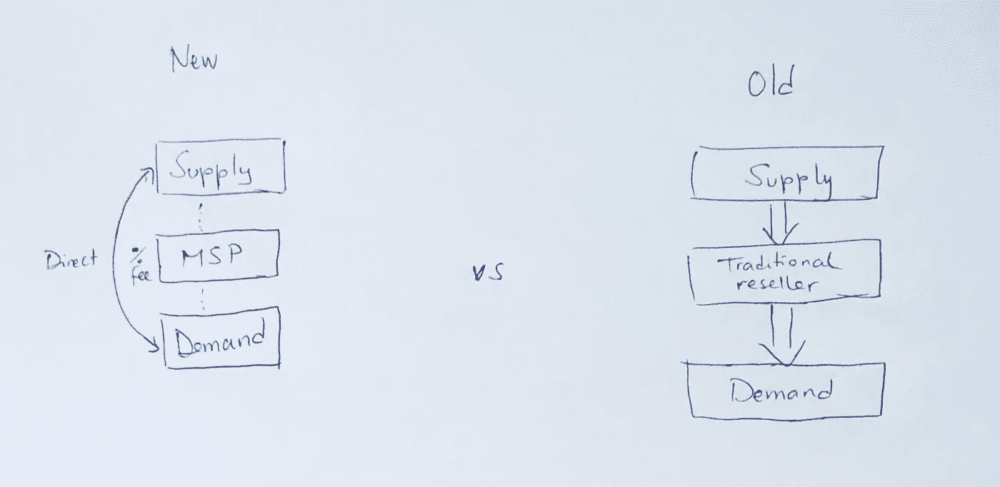
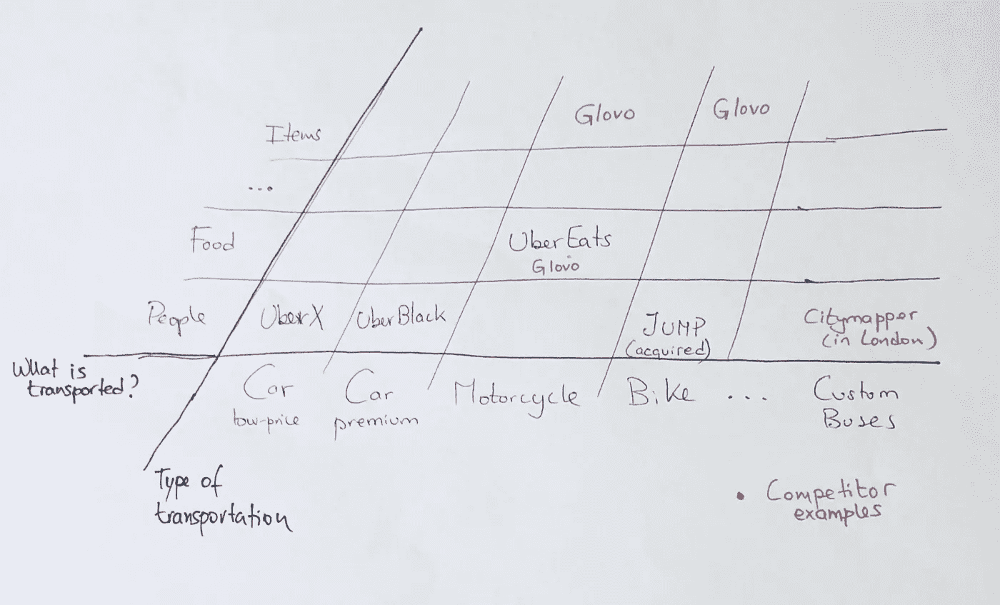
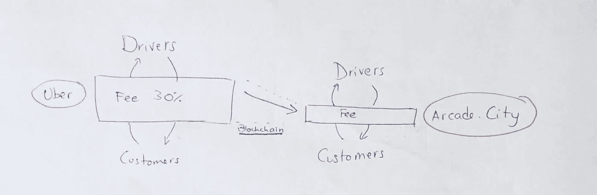

# 优步被城市化了

> 原文：<https://medium.com/coinmonks/uber-being-uberized-b497b6fed5d?source=collection_archive---------4----------------------->

围绕优步和 AirBnb，已经有很多关于异常估值的案例研究——AirBnb 是 310 亿美元，优步是 480 亿美元。这些都是清晰的例子，说明多方平台炒作的概念是如何引起每个决策者的注意的。

诸如“你的行业将被颠覆”和“我的创业公司是保险业的优步”这样的常见语句出现在每天的早间商业新闻中。但是这种新的安排到底代表了什么呢？

## 多边平台

这个概念可以简单地概括为连接两个或多个参与者组的能力。这之所以成为可能，是因为互联网极大地降低了搜索成本，而智能手机让人们可以随时随地无限制地进行搜索。

> 今天，当你与你的朋友围绕一个话题激烈争论时，你可以快速验证手机中的答案，然后继续前进。

下图清晰地捕捉到了正在发生的业务变化:

Change on business connections

然而，所有这些创新都有一些注意事项。诸如平台上参与方的数量、如何为产品/服务定价以及如何应用治理等主题将极大地影响最终的服务。

优步是这一领域的旗舰参考，并提出了实现移动性的新方法。在没有大的进入壁垒的情况下，如果优步想要生存，他们需要从另一个角度来看待这个问题。

**进入阻止策略**

有三种常见的阻止进入的策略:

*   限价——进入前的低价
*   掠夺性定价——低价迫使退出
*   战略捆绑–以低于联合购买的成本组合服务

优步通常在他们进入时推出低价。他们将自己定位于多个类别(如 UberX、UberBlack)，以适应多个价格段。然而，最近的市场条目显示，当我们看传统公司/出租车时，优步并不是最便宜的。

因此，优步现在正试图通过在生态系统中战略性地捆绑更多的服务来提高成本，从而在这个行业中进行竞争。

如果第一步是试图在一个细分市场(无人驾驶汽车)上颠覆自己，那么现在的重点是为移动服务提供终极应用(收购 Jump Bikes 就是一个例子)。

他们现在的策略似乎是整合各种运输方式，而不是仅仅专注于汽车/摩托车市场，并使运输的货物多样化(例如 UberEats for food)

**我敢冒险说，我们可能会见证优步会员月租费的产生，可以使用汽车、自行车、定制路线巴士……**

Examples of already deployed services, some competitor examples and possible white spaces

延迟进入的另一种方式是“非正式地”同意监管。我说非正式是因为他们不能公开同意，因为这会影响他们的成本结构。但是随着监管被证明是为了保护现任者，很明显会有什么样的道路。

与此同时，一个优步成本结构颠覆者正在形成…

## 技术进步为新大卫奠定了基础

如前所述，如果能够盈利，任何市场都会吸引进入。因此，任何扰乱提供这项服务的成本的宏观事件肯定会吸引更多的进入者，这正是正在发生的事情，成为区块链的影响之一。

区块链也是炒作列车上的一个话题。通常，人们会因为比特币和所有的加密货币狂热而对其不屑一顾。然而，有烟就应该有火。这就是我要找的。

我目前的研究重点是区块链影响的经济学。虽然这个话题显然刚刚开始触及计算机科学之外的学术议程，但我能够找到两位麻省理工学院的研究人员，他们发表了[“一些简单的区块链经济学”](http://www.nber.org/papers/w22952)。

本文有两个明确的结论:

*   受影响的成本:核查成本和联网成本；
*   **市场可以在不需要可信中介的情况下部署。**

是的，你读得很好。所有现在试图规模化的中介，很快就会被去中心化的平台颠覆。他们想拿的 30%的费用受到威胁了吗？我们会看到的。

Blockchain effect on a platform business

> 比如街机之类的例子。优步的城市，Airbnb 的比托肯可以很容易地找到，结果证明是平台业务的较低成本结构。

## 我应该担心吗？

*   你依赖网络吗？你在连接不同的业务方面吗？
*   你是否有简单的业务关系，依靠合同来调解信任？(例如，汽车行业中的紧密供应链可能需要更多时间才能受到影响，因为它们已经非常复杂和相互关联)

如果你的答案是肯定的，你应该进一步调查。

PS:在写这篇文章的时候，我没有任何提到的项目的股份。它们只是作为例子被提及，而不是作为投资建议。

如果你喜欢这篇文章，请随意👏。如果你有任何建议或分享你的经验，请这样做。