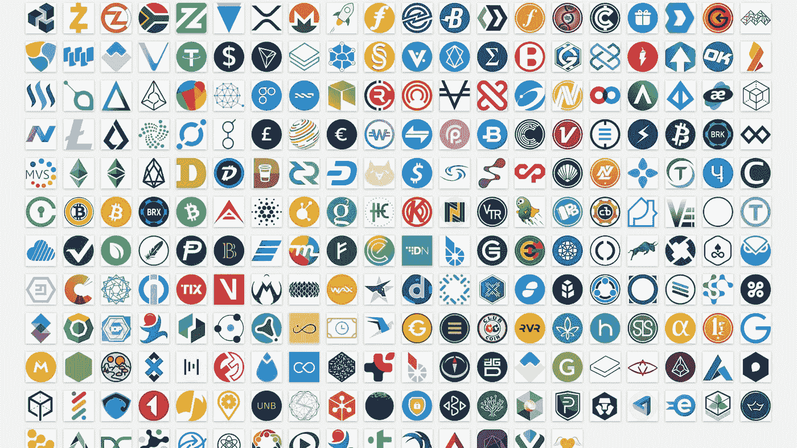

# 啊！分散式医疗保健会成为现实吗？

> 原文：<https://medium.com/coinmonks/ugh-will-decentralized-healthcare-ever-be-a-thing-a8ddd2e3c586?source=collection_archive---------3----------------------->

The TOP100 Digital Health Companies In 2021 by The Medical Futurist ([source](https://medicalfuturist.com/the-top100-digital-health-companies-in-2021-by-the-medical-futurist/?utm_source=The%20Medical%20Futurist%20Newsletter&utm_campaign=0fd199c3cd-EMAIL_CAMPAIGN_2021_9_21&utm_medium=email&utm_term=0_efd6a3cd08-0fd199c3cd-420545589&mc_cid=0fd199c3cd&mc_eid=fe618932a6))

如果会的话，它的(象征性)经济学会是什么？

每当我读到 [CBInsights](https://www.cbinsights.com/reports/CB-Insights_Healthcare-Report-Q2-2021.pdf?utm_campaign=marketing_state-healthcare_2021-07&utm_medium=email&_hsmi=140499723&_hsenc=p2ANqtz-9A0ecU9n0B1wBXnUnQv0gP1jtS02wZ-iqnua8cEWVjsgK9trCzm6GCXs0NcsPTXyT6yzQiFDCk2TMAVmUMUA3V4EQ5jw&utm_content=140499723&utm_source=hs_automation) 、 [RockHealth](https://rockhealth.com/insights/h1-2021-digital-health-funding-another-blockbuster-year-in-six-months/) 或[医学未来学家](https://medicalfuturist.com/the-top100-digital-health-companies-in-2021-by-the-medical-futurist/?utm_source=The%20Medical%20Futurist%20Newsletter&utm_campaign=0fd199c3cd-EMAIL_CAMPAIGN_2021_9_21&utm_medium=email&utm_term=0_efd6a3cd08-0fd199c3cd-420545589&mc_cid=0fd199c3cd&mc_eid=fe618932a6)的报告，我不禁感到有些失望和沮丧，而区块链科技*甚至没有提到*。

数字健康创新景观系统地包括:人工智能、ML、远程医疗、[数字治疗学](https://en.wikipedia.org/wiki/Digital_therapeutics)、[-组学](https://link.springer.com/chapter/10.1007/978-3-319-43033-1_1)、医疗设备、健康 IT 和最近的精神健康技术。然而，不知何故，区块链总是不在名单上。

毫不奇怪，在这个[、价值 141 亿美元的数字健康市场](https://www.gminsights.com/industry-analysis/digital-health-market)，2021 年上半年吸引的私人投资已经相当于 2020 年全年的总和(见下图)，我在区块链或 cryptohealth 看到的投资很少甚至没有。

Funding, deals, deal sizes, acquisitions and public exits **are all up** ([source](https://rockhealth.com/insights/h1-2021-digital-health-funding-another-blockbuster-year-in-six-months/))

我曾在 2018 年就此写过[，尽管 2020 年区块链医疗保健市场估值有望达到 8.7%的 2B，CAGR 预测到 2026 年，投资在数量和规模上仍然很小。](/crypto-oracle/is-blockchain-interested-in-healthcare-ddf19966c7f5)

我想分享 **3 个理由**，我认为这可以解释区块链和医疗保健的*长期投资不足*，尽管*数字医疗投资持续指数增长*。

# 原因 1:许多投资者仍然不理解区块链在医疗保健中的作用

尽管[新冠肺炎](https://www.blockdata.tech/blog/general/10-key-blockchain-developments-in-healthcare-towards-covid19-in-2021)向[展示了区块链科技](https://drjanethomason.net/blockchain-and-emerging-health-systems/)在发达和新兴的医疗保健服务系统中提供了有影响力的解决方案，例如:

*   测试、疫苗配送和医疗用品的供应链
*   便利汇款、现金转移和跟踪捐助资金
*   自动化医疗支付和临床试验管理
*   COVID 通行证、职业资格认证和自我主权身份
*   数据和电子健康记录管理和护理连续性

[**科技**](https://www.disruptordaily.com/blockchain-market-map-healthcare/) **成功不等同于** [**财务**](https://builtin.com/blockchain/blockchain-healthcare-applications-companies) **成功或** [**可投资性**](https://www.lexico.com/definition/investability) **。**

> 事实上，当分析数十家区块链健康公司时，只有少数几家具有商业可行性(见下图)。

Blockchain health projects currently comprise a small fraction of the overall number of commercially successful blockchain projects ([source](https://blockchainhealthcaretoday.com/index.php/journal/article/view/166/217))

我认为，除了投资者缺乏意识、犹豫不决和规避风险之外，总部位于区块链的解决方案 ***还对医疗保健行业带来了生存威胁*** ，因此转移了投资。

区块链不仅仅是*在医疗保健中消除*大量投资和强大的第三方，如[药房利益经理](https://www.statnews.com/2018/08/27/pharmacy-benefit-managers-good-or-bad/)、[集团采购组织](https://www.modernhealthcare.com/article/20181019/TRANSFORMATION02/181019863/professors-argue-gpos-pay-to-play-fees-drive-up-healthcare-costs)和[第三方管理者](https://propertycasualtyfocus.com/leap-bad-faith-tpas-may-sued-aiding-actions/)；区块链*改变了推动当前现状的经济力量平衡*，这代表了[美国 GDP 的近 20%](https://www.investopedia.com/u-s-healthcare-spending-rising-fast-5186172) 。

# 原因 2:医疗保健是一个集中的游戏，只有极少数人从中获利

试图理解为什么美国努力让其公民活着，为什么对新冠肺炎和 T2 的反应如此糟糕，这超出了本文的范围。

尽管事实表明，疫情在公共卫生方面的准备和投资有助于增进健康、延长寿命、提高生活质量，并反过来扩大劳动力和促进经济增长(见下文)。

In upper-middle- and high-income countries, the greatest health improvement could come from increased use of preventive strategies for heart disease, diabetes, weight management, smoking cessation, and prevention and treatment of substance-use disorders ([source](https://www.mckinsey.com/industries/healthcare-systems-and-services/our-insights/prioritizing-health-a-prescription-for-prosperity))

话虽如此，几十年来，美国医疗保健系统一直鼓励并支付服务、药物和住院治疗的*利用率，而不是奖励预防、教育和公共卫生干预。*

新冠肺炎**只是加深了**这些*错位*的激励，这些激励为付费者、大医院和行业创造了*的创纪录收益，而 [*将患者推向贫困*](https://www.hrw.org/news/2021/03/02/united-states-pandemic-impact-people-poverty#)[*威胁着独立临床实践的生存能力*](https://www.medicaleconomics.com/view/7-maneuvers-for-independent-practices-to-weather-the-storm) 。*

*考虑到这一点，投资者更愿意投资大型技术(尽管有些人正在离开医疗保健行业)，而不是冒险进入正在试验新经济模式的公司，就不足为奇了。*

**

***FAMGA** took new steps to increase their market opportunity in healthcare. **Facebook** launched Oculus to deploy VR-based education. **Apple** updated Watch and iOS to capture even more health metrics. **Microsoft** launched Microsoft Cloud for enterprise solutions. **Google** launched an EHR solution for providers, payers, and employers. **Amazon** launched Amazon Care, Amazon Pharmacy, and AmazonDx, all consumer-focused healthcare services ([source](https://www.cbinsights.com/reports/CB-Insights_Big-Tech-In-Healthcare-2021.pdf?))*

# *原因 3:数据=美元，只要数据不是你的，分散经济就不是一件事*

*医疗保健的经济引擎是数据。*

*可操作的信息不仅对预防、诊断和治疗疾病或刺激创新至关重要，也是医疗保健公司赚钱的基本方式。债务和信贷工具、购买力和市场支配地位是基于数据监管、分析、贸易和来自*创造知识不对称*(如下)的杠杆力量。*

**

*Data is patient-centric, but not patient-owned, and so the economics of healthcare are not-patient driven ([source](https://files.pitchbook.com/website/files/pdf/PitchBook_Analyst_Note_Emerging_Opportunities_Real_World_Evidence.pdf))*

*数据医疗保健市场不仅[大](https://www.marketsandmarkets.com/Market-Reports/healthcare-data-analytics-market-905.html)(从 2021 年的估计 211 亿美元到 2026 年达到 751 亿美元)和[复杂](https://about.datarade.ai/data-marketplaces)、【B2B、IoHT、D2C】、**而且是寡头垄断**。例如，在美国市场的 1200 个电子健康记录中，[五个](https://www.ehrinpractice.com/largest-ehr-vendors.html)占据了 80%的市场，一个( [Epic](https://www.cbinsights.com/research/electronic-health-record-companies-unbundling/) )拥有医院环境中 30%的合同。*

*尽管为了应对新冠肺炎疫情法案，监管环境[禁止医疗系统、应用程序和设备之间的电子医疗信息封锁](https://files.pitchbook.com/website/files/pdf/PitchBook_Analyst_Note_Emerging_Opportunities_Real_World_Evidence.pdf),但几乎没有经济、知识产权和合规[激励来共享数据。](/pikciochain/blockchain-for-personal-data-privacy-in-healthcare-d01bb67d4179)*

> *虽然数据是以患者为中心的，但它不是患者所有的，因此医疗保健的经济学不是由患者驱动的。*

# *分散代币经济学是医疗经济学的未来吗？*

*健康数据是我们的，它有价值，并且[价值可以用来激励我们](https://sgershuni.medium.com/ssi-business-models-and-go-to-market-663813eea3b4)保持健康，这种想法听起来简单、公平且直截了当(想象某种[全民健康收入](https://medium.datadriveninvestor.com/3-new-words-to-know-in-2021-weird-uhi-and-camels-d102aee150f2))。为什么消费者不应该参与数据市场，从中受益并做出贡献？*

*但是，即使我们忽略了这种参与可能带来的隐私、监管和税收影响，问题仍然是:我们如何获取(标记化)我们健康数据的价值？或者换句话说，我们应该在医疗保健中使用哪种令牌？*

*除了*硬币*(一种使用自己的区块链的数字货币或价值储存手段)与*代币*(一种没有自己的区块链，但可以(但不一定)用作支付的数字资产)之间的[技术差异](https://blog.liquid.com/coin-vs-token)之外，[代币是区块链一个重要而迷人的](/unstoppabledomains/an-introduction-to-digital-tokens-cdcc72a12221)特征，它们的分配模式(*代币经济学*)是一个不断发展的领域(见下文)。*

**

*Token distribution mechanisms have transitioned from crowd fundraising (value to the issuer) to focusing on distributing tokens to users that are providing value to the user ([source](https://blog.coinlist.co/the-evolution-of-token-distribution-models/))*

*代币可以在医疗保健中以多种创新方式使用:*

1.  *公用令牌可以提供对特定服务或产品的访问或支付，以及促进网络中的[治理](https://tradecraftjake.medium.com/governance-tokens-investing-in-the-building-blocks-of-a-new-economy-fc5f7ecad1ae)和[投票](/coinmonks/daos-are-the-next-best-thing-4efaff6662f6)。*
2.  *证券代币可以证明对现实世界资产的投资，比如股票和固定收益。*
3.  *[稳定货币](/dragonfly-research/a-visual-explanation-of-algorithmic-stablecoins-9a0c1f0f51a0)是用作可编程货币的数字代币，具有固定价值，通常与法定货币挂钩，但可以由其他加密或非加密资产[支持。](/@sebastien.derivaux/crypto-banking-101-ece9f1c2b031)*
4.  *[不可替代代币](/token-kitchen/non-fungible-tokens-nfts-54ec3f4caf15) (NFTs)以数字方式代表独特的物品，可以是真实的，也可以是虚拟的，可以用作[收藏品](https://medium.datadriveninvestor.com/non-fungible-tokens-nfts-for-dummies-5944d1570ec1)、[身份、资格或信誉证明](https://academy.affinidi.com/non-fungible-tokens-nfts-vs-verifiable-credentials-vcs-cd0ebb13f1fb)。*
5.  *[可替代和非功能性非专利技术](https://blog.oceanprotocol.com/nfts-ip-3-combining-erc721-erc20-b69ea659115e)或[混合 NFT](https://decrypt.co/81500/lockdown-thriller-movie-be-released-limited-edition-hybrid-nfts?utm_campaign=daily_bundle_template&utm_content=NFTs%20go%20to%20Hollywood&utm_medium=email&utm_source=sg_email) 的组合正在开发中，用于[知识产权保护](/@nic__carter/why-nfts-are-hard-to-explain-48f0ab0a35bf)。*
6.  *[社交](/privi/wtf-is-a-social-token-a037a3577681)和[个人](https://www.nature.com/articles/d41586-021-01642-3)NFT 代表了[创作者](https://medium.datadriveninvestor.com/the-next-wave-of-nfts-is-here-theyre-called-social-nfts-8dda2cbfa18b)和他们的社区如何直接交换价值([通用创作者收入](https://li.substack.com/p/the-case-for-universal-creative-income))的一种方式。*

## *那么，在医疗保健中使用什么样的令牌最好呢？*

*这取决于你想获得什么样的价值。*

*作为一名几十年来教育病人自我保健的医生，我觉得个人 NFTs 将成为投资于自己的有趣工具。NFTs 可以让[创造者](https://hbr.org/2021/07/how-blockchain-can-help-combat-disinformation)(无论是专业人士还是患者)创造新的[分布式经济活动](/our-new-nature/the-real-power-of-the-nft-19e313c01712)，这是目前的医疗系统所不支持的，比如以全民健康或创造者收入的形式。*

# *最后的想法:投资者会买账吗？*

*除了[投资者对区块链和加密货币的波动性、合法性和可行性的看法](/trality/the-future-of-cryptocurrency-1fed6ccf41d6)之外，投资分散健康(如 DeFi)对当前的风险投资模式[提出了](https://www.visualcapitalist.com/factor-investing-in-everyday-life/)严峻的挑战和机遇。*

> *分散的经济基础是存在的，但它们需要拥抱新的商业模式，包括透明度、竞合(合作竞争)和互操作性思维。*

*如果医疗保健能够效仿分散金融领域的实验和变革，那将是件好事，因为如果说新冠肺炎教会了我们什么的话，那就是未来将充满变数。*

**

*The future is a multi-token world [Source](/coinmonks/the-future-is-multi-coin-fe0019cfa264)*

**如果你觉得这个内容很吸引人，并且对自己的试运行内容感兴趣，请查看量子经济学的* [*按需分析*](https://quantumeconomics.io/market-analysis/) *服务**

> *加入 Coinmonks [电报频道](https://t.me/coincodecap)和 [Youtube 频道](https://www.youtube.com/c/coinmonks/videos)了解加密交易和投资*

## *另外，阅读*

*   *[尤霍德勒 vs 科恩洛 vs 霍德诺特](/coinmonks/youhodler-vs-coinloan-vs-hodlnaut-b1050acde55a) | [Cryptohopper vs 哈斯博特](https://blog.coincodecap.com/cryptohopper-vs-haasbot)*
*   *[币安 vs 北海巨妖](https://blog.coincodecap.com/binance-vs-kraken) | [美元成本平均交易机器人](https://blog.coincodecap.com/pionex-dca-bot)*
*   *[新加坡十大最佳加密交易所](https://blog.coincodecap.com/crypto-exchange-in-singapore) | [购买 AXS](https://blog.coincodecap.com/buy-axs-token)*
*   *[投资印度的最佳密码](https://blog.coincodecap.com/best-crypto-to-invest-in-india-in-2021) | [HitBTC 评论](/coinmonks/hitbtc-review-c5143c5d53c2)*
*   *[加拿大最佳加密交易机器人](https://blog.coincodecap.com/5-best-crypto-trading-bots-in-canada) | [赌注加密](https://blog.coincodecap.com/staking-crypto)*
*   *[如何在印度购买比特币？](/coinmonks/buy-bitcoin-in-india-feb50ddfef94) | [瓦济克斯审查](/coinmonks/wazirx-review-5c811b074f5b)*
*   *[比特币主根](https://blog.coincodecap.com/bitcoin-taproot) | [Bitso 评论](https://blog.coincodecap.com/bitso-review) | [排名前 6 的比特币信用卡](/coinmonks/bitcoin-credit-card-bc8ab6f377c6)*
*   *[最佳免费加密信号](https://blog.coincodecap.com/free-crypto-signals) | [YoBit 评论](/coinmonks/yobit-review-175464162c62) | [Bitbns 评论](/coinmonks/bitbns-review-38256a07e161)*
*   *[OKEx 回顾](/coinmonks/okex-review-6b369304110f) | [Kucoin 交易机器人](/coinmonks/kucoin-trading-bot-automate-your-trades-8cf0ca2138e0) | [期货交易机器人](/coinmonks/futures-trading-bots-5a282ccee3f5)*
*   *[AscendEx Staking](https://blog.coincodecap.com/ascendex-staking)|[Bot Ocean Review](https://blog.coincodecap.com/bot-ocean-review)|[最佳比特币钱包](https://blog.coincodecap.com/bitcoin-wallets-india)*
*   *[霍比评论](https://blog.coincodecap.com/huobi-review) | [OKEx 保证金交易](https://blog.coincodecap.com/okex-margin-trading) | [期货交易](https://blog.coincodecap.com/futures-trading)*
*   *[Godex.io 审核](/coinmonks/godex-io-review-7366086519fb) | [邀请审核](/coinmonks/invity-review-70f3030c0502) | [BitForex 审核](https://blog.coincodecap.com/bitforex-review)*
*   *[Crypto.com 费用](/coinmonks/binance-fees-8588ec17965) | [僵尸加密审查](/coinmonks/botcrypto-review-2021-build-your-own-trading-bot-coincodecap-6b8332d736c7) | [替代品](https://blog.coincodecap.com/crypto-com-alternatives)*
*   *[有哪些交易信号？](https://blog.coincodecap.com/trading-signal) | [Bitstamp vs 比特币基地](https://blog.coincodecap.com/bitstamp-coinbase) | [买索拉纳](https://blog.coincodecap.com/buy-solana)*
*   *[ProfitFarmers 点评](https://blog.coincodecap.com/profitfarmers-review) | [如何使用 Cornix 交易机器人](https://blog.coincodecap.com/cornix-trading-bot)*
*   *[MXC 交易所评论](/coinmonks/mxc-exchange-review-3af0ec1cba8c) | [Pionex vs 币安](https://blog.coincodecap.com/pionex-vs-binance) | [Pionex 套利机器人](https://blog.coincodecap.com/pionex-arbitrage-bot)*
*   *[我的密码交易经验](/coinmonks/my-experience-with-crypto-copy-trading-d6feb2ce3ac5) | [比特币基地评论](/coinmonks/coinbase-review-6ef4e0f56064)*
*   *[CoinFLEX 评论](https://blog.coincodecap.com/coinflex-review) | [AEX 交易所评论](https://blog.coincodecap.com/aex-exchange-review) | [UPbit 评论](https://blog.coincodecap.com/upbit-review)*
*   *[AscendEx 保证金交易](https://blog.coincodecap.com/ascendex-margin-trading) | [Bitfinex 赌注](https://blog.coincodecap.com/bitfinex-staking) | [bitFlyer 点评](https://blog.coincodecap.com/bitflyer-review)*
*   *[麻雀交换评论](https://blog.coincodecap.com/sparrow-exchange-review) | [纳什交换评论](https://blog.coincodecap.com/nash-exchange-review)*
*   *[加密货币储蓄账户](/coinmonks/cryptocurrency-savings-accounts-be3bc0feffbf) | [加密交易机器人](https://blog.coincodecap.com/best-crypto-trading-bots)*
*   *[BigONE 交易所评论](/coinmonks/bigone-exchange-review-64705d85a1d4) | [CEX。IO 审查](https://blog.coincodecap.com/cex-io-review) | [交换区审查](/coinmonks/swapzone-review-crypto-exchange-data-aggregator-e0ad78e55ed7)*
*   *[最佳比特币保证金交易](/coinmonks/bitcoin-margin-trading-exchange-bcbfcbf7b8e3) | [比特币保证金交易](https://blog.coincodecap.com/bityard-margin-trading)*
*   *[加密保证金交易交易所](/coinmonks/crypto-margin-trading-exchanges-428b1f7ad108) | [赚取比特币](/coinmonks/earn-bitcoin-6e8bd3c592d9) | [Mudrex 投资](https://blog.coincodecap.com/mudrex-invest-review-the-best-way-to-invest-in-crypto)*
*   *[WazirX vs coin dcx vs bit bns](/coinmonks/wazirx-vs-coindcx-vs-bitbns-149f4f19a2f1)|[block fi vs coin loan vs Nexo](/coinmonks/blockfi-vs-coinloan-vs-nexo-cb624635230d)*