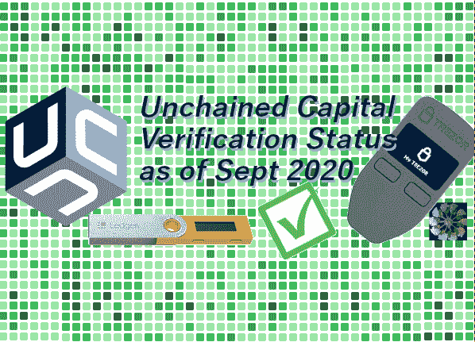

# 截至 2020 年 9 月的非链式验资

> 原文：<https://medium.com/coinmonks/unchained-capital-verification-as-of-september-2020-6123f8ec8178?source=collection_archive---------2----------------------->

## 不要相信。验证。你的金库里有什么？

作者@ vicariousdrama

644428–648834

# 介绍

Unchained Capital 将自己描述为一家为比特币持有者提供合作托管多签名金库和贷款的本地金融服务公司。

Unchained Capital 有一个 [YouTube 频道](https://www.youtube.com/channel/UCTkCLH1VSjWakXyF6z-mjtA)，在那里他们从营销和用户的角度讲述了他们服务的一些功能。这篇文章列举了我在 2020 年 9 月测试的特性。这些结果有一个更长的 50 多页的版本，我可能会作为一个单独的文章发布。至少，通读要点可以让您了解在验证这些特性以满足您自己的需求时应该注意什么。

在中，您会看到✔️指示符表示某个功能已通过验证，⬜指示某个功能应该可用，但我没有进行验证，因为我缺少足够的测试硬件来进行验证。没有失败。

⚠️的出现是用来提醒你应该注意的方面，如果你选择使用可能代表隐私问题、漏洞或可能令人困惑的方面的非链资本。

# 试验台

在这次测试中，我只使用了 Trezor One 和 Ledger Nano S。根据该网站的说法，它们目前不支持 Coldcard。大多数测试是通过使用 Chrome 或 Chrome 衍生产品(如 Brave)的网络浏览器完成的。在某些情况下，我使用了驻极体和大篷车。所有测试都在 mainnet/production 上完成。

# 网站注册和隐私问题

✔️:我可以用用户名、密码、电子邮件和电话创建一个账户

⚠️要创建保险库(或贷款)，需要更多的 KYC 信息(姓名、出生日期、照片身份证明、地址信息)

⚠️网站调用以下完全合格的域名

*   my.unchained-capital.com
*   [www.google-analytics.com](http://www.google-analytics.com)
*   fonts.googleapis.com
*   Pi.typekit.net
*   fonts.gstatic.com

所有 multisig 提供商通用的⚠️，因为 Unchained Capital 需要设备的 xpubs 来帮助创建交易和衍生密钥，所以他们可以看到与钱包相关的所有交易。

# 保管库创建

✔️默认情况下，所有密钥使用的派生路径是 m/45'/0'/0 '。

✔️你可以指定一个自定义的派生路径。例如 m/45'/0'/1 '。

✔️设置键与分类帐纳米 s

✔️用相同的硬件钱包设置第二个密钥(Unchained Capital 不建议这样做)

✔️设置键与 Trezor 一

✔️使用 2 台设备设置 Multisig 钱包(金库#1)

✔️使用 1 个设备和 2 个不同的衍生路径设置 Multisig Wallet(金库# 2 )( unchained capital 不建议这样做)

具有分类帐 Nano X 的⬜设置密钥

带 trezor 型的⬜设置键

⚠️对没有死链接或内容验证的第三方网站的依赖

您创建的⚠️键不会“记住”它们所关联的设备类型。这留给用户来处理所有未来的交易，并可能导致混乱。

# 验证接收地址

✔️可以验证 Nano S 拥有的分类帐地址

✔️可以证明卓尔一号有地址所有权

✔️预先制作了备份文件，其中包含恢复钱包的重要细节

⚠️完全派生路径的深度为 6，这是非标准的。

⚠️自由资本不会自动看到它没有公布的交易

⚠️自由资本将建议重复使用相同的存款地址

⚠️未被束缚的资本实际上具有 0 的缺口限制，并且似乎仅监控当前存款地址，而跳过已经使用的地址

**大篷车**

✔️钱包文件与解放资本的大篷车产品兼容

Caravan 中的⚠️默认 BIP32 路径与非链接资本默认方案不匹配

**银金矿**

✔️可以使用 Electrum 设置、签署和发送交易

⚠️钱包文件不能直接导入到 Electrum(但易于转换)

# 签署交易

✔️能够准备交易，签署，并发送资金到另一个地址

✔️发送对话框允许几乎完全控制费用率

⚠️费率必须大于 0 且小于每字节 1000 sats。

https://bitcoinfees.earn.com，一个外部网站，不考虑最近的街区，而是把日子作为一个整体。

⚠️发送对话框无法指定 satoshis 中的金额。回忆 sat 在小数点后第 8 位

⚠️发送对话框允许数量超过 8 位小数，但在允许您进行下一步操作之前会进行验证

⚠️自由资本只监控现在的地址

⚠️钱包将只反映基于当前地址的余额

当有多个平衡地址时，⚠️没有 UTXO 管理

用于审核事务的⚠️链接都在 [https://blockstream.info](https://blockstream.info) 的外部，不能定义自己的节点

⚠️所有通过 web 界面准备的交易都是通过非链接的 Capital 服务器广播的，没有能力定义自己的节点

⚠️交易 ID 直到播出后才被披露

⚠️金库将跳过有交易关联的地址，但不会包括在总余额

⚠️必须等到交易被确认后，才能开始保险库中的另一个交易。如果块中从未包含低费用交易，这可能会有问题。要解决这个问题，请使用外部钱包软件进行 RBF。

在未决存款完成之前，具有未决存款交易的⚠️金库不能发送(提取或转移)资金。这是一个可能的拒绝服务攻击媒介。

# 钥匙更换

✔️能够创造一个新的替换钥匙

✔️能够将密钥标记为丢失或损坏，需要更换

✔️逐步完成事务工作，以重用剩余的关键部分。

✔️可以用新钥匙替换保险库的钥匙。

✔️非连锁资本有助于自动增加衍生路径中的“账户”或 6 位中的第 4 位的密钥轮换

✔️防止为正在使用的密钥重新创建相同的密钥

✔️防止为标记为泄露的密钥重新创建相同的密钥

无法设置将资金转移到新密钥集的⚠️费用

⚠️没有明确的方法来验证资金将被送往的地址(尽管我在本文中写了如何做到这一点:[https://medium . com/coin monks/address-verification-when-changing-keys-for-unchained-capital-vaults-268005 e 7563 e](/coinmonks/address-verification-when-changing-keys-for-unchained-capital-vaults-268005e7563e)

⚠️更换钥匙列表包括不能用于更换的钥匙。

替换钥匙的⚠️列表没有按名称或创建日期排序。

当保管库有未确认的交易时，⚠️无法替换密钥。这是一个混合的结果，但可能会导致对挂起的入站事务拒绝服务

⚠️无法花费资金，而保险库正在从钥匙更换被清扫。

# 执行健康检查

✔️能够执行关键的健康检查

✔️验证网站显示上次执行健康检查的时间

✔️验证了在不正确的设备上进行健康检查不会触发成功。

# 用非链式密钥签署交易

✔️能够设置一个交易，要求签署的解放

✔️能够控制交易的金额和费用

✔️证实，解放签署了该交易

✔️能够控制已签署交易的广播

⚠️不确定我是否因签署交易欠 unchained 20 美元，以及如何支付。未集成到 web 应用程序中。—作为跟进，Phil 指出他们尚未对这项服务收费。

# 管理保管库

✔️能够创建多个金库。

✔️能够标记一个金库关闭。

✔️一个关闭的保险库不能被重新打开。

✔️验证了“被解放”不允许从关闭的金库发起新的交易。

✔️一个封闭的金库可以改名

✔️根据《被解放的资本》,你可以拥有无限数量的金库

⚠️关闭的保险库仍保留在保险库列表中。

⚠️默认情况下，保管库可能会按生成的 ID 而不是名称排序

# 信任最小化外部恢复

✔️能够导入到大篷车生成的钱包

✔️能够用 UTXOs 查看钱包上的地址历史

✔️能够创建新的交易进行发送

✔️发送交易完全控制地址，费用，金额

✔️发送交易支持手动控制单个 UTXOs 的支出

✔️交易的每一步都给出原始的十六进制数，可以从外部进行验证

用硬件设备进行✔️签名支持我之前使用的 Trezor 和 Ledger 设备。

✔️交易可以完全签署，并准备广播

✔️该工具能够广播交易

# 网站账户管理

✔️验证了更改我的帐户密码的能力

✔️验证了使用新凭据在网站和应用程序上注销/登录的能力

# 结论

Unchained Capital 提供了一种有用的协作 multisig 服务，这种服务由他们的网站驱动，可以与他们的贷款产品相吻合。虽然 KYC 高得没有必要，但隐私通常不是任何 multisig 合作产品的首要考虑因素。

无链资本的最大优势在于，他们在通过大篷车项目将外部回收最小化的信任方面投入了巨大的努力。此外，它很容易适应使用 Electrum 钱包。

我希望该应用程序中有几点需要改进，最值得注意的是关于验证地址的指导、UTXO 管理以及一次监控多个地址的能力。鉴于很少收到电子邮件，我希望有一种方法可以在帐户设置中关闭这些邮件。

我建议任何考虑释放资本的人在测试设置时进行尽职调查，并定期重新验证，因为服务可能会随着时间的推移而更新。至关重要的是，无论用户何时创建新的保管库或更换钥匙，都要获取外部支出信息。派生路径及其设备种子，以及保险存储上未锁定的大写 xpub 对于恢复至关重要。

再次重申，不要相信我在这篇文章中写的东西。

**自己验证一下吧！**

使用您认为合适的信息作为出发点，根据您的个人威胁模型来运行您自己的场景。

## 另外，阅读

*   最好的[密码交易机器人](/coinmonks/crypto-trading-bot-c2ffce8acb2a)
*   [密码本交易平台](/coinmonks/top-10-crypto-copy-trading-platforms-for-beginners-d0c37c7d698c)
*   最好的[加密税务软件](/coinmonks/best-crypto-tax-tool-for-my-money-72d4b430816b)
*   [最佳加密交易平台](/coinmonks/the-best-crypto-trading-platforms-in-2020-the-definitive-guide-updated-c72f8b874555)
*   最佳[加密贷款平台](/coinmonks/top-5-crypto-lending-platforms-in-2020-that-you-need-to-know-a1b675cec3fa)
*   [最佳区块链分析工具](https://bitquery.io/blog/best-blockchain-analysis-tools-and-software)
*   [加密套利](/coinmonks/crypto-arbitrage-guide-how-to-make-money-as-a-beginner-62bfe5c868f6)指南:新手如何赚钱
*   最佳[加密制图工具](/coinmonks/what-are-the-best-charting-platforms-for-cryptocurrency-trading-85aade584d80)
*   [莱杰 vs 特雷佐](/coinmonks/ledger-vs-trezor-best-hardware-wallet-to-secure-cryptocurrency-22c7a3fd391e)
*   了解比特币的[最佳书籍有哪些？](/coinmonks/what-are-the-best-books-to-learn-bitcoin-409aeb9aff4b)
*   [3 商业评论](/coinmonks/3commas-review-an-excellent-crypto-trading-bot-2020-1313a58bec92)
*   [AAX 交易所评论](/coinmonks/aax-exchange-review-2021-67c5ea09330c) |推荐代码、交易费用、利弊
*   [Deribit 审查](/coinmonks/deribit-review-options-fees-apis-and-testnet-2ca16c4bbdb2) |选项、费用、API 和 Testnet
*   [FTX 密码交易所评论](/coinmonks/ftx-crypto-exchange-review-53664ac1198f)
*   [n 零审核](/coinmonks/ngrave-zero-review-c465cf8307fc)
*   [Bybit 交换审查](/coinmonks/bybit-exchange-review-dbd570019b71)
*   [3Commas vs Cryptohopper](/coinmonks/cryptohopper-vs-3commas-vs-shrimpy-a2c16095b8fe)
*   最好的比特币[硬件钱包](/coinmonks/the-best-cryptocurrency-hardware-wallets-of-2020-e28b1c124069?source=friends_link&sk=324dd9ff8556ab578d71e7ad7658ad7c)
*   最佳 [monero 钱包](https://blog.coincodecap.com/best-monero-wallets)
*   [莱杰纳米 s vs x](https://blog.coincodecap.com/ledger-nano-s-vs-x)
*   [bits gap vs 3 commas vs quad ency](https://blog.coincodecap.com/bitsgap-3commas-quadency)
*   [莱杰纳米 S vs 特雷佐 one vs 特雷佐 T vs 莱杰纳米 X](https://blog.coincodecap.com/ledger-nano-s-vs-trezor-one-ledger-nano-x-trezor-t)
*   [block fi vs Celsius](/coinmonks/blockfi-vs-celsius-vs-hodlnaut-8a1cc8c26630)vs Hodlnaut
*   Bitsgap 评论——一个轻松赚钱的加密交易机器人
*   为专业人士设计的加密交易机器人
*   [PrimeXBT 审查](/coinmonks/primexbt-review-88e0815be858) |杠杆交易、费用和交易
*   [埃利帕尔泰坦评论](/coinmonks/ellipal-titan-review-85e9071dd029)
*   [赛克斯·斯通评论](https://blog.coincodecap.com/secux-stone-hardware-wallet-review)
*   [区块链评论](/coinmonks/blockfi-review-53096053c097) |从您的密码中赚取高达 8.6%的利息