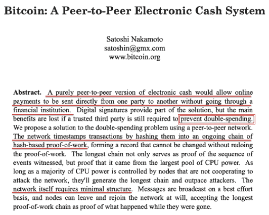
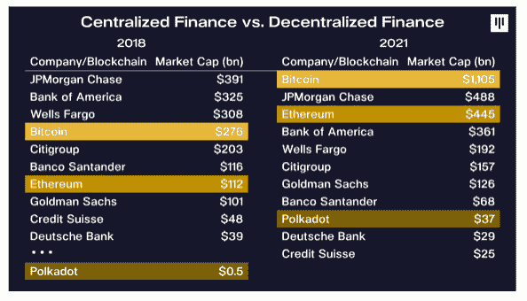
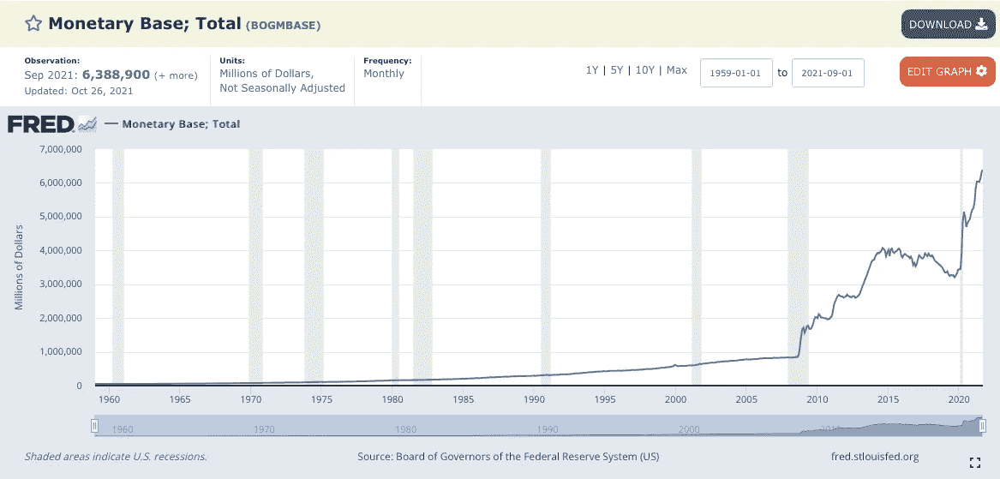
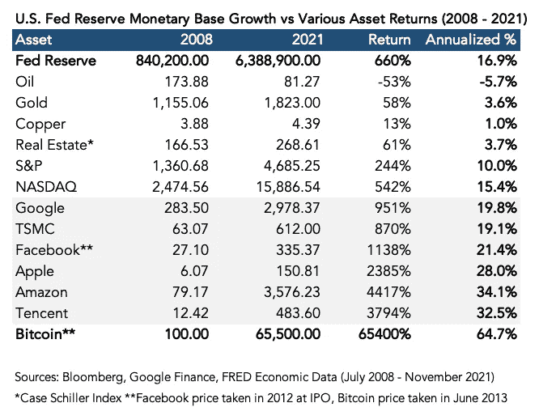
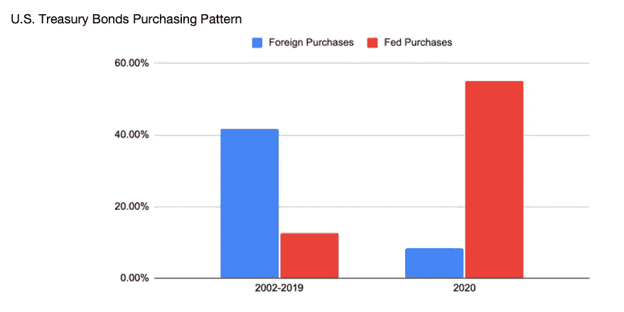
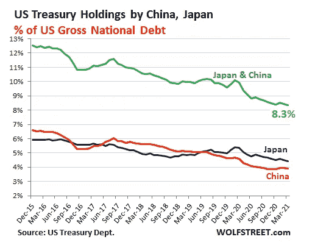
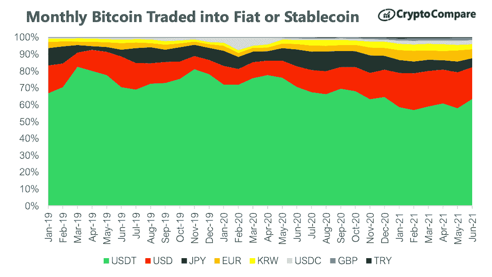
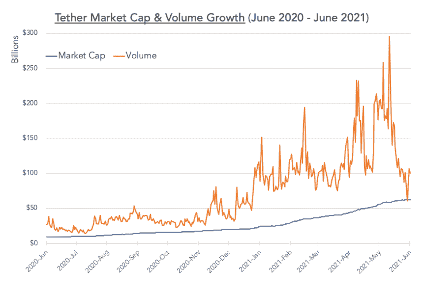
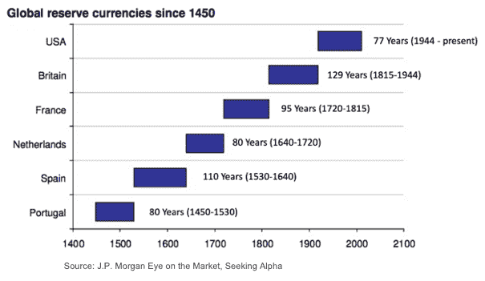
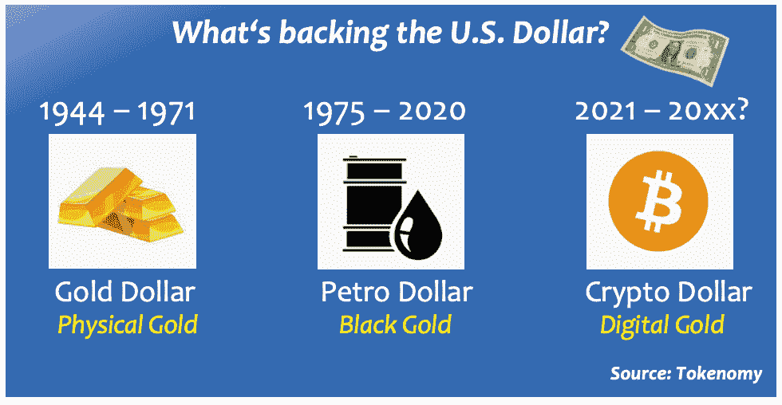

# 揭示比特币和其他加密资产的内在价值

> 原文：<https://medium.com/coinmonks/uncovering-the-intrinsic-value-of-crypto-assets-fdbb7c0b185d?source=collection_archive---------6----------------------->

## 支持加密投资理论的宏观基本面

*本文强调了支持加密资产加速增长和投资论点的宏观基本面叙述和无形内在价值。我们从三个关键角度——技术、金融和政治——看待比特币和区块链革命，并利用历史模式预测未来可能的结果。*

Image: ShutterStock

那些已经关注加密发展一段时间的人可能已经注意到**加密市场的叙述在不同的周期中变化**。2017 年的上一个牛市周期都是通过 ico 进行令牌化和融资。自 2020 年中期以来，NFT、DeFi 和 CBDC 的开发项目主导了当前的市场情绪。这些叙述强调了新发现的区块链技术的应用，但市场参与者往往对技术的潜力反应过度，而低估了实际的执行风险。因此，我们可以看到许多新推出项目的短期炒作和异常收益，当秘密情绪冷却时，它们总是伴随着严重的价格调整。

事实上，秘密投资不仅仅是追逐炒作和价格行为。有一些基本的叙述应该在时间的考验中仍然有效。这篇文章确定了三个宏观经济论文，以揭示真正的内在价值的加密资产。通过从技术、金融和政治角度审视这些观点，我们揭示了隐藏在市场炒作之下的深层真相。

**技术视角:比特币是一种技术**

每当提到比特币，大多数人都会直觉地联想到它的价格和波动性，但它远不止是一种投机资产。比特币是一种完全去中心化、抗审查的点对点电子支付协议。硬币本身是网络参与者维护公开分发的分类账的一种激励和安全特征。重点不应该放在硬币的价格上，而是放在网络效应和它对金融世界的潜在影响上。

Source: bitcoin.org

让我们以互联网为参考。本质上是过去 20 年改变了几乎所有行业的一个通信协议(TCP/IP)。许多行业的基本商业模式已经被该协议完全去中介化，无论是商业、媒体、娱乐、游戏、通信等等。一个巨大的社交媒体行业也已经形成，现在正主导着人们相互交流的方式。所有这些变化都始于互联网的发明，互联网只是一个通用的通信协议。

有趣的是，互联网并没有引发金融业的根本性变革。有许多金融科技公司通过无缝的用户界面和易于使用的功能使金融变得更容易获得，但传统金融基础设施的管道已经近 50 年没有升级了。发明于 1973 年的 S.W.I.F.T(环球银行间金融电信协会)网络使世界各地的银行能够发送和接收有关金融交易的信息，该网络一直沿用至今。跨境交易通常需要许多天才能结算，汇款和外汇手续费很高，从 3%到 7% [ [1](https://www.econstor.eu/bitstream/10419/213809/1/1689681772.pdf) ]不等。随着价值转移协议比特币(Bitcoin)的推出，终于有了一个可能改善传统金融现状的技术路线图。

区块链展示了一种分布式账本技术(DLT ),可用于促进对等价值转移，而无需集中各方的参与。同样的概念现在正在企业层面进行测试-摩根大通在 2017 年牵头发起了银行间信息网络(IIN)，涉及全球 78 个市场的 400 多家金融机构和公司。它最近被更名为 [Liink](https://www.jpmorgan.com/onyx/liink) 。虽然这不是一个未经许可的公共区块链，但该项目利用了 DLT 概念，并正在取代已有半个世纪历史的 SWIFT 系统。

价值转移仅仅是区块链技术的第一个明显的应用。新兴的借贷活动为加密资产创造了一个[固定收益市场](/coinmonks/seeking-yield-in-the-crypto-market-858ec3455d11)；稳定硬币和 CBDC 倡议使法定货币与其数字形式联系起来，代币化为资产的数字证券化铺平了道路。可能性似乎是无限的，因为 DeFi(分散金融)协议已经开始促进过去只能由金融机构执行的交易。在 2021 年初 crypto rally 的巅峰时期，比特币和以太坊协议的市值史无前例地超过了许多传统银行。尽管短期价格波动仍然存在，但当我们关注技术潜力及其长期投资回报时，显然采用趋势一直呈指数增长。

Source: Pantera Capital

**财政前景:跟上通货膨胀和货币基础扩张**

通胀一直是许多投资者的担忧，特别是自 2008 年全球金融危机以来，当时世界各国政府开始通过快速增加货币供应以及实施人为的低利率来刺激经济。通货膨胀取决于 1)货币供应量的增长和 2)货币的流通速度。通货膨胀率通常可以通过消费价格、金融资产和货币基础规模的变化来观察。

谈到衡量通胀，人们直观地会想到 CPI(居民消费价格指数)。然而，与货币基础扩张(印钞)的速度相比，近年来消费者价格一直保持在合理的低位。这主要是由于技术进步，一股强大的*通货紧缩力量*使得消费品逐渐变得便宜。另一个关键原因是，前几轮[量化宽松](https://www.investopedia.com/terms/q/quantitative-easing.asp)大多用于救助金融机构，以维持金融市场稳定；因此，过剩的货币供应被困在金融体系中，推高了金融资产价格，而不是消费者价格。然而，最近的 COVID 刺激计划将资金直接送到了消费者手中。结果，货币流通速度加快，消费领域开始出现通货膨胀；自 2021 年 6 月以来，[年同比 CPI 数字](https://www.statista.com/statistics/273418/unadjusted-monthly-inflation-rate-in-the-us/)已经飙升超过 5%。

基础通货膨胀是广义货币供应量的增加。以美元为例，自 1960 年以来，货币基础一直以线性方式稳步上升，但从 2008 年全球金融危机开始，货币基础变成了指数曲线。如图所示，**过去 13 年，美元基础货币增长超过 660%。**2021 年 10 月公布的最新数字为 6.38 万亿美元，而 2008 年 6 月为 8，400 亿美元。

当投资者看到货币供应量如此呈指数级增长时，他们应该怎么做？他们能够保持他们的美元购买力吗？大规模量化宽松计划不仅仅发生在美国；欧洲央行、日本银行、中国人民银行和许多其他国家正在推出激进的刺激方案，以保持其经济在 COVID 后的运行。如果投资者不拥有超过广义货币供应增长速度的资产，他们的购买力会随着时间的推移而迅速下降。大宗商品、房地产或黄金等传统通胀对冲工具似乎无法带来超过货币基础通胀率的回报，后者的年化通胀率达到了令人震惊的 16.9%。

即使是广泛的股票市场指数也无法跟上美联储资产负债表快速扩张的步伐。在上图中，我们只能指望那些科技巨头带来超额回报。然而，当谈到比特币时，这种新的数字资产的表现远远超过了所有传统资产类别和科技公司。这就是为什么许多资产管理公司开始在其投资组合中配置比特币和加密资产，并将其视为法定货币通胀对冲和新的数字价值储存手段。

另一个有趣的市场现象是外国(非美国)政府的突然行为变化，如中国或日本，它们是美国的主要出口国，通过贸易持有大量美元。过去，这些主权国家总是用它们的美元储备购买美国国债。然而，这种通常的行为在 2020 年开始转变。正如顶级对冲基金经理斯坦利·德鲁肯米勒(Stanley Druckenmiller)指出的那样，在过去 20 年中，一直有 5000 亿美元流入美国国债，直到 2020 年春天，**外国政府减缓了购买低收益国债的速度，转而购买了更多的美国股票** [ [4](https://www.cnbc.com/2021/05/11/stanley-druckenmiller-says-the-fed-is-endangering-the-dollars-global-reserve-status.html) ]。一种解释是，外国政府可能也意识到要保护自己的美元购买力。这一事件也使美联储成为美国国债的主要购买者，进一步加速了美元的非正常货币扩张。

Source: [BitMex Blog](https://blog.bitmex.com/farblast-off-go/), Arthur Hayes, 2021

Source: [Wolfstreet](https://wolfstreet.com/2021/05/17/who-bought-the-4-7-trillion-of-treasury-securities-added-since-march-2020-to-the-incredibly-spiking-us-national-debt/), 2021

机构对加密货币的采用始于宏观对冲基金经理，因为他们是第一批观察到这种货币扩张趋势和对冲法定货币系统需求的人。许多传统资产管理公司和企业投资者也遵循这一投资理念，将加密资产加入他们的投资组合。随着萨尔瓦多在 2021 年 6 月让比特币成为法定货币，加密成为央行和主权实体的储备资产只是时间问题。

**政治观点:对加密美元的政治支持是一股积极的顺风**

比特币可能是第一种加密货币，但它不再是交易量最大的一种。2019 年 4 月，使用最广泛的 stablecoin USDT(或 Tether)超过了比特币的交易量。交易量在 2021 年 5 月达到峰值，每天近 3000 亿美元。正如在之前一篇关于[加密美元的崛起](/coinmonks/the-next-crypto-wave-62d9e32d0167)的文章中所讨论的，作为使用最广泛的国际结算货币，美元继续主导着今天近 90%的比特币交易。

Source: Coinmarketcap data

世界各地的政府对密码部门采取非常不同的方法。以两个最大的经济体为例；一方面，中国采取严肃的立场打击国内的密码交易和采矿活动；与此同时，美国允许加密交易所上市，比特币期货和期权在 CFTC 批准的交易所交易。这只是政府处理加密资产的两个极端例子。除了已经将比特币定为法定货币的萨尔瓦多，大多数主权监管机构都处于两个极端之间，尚未决定最合适的政策。不管政策方向如何，那些禁止这种创新增长的人最终将错过随之而来的潜在经济利益，这可能是相当可观的。

了解美国政府对美元稳定货币的看法很有意思，特别是当私营部门创造的加密美元 USDT 成为全球加密货币生态系统的支柱时。美联储董事会成员 Randal Quarles 在 2021 年 6 月的一次讲话中似乎暗示，**央行可能会*支持*这种私营部门的创新，因为它认为“*稳定货币的潜在好处*** *”，包括美元稳定货币可能会* ***支持美元在全球经济中的作用***

*保持美元作为全球主要货币的地位一直是美国政府保持其全球领导地位和确保国家金融健康的一个关键目标。历史表明，美元的主导地位始于 1944 年布雷顿森林体系的建立，当时美元首次作为黄金支持的全球货币推出。然而，这仅仅持续到 1971 年 8 月，当时中央银行耗尽了黄金储备。三年后，美国政府与沙特阿拉伯达成协议，以美元为单位统一所有出口石油价格。由于石油是世界上最重要的能源，所有国家都开始积累美元作为石油交易的储备货币——因此，石油美元体系诞生了。快进到今天，2020 年全球原油运输总量估计为 6618 亿美元。与 2019 年前 COVID 时代相比，下降了 34.5%。虽然这看起来是一个很大的数字，但它仅仅代表了几天内美元稳定的交易量。如今，加密市场已经发展得比全球能源市场更大，这对美国政府来说是一个惊喜。加密美元的大量使用进一步加强了美元的主导地位，这一纯粹由市场驱动的事件在没有任何政府干预的情况下发生。*

*在过去的 600 年里，世界上的货币体系规则每 80 到 120 年就会发生变化。在国际金融史上，拥有最多军事力量和最多黄金或白银的国家成为世界上主要的国际储备货币。目前美元的主导地位已经持续了 77 年，首先是黄金，然后是石油。随着最近的 COVID 疫情削弱了全球对石油的需求，减少了石油美元的流量，加密美元开始控制美元的统治地位。这可能是一个新现象，数字黄金正在取代黑金成为下一个美元储备。*

****

*巧合的是，购买比特币最方便的地方是美国，任何散户投资者都可以通过 Paypal、Cash App、受监管的加密交易所、传统经纪公司和商品期货交易所获得比特币，更不用说从上市公司到私人加密基金的各种投资工具了。在国会山，关于加密货币的监管对话既活跃又积极。最重要的是，由美国顶级基金经理领导的机构采用已经导致数百亿资金流入加密生态系统[ [7](https://www.buybitcoinworldwide.com/treasuries/) ]。科技巨头之一的脸书已经悄悄地将其之前备受争议的 stablecoin 项目从瑞士迁回美国，并计划发行一种美元支持的硬币[ [8](https://www.cnbc.com/2021/05/12/facebook-backed-diem-is-moving-from-switzerland-to-the-us.html) ]。如果这个项目大规模启动，全世界将有 30 亿人能够立即接收和交易数字美元。世界上没有任何一种法定货币能像美元一样实现如此大的全球发行和流通。*

*虽然美国逐步接受加密创新，但假设是**美元的主导地位将在未来 20-30 年继续存在，并通过加速加密交易和所有权来维持。我们应该期待看到一个由强大的政治和经济利益支持的不断增长的秘密经济。***

***结论***

*投资加密货币不仅仅是追逐时尚或从短期波动中获利。在价格波动的深层，有一些支持长期投资观点的基本原因。理解这些原则将有助于我们发现这一创新资产类别的无形内在价值。*

*不可能预测明天或明年会发生什么，但当我们观察技术进步、金融趋势、投资偏好和政治利益的变化时，我们可以预见未来几十年我们将走向何方。许多信号表明，未来金融、货币和监管体系将发生重大结构性转变。意识到这些即将到来的趋势可以在一个极其不确定的时期为我们提供确定性。这是每个人考虑在投资组合中获取加密风险的时候了，如果你保持长期观点，这是一项相当安全的投资。*

*关于作者:Christian Hsieh 是加密金融服务平台 [Tokenomy](https://tokenomy.com) 的首席执行官。*

***参考文献:***

1.  **寄钱回家:交易成本和对发展中国家的汇款*，cege 讨论文件，第 387 号， [ECONSTOR](https://www.econstor.eu/bitstream/10419/213809/1/1689681772.pdf) ，2020 年。*
2.  *通货膨胀的最终指南，Lyn Alden，2021 年。*
3.  *物价指数上涨 5.4%，通货膨胀率高于预期，[美国消费者新闻与商业频道](https://www.cnbc.com/2021/08/11/cpi-report-july-2021.html)，2021。*
4.  *斯坦利·德鲁肯米勒说美联储正在危及美元的全球储备地位，[美国消费者新闻与商业频道](https://www.cnbc.com/2021/05/11/stanley-druckenmiller-says-the-fed-is-endangering-the-dollars-global-reserve-status.html)，2021。*
5.  **降落伞裤和央行货币*，作者兰德尔·夸尔斯，[美联储](https://www.federalreserve.gov/newsevents/speech/quarles20210628a.htm)，2021 年。*
6.  *[2020 年世界主要出口国](https://www.worldstopexports.com/worlds-top-oil-exports-country/)原油出口。*
7.  *比特币国债，2021 年[全球购买比特币](https://www.buybitcoinworldwide.com/treasuries/)。*
8.  *脸书支持的加密项目 Diem 放弃瑞士许可证申请，将搬回美国，[美国消费者新闻与商业频道](https://www.cnbc.com/2021/05/12/facebook-backed-diem-is-moving-from-switzerland-to-the-us.html)，2021。*

> *加入 Coinmonks [电报频道](https://t.me/coincodecap)和 [Youtube 频道](https://www.youtube.com/channel/UCbyDhTbOiKh2iUMKBi4-4Zg)了解加密交易和投资*

## *也阅读*

* [## 最佳加密交易所| 2021 年十大加密货币交易所

### ICON _ PLACEHOLDEREstimated 预计阅读时间:28 分钟加密货币交易所的加密交易需要知识…

blog.coincodecap.com](https://blog.coincodecap.com/crypto-exchange)  [## 2021 年 9 大最佳加密贷款平台| CoinCodeCap

### 当谈到加密货币贷款时，大量因素等同于良好的收入状况。此外，借款的一部分…

blog.coincodecap.com](https://blog.coincodecap.com/crypto-lending)  [## 2021 年最佳加密交易机器人(免费和付费)

### 2021 年币安、比特币基地、库币和其他密码交易所的最佳密码交易机器人。四进制，位间隙…

medium.com](/coinmonks/crypto-trading-bot-c2ffce8acb2a)  [## 最佳 4 个加密交易信号电报通道

### 这是乏味的找到正确的加密交易信号提供商。因此，在本文中，我们将讨论最好的…

medium.com](/coinmonks/best-crypto-signals-telegram-5785cdbc4b2b)  [## BlockFi 评论 2021:利弊和利率| CoinCodeCap

### 今天，我们提出了一个全面的 BlockFi 评论，这是一个成立于 2017 年的加密贷款平台，拥有其…

blog.coincodecap.com](https://blog.coincodecap.com/blockfi-review)  [## 如何在印度购买比特币？2021 年购买比特币的 7 款最佳应用[手机版]

### 如何使用移动应用程序购买比特币印度

medium.com](/coinmonks/buy-bitcoin-in-india-feb50ddfef94)  [## 加密税务软件——五大最佳比特币税务计算器[2021]

### 不管你是刚接触加密还是已经在这个领域呆了一段时间，你都需要交税。

medium.com](/coinmonks/best-crypto-tax-tool-for-my-money-72d4b430816b)  [## 存储比特币的最佳加密硬件钱包[2021] | CoinCodeCap

### 保管您的数字资产很容易，但找到正确的存储方式却是一项繁琐的任务。在线钱包有一个风险…

blog.coincodecap.com](https://blog.coincodecap.com/best-hardware-wallet-bitcoin)*