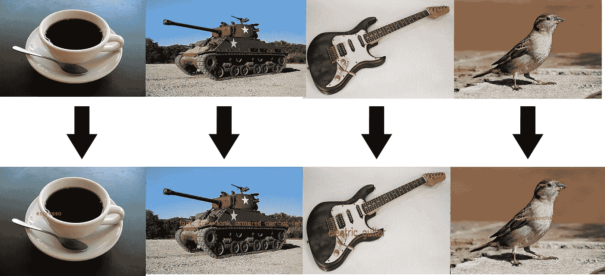
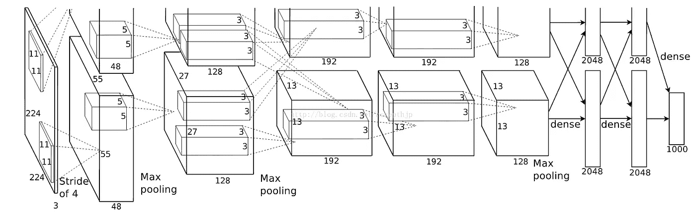
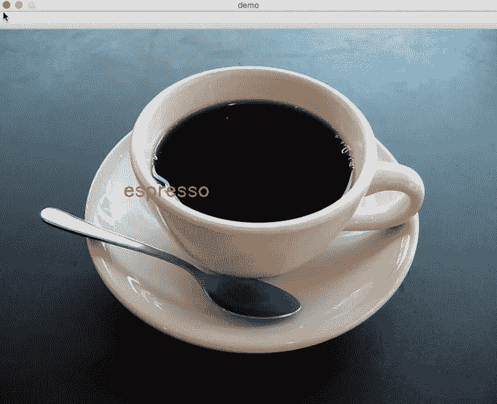
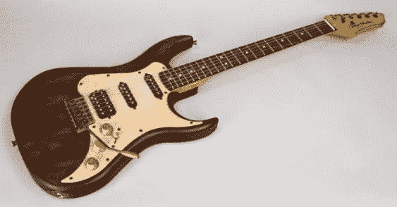
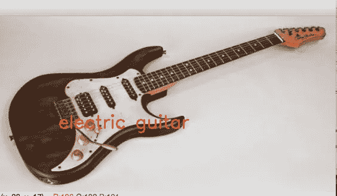

# 使用 Tensorflow，只需 3 分钟就能通过动手编写代码了解 AlexNet

> 原文：<https://medium.com/coinmonks/understand-alexnet-in-just-3-minutes-with-hands-on-code-using-tensorflow-925d1e2e2f82?source=collection_archive---------1----------------------->

在 2012 年 ImageNet LSVRC-2012 比赛中，AlexNet 模型以巨大的错误率(15.3%比 26.2%(第二名))击败了所有其他竞争对手。AlexNet 背后的这个魔酱是什么？虽然学术论文可以在这里找到，但这篇文章旨在通过 Tensorflow 中实现的实用代码帮助你揭开 AlexNet 背后的神秘面纱。

# **模型建筑**

与 LeNet 类似的结构，AlexNet 每层有更多的过滤器，更深和堆叠。有 5 个卷积层，3 个全连接层，在每个层之后应用 Relu，在第一个和第二个全连接层之前应用 dropout。

# 模型定义

在这里，我们用 tensorflow 编写了 python 函数中卷积、池化、LRN、丢弃和完全连接的定义。现在让我们写下张量流的定义:

# **模型测试**

最后，让我们用 OpenCV 编写的一些实现代码来尝试这个模型

这是结果

图 1:

Test Image

Result

图 2:

Test Image

Result

图 3:

Test Image

Result

图 4:

Test Image

Result Image

完美！本文的所有代码都可以在以下位置找到:

[https://github . com/ykpengba/Alex net-A-Practical-Implementation](https://github.com/ykpengba/AlexNet-A-Practical-Implementation)

如果你想自己测试代码，请确保在 http://www.cs.toronto.edu/~guerzhoy/tf_alexnet/[下载 bvlc_alexnet.npy 模型，并放在你的目录中。](http://www.cs.toronto.edu/~guerzhoy/tf_alexnet/)

请随时在 linkedin 上联系我，电话是[https://www.linkedin.com/in/yukpeng/](https://www.linkedin.com/in/yukpeng/)。请在 medium 上关注我，以便将来获得更多实用的深度学习教程。

> 加入 Coinmonks [电报频道](https://t.me/coincodecap)和 [Youtube 频道](https://www.youtube.com/c/coinmonks/videos)获取每日[加密新闻](http://coincodecap.com/)

## 另外，阅读

*   [复制交易](/coinmonks/top-10-crypto-copy-trading-platforms-for-beginners-d0c37c7d698c) | [加密税务软件](/coinmonks/crypto-tax-software-ed4b4810e338)
*   [网格交易](https://coincodecap.com/grid-trading) | [加密硬件钱包](/coinmonks/the-best-cryptocurrency-hardware-wallets-of-2020-e28b1c124069)
*   [CBET 回顾](https://coincodecap.com/cbet-casino-review) | [库科恩 vs 比特币基地](https://coincodecap.com/kucoin-vs-coinbase)
*   [折 App 回顾](https://coincodecap.com/fold-app-review) | [库币交易机器人](/coinmonks/kucoin-trading-bot-automate-your-trades-8cf0ca2138e0)
*   [如何匿名购买比特币](https://coincodecap.com/buy-bitcoin-anonymously) | [比特币现金钱包](https://coincodecap.com/bitcoin-cash-wallets)
*   [币安 vs FTX](https://coincodecap.com/binance-vs-ftx) | [最佳(SOL)索拉纳钱包](https://coincodecap.com/solana-wallets)
*   [密码电报信号](http://Top 4 Telegram Channels for Crypto Traders) | [密码交易机器人](/coinmonks/crypto-trading-bot-c2ffce8acb2a)
*   [最佳加密交易所](/coinmonks/crypto-exchange-dd2f9d6f3769) | [最佳加密交易所](/coinmonks/bitcoin-exchange-in-india-7f1fe79715c9)
*   开发人员的最佳加密 API
*   最佳[密码借贷平台](/coinmonks/top-5-crypto-lending-platforms-in-2020-that-you-need-to-know-a1b675cec3fa)
*   杠杆代币的终极指南