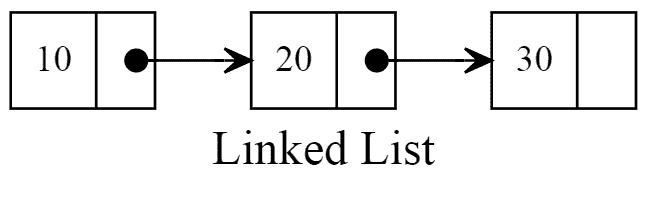
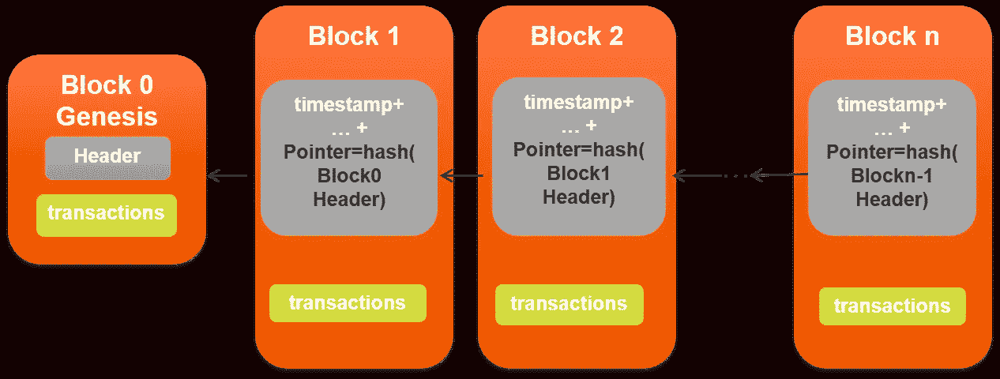

# 理解和创造区块链

> 原文：<https://medium.com/coinmonks/understanding-and-creating-blockchains-86662c8e7516?source=collection_archive---------2----------------------->


Taken from: [https://www.zdnet.com/article/what-is-the-future-of-blockchain/](https://www.zdnet.com/article/what-is-the-future-of-blockchain/)

我看到很多博客和人们在谈论区块链，但都是以一种非常肤浅的方式。好吧，他们解释说，区块链就像一个分类账，以如此安全方式处理交易，违反它将是一项非常痛苦的任务，但对于一个软件工程师来说，这离很好地理解区块链太远了。

我有点像杰克，脱衣舞娘，所以让我们按**部分进行:**首先，我们将尝试理解区块链的基本核心**概念**，如交易、采矿和工作证明。然后，我们将**实现** one 来看看这些概念在实践中的表现。

# 核心概念

如果你学过计算机科学，你可能知道一种叫做**链表**的基本数据结构。这种数据结构由节点**、**或**块、**的集合构成，这些节点通过引用相互链接，它们存储某种数据，如整数、字符串等。



Taken from: [http://www.rubyguides.com/2017/08/ruby-linked-list/](http://www.rubyguides.com/2017/08/ruby-linked-list/)

区块链与喜欢的列表非常相似:它是彼此链接的节点的集合，但与链表不同，它们通过一种**键**(哈希)链接。也就是说，每个节点都有自己的哈希和邻居节点的哈希。正如那首帕拉摩尔的歌所说，**唯一的例外**是链的第一个节点，叫做**创世纪块**。



Taken from: [http://racenext.com/blockchain.html](http://racenext.com/blockchain.html)

每当一个新的区块链被创建，创世区块也应该被创建。而那些块存储的主要信息是**事务**。交易可以是餐馆付款、银行转账、酒店预订或任何其他期望的情况。

回到链表，要在链表中插入数据，我们只需要创建一个新的节点，将一些数据放入该节点，并将其添加到链表中。与区块链的过程也非常相似，不同的是**你不能只是创建一个新的区块**，你必须确保创建的区块需要做很多工作，也就是说，这个过程是困难的。这个过程确保了一个**工作证明**到区块，它被称为**采矿**，因为我们不仅要创建一个区块，还要找到一个合适的区块。很快你就会在实践中看到为什么它需要如此强大的计算能力。

如前所述，存储在块中的主要数据是事务，这里有一些有趣的事情:事务应该在一定的时间间隔内创建，而不是每次都创建，因为这样做有可能实现一种对矿工的奖励系统，当一个新的块被开采时，他们获得一些点，而其他事务被推到一个列表中进行处理。

# 履行

没有任何实践就阅读这些概念没有多大意义，所以让我们使用 ES6 特性创建一个 Java Script 项目并深入研究一下。首先，创建名为区块链的项目:

```
mkdir blockchain
cd blockchain
npm init -y
touch index.js
npm install --save babel-register
npm install --save-dev babel-preset-es2015
npm install crypto-js
touch .babelrc
```

在里面。babelrc 文件增加以下内容:

```
{ “presets”:[“es2015”] }
```

在 package.json 文件的脚本区域添加它:

```
"start": "babel-node index.js"
```

现在我们已经在项目中启用了 ES6。

本质上，我们在这个项目中只有三种模式:交易、区块和区块链。第一个是一个可能的真实世界交易的蓝图，其中某人向另一个人汇款。

街区是区块链的一个组成部分。I 具有从它被创建的时刻起的时间戳、前一节点的散列、它自己的散列和事务列表。

方法 *getHash* ()只是使用块属性来创建散列。由于我们无法控制它的回报，我们可以利用它来增加采矿工作的证明。如果你查看一下*的 mine* 方法，你会在第 17 行看到一个名为 **patternOfDifficulty** 的变量，这个想法非常简单:我们用一些 hash 值创建一个块，getHash()方法的返回，然后我们检查第一个 **" *难度* "** 数字(在我们的例子中是一个数量为 9 的字符串等于难度)是否等于定义的 **patternOfDifficulty。**如果不是，我们继续运行，直到条件为假，即第一个***难度***数字等于**模式难度。**例如，假设我们得到以下散列:

```
232#4533829jmz-2038282s21332dshjaxjhajhuaghahdkvacadhakhdkahdk338283
```

如果我们的困难等于 4，困难的模式是:

```
9999
```

如果我们得到散列的第一个"*难度"*字符，我们得到:

```
232#
```

与模式难度相比:

```
9999 != 232#
```

我们会犯错。所以我们需要重新制作。如果现在得到的散列是:

```
9999jfknejfwhfkwnfkwhkfihiemht7et97-29u3oh38hfoahgufgaouyf7g7g7g7g
```

第一个“*难度”*字符现在是:

```
9999 
```

如果我们比较模式的困难:

```
9999 == 9999
```

它们匹配，因此我们脱离了循环，开采了一个区块。**难度越高，开采一块的时间就越高。**如果你再看一下 Block 类，你会在第 9 行看到属性 variable，该属性负责改变 **SHA256** 函数的输出，因为所有其他属性在循环中从不改变。因此，为了激发该函数的不同输出，changeable 的值在每次迭代中都会递增。

一旦我们有了事务和块类，我们就可以实现区块链类:

如您所见，该类保存了一个块和未决事务的列表。它还有一个属性来指定挖掘难度和对矿工的奖励。

在构造函数内部，在第 3 行，当我们声明 blocks 列表时，我们已经添加了一个块，原因已经在上面说过了，那是 genesis 块。该块由第 9 行定义的 *getGenesisBlock()* 方法创建。该方法只返回一个没有 prevHash 属性的块实例。

有了这些东西，我们就可以开始玩了:让我们创建一个难度为 2、采矿奖励为 100 的名为 fancyChain 的区块链。然后，我们将在该链中插入两个交易，id 为 505 的人向 id 为 40 的人发送 100，0 美元的金额，他们发送 150，0 美元的金额。假设有人从他的朋友那里买东西，我们的连锁店正在登记交易。

如果我们将 fancyChain 打印为 JSON:

如您所见，它按预期工作:我们的链是用 genesis 块创建的，两个事务放在那里。现在让我们假设 id 为 31 的人试图挖掘一些未决事务，并在挖掘后查看其余额:

通过这样做，我们的输出将是:

如果看一下这些散列，你会看到前两个字符(难度= 2)是 99，就像我们之前定义创建区块链实例一样。再次打印链条，我们得到:

再看一下，你会发现所有这些块，除了来自创世纪的，都存储了前一个块的散列。

**现在是时候看看为什么区块链注册交易如此安全了。**假设 id 为 40 的朋友实际上是一个暴徒，他试图将交易值更改为更高的值，就像这样:

区块链发生了有趣的事情:**所有的链都失效了。**您可以通过以下方式进行检查:

```
console.log(“Is fancyChain valid? “ + fancyChain.isChainValid());
```

如果你回头看看区块链类，方法 isChainValid()将解释:**一旦事务的值被改变，第 49 行的 If 语句将得到 false，因为方法 getHash()被调用，它使用事务数组来获得它的散列。**因此，只要改变这个值，所有的链都会失效。

这就是为什么区块链是一个非常安全的注册交易和建立智能合约的工具。

# 总结

如果你想创建自己的加密硬币、智能合同或以安全的方式处理交易，区块链会非常有用。

如您所见，区块链基本上是存储交易的块的集合，人们可以挖掘这些交易并获得某种积分。

作为建议，我应该告诉你不要把这个例子用于一个真正的加密系统，这里的意图只是告诉你关于区块链的更深层次的软件理解。给你一个提示，我建议你改变区块链的难度，看看你在电脑里挖一个方块要花多少时间: )

就这些了，下次见！

GitHub 上的代码:[https://github.com/ABuarque/BlockchainArticle](https://github.com/ABuarque/BlockchainArticle)