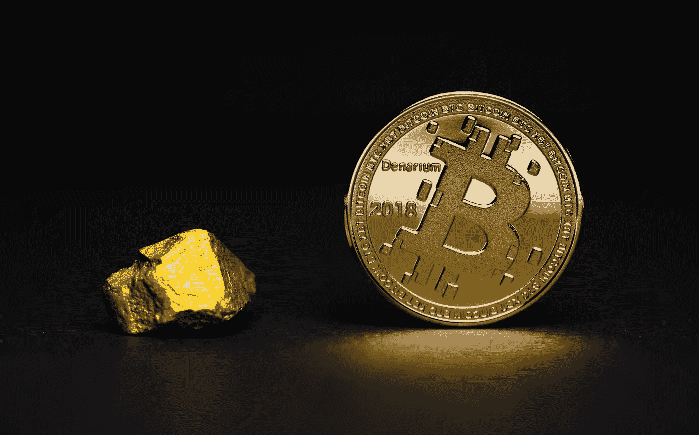
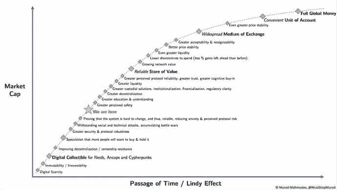

# 了解比特币

> 原文：<https://medium.com/coinmonks/understanding-bitcoin-202586bf1787?source=collection_archive---------1----------------------->

## 对定义加密货币的数字货币的坦率分析，
为什么我们应该做多比特币，做空银行…

Photo by [Aleksi Räisä](https://unsplash.com/@denarium_bitcoin?utm_source=unsplash&utm_medium=referral&utm_content=creditCopyText) on [Unsplash](https://unsplash.com/s/photos/bitcoin?utm_source=unsplash&utm_medium=referral&utm_content=creditCopyText)

日语中有一个词 *chokusetsu，*，在交流中，它表达了对直率和诚实的渴望，而不是通常的糖衣*。我决定用英文单词“candid”作为我的副标题，但它和日语的对应词没有太多微妙的差别。*

我也可以选择更吸引人的标题，比如“没有比特币”或“比特币有什么好大惊小怪的？”但是我再次回顾了最初是什么让我对比特币领域感兴趣——那就是*了解其背后的理念和技术。*

> 那么，这篇文章就是我***chokusetsu****对比特币的解释。*

*它是作为对仍处于萌芽状态的密码行业的市场领导者的介绍而写的，因此，希望更好地掌握“SHA256 密码算法”或“修剪 Merkle 树哈希”等技术术语的读者应该等待我的后续文章，在这些文章中，我将更深入地研究技术和理论(链接将插入此处)。*

*也就是说，对于那些还在阅读的人，让我们开始吧，好吗…*

# *愿景:比特币是什么？*

*根据这种加密货币的假名创造者中本聪的说法，比特币是一种“点对点电子现金系统”，允许支付从一方直接发送到另一方，而无需金融机构的参与。*

*因此，本质上，比特币是一种完全由其所有者控制的数字货币。它存储在兼容的“钱包”中，无需银行即可发送或接收。*

*让我们暂停一秒钟，让这一点深入人心，因为这就是比特币“最大化主义者”的所有宣传的内容——夺回主宰我们生活的最重要的东西——钱。*

*在你说“我不为金钱所动”之前。钱根本没有主宰我的生活”，请提醒自己，在原始层面上，钱决定谁吃谁不吃。钱决定我们能住在哪里；我们能穿什么；我们能驾驶什么；我们能做什么——本质上，钱决定了我们如何过现代生活的局限性。*

*然而，时至今日，我们依靠“可信的”中介机构不仅储存我们的财富和调节我们的交易，而且控制货币本身的发行和价值。*

# *问题是:我们为什么需要比特币？*

> *我相信不断发展的信息革命将会给我们智慧和力量来解决人类以前无法解决的问题，并帮助我们对整个社会产生积极的影响——孙正义*

*尽管比特币是多年学习、研究和测试的结晶，但许多人认为发布该代码的催化剂是 2007-08 年金融危机。许多经济学家认为这是自 20 世纪 30 年代大萧条以来最严重的金融灾难，尽管我们很容易在 2020 年忘记它，因为我们都在“继续努力”。问题是，许多同样的经济学家现在说，另一场货币危机即将到来。*

*发生了什么事？不要说太多细节，银行在风险更高的金融产品如次级抵押贷款中过度杠杆化，而其他影子银行实体如对冲基金，借入短期流动资本购买风险更高的长期非流动性资产。这导致了房利美和雷曼兄弟等许多“可信”机构的崩溃，引发了持续多年的全球经济冲击波效应，即所谓的“大衰退”。*

*换句话说，由于表面上的低利率，贪婪的银行和机构发放了高风险且往往是掠夺性的贷款或抵押贷款。雪上加霜的是，甚至更贪婪的对冲基金也押注于股票、衍生品和他们能找到的任何其他看似有利可图的资产。随之而来的信贷冻结几乎导致了全球金融体系的崩溃。*

*所有这些不负责任的混乱的结果？*

*没有一个肇事者受到经济或刑事惩罚，而一些人甚至获得了数十亿美元的纾困。央行从政府和银行购买了近 2.5 万亿美元的债务和问题资产。*

> *这是世界历史上规模最大的信贷市场流动性注入，也是规模最大的货币政策行动。*

*美联储还向美国信贷市场注入了 6000 亿美元，希望这将带来流动性，刺激更多的国内贷款和抵押贷款再融资。银行吸取教训了吗？似乎不是，因为这些资金被用于更“有利可图”的领域，如新兴市场和隐蔽的货币战争。*

*不幸的是，在所有零和游戏中，总会有输家。是的，你说对了——人。房主失去了他们的房子；失业率飙升；借贷变得更加困难和昂贵。然而，另一个有趣的结果是财富分配。美国 1%的顶层收入能力超过了后大萧条时代的峰值，由于贫困家庭往往不持有资产，中产阶级家庭受到的冲击最大。*

*因此，超级富豪变得更富，中产阶级被稀释，财富差距变得更大。太好了。*

> *"当街上有血的时候买，即使血是你自己的."—罗斯柴尔德男爵*

*我们需要比特币来平衡竞争环境，弥合我们今天面临的可鄙的不平等差距。我们需要比特币让后代能够对自己的所有决定负责。*

# *技术:比特币是如何工作的？*

*比特币背后的技术如何运作的确切机制超出了本文的范围，但我将给出底层过程的简要概述。*

***密码术**
比特币背后的主要技术是*密码术*，用编码术语来说就是“通过将信息加密成不可读的格式(密码文本)来保护信息的艺术，该格式稍后将被持有密钥的人解密成明文”。*

*从技术上讲，比特币本身并不加密数据。相反，它使用两种被称为“哈希”和“数字签名”的标准化加密方法来验证发送方和接收方之间的交易。哈希是将任意大小的数据编码成固定大小的过程。这种算法的输出被称为“哈希”。数字签名是验证数据传输的真实性和来源的一种方式，其工作方式很像现实世界中的个人签名或指纹。*

***例如:**我想从 Bob 那里买辆车，但他要求我用比特币付款，相当于 0.5 BTC。我决定买一些比特币，所以我首先需要一个钱包。我创建了一个钱包，然后它产生了两个“密钥”——一个必须保密的私人密钥和一个我可以与任何人分享的公共密钥，就像银行信息一样。*在后台，加密算法将这些密钥“散列”成 26-35 个字母数字字符序列(公共)和 64 个字母数字字符序列(私有)*。*

*现在我需要一些比特币，所以我去 BitPanda 用我的信用卡买了 1 BTC，输入我的比特币钱包地址(公钥)后，我等了几分钟，直到我的 BTC 到了。带着我的新加密货币，我让鲍勃把他的钱包地址发给我，他很快就发了。我打开钱包，按下“发送”按钮，这时我输入鲍勃的钱包地址和我想发给他的比特币数量。我复制并粘贴他的钱包地址(因为如果我犯了一个错误，我可能会失去资金)，然后输入 0.5 BTC，因为这是商定的价格，然后确认交易。*在后台，该软件用我的私钥对 Bob 的钱包地址(公钥)进行数字签名，并且知道目的地地址和收件人地址，从我的钱包中移除 0.5BTC 并添加到 Bob 的钱包中。**

*好，那么在验证交易的时间范围内，系统如何知道我没有试图通过同时向约翰、迈克和吉尔发送 0.5 BTC 来欺骗鲍勃？这就是所谓的“双重支出”问题，比特币通过利用“区块链”技术解决了这个问题。*

***区块链*** 

*这些块由强大的专用计算机“挖掘”,这些计算机使用蛮力计算来猜测某个哈希，这是一个字母数字序列。猜测这些序列的速率是对挖掘比特币能力的一种衡量，被称为‘哈希速率’。该系统尝试对每 8 分钟发生的每个块进行计时，并且通过调整哈希难题的难度级别来实现。*

*那么这些积木是什么呢？它们只是比特币网络上自最后一个区块被开采以来发生的所有交易的集合，结合了前一个区块的标识符(因此它知道在序列中放置这个区块的位置)。整个比特币区块链是公开透明的，因为它包含了曾经发生的每一笔交易的记录。然而，钱包地址本身是匿名的，所以即使我们可以看到所有的交易和余额，我们也不一定知道它们属于谁。*

*谁在开采这些区块，他们获得了什么？在比特币诞生之初，你可以用个人电脑采矿，但随着 Satoshi 预测到计算能力的增加，他让哈希难题随着时间的推移变得更加困难，现在专用的采矿计算机被集中在被称为采矿农场的巨大仓库中。采矿的动机很简单——解决一个挖掘区块的哈希难题，并获得比特币形式的奖励。最初，这一奖励是 50 BTC，但这一数字每 210，000 块减半，直到奖励变为零，因为到那时仅交易费就足以维持网络。*

*好吧，所以这整个复杂但简单而优雅的系统(被称为“工作证明”)是为了一个主要原因而创建的——消除“重复支出”问题。区块链是使用“工作证明”系统生成的，该系统保证没有恶意活动来创建假块以允许“双重支出”。创建附着在合法链上的假块的唯一方法是控制网络 51%以上的计算能力。然而，保持诚实的动机超过了攻击者双倍花费他的余额的好处，并且一旦发现这个虚假的区块链就有可能被恢复。*

# *经济学:比特币有什么不同？*

*在经济学方面，比特币更类似于黄金，而不是我们日常生活中使用的现金或信用。自从英格兰银行在 1931 年取消了英镑与黄金的挂钩，或者美国在 1933 年颁布了“攫取黄金”的第 6102 号行政命令以来，货币发生了巨大的变化，从技术上讲，这并没有取消挂钩，而是使美元贬值了近一半，直到 1971 年尼克松最终取消了金本位制。*

*很像黄金，比特币是开采出来的；供应有限；目前要求经纪人(加密交易所和场外交易柜台)进行交易。*

***货币政策:供给** 与今天的货币的主要区别在于，它有无限的供给，中央银行能够凭空印刷货币，银行能够利用“部分准备金”方法借出数倍于其持有量的货币。这很像杠杆交易——当事情进展顺利时，肥猫会得到大量奖金，然而，正如我们以前多次看到的那样，当事情出错时，它们会变得非常糟糕！(查找 REKT)*

*相比之下，一旦最后一枚比特币被开采出来，流通中的比特币将只有 2100 万枚。事实上，由于许多硬币已经丢失在无法访问的钱包中，最终的流通供应量将会大大减少。目前，只有超额抵押贷款——个人可以用他们的比特币价值借入一小部分。*

***货币政策:通胀 vs 通缩** 美国过去 20 年的平均通胀率为 3.22%，当前通胀率约为 2.2%。这个数字代表了一般商品和服务价格的增长，实际上是货币每年贬值的速度。这被视为通过促进消费和抑制储蓄来刺激经济的一种健康方式。*

*另一方面，比特币由于其有限的最终供应量和采矿奖励的里程碑式减少(减半)，最终将具有 0%的通胀率。截至发稿时，比特币利率目前的通胀率约为 3.6%，下一个减半的时间表估计将于今年 5 月到来。一旦这一事件发生，比特币通胀率将降至 1.8%，首次低于世界各国央行 2%的通胀目标。虽然央行以操纵通胀率而闻名，这让它们有借口印刷法定货币并向经济体系注入法定货币，但比特币的通胀是由数学决定的，无法改变。*

***地域接受度** 世界上有 180 种法定货币，每一种都是在本国当地经济中购买商品所必需的。这使得银行和货币兑换商可以从不可避免的过高汇率中获利。此外，外汇市场价值近 2 万亿美元(是全球 GDP 的 2.5 倍)，每天交易 5.3 万亿美元。这个市场主要是作为政府和中央银行获得对世界金融更多控制的工具而存在的。*

*如果比特币成为国际公认的货币，那么它将可以在任何国家的经济中兑换。这可能会产生深远的影响，并带来新的全球公平平衡，其直接结果在全球定价方面是不可预测的，但长期均衡肯定会找到。*

***所有权，保管&控制权** 目前，银行被委托保管客户的资金。作为回报，它们提供安全以及大量服务，如 ATM 取款、银行转账和信用卡/借记卡。他们也有权力冻结或关闭账户，阻止转账，拒绝或限制自由获取资金(想想银行营业时间或在线服务维护)。*

*当你拥有一枚比特币，你*就拥有*一枚比特币。它是你的了。没有人可以把它从你这里拿走(忽略网络钓鱼和敲诈)，阻止你发送或接收硬币，或者向你收取额外的费用。只要你的安全措施严密，你最终可以完全控制你的钱。*

# *比特币的未来:分散货币的障碍*

> *如果你想树敌，试着改变一些事情——伍德罗·威尔逊*

*就这样，对。数字点对点现金。这就是比特币的愿景，也是比特币现在正在做的事情*。但是，真的吗？即使“最大化主义者”会告诉你，比特币并不是一种被广泛接受的货币。**

**当然，你可以用比特币购买*一些*东西和支付*一些*服务，但由于用加密货币支付是可选的，不是必须的，所以它还不是合法货币。为比特币辩护的是，越来越多的商店通过只接受卡支付来实现“无现金”，这意味着现金本身并不总是王道。**

**这是一个巨大的密码难题。点对点，是的。电子的，是的。现金，嗯…没有。或者至少，还没有…**

> **现金是合法的货币——货币或硬币——可以用来交换商品、债务或服务。**

****

**by [Murad Mahmudov](https://twitter.com/MustStopMurad)**

**“等等，比特币不是卖几千块吗？”，我听到你说。是的，他们有。它们在比特币基地或币安等加密货币交易所，或通过 BitPanda 等受监管的经纪商出售，售价高达数千美元。这些交易所的运作与普通企业非常相似，需要政府批准才能在当地金融法规的指导下运营。本质上，这使它们成为金融机构的代理。**

**所以，为了实现中本聪的真实愿景，我们需要:**

*   **一种使用 fiat 进行比特币交易的点对点方法(加密登机)——消除操纵、降低费用并保护隐私权(即不会追溯到你的比特币钱包地址)**
*   **普通大众理解并接受这种新技术的核心租户，认为这种新技术比目前的系统更有利于地球，更有效率**
*   **世界各地的商人接受 BTC 作为他们的主要支付系统，看到了加密保护的分散经济的好处**

**当前金融体系的这种和平撤离可能会导致当权者使用压迫和暴力，正如他们在历史上无数次所做的那样，来征服群众以阻止采用率。我希望这是一场不流血的革命，在这场革命中，博弈论的概念使这种战术的使用变得不可行。**

**但是…我们毕竟是人。**

> **[在您的收件箱中直接获得最佳软件交易](https://coincodecap.com/?utm_source=coinmonks)**

****

**相关文章**

*   **"[区块链技术可能永远改变的 10 件事](/the-capital/10-things-blockchain-technology-could-change-forever-739b0162603?source=post_stats_page---------------------------)"**

****