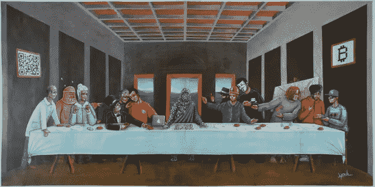
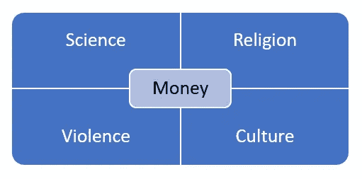
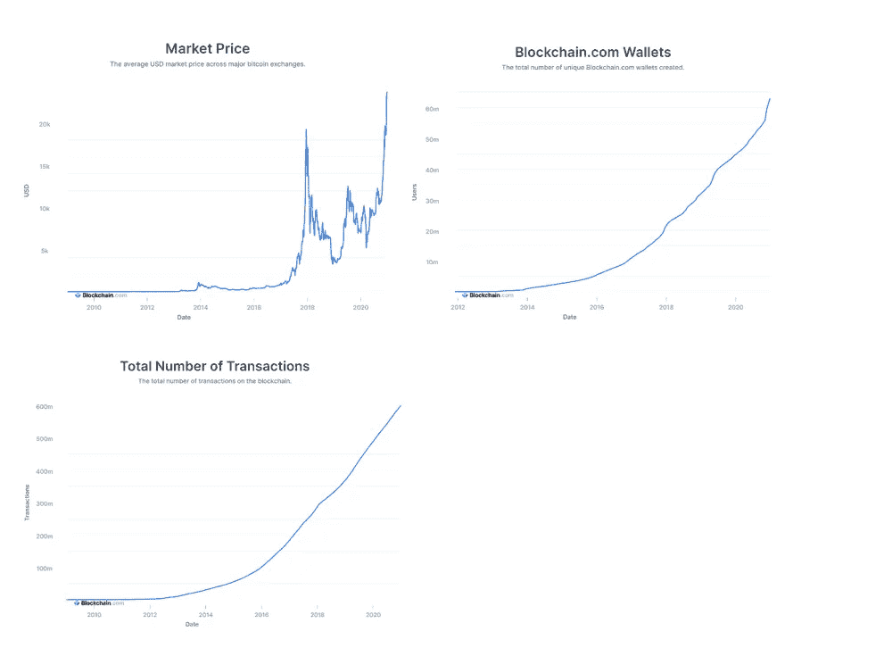
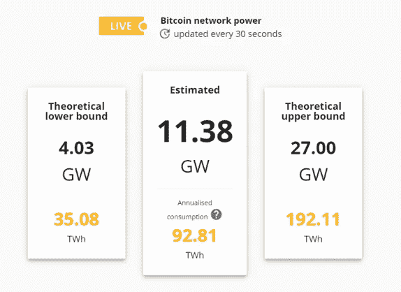
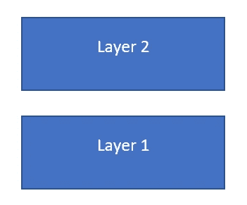

# 理解比特币&权力的五个轴心

> 原文：<https://medium.com/coinmonks/understanding-bitcoin-the-5-axes-of-power-43e1fa7597ac?source=collection_archive---------4----------------------->

## **>总结**:比特币很可能是后起之秀价值互联网的基础。由于其供应有限，我预计 BTC/美元将在未来 5 到 10 年内超过 500.000 美元。

The Last (Bitcoin) Supper by Youl

## **>权力的五大轴心:金钱在我们的社会中扮演着核心角色。互联网分散了几乎所有的权力轴心。接下来是比特币和其他加密货币。**

对我们文明史的广泛阅读使我相信权力围绕五个主轴发展。出于实际投资的目的，我认为阅读这些指数，特别是它们的**delta**(在大部分市场之前*)有助于做出好的投资，因为它们是资本流动的强有力的预测器。*

这些轴线在历史上以迷人的方式相互交织。彻底的分析可能会很长，但也许简单直观的概述就足够了，以真正理解世界各地的权力如何演变，以及比特币如何发挥作用。

想想世界上所有的科学，都是随着时间的推移而发展的。如果没有市场/金钱的力量，它能给全世界的公民带来价值吗？当穆罕默德·阿里在 19 世纪试图使埃及工业化时，他有足够的钱购买科学/英国可以输出的最新棉纺机器。他所没有的是埃及的正确文化，让这些机器等同于有竞争力的产出。它们经常会着火，零件总是会丢失。

如果没有暴力，我们在很多方面都会过得更好。但我们也可能生活在纳粹星球。一神教可以说是所有宗教中最暴力、同时也是最统一的，但是如果彼此不分享关于我们的存在和命运的更深层次的信仰，合作的机会就很少。市场力量推动着我们的世界，而金钱是每一笔交易的核心。然而，由于无法控制暴力、文化或宗教，金钱帮不上忙。没有科学，我们就无法超越我们默认的猴子级别的存在，不管我们有多少钱或者有多么伟大的文化。

当这五个轴对齐时，我们会产生繁荣的社会。也许不那么明显，互联网在过去的 20 年里深刻地改变了这种模式，改变了每个轴心的运作方式。沟通是我们所做一切的核心，互联网从根本上分散了我们的沟通矩阵。尖端科学(电子学习等)、文化和宗教的最新进展(Instagram)都可以通过点击按钮获得，而暴力仍然是政府的垄断。它使信息的流动更加自由，并产生了许多不同的现象。

例如，这已经明显地分裂和极化了我们的政治。它还使教育民主化(以前是功能垄断)。它催生了取消文化，由狡猾的算法无意识地驱动的不同平台上的一群网民推动。它让国际象棋成为一项更受欢迎的运动。最值得注意的是，它已经把我们变成了一个数据驱动的社会，因为现在 5 个权力轴心本质上是数据生产机器，因为它们越来越数字化。

互联网如何改变了我们的生活，这一点无需多言。数万亿美元的价值建立在它之上。目前，大部分价值是围绕信息套利建立的，与以前的方法(信鸽、电话等)相比，核心底层功能是一种**更便宜、更快速、更分散的信息流**。

更便宜、更快捷、更分散的**价值/资金流**是下一个互联网本地加密货币的形式。在当前版本的互联网中，我们正在相互交换信息。然而，我们是在交易它之外的价值，用的不是它本身的货币。出于这个原因，交易依赖于第三方，这使得价值的流动**比其他方式更慢、更昂贵**。

仔细研究区块链技术公司(在代码层面)后，我发现比特币本质上是安全的互联网黄金，不依赖于第三方，是第二个互联网的基础。这是一个分散的价值网络。如果你愿意，可以称之为金钱的脸书。比特币的演变是互联网去中心化，**显而易见，**可以说是我们文明中最基本的权力轴心。当第一个互联网(信息互联网)开始时，它对我们大多数人来说就像一个玩具。这是一个值得深思的观察。

价值互联网可能会遵循与信息互联网相似的道路。它将带来更多的自由、效率和民主化——许多价值可能在其中交易并建立在其上。几年后，当中央银行将法定货币数字化时，也有可能通过可编程货币带来个性化的货币政策。这就有了自己的阴阳。

## **>了解比特币:安全的互联网黄金/货币。**

本质上，比特币用可信第三方的参与换取了数学真理。它通过利用数学、计算、去中心化和行为金融学来做到这一点。在我看来，这是我们短暂历史中最深远的**工程突破**之一。到这一节结束时，我希望你能很好地理解比特币及其底层的发条。

**目前的状况:金融体系依赖于可信任的第三方。**

今天，银行保留交易分类账。这使得银行，即可信的第三方，能够知道客户何时消费了一定的金额，从而解决了**双重消费问题**——你不能花同样的钱两次，因为银行知道你已经花了。这给了你的付款的接收者(或交易中的对手方)一定的保证。在任何给定的交易中，通常会有更多的中间人(尤其是在网上支付的情况下)。银行掌握着我们如何使用资金的所有信息，最终，政府也掌握着这些信息。这**降低了速度，增加了交易成本**以及被“公务员”没收的可能性和容易程度。此外，不可逆交易并非不可能，这使得**欺诈成为卖家**的持续风险。

**新金融范式:数学真理、去中心化和行为金融。**

比特币网络中的用户拥有装有硬币的钱包。每个用户都有一个公钥、一个私钥和一个钱包地址。私钥要保持安全，因为它允许用户操作它的钱包。交易是公开的，但是您只能看到交易用户的公钥。您不能从公钥追踪钱包地址，因此保持交易匿名，同时实现透明性。网络由节点组成，这些节点是为网络提供计算能力的独立计算机。

电子货币和比特币一样，本质上是一个数字交易链。一枚硬币的每个拥有者通过数字签名(用他的私人钥匙)把它转让给下一个拥有者。前一个事务的**散列**和 2。对应钱包的公钥。这个**将**事务链接在一起。现在，我们可以把这个散列看作是一个数字，在组成电子硬币的庞大交易链中，它标识了以前的交易。

为了消除对可信第三方的需求，交易被**广播**到网络，反过来，网络参与者(节点)同意交易的**单一顺序**——单一链。通过这种方式，每个人都可以看到发生的交易，并同意一个单一的**真理**。如果约定的事实与现实相似，由于交易对每个人都是可见的，这就解决了双重支出问题。理想情况下，一个交易链是通过代表真理的时间来创造的。链条越长，越被网络参与者视为真理。

你可能想知道，数学真理是如何发挥作用的？散列是一个昂贵的计算难题的结果。例如，当一个事务被广播到网络中时，**挖掘器**会将该事务包含在**块**中。当块充满事务时，矿工必须解决上述难题，以便块的结果散列(散列=数字和字母的长列表)满足一系列特征，例如以 6 个零开始。当他这样做时，块可以被包括到链中。这需要大量的计算，因此是对网络的投资。该矿商基本上是为能源和硬件付费，以将一个区块(一系列交易)纳入网络。

这项投资(被称为工作证明——PoW)是数学真理的基础。为解决上述难题而进行的计算完全是随机的。该游戏在于猜测一个被称为**随机数**的数字。通过散列函数传递 nonce 和块的其余数据，会产生一个散列。nonce 是块中唯一可以改变的数据点，所以这个游戏就是猜测一个 nonce 来得到你想要的散列。**去中心化**把这种随机性变成**数学真理**。

怎么会？假设网络中 60%的参与者(节点)是诚实的，剩下的 40%是不诚实的——这意味着他们想要攻击网络。在比特币世界中，攻击是如何进行的？假设不诚实的节点 A 发送 1 个 BTC 给节点 B(它是某种产品的销售者)。该交易被广播到网络中，并且不诚实节点 A 开始在秘密并行链上工作，该秘密并行链回复该交易，其余的不诚实节点将一起解决每个连续块的所有**计算难题。如果他能设法在一段持续的时间内产生较长的链，那么攻击就会成功，因为较长的平行链会被认为是真理。**

由于计算是随机的，任何不诚实的节点验证网络中的**下一个块**的机会遵循**泊松分布**——因为在任何时刻，**或者**诚实的节点或者不诚实的节点将验证下一个块。跳过源于这个简单原则的所有统计数据，它基本上意味着，相对于不太占优势的节点集而言,**的优势会以指数方式累积。如果网络中不到一半的节点是不诚实的，那么他们的胜算就会增加。在我们的例子中，随着时间的推移，诚实的节点可以以指数方式压倒它们，并创建**更长的链**，这将被网络的其余部分视为真理。你现在可以看到数学真理是如何在一个分散的网络中产生的。**

现在，问题仍然存在，如何保持**节点被激励，老实说**？如果超过一半的节点变得不诚实，那么整个网络就会被破坏，因此它的货币一文不值。这种解决方案既优雅又对环境有害。由于解决 PoW 计算难题需要大量的能量，破坏网络将违背矿工的利益。战俘让矿工继续投资，因为他们采矿的回报是硬币。如果网络遭到破坏，那么他们的**硬币就会失去价值**。任何其他保持分散的交易验证者网络投入网络的协议都可以完成这项工作(考虑以太坊中的股份证明)。现在你可以看到比特币如何利用数学、计算、去中心化和行为金融来解决**双重支出问题**，规避对可信第三方的需求。

节点可以随意加入和离开网络。在回到网络中时，它们必须做的就是通过查询其他活动节点来拉最新版本的链。唉，只要超过 50%的节点是诚实的，比特币就可以作为一个强大的分散式价值交换网络在互联网上运行。节点在网络中通信的方式是通过 P2P 协议。实际上有许多不同种类的节点，执行不同的功能，但这可能是更技术性的对话的材料。

## **>识别价值:比特币是“货币的脸书”。**

从今年夏天开始，我一直在努力思考数字空间中的**价值是由什么构成的。既然它如此虚无缥缈，就很难用传统的方式来思考价值，我相信比特币也是如此。**

今年 8 月，我投资了 Spotify，因为我相信播客(一种新的文化力量)带来的商机是巨大的(并没有被市场完全低估)。尽管如此，我还是努力清晰地界定价值。Spotify 基本上是建立在一系列开源语言(由分散的社区维护)之上的，如果愿意，一群员工几乎可以在几个月内创建一个新的 Spotify(无论如何是软件部分)。是什么阻止了他们这样做？什么会阻止艺术家/用户逃到这个另类的 Spotify？

在研究比特币的过程中，我发现答案还是在于去中心化网络的本质。从统计数据来看，网络中的大多数利益相关者不太可能立刻离开/叛变。在过去的 10 年中，我们已经多次看到这种情况，因为一个网络在其信息套利的垂直领域成为**的主导品牌**。员工和用户留下来是因为他们从网络中获得了价值。员工通过执行维护/增加网络价值的行动获得报酬。想想 AirBnB，优步，脸书，Spotify，谷歌，亚马逊等等。这就是所谓的梅特卡夫定律，即“电信网络的影响与系统连接用户数量的平方(n2)成正比”。仅供参考，如果你没有想到，这些业务完全建立在**信息套利**之上。

或许以上看起来是显而易见的，但既然大家一致认为比特币是“无中生有”，那么是否有任何知识转移可以对这个话题有所启发呢？首先，上面列出的公司**发挥着**的作用，为最终用户增加价值。其次，他们建立**网络效应**，保持利益相关者对网络的投资和参与，并带来**增长**。当脸书在 2012 年推出 IPOd 时，并没有明显看出他们在有效地吸引注意力。他们让用户参与应用程序，然后将这种关注卖给广告商——这是一个关注网络。他们创造网络效应，以吸引更多关注捐赠用户和更多付费广告商，通过这种“简单”的方法，该股自那时以来已上涨 10 倍。这是我们这个时代的剧本，它完全适用于整个经济。

当时很难读懂脸书，但在回顾中，我们已经无数次看到同样的剧本展开。几乎每一次，人们的共识都是，调查的对象是建立在虚无之上的，而且几年下来，公司/股票表现得相当好。那么现在，脸书员工和比特币矿工有什么区别呢？在我看来，两家公司都在不断地采取行动来提升各自网络的价值，并且都在其中投入了资金。脸书用户和比特币用户有什么区别？一个通过互联网发送他们的**注意力**，另一个发送/存储**值**。在我看来，比特币的价值与我们这个时代许多最成功的商业投资是一样的。比特币是其垂直领域的主导品牌。剧本是一样的。然而这一次，一切都是为了钱。

## **>价格驱动因素**

**比特币限量供应:**供应基数限定为 2100 万个币。今天，大约发行了 1800 万张。新的硬币被发放给矿工，作为对他们验证工作的补偿，直到达到供应基数上限。从这一点开始，用户按每笔交易向矿工支付交易费。这使得比特币的价格成为需求的直接函数。

因此，问题是什么驱动了对比特币的需求？

**比特币是可编程黄金:**网络和底层的区块链技术使比特币的价值储存变得可行。它的主导品牌使其成为第一大数字存储价值，因此，在数字领域，越来越类似于黄金。与传统黄金不同的是，它是数字化的，这使得它可以编程，并且高度嵌入互联网经济。不完全图灵，但在这个意义上比金条好得多。BTC 目前的市值约为 4500 亿美元，而黄金的市值约为 10 万亿美元。如果我们要在未来几十年看到大部分经济增长发生在数字领域，我们也有可能看到 BTC 的市值超过黄金。

今天，任何事情都是政府加强对公民控制的好借口。我们在审查制度的普遍兴起以及其他花哨的举动中看到了这一点。这包括直接或间接没收货币(通过扩大货币基础来实现通货膨胀)。富人和/或聪明人正在关注这个问题。由于比特币的供应量有限，而且很难被没收(由于其加密特性)，因此它是一种很有吸引力的价值储存手段。如果有人认为这确实是第二个互联网——价值互联网——的基础，那就更是如此。

基于互联网的经济趋向于自给自足和自主。例如，在服务器端，我们已经看到 AWS 的崛起，而不是一个对等的基于政府的服务器操作的崛起。我们已经看到人们**不断走在监管**的前面，推动整个民主化，应用程序一次又一次地扰乱了哀嚎的非互联网经济。互联网上有某种“能量”指向某个方向。如果回顾过去十年互联网用信息做了什么，以及它改变我们世界的方式，你相信未来一二十年用(互联网)钱会做什么？有可能不吞噬这个权力轴心吗？

## **>看穿炒作与悲哀:内在网络 KPI 与 BTC/美元的中期及以后的演变相关。**

投资比特币从根本上来说是投资一个服务于一项功能并利用一系列网络效应的网络。看穿炒作就是看清网络的本来面目。随着 BTC 巩固成为价值的首选互联网商店，**我预计，就 BTC/美元的演变而言，这条路将会崎岖不平**，不适合胆小的人。虽然五轴力量的模型有些抽象，但我相信它是看穿炒作和炒作不可避免的逆转的最清晰的心智模型。

为了进一步说明，让我们考察一下 BTC/美元相对于一些简单的**内在网络 KPI**(来源:[blockchain.com](blockchain.com))的演变:

注意价格方面，BTC/美元很容易波动。然而，中长期价格显然与钱包(拥有硬币的人/组织)和交易的数量相关，就像脸书股票的价格与活跃用户和付费广告客户的数量相关一样。比特币是一个信任网络。脸书是一个注意力网络。今天，网络上大约有 6300 万个钱包。地球上有 78 亿人。如果互联网真的选择吞噬权力的金钱轴心，人们可以预期在未来几年里钱包的数量会增加很多。目前，增长曲线看起来呈指数增长。几年后 3.5 亿个钱包会是一个遥远的梦想吗？800 米？15 亿？

现在，到了这个阶段，你可能很清楚，比特币至少对现有秩序造成了轻微的破坏。因此，可以肯定的是，政府取缔比特币会给这项投资带来风险。尽管如此，这样做实际上意味着关闭或大幅审查互联网，就像中国一样。因为网络是分散的，这也许是不可能的。在这种情况下，我相信 BTC/美元会**涨得更高**，因为对比特币之类的东西的需求会变得更加迫切。在我看来，政府的这种努力将成为对互联网经济的直接攻击之一，这些攻击在过去十年中被证明是大规模积极的营销活动——就像当年的优步，但这次更少从“物理领域”进行。

## **>技术顾虑:网络存在一些漏洞，可扩展性是个问题。**

PoW 效率低下:我在上面解释过的共识机制 PoW 需要大量的能量输入(见下图:source [https://cbeci.org/)。这不利于环境。在 2020 年，我花了大量时间研究消费者偏好，我观察到，对环境有积极影响的品牌往往比那些没有积极影响的品牌表现更好。对环境有害是比特币的逆风，尤其是在主流采用比特币的时候。理想情况下，比特币必须纠正方向，对环境产生积极的净影响。](https://cbeci.org/).)

**51%的攻击:**一些矿工可以聚集在一起，对网络进行 51%的攻击。在深入研究之前，请记住 51% **不能用来偷硬币**。一个人只能通过窃取与硬币相关联的私钥来窃取硬币。在比特币世界中，拥有 51%以上挖掘能力的恶意矿工，正如其所指的攻击，只能执行交易，然后将其还原。例如，他可以向卖方 B 发送 1BTC，然后恢复交易，从卖方 B 免费获得产品。

目前，采矿池看起来如下(来源；[https://block chain . info](https://blockchain.info)):

现在，由于 PoW 涉及如此大的能量输入(可能仅次于与执行采矿的硬件相关联的金钱输入)，矿工们在网络上非常投入。他们输入的所有回报是硬币，因此，变得恶意会大大降低获得的硬币的价值。一些组织完全有可能试图**贿赂几个大矿工**聚在一起进行 51%的攻击。然而，这样的行贿者将不得不支付矿工(通过时间积累的硬币总数* E[BTC/美元@ 2030–2040])。

**可扩展性:**比特币每秒不能处理超过 7 笔交易。当前数据块大小为 1MB，每 10 分钟挖掘一个新数据块，因此网络的可扩展性不强。*社区*(你看到的所有为 Github repos 做出贡献的聪明人:[https://github.com/bitcoin/bitcoin](https://github.com/bitcoin/bitcoin)，[https://github.com/lightningnetwork/lnd](https://github.com/lightningnetwork/lnd))已经提出了一个有前途的抽象，它包含两个操作层，如下所示:

其中第 1 层将是比特币区块链，第 2 层将处理微交易，每次都推到第 1 层将是过度杀戮。例如，假设比尔每天早上都买咖啡。第 2 层将这些事务捆绑在一起，每周一次，将聚合推送到第 1 层，而不是每天早上将每个事务推送到第 1 层。这样，抽象将 7 个事务压缩为 1 个。

## **>结论:以上可能完全错误。**

比特币不可能成为假设中的价值互联网的基础。如果加密货币真的是第二代互联网的基础，那么比特币可能会被推翻。然而，比特币目前在该领域拥有**主导品牌**。虽然这项技术并不完美，但足够多的聪明人似乎在推动它，我们目前看到它的采用呈指数级增长。

我的第一个商业项目是 P2P 市场。在开发它的过程中，我明白了互联网上能发生的一切都会发生。我相信，如果互联网货币现在是一种可能性，互联网将很快开发任何可以在其上开发的可能性。从这个意义上来说，比特币与我们在过去十年中一次又一次看到的繁荣的其他网络没有什么不同，尽管存在风险，但历史表明，这可能是另一个十袋袋。

我建议投资比特币和整个加密领域。无论是通过购买资产，还是通过积极的自我教育。接下来，我将探索以太坊。我有一种感觉，它将会是世界上第一个全球化的、去中心化的操作系统——一种行星式的操作系统。

> 加入 Coinmonks [Telegram group](https://t.me/joinchat/EPmjKpNYwRMsBI4p) 并了解加密交易和投资

## 另外，阅读

*   什么是[闪贷](https://blog.coincodecap.com/what-are-flash-loans-on-ethereum)？
*   最好的[密码交易机器人](/coinmonks/crypto-trading-bot-c2ffce8acb2a)
*   [3 商业评论](/coinmonks/3commas-review-an-excellent-crypto-trading-bot-2020-1313a58bec92) | [Pionex 评论](/coinmonks/pionex-review-exchange-with-crypto-trading-bot-1e459d0191ea) | [Coinrule 评论](https://blog.coincodecap.com/coinrule-review-a-perfect-trading-bot)
*   [AAX 交易所评论](/coinmonks/aax-exchange-review-2021-67c5ea09330c) | [德里比特评论](/coinmonks/deribit-review-options-fees-apis-and-testnet-2ca16c4bbdb2) | [FTX 密码交易所评论](/coinmonks/ftx-crypto-exchange-review-53664ac1198f)
*   [n 零审核](/coinmonks/ngrave-zero-review-c465cf8307fc)
*   [Bybit 交易所评论](/coinmonks/bybit-exchange-review-dbd570019b71) | [Bityard 评论](https://blog.coincodecap.com/bityard-reivew)
*   [3Commas vs Cryptohopper](/coinmonks/3commas-vs-pionex-vs-cryptohopper-best-crypto-bot-6a98d2baa203)
*   最好的比特币[硬件钱包](/coinmonks/the-best-cryptocurrency-hardware-wallets-of-2020-e28b1c124069?source=friends_link&sk=324dd9ff8556ab578d71e7ad7658ad7c)
*   [总账 vs 平均](https://blog.coincodecap.com/ngrave-vs-ledger)
*   [密码本交易平台](/coinmonks/top-10-crypto-copy-trading-platforms-for-beginners-d0c37c7d698c)
*   [莱杰 nano s vs x](https://blog.coincodecap.com/ledger-nano-s-vs-x)
*   [沃德评论](https://blog.coincodecap.com/vauld-review) | [尤霍德勒评论](/coinmonks/youhodler-4-easy-ways-to-make-money-98969b9689f2) | [区块链评论](/coinmonks/blockfi-review-53096053c097)
*   最好的[加密税务软件](/coinmonks/best-crypto-tax-tool-for-my-money-72d4b430816b) | [硬币追踪评论](/coinmonks/cointracking-review-a-reliable-cryptocurrency-tax-software-5114e3eb5737)
*   最佳[加密借贷平台](/coinmonks/top-5-crypto-lending-platforms-in-2020-that-you-need-to-know-a1b675cec3fa)
*   [莱杰纳米 S vs 特雷佐 one vs 特雷佐 T vs 莱杰纳米 X](https://blog.coincodecap.com/ledger-nano-s-vs-trezor-one-ledger-nano-x-trezor-t)
*   [block fi vs Celsius](/coinmonks/blockfi-vs-celsius-vs-hodlnaut-8a1cc8c26630)vs Hodlnaut
*   [Bitsgap 审查](/coinmonks/bitsgap-review-a-crypto-trading-bot-that-makes-easy-money-a5d88a336df2) | [Quadency 审查](/coinmonks/quadency-review-a-crypto-trading-automation-platform-3068eaa374e1)
*   [埃利帕尔泰坦评论](/coinmonks/ellipal-titan-review-85e9071dd029) | [赛克斯斯通评论](https://blog.coincodecap.com/secux-stone-hardware-wallet-review)
*   [BlockFi 评论](/coinmonks/blockfi-review-53096053c097) |在您的密码中赚取高达 8.6%的利息
*   [DEX Explorer](https://explorer.bitquery.io/ethereum/dex) 和[区块链 API](https://explorer.bitquery.io/graphql)
*   [加密套利](/coinmonks/crypto-arbitrage-guide-how-to-make-money-as-a-beginner-62bfe5c868f6)指南:新手如何赚钱
*   最佳[加密制图工具](/coinmonks/what-are-the-best-charting-platforms-for-cryptocurrency-trading-85aade584d80)
*   了解比特币最好的[书籍有哪些？](/coinmonks/what-are-the-best-books-to-learn-bitcoin-409aeb9aff4b)

> [直接在您的收件箱中获得最佳软件交易](/coinmonks/newsletters/coinmonks)

