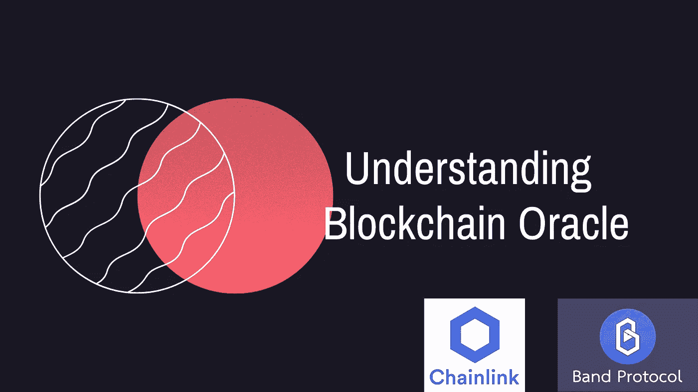

# 了解区块链 Oracle-第一部分

> 原文：<https://medium.com/coinmonks/understanding-blockchain-oracle-part-i-20592f189b16?source=collection_archive---------1----------------------->

如果您是技术出身，您一定听说过 Oracle 这个术语。Oracle 是一个可以存储大量数据的数据库。许多大型组织将这个数据库用于他们的数据仓库和其他与数据相关的项目。

但是甲骨文这个词是怎么和区块链联系在一起的。在本文中，我们将讨论区块链 Oracle。

在区块链中，交易生成、验证、处理区块链系统内部发生的一切。它不与外界通信，它们的操作仅限于网络本身。智能合约将数据作为区块链交易的输入，并执行预定义的任务。它不与外部系统通信。区块链系统与外部世界之间不存在来回数据通信，这将限制智能合同的进展。

要成为传统系统的替代品，它必须与外部世界的数据进行通信。因此，为了达到这一目的，区块链 oracle 应运而生。通过使用区块链，甲骨文智能合同以及区块链技术可以鼓励普通大众采用。

## 什么是区块链神谕？

区块链甲骨文作为区块链和外部世界之间的桥梁，将外部信息输入智能合同。这个外部数据源要么来自某个数据库、服务器、硬件，要么来自互联网上的任何东西。

除了作为外部数据源之外，它还将负责在将数据发送到区块链网络之前进行数据认证。在调用时，数据将作为输入传递给智能协定。

著名的区块链甲骨文项目:链环，带协议

**不同的区块链神谕**

区块链神谕可以根据几种不同的品质进行分类。

**1。** **数据来源**

**软件** -旨在将数据从服务器、数据库等在线系统传输到区块链。这些类型的 oracles 非常流行，因为它们能够传输实时数据，如汇率、数字资产价格或实时航班信息。

**硬件** -旨在将信息从物理世界传输到智能合同，即电子传感器、条形码扫描仪和其他信息读取设备。

**2。** **信息流向**

**入站** -从外部源系统向智能合同发送数据。

**出站** -将智能合约的信息传输到外部世界。

**3。** **信任**

**集中化**——由单一的权力机构维护和控制。作为单一的信息来源。

**去中心化**——这些是对区块链最合适、最可靠的神谕。它不依赖于单个数据源，可以很容易地从多个 oracles 中验证数据。

**4。** **合同专用神谕**

顾名思义，这些 oracles 被设计为由单个智能合约使用。这些工具非常灵活，是为了满足特定的业务需求而从头开始开发的。维护这些 oracles 非常耗时且昂贵。

**5。** **人类神谕**

如果一个普通人在某个特定领域有足够的知识和技能，他也可以充当先知。个人的身份验证是通过加密技术完成的。这些人可以使用他们的技能集来检查来自不同来源的数据认证，并将其传输到智能合同。

根据结构设计，甲骨文可以分为多个类别。

**神谕有多重要？**

传统系统不可能在一夜之间改变，也不能丢弃现有的组织数据。目前，区块链的交易仅限于网络内部。它不能在外部系统和智能合同之间来回传输数据，这限制了它集成到现有数据源中的能力。为了拓宽边界，网络首先需要开始接受来自外部系统的数据。开发人员和研究人员需要找到一种方法，将这些遗留数据应用到区块链架构中。

## **甲骨文问题**

因为甲骨文和区块链系统既有结构上的差异，也有本质上的差异，这导致了许多被称为甲骨文问题的设计挑战。

神谕是数据的单一来源，不像区块链，它是分散的，因此强加了对数据真实性的关注。由于智能合约将根据 oracle 提供的数据执行决策，因此如果 Oracle 受到威胁，智能合约将不会产生预期的输出。

另一个挑战是信任这些外部数据源，因为这些是第三方服务，不是区块链共识机制的一部分。因此，这些不一定要遵守区块链遵循的安全机制。

oracle 也容易受到中间人攻击，黑客试图修改来自 Oracle 数据源的数据。智能合约的错误输入将产生奇怪的结果。

然而，这些问题并不是无法克服的。遵循基本共识方法的强大数据标准化机制可以帮助解决这个问题。当然，一个安全、可靠、可信的 oracles 系统的设计将有助于智能合约的广泛采用和成功。

资源:[币安学院](https://academy.binance.com/blockchain/blockchain-oracles-explained)